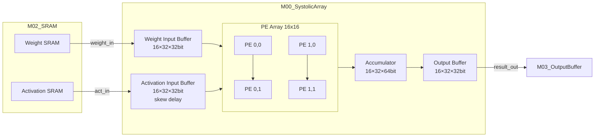

# M00_SystolicArray — Datapath Spec

## 1. 模块框图



## 2. PE 内部结构

每个 PE 包含：

```
         weight_reg (32/16/8 bit)
              |
act_in ──► [MUX] ──► MAC_UNIT ──► psum_out
              |           |
         precision    psum_in (来自上方 PE 或 0)
          _sel[1:0]
```

| 子单元 | 描述 |
|--------|------|
| weight_reg | 权重寄存器，WS 模式下保持不变 |
| precision MUX | 根据 precision_mode 选择 FP32/FP16/INT8 路径 |
| MAC_UNIT | 乘加单元，FP32=IEEE 754，FP16=IEEE 754 half，INT8=定点 |
| psum_reg | 部分和寄存器，OS 模式下在 PE 内累加 |

INT8 模式下 MAC_UNIT 内部拆分为 2 个并行 INT8 乘加器，共享 psum_reg（32bit 累加）。

## 3. 流水线级数与延迟

| 流水线阶段 | 级数 | 延迟 (cycles) | 说明 |
|------------|------|---------------|------|
| 输入缓冲 + skew | 1 | 1 | 激活值按列错位输入，补偿传播延迟 |
| PE 阵列对角线传播 | 16 | 16 | 数据沿 16×16 阵列对角线传播 |
| K 维度累加 | K | K | 可流水，每 cycle 产生 1 个部分和 |
| 输出缓冲 | 1 | 1 | 结果收集与格式转换 |

首次有效输出延迟：18 + K cycles（K 为矩阵内积维度）

稳态吞吐量（M=N=K=16，FP32）：
- 256 MAC/cycle × 500 MHz = 128 GFLOPS ≈ 0.25 TOPS 目标

## 4. 关键路径分析

| 路径 | 估算延迟 | 说明 |
|------|----------|------|
| FP32 MAC（乘法树） | ~1.8 ns | SF4 4nm，FP32 乘法为关键路径 |
| FP16 MAC | ~1.1 ns | 低于 FP32，不是关键路径 |
| INT8 MAC | ~0.7 ns | 远低于时钟周期 2 ns |
| psum 累加链 | ~0.4 ns | 32bit 加法，不是关键路径 |
| 时钟周期预算 | 2.0 ns | 500 MHz，留 ~0.2 ns setup margin |

FP32 MAC 为关键路径，需在综合时对 FP32 乘法树施加 max_delay 约束。

## 5. 数据位宽汇总

| 节点 | FP32 | FP16 | INT8 |
|------|------|------|------|
| weight_in 总线 | 16×32 bit | 16×16 bit | 16×8 bit |
| act_in 总线 | 16×32 bit | 16×16 bit | 16×8 bit |
| psum（PE 内） | 64 bit | 32 bit | 32 bit |
| result_out 总线 | 16×32 bit | 16×16 bit | 16×32 bit |

result_out 在 INT8 模式下输出 32bit 累加结果（量化前）。
