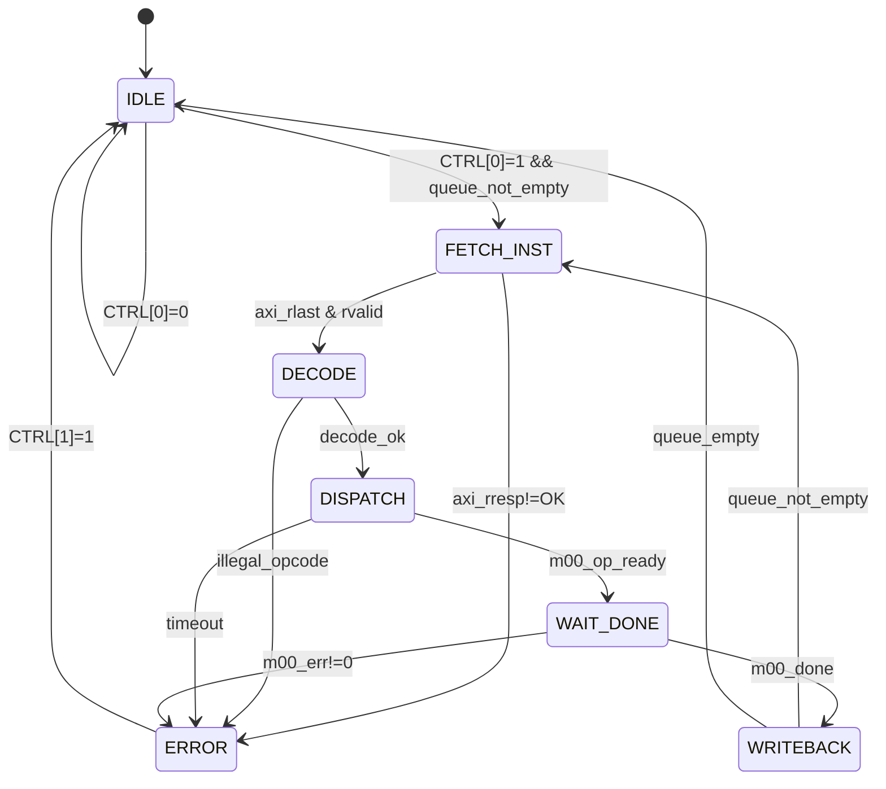
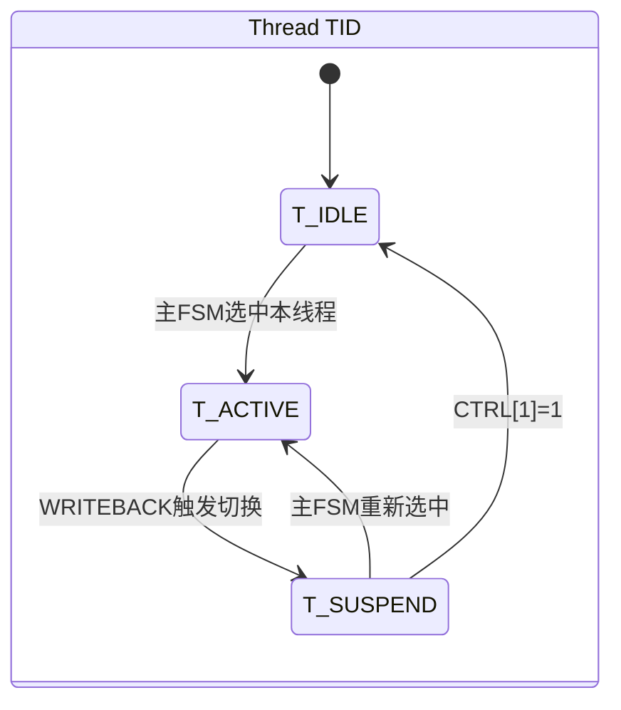

# M01_DataflowController — FSM Specification

## 1. 主状态机

### 状态列表

| 状态        | 编码  | 描述                              |
|-------------|-------|-----------------------------------|
| IDLE        | 3'b000 | 等待使能或指令                   |
| FETCH_INST  | 3'b001 | 通过 AXI 从指令队列取指           |
| DECODE      | 3'b010 | 译码算子类型、精度、地址          |
| DISPATCH    | 3'b011 | 向 M00 发送 op_valid，等待 ready  |
| WAIT_DONE   | 3'b100 | 等待 m00_done 脉冲                |
| WRITEBACK   | 3'b101 | 更新 PERF_CNT，触发中断，切换线程 |
| ERROR       | 3'b110 | 锁存错误码，拉高 irq_err          |

### 状态转移表

| 当前状态    | 条件                          | 下一状态    |
|-------------|-------------------------------|-------------|
| IDLE        | CTRL[0]=1 && queue_not_empty  | FETCH_INST  |
| IDLE        | CTRL[0]=0                     | IDLE        |
| FETCH_INST  | axi_rlast && axi_rvalid       | DECODE      |
| FETCH_INST  | axi_rresp != 2'b00            | ERROR       |
| DECODE      | decode_ok                     | DISPATCH    |
| DECODE      | illegal_opcode                | ERROR       |
| DISPATCH    | m00_op_ready                  | WAIT_DONE   |
| DISPATCH    | timeout (>= 256 cycles)       | ERROR       |
| WAIT_DONE   | m00_done                      | WRITEBACK   |
| WAIT_DONE   | m00_err != 2'b00              | ERROR       |
| WRITEBACK   | queue_not_empty               | FETCH_INST  |
| WRITEBACK   | queue_empty                   | IDLE        |
| ERROR       | CTRL[1]=1 (软复位)            | IDLE        |

### Mermaid 状态图



---

## 2. 多线程调度子状态机

每个线程（TID=0/1）独立维护一个轻量子状态机，主状态机在 WRITEBACK 阶段触发线程切换。

### 线程子状态

| 子状态      | 描述                          |
|-------------|-------------------------------|
| T_IDLE      | 线程未激活                    |
| T_ACTIVE    | 线程持有执行权                |
| T_SUSPEND   | 上下文已保存，等待重新调度    |

### 线程切换时序

```
WRITEBACK 阶段（4 周期）：
  Cycle 0: 保存当前线程 PC、OP_QUEUE 读指针 → THREAD_CTX[cur_tid]
  Cycle 1: 选择下一线程（Round-Robin：next_tid = ~cur_tid）
  Cycle 2: 恢复 next_tid 的 PC、OP_QUEUE 读指针
  Cycle 3: 更新 STATUS[3:2] = next_tid，进入 FETCH_INST
```

### Mermaid 线程子状态图



---

## 3. 关键时序约束

| 参数                  | 值          |
|-----------------------|-------------|
| DISPATCH 超时阈值     | 256 CLK_SYS |
| 上下文切换延迟        | 4 CLK_SYS   |
| WRITEBACK → FETCH 延迟 | 1 CLK_SYS  |
| 最小 IDLE 驻留        | 1 CLK_SYS   |
