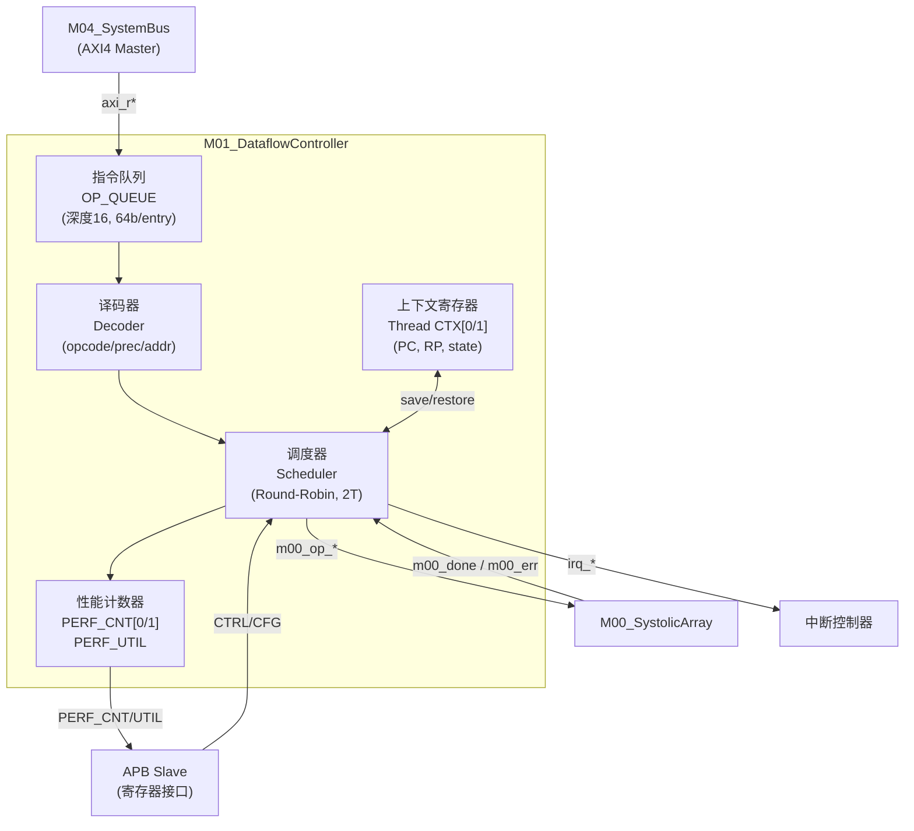

# M01_DataflowController — Datapath Specification

## 1. 模块框图



---

## 2. 流水线结构

5 级流水线，单发射，每线程独立 PC：

| 级  | 名称      | 功能                                              | 延迟       |
|-----|-----------|---------------------------------------------------|------------|
| IF  | 取指      | AXI Burst 读，填充 IQ；IQ 非空则直接读            | 1–8 cycle  |
| ID  | 译码      | 解析 op_code[7:0]、prec[1:0]、src/dst addr、shape | 1 cycle    |
| IS  | 调度      | 线程仲裁，生成 m00_op_* 信号，握手等待            | 1–N cycle  |
| EX  | 执行      | M00 执行（外部），等待 m00_done                   | 算子相关   |
| WB  | 回写      | 更新 PERF_CNT，触发 irq，切换线程上下文           | 4 cycle    |

流水线利用率定义：

```
UTIL = (EX 阶段有效周期) / (总运行周期)  ≥ 80%
```

---

## 3. 指令队列（OP_QUEUE）

- 深度：16 条（可通过 OP_QUEUE 寄存器配置基地址）
- 宽度：64 bit/entry
- 编码：

```
[63:56] op_code[7:0]
[55:54] prec[1:0]
[53:53] tid[0]
[52:48] reserved
[47:32] shape_m[15:0]   (或算子特定参数)
[31:16] src_addr_hi[15:0]
[15:0]  dst_addr_hi[15:0]
```

- 满时 IF 级暂停（back-pressure）
- 空时主 FSM 回 IDLE

---

## 4. 关键路径分析

| 路径                          | 估算延迟 | 约束          |
|-------------------------------|----------|---------------|
| IQ 读 → Decoder → m00_op_code | ~0.8 ns  | < 2 ns (500MHz) |
| m00_done → PERF_CNT 更新      | ~0.4 ns  | 组合逻辑      |
| 上下文切换（CTX save/restore） | 4 cycle  | 8 ns          |
| AXI 读延迟（SRAM）            | 4–8 cycle | 取决于 M04 仲裁 |

关键路径为 IQ 读出 → 译码 → m00_op_valid 驱动，需满足 500 MHz 时序收敛（三星 SF4 4nm 工艺裕量充足）。
