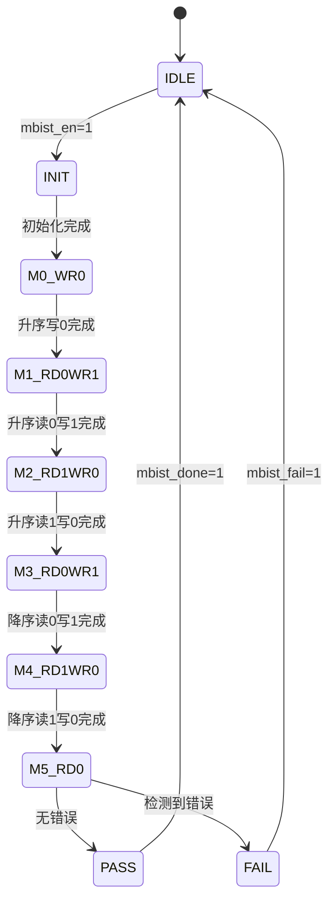

# M02_SRAM DFT 设计规范

## MBIST 方案

### 算法：March C-

March C- 是 SRAM 测试的工业标准算法，复杂度 O(10n)，检测固定故障、转换故障、耦合故障。

**算法序列**：

```
M0: ↑(w0)           — 升序写 0
M1: ↑(r0, w1)       — 升序读 0 验证，写 1
M2: ↑(r1, w0)       — 升序读 1 验证，写 0
M3: ↓(r0, w1)       — 降序读 0 验证，写 1
M4: ↓(r1, w0)       — 降序读 1 验证，写 0
M5: ↑(r0)           — 升序读 0 验证
```

### MBIST 控制器

| 信号 | 方向 | 位宽 | 描述 |
|------|------|------|------|
| mbist_en | input | 1 | MBIST 使能 |
| mbist_done | output | 1 | 测试完成 |
| mbist_fail | output | 1 | 测试失败 |
| mbist_fail_addr | output | 19 | 失败地址 |
| mbist_fail_data | output | 256 | 失败数据 |
| mbist_mode | input | 2 | 测试模式：00=March C-，01=Checkerboard，10=Walking 1 |

### MBIST 状态机



### 测试时间估算

| 参数 | 值 |
|------|-----|
| 存储单元数 | 16384 (16K entries) |
| March C- 操作数 | 10 × 16384 = 163840 |
| 测试时钟 | 100 MHz (MBIST 模式) |
| 测试时间 | ~1.64 ms |

### 故障覆盖率

| 故障类型 | 覆盖率 |
|----------|--------|
| Stuck-at-0/1 | 100% |
| Transition fault | 100% |
| Coupling fault (CFid) | 100% |
| Coupling fault (CFst) | 100% |
| Address decoder fault | 95% |

## 扫描链配置

### 扫描链划分

控制逻辑（非 SRAM 宏单元）插入扫描链：

| 扫描链 | 触发器数 | 描述 |
|--------|----------|------|
| SCAN_CHAIN_0 | 128 | FSM + 控制寄存器 |
| SCAN_CHAIN_1 | 64 | ECC 编解码器寄存器 |
| SCAN_CHAIN_2 | 32 | 仲裁器 + 地址译码 |

### 扫描信号

| 信号 | 方向 | 描述 |
|------|------|------|
| scan_en | input | 扫描使能 |
| scan_in[2:0] | input | 扫描输入（3 条链） |
| scan_out[2:0] | output | 扫描输出（3 条链） |
| scan_clk | input | 扫描时钟 |

### 扫描模式约束

- SRAM 宏单元在扫描模式下保持功能模式（不参与扫描）
- 扫描时钟频率：100 MHz
- 扫描覆盖率目标：95%（控制逻辑）

## JTAG 接口

### JTAG 信号

| 信号 | 方向 | 描述 |
|------|------|------|
| tck | input | 测试时钟 |
| tms | input | 测试模式选择 |
| tdi | input | 测试数据输入 |
| tdo | output | 测试数据输出 |
| trst_n | input | 测试复位，低有效 |

### JTAG TAP 控制器

标准 IEEE 1149.1 TAP 状态机，支持以下指令：

| 指令 | 编码 | 描述 |
|------|------|------|
| BYPASS | 4'b1111 | 旁路模式 |
| IDCODE | 4'b0001 | 读取器件 ID |
| SAMPLE | 4'b0010 | 采样边界扫描 |
| EXTEST | 4'b0000 | 外部测试 |
| MBIST_START | 4'b1000 | 启动 MBIST |
| MBIST_STATUS | 4'b1001 | 读取 MBIST 结果 |
| SCAN_EN | 4'b1010 | 使能扫描链 |

### IDCODE 寄存器

| 位 | 值 | 描述 |
|----|-----|------|
| [31:28] | 4'h1 | 版本号 |
| [27:12] | 16'h0002 | 部件号 (M02) |
| [11:1] | 11'h0A1 | 制造商 ID |
| [0] | 1'b1 | 固定为 1 |

### MBIST via JTAG 流程

```
1. 通过 JTAG 发送 MBIST_START 指令
2. 等待 mbist_done 信号（轮询 MBIST_STATUS）
3. 读取 MBIST_STATUS：
   - bit[0]: done
   - bit[1]: fail
   - bit[20:2]: fail_addr[18:0]
4. 若 fail=1，读取 mbist_fail_data
```

## DFT 模式隔离

### 模式切换

| 模式 | scan_en | mbist_en | 功能 |
|------|---------|----------|------|
| 功能模式 | 0 | 0 | 正常 SRAM 操作 |
| 扫描模式 | 1 | 0 | 扫描链移位 |
| MBIST 模式 | 0 | 1 | MBIST 测试 |

### 隔离要求

- MBIST 模式下，外部接口（M00/M01/M04）被隔离
- 扫描模式下，SRAM 宏单元保持最后功能状态
- 模式切换必须在复位状态下进行

## 测试覆盖率目标

| 测试类型 | 目标覆盖率 |
|----------|-----------|
| MBIST 故障覆盖率 | 99% |
| 扫描链覆盖率 | 95% |
| JTAG 功能覆盖率 | 100% |
| 总体 DFT 覆盖率 | 97% |
