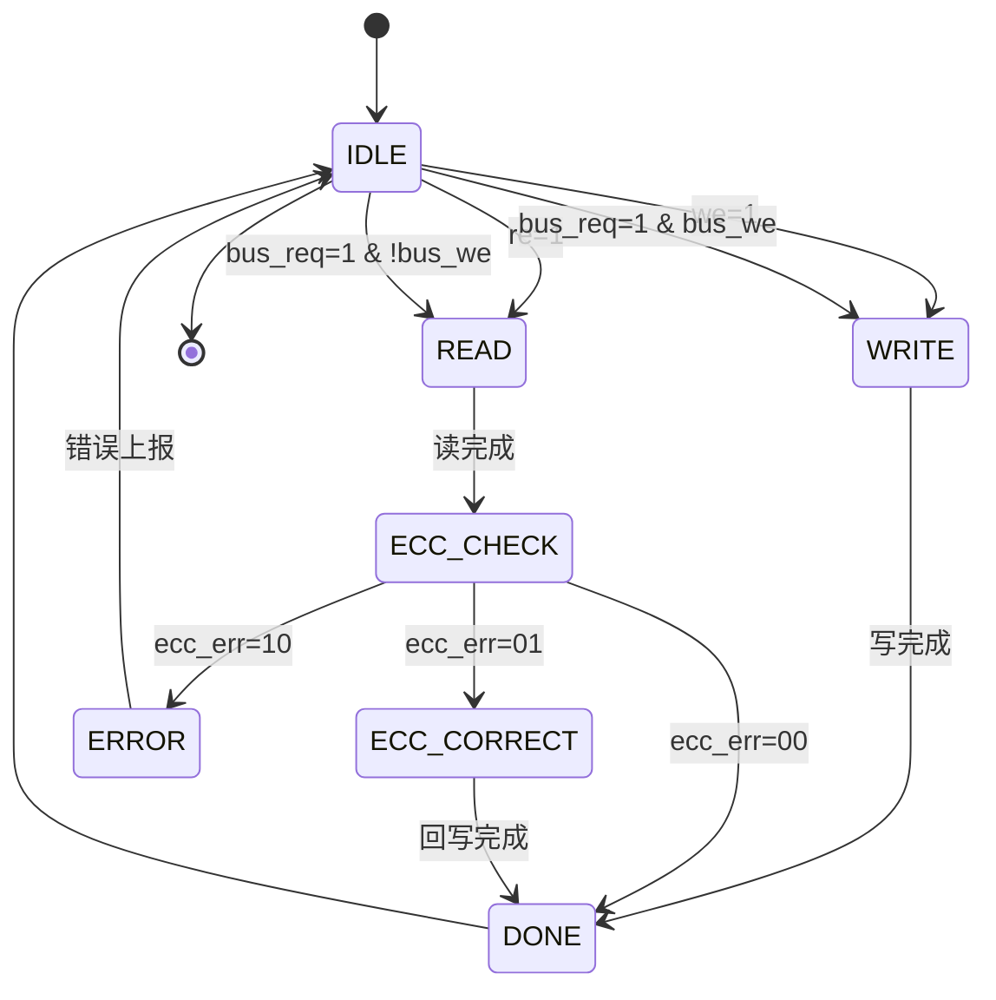

# M02_SRAM 状态机设计

## 状态列表

| 状态 | 编码 | 描述 |
|------|------|------|
| IDLE | 3'b000 | 空闲，等待访问请求 |
| READ | 3'b001 | 读操作，访问 SRAM |
| WRITE | 3'b010 | 写操作，写入 SRAM |
| ECC_CHECK | 3'b011 | ECC 校验，检测/纠正错误 |
| ECC_CORRECT | 3'b100 | ECC 纠正，回写纠正数据 |
| DONE | 3'b101 | 操作完成，返回 IDLE |
| ERROR | 3'b110 | 错误状态，双比特错误 |

## 状态转移表

| 当前状态 | 条件 | 下一状态 | 动作 |
|----------|------|----------|------|
| IDLE | re=1 | READ | 发起读请求 |
| IDLE | we=1 | WRITE | 发起写请求 |
| IDLE | bus_req=1 | READ/WRITE | 总线访问 |
| READ | - | ECC_CHECK | 读出数据，启动 ECC |
| WRITE | - | DONE | 写入完成，生成 ECC |
| ECC_CHECK | ecc_err=00 | DONE | 无错误 |
| ECC_CHECK | ecc_err=01 | ECC_CORRECT | 单比特错误，需纠正 |
| ECC_CHECK | ecc_err=10 | ERROR | 双比特错误 |
| ECC_CORRECT | - | DONE | 回写纠正数据 |
| DONE | - | IDLE | 清除标志 |
| ERROR | - | IDLE | 上报错误，清除 |

## 状态转移图



## 控制信号

### 输出信号

| 信号 | IDLE | READ | WRITE | ECC_CHECK | ECC_CORRECT | DONE | ERROR |
|------|------|------|-------|-----------|-------------|------|-------|
| ready | 1 | 0 | 0 | 0 | 0 | 1 | 0 |
| sram_re | 0 | 1 | 0 | 0 | 0 | 0 | 0 |
| sram_we | 0 | 0 | 1 | 0 | 1 | 0 | 0 |
| ecc_en | 0 | 0 | 1 | 1 | 1 | 0 | 0 |
| bus_grant | 0 | bus_req | bus_req | 0 | 0 | 0 | 0 |

### 状态寄存器

```verilog
reg [2:0] state, next_state;

always @(posedge clk or negedge rst_n) begin
    if (!rst_n)
        state <= IDLE;
    else
        state <= next_state;
end
```

## 时序约束

| 转移 | 延迟 (ns) | 说明 |
|------|-----------|------|
| IDLE → READ | 0.3 | 地址译码 |
| READ → ECC_CHECK | 2.0 | SRAM 读延迟 |
| ECC_CHECK → DONE | 0.5 | ECC 校验 |
| ECC_CHECK → ECC_CORRECT | 0.5 | 检测到错误 |
| ECC_CORRECT → DONE | 2.0 | 回写延迟 |
| WRITE → DONE | 2.0 | SRAM 写延迟 |

## 异常处理

### 双比特错误

1. 进入 ERROR 状态
2. 设置 ecc_err = 2'b10
3. 记录错误地址到 ECC_ADDR
4. 递增 DED_CNT
5. 可选：触发中断

### Bank 冲突

1. 检测同 bank 并发访问
2. 仲裁：优先级 Systolic Array > Dataflow Controller > Bus
3. 低优先级请求等待 1 cycle

### 总线超时

1. 总线请求超过 16 cycle 未响应
2. 强制释放 bus_grant
3. 返回 IDLE
