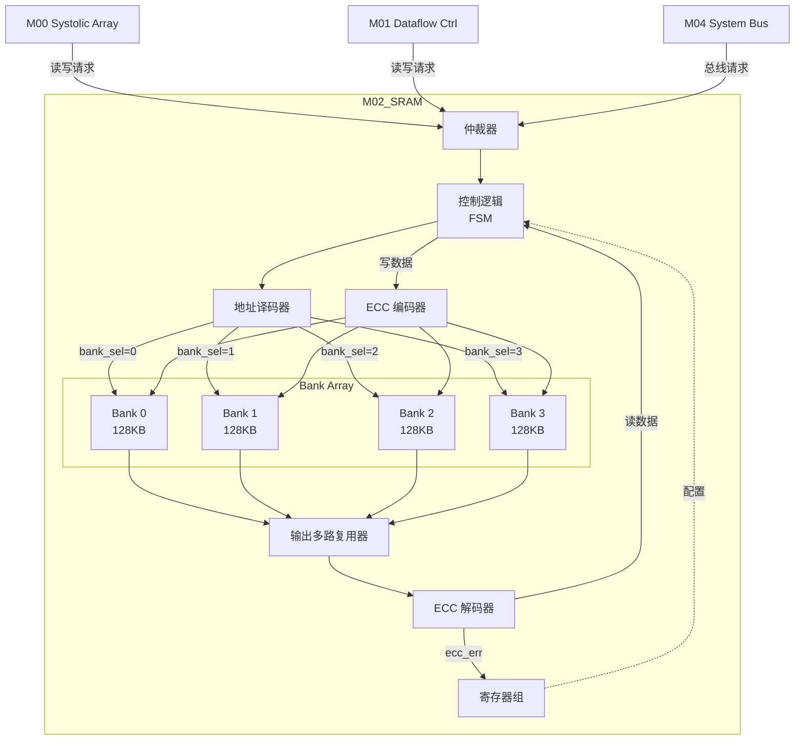

# M02_SRAM 数据通路设计

## 模块框图



## 读操作数据通路

### 时序图

```
Cycle:    0         1         2         3
        ___     ___     ___     ___     ___
clk    |   |___|   |___|   |___|   |___|   |
       _______
re     _______X_______________________________
       _______
addr   _______X_ADDR__________________________
                       _______________________
rdata  _______________X_______DATA____________
                               _______________
ready  ___________________________X___________
                               ___
ecc_err ___________________________X___________
```

### 数据流

1. **Cycle 0**: 接收读请求
   - 输入：addr, re=1
   - 仲裁器选择请求源
   - 地址译码，选择 bank

2. **Cycle 1**: SRAM 访问
   - Bank 读出 265 bit (256 data + 9 ECC)
   - 数据进入 ECC 解码器

3. **Cycle 2**: ECC 校验
   - 计算校验位
   - 检测错误：无错/单比特/双比特
   - 单比特错误自动纠正
   - 输出：rdata (256 bit), ecc_err (2 bit)

4. **Cycle 3**: 完成
   - ready=1
   - 若单比特错误，回写纠正数据（可选）

## 写操作数据通路

### 时序图

```
Cycle:    0         1         2
        ___     ___     ___     ___
clk    |   |___|   |___|   |___|   |
       _______
we     _______X_______________________
       _______
addr   _______X_ADDR__________________
       _______
wdata  _______X_______DATA____________
                       _______________
ready  ___________________X___________
```

### 数据流

1. **Cycle 0**: 接收写请求
   - 输入：addr, wdata, we=1
   - 仲裁器选择请求源
   - 地址译码，选择 bank

2. **Cycle 1**: ECC 编码
   - 输入 256 bit 数据
   - 生成 9 bit 校验位
   - 输出 265 bit 到 SRAM

3. **Cycle 2**: SRAM 写入
   - Bank 写入 265 bit
   - ready=1

## ECC 编解码路径

### 编码器 (写路径)

```
wdata[255:0] (256 bit)
    ↓
[Hamming 编码器]
    ↓
data[255:0] + parity[8:0] (265 bit)
    ↓
SRAM Bank
```

**Hamming (256,265) 编码**:
- 数据位：D[255:0]
- 校验位：P[8:0]
- P[i] = XOR(D[j]) for j where bit(j, i)=1

### 解码器 (读路径)

```
SRAM Bank
    ↓
data[255:0] + parity[8:0] (265 bit)
    ↓
[Hamming 解码器]
    ↓
syndrome[8:0] = received_parity XOR calculated_parity
    ↓
[错误检测/纠正]
    ↓
rdata[255:0] (256 bit) + ecc_err[1:0]
```

**错误检测逻辑**:
- syndrome = 0 → 无错误
- syndrome ≠ 0, weight(syndrome)=1 → 校验位错误（忽略）
- syndrome ≠ 0, weight(syndrome)>1 → 数据位错误
  - 单比特：纠正 data[syndrome]
  - 双比特：ecc_err=2'b10

## 关键路径分析

### 读路径关键路径

```
地址译码 (0.3ns)
  → Bank 选择 (0.1ns)
  → SRAM 读 (1.5ns)
  → ECC 解码 (0.4ns)
  → 输出寄存器 (0.2ns)
────────────────────────
总计: 2.5ns (1.25 cycle @ 500MHz)
```

**优化**: 流水线化 ECC 解码，延迟增加 1 cycle，频率可达 800 MHz。

### 写路径关键路径

```
ECC 编码 (0.4ns)
  → Bank 选择 (0.1ns)
  → SRAM 写 (1.5ns)
────────────────────────
总计: 2.0ns (1 cycle @ 500MHz)
```

## Bank 仲裁逻辑

### 优先级

1. M00 Systolic Array (最高)
2. M01 Dataflow Controller
3. M04 System Bus (最低)

### 冲突处理

```verilog
// 伪代码
if (bank_conflict) {
    if (m00_req && m00_bank == target_bank)
        grant = m00;
    else if (m01_req && m01_bank == target_bank)
        grant = m01;
    else if (bus_req && bus_bank == target_bank)
        grant = bus;
    
    // 其他请求延迟 1 cycle
    stall_others = 1;
}
```

## 性能指标

| 指标 | 值 |
|------|-----|
| 读延迟 | 2 cycle (无 ECC 错误) |
| 读延迟 | 3 cycle (单比特纠正) |
| 写延迟 | 2 cycle |
| 吞吐量 | 128 GB/s (256 bit @ 500 MHz, 4 bank) |
| Bank 冲突率 | < 5% (典型负载) |
| ECC 开销 | 3.5% (9/256) |
