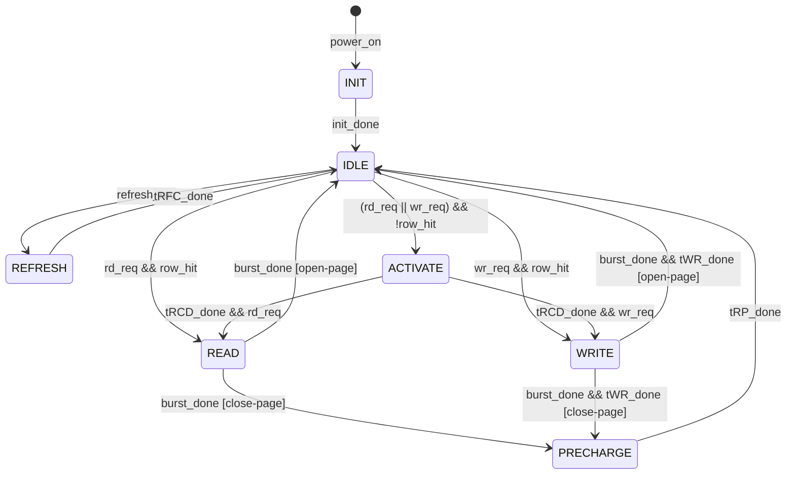

# M03_DRAMController — 状态机规范

## 1. 状态列表

| 状态 | 编码 | 描述 |
|------|------|------|
| INIT | 3'b000 | 上电初始化序列（tINIT = 200 us） |
| IDLE | 3'b001 | 等待命令，所有 Bank 预充电完毕 |
| ACTIVATE | 3'b010 | 发送 ACT 命令，等待 tRCD |
| READ | 3'b011 | 发送 RD 命令，等待 CAS 延迟 + BL |
| WRITE | 3'b100 | 发送 WR 命令，写数据传输 |
| PRECHARGE | 3'b101 | 发送 PRE 命令，等待 tRP |
| REFRESH | 3'b110 | 发送 REF 命令，等待 tRFC |

## 2. 状态转移表

| 当前状态 | 条件 | 下一状态 |
|----------|------|----------|
| INIT | init_done（tINIT 计数完成） | IDLE |
| IDLE | refresh_req | REFRESH |
| IDLE | rd_req && row_hit | READ |
| IDLE | rd_req && !row_hit | ACTIVATE |
| IDLE | wr_req && row_hit | WRITE |
| IDLE | wr_req && !row_hit | ACTIVATE |
| ACTIVATE | tRCD_done | READ / WRITE（依请求类型） |
| READ | burst_done | PRECHARGE（close-page） / IDLE（open-page） |
| WRITE | burst_done + tWR_done | PRECHARGE（close-page） / IDLE（open-page） |
| PRECHARGE | tRP_done | IDLE |
| REFRESH | tRFC_done | IDLE |

> **Page Policy**：默认 close-page（每次访问后 PRECHARGE），可通过 DRAM_CTRL[8] 切换为 open-page。

## 3. 关键计时器

| 计时器 | 触发状态 | 超时值 |
|--------|----------|--------|
| init_cnt | INIT | 200 us / tCK = 100,000 cycles |
| rcd_cnt | ACTIVATE | tRCD / tCK = 9 cycles |
| cl_cnt | READ | tCL / tCK = 9 cycles |
| wr_cnt | WRITE | tWR / tCK = 10 cycles |
| rp_cnt | PRECHARGE | tRP / tCK = 9 cycles |
| rfc_cnt | REFRESH | tRFC / tCK = 140 cycles |
| refi_cnt | 全局 | tREFI / tCK = 1950 cycles |

## 4. Mermaid 状态图

## 5. 优先级仲裁

当多个请求同时到达时，优先级顺序：

1. REFRESH（硬实时，tREFI 超时强制执行）
2. 已打开行的 row-hit 请求（减少 PRECHARGE 开销）
3. 写请求（写缓冲区满时提升优先级）
4. 读请求
