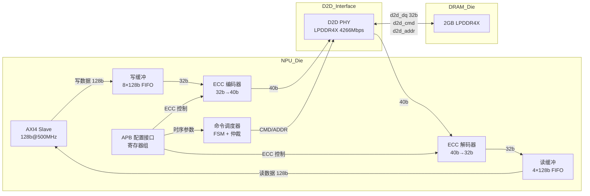

# M03_DRAMController — 数据通路规范

## 1. 模块框图



## 2. 读数据通路

```
AXI AR 通道
  → 地址解码（行/列/Bank/BankGroup）
  → 命令调度器（ACTIVATE / READ）
  → D2D PHY 发送 CMD
  → DRAM 返回 DQ（tCL + BL8 = ~20 ns）
  → ECC 解码（2 cycles，纠正单比特错误）
  → 128b 拼装（4×32b）
  → 读缓冲 FIFO
  → AXI R 通道返回
```

关键延迟分解（row-hit 场景）：

| 阶段 | 延迟 |
|------|------|
| AXI 地址接收 | 1 cycle |
| 命令调度 | 1 cycle |
| D2D PHY 传输 | ~5 ns |
| tCL（DRAM 内部） | 18 ns |
| BL8 数据传输 | 4 × tCK = 1.9 ns |
| ECC 解码 | 2 cycles = 4 ns |
| AXI 数据返回 | 1 cycle |
| **合计** | **~32 ns << 100 ns** |

## 3. 写数据通路

```
AXI AW + W 通道
  → 写缓冲 FIFO（8 深度，防止背压）
  → ECC 编码（1 cycle，32b → 40b）
  → 命令调度器（ACTIVATE / WRITE）
  → D2D PHY 发送 CMD + DQ
  → DRAM 写入（tWR 后可安全 PRECHARGE）
  → AXI B 通道写响应
```

写缓冲满时（8 条目），反压 AXI awready/wready 为低。

## 4. 刷新调度

- 全局计数器每 1950 cycles（tREFI = 3.9 us @ 500 MHz）触发刷新请求
- 刷新请求插入命令队列最高优先级
- 刷新期间（tRFC = 140 cycles = 280 ns）阻塞所有读写命令
- 支持最多 8 次刷新推迟（Deferred Refresh），超出则强制执行

## 5. 关键路径分析

| 路径 | 描述 | 估算延迟 |
|------|------|----------|
| ECC 编码 | 32b XOR 树 → 7 校验位 | ~0.8 ns |
| ECC 解码 | syndrome 计算 + 纠错 MUX | ~1.2 ns |
| 地址解码 | 行/列/Bank 拆分 | ~0.3 ns |
| 命令调度仲裁 | 4 路优先级编码器 | ~0.4 ns |
| **关键路径** | **ECC 解码**（需 pipeline） | **1.2 ns < 2 ns tCK** |

ECC 解码分两级流水：第一级计算 syndrome，第二级纠错，各占 1 cycle。
