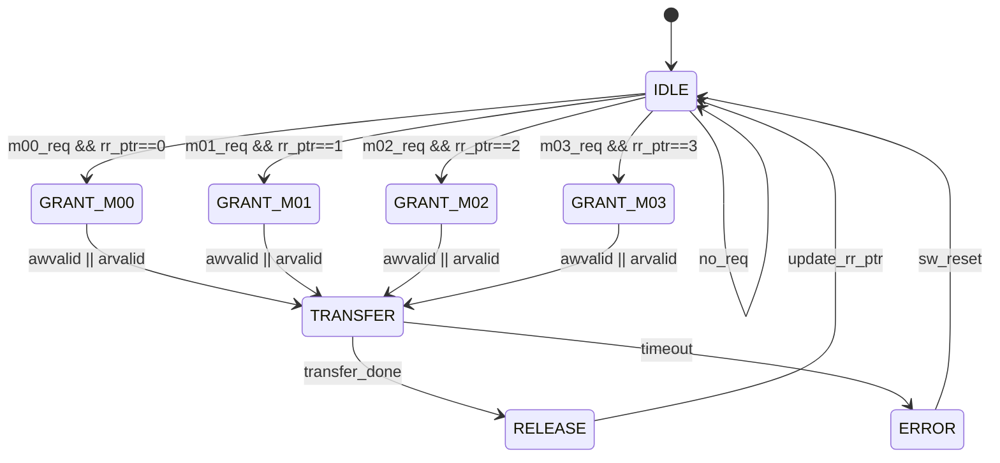

# M04_SystemBus - 仲裁状态机

## 状态列表

| State | Encoding | Description |
|-------|----------|-------------|
| IDLE | 3'b000 | 总线空闲，等待请求 |
| GRANT_M00 | 3'b001 | 授权 M00 (Systolic Array) |
| GRANT_M01 | 3'b010 | 授权 M01 (Dataflow Controller) |
| GRANT_M02 | 3'b011 | 授权 M02 (SRAM) |
| GRANT_M03 | 3'b100 | 授权 M03 (DRAM Controller) |
| TRANSFER | 3'b101 | 数据传输中 |
| RELEASE | 3'b110 | 释放总线，准备下一轮仲裁 |
| ERROR | 3'b111 | 死锁或错误状态 |

## 状态转移表

| Current State | Condition | Next State | Action |
|---------------|-----------|------------|--------|
| IDLE | m00_req && rr_ptr==0 | GRANT_M00 | grant_m00=1, update_ptr |
| IDLE | m01_req && rr_ptr==1 | GRANT_M01 | grant_m01=1, update_ptr |
| IDLE | m02_req && rr_ptr==2 | GRANT_M02 | grant_m02=1, update_ptr |
| IDLE | m03_req && rr_ptr==3 | GRANT_M03 | grant_m03=1, update_ptr |
| IDLE | no_req | IDLE | - |
| GRANT_M00 | awvalid \|\| arvalid | TRANSFER | start_transfer |
| GRANT_M01 | awvalid \|\| arvalid | TRANSFER | start_transfer |
| GRANT_M02 | awvalid \|\| arvalid | TRANSFER | start_transfer |
| GRANT_M03 | awvalid \|\| arvalid | TRANSFER | start_transfer |
| TRANSFER | wvalid && wready && wlast | RELEASE | end_transfer |
| TRANSFER | rvalid && rready && rlast | RELEASE | end_transfer |
| TRANSFER | timeout (>16 cycles) | ERROR | set_error_flag |
| RELEASE | - | IDLE | rr_ptr = (rr_ptr+1) % 4 |
| ERROR | sw_reset | IDLE | clear_error |

## 状态机图



## 仲裁逻辑

### Round-Robin 指针更新

```verilog
always @(posedge clk or negedge rst_n) begin
    if (!rst_n)
        rr_ptr <= 2'b00;
    else if (state == RELEASE)
        rr_ptr <= (rr_ptr + 1) % 4;
end
```

### 优先级仲裁模式

当 ARB_CFG.arb_mode = 1 时，使用固定优先级：

```
priority = {M00_pri, M01_pri, M02_pri, M03_pri}
grant = highest_priority(req_vector & priority_mask)
```

### 超时检测

```verilog
always @(posedge clk or negedge rst_n) begin
    if (!rst_n)
        timeout_cnt <= 0;
    else if (state == TRANSFER)
        timeout_cnt <= timeout_cnt + 1;
    else
        timeout_cnt <= 0;
end

assign timeout = (timeout_cnt > MAX_BURST_LEN);
```

## 关键时序

| Timing | Value | Description |
|--------|-------|-------------|
| Grant Latency | 1 cycle | IDLE → GRANT_Mx |
| Transfer Setup | 1 cycle | GRANT_Mx → TRANSFER |
| Release Latency | 1 cycle | TRANSFER → IDLE |
| Total Arbitration | 3 cycles | 最小仲裁开销 |

## 死锁预防

- 超时机制：16 cycles 强制释放
- 优先级反转检测：连续3次同一 master 被跳过触发告警
- 软件复位：BUS_CTRL.sw_reset 强制回到 IDLE
