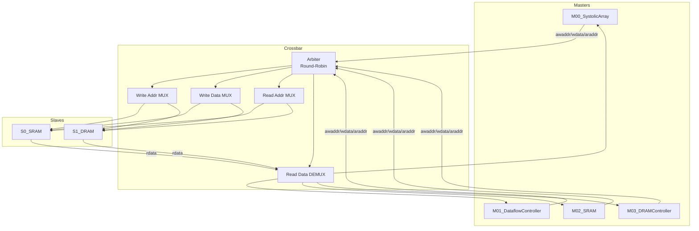

# M04_SystemBus - 数据通路

## 模块框图



## 数据通路组件

### 1. 仲裁器 (Arbiter)

**输入:**
- m00_req, m01_req, m02_req, m03_req (4-bit)
- rr_ptr (2-bit)
- arb_mode (1-bit)

**输出:**
- grant_m00, grant_m01, grant_m02, grant_m03 (4-bit one-hot)
- current_master (2-bit)

**逻辑:**
```verilog
assign grant = arb_mode ? priority_arb(req, priority_cfg) 
                        : round_robin_arb(req, rr_ptr);
```

### 2. 地址多路复用器 (Address MUX)

**写地址通道:**
```verilog
always_comb begin
    case (current_master)
        2'b00: s_awaddr = m00_awaddr;
        2'b01: s_awaddr = m01_awaddr;
        2'b10: s_awaddr = m02_awaddr;
        2'b11: s_awaddr = m03_awaddr;
    endcase
end
```

**读地址通道:** 同上逻辑，替换为 araddr。

### 3. 数据多路复用器 (Data MUX)

**写数据通道:**
```verilog
always_comb begin
    case (current_master)
        2'b00: s_wdata = m00_wdata;
        2'b01: s_wdata = m01_wdata;
        2'b10: s_wdata = m02_wdata;
        2'b11: s_wdata = m03_wdata;
    endcase
end
```

### 4. 读数据解复用器 (Read Data DEMUX)

```verilog
always_comb begin
    m00_rdata = (current_master == 2'b00) ? s_rdata : 256'b0;
    m01_rdata = (current_master == 2'b01) ? s_rdata : 256'b0;
    m02_rdata = (current_master == 2'b10) ? s_rdata : 256'b0;
    m03_rdata = (current_master == 2'b11) ? s_rdata : 256'b0;
end
```

### 5. 地址解码器 (Address Decoder)

```verilog
assign slave_sel = (addr[31:28] == 4'h0) ? 1'b0 :  // SRAM: 0x0xxx_xxxx
                   (addr[31:28] == 4'h8) ? 1'b1 :  // DRAM: 0x8xxx_xxxx
                   1'b0;  // default to SRAM
```

## 流水线结构

### 3级流水线

| Stage | Operation | Latency |
|-------|-----------|---------|
| S1 | 仲裁 + 地址解码 | 1 cycle |
| S2 | 数据多路复用 + Slave 访问 | 1 cycle |
| S3 | 读数据解复用 + 返回 | 1 cycle |

**总延迟:** 3 cycles (最小)

### 流水线寄存器

```verilog
// Stage 1 → Stage 2
always_ff @(posedge clk) begin
    s1_master_id <= current_master;
    s1_slave_sel <= slave_sel;
    s1_addr <= mux_addr;
end

// Stage 2 → Stage 3
always_ff @(posedge clk) begin
    s2_master_id <= s1_master_id;
    s2_rdata <= slave_rdata;
end
```

## 关键路径

### 写路径

```
Master awvalid → Arbiter (0.5ns) → MUX (0.3ns) → Slave awready (0.2ns)
Total: 1.0ns (满足 2ns @ 500MHz)
```

### 读路径

```
Master arvalid → Arbiter (0.5ns) → MUX (0.3ns) → Slave (1.0ns) → DEMUX (0.3ns) → Master rdata
Total: 2.1ns (需要流水线优化)
```

**优化:** 在 Slave 访问后插入寄存器，分摊为2个 cycle。

## 带宽计算

### 理论带宽

```
BW_theoretical = DATA_WIDTH × CLK_FREQ / 8
               = 256-bit × 500MHz / 8
               = 16 GB/s
```

### 有效带宽

考虑仲裁开销 (3 cycles) 和平均 burst 长度 (8 cycles):

```
BW_effective = BW_theoretical × (8 / (8+3))
             = 16 GB/s × 0.727
             = 11.6 GB/s
```

满足 >= 10 GB/s 需求。

## FIFO 缓冲

### 写数据 FIFO

- 深度：8 entries × 256-bit
- 用途：缓冲突发写数据，避免 master 阻塞
- 水位告警：> 6 entries 触发 almost_full

### 读数据 FIFO

- 深度：8 entries × 256-bit
- 用途：缓冲 slave 返回数据，平滑延迟抖动
- 水位告警：< 2 entries 触发 almost_empty

## 面积估算

| Component | Gates | Area (um²) |
|-----------|-------|-----------|
| Arbiter | 500 | 1000 |
| MUX/DEMUX | 2000 | 4000 |
| FIFO (2×8×256) | 8000 | 16000 |
| Control Logic | 1000 | 2000 |
| **Total** | **11500** | **23000** |

约 0.023 mm² @ 4nm，满足 < 0.5 mm² 预算。
