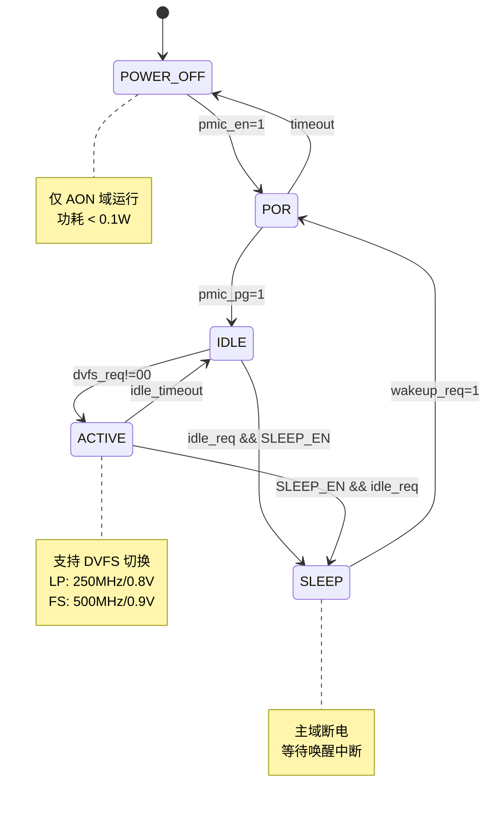

# M05 PowerManager — FSM

## 状态列表

| 状态编码 | 状态名 | pwr_state[1:0] | 描述 |
|----------|--------|----------------|------|
| 2'b00 | POWER_OFF | 2'b00 | 芯片断电，仅 AON 域保持最小功能 |
| 2'b01 | POR | 2'b01 | 上电复位中，等待 PMIC Power Good |
| 2'b10 | IDLE | 2'b10 | 主域上电但时钟门控，待机状态 |
| 2'b11 | ACTIVE | 2'b11 | 全功能运行，支持 DVFS 切换 |
| 2'b10 | SLEEP | 2'b10 | 深度睡眠，主域断电，AON 保持 |

注：IDLE 和 SLEEP 共享编码 2'b10，通过内部 FSM 区分。

## 状态转移表

| 当前状态 | 触发条件 | 下一状态 | 动作 |
|----------|----------|----------|------|
| POWER_OFF | pmic_en=1 | POR | 启动 PMIC，开始上电序列 |
| POR | pmic_pg=1 && settle_done | IDLE | 释放隔离，使能主域电源 |
| POR | timeout | POWER_OFF | 上电失败，回退断电 |
| IDLE | dvfs_req!=00 | ACTIVE | 释放时钟门控，进入工作状态 |
| IDLE | idle_req=1 && SLEEP_EN=1 | SLEEP | 进入深度睡眠 |
| ACTIVE | dvfs_req=00 && idle_timeout | IDLE | 空闲超时，门控时钟 |
| ACTIVE | SLEEP_EN=1 && idle_req=1 | SLEEP | 软件请求睡眠 |
| SLEEP | wakeup_req=1 | POR | 唤醒，重新上电主域 |
| ANY | rst_aon_n=0 | POWER_OFF | 异步复位 |

## 状态转移图

## DVFS 子状态机

在 ACTIVE 状态内部，DVFS 切换有独立子状态机：

| 子状态 | 描述 |
|--------|------|
| DVFS_IDLE | 无切换请求，保持当前工作点 |
| DVFS_V_RAMP | 电压爬升/下降中 |
| DVFS_F_SWITCH | 频率切换中 |
| DVFS_SETTLE | 等待稳定 |

切换流程：
1. 检测 dvfs_req 变化
2. 若升频：先升压 → 等待稳定 → 切频
3. 若降频：先切频 → 降压 → 等待稳定
4. 置 dvfs_ack，清 dvfs_busy

## 时序约束

| 参数 | 最小值 | 典型值 | 最大值 | 单位 |
|------|--------|--------|--------|------|
| POR 等待时间 | 100 | 500 | 1000 | μs |
| 电压稳定时间 | 5 | 8 | 15 | μs |
| 频率切换时间 | 1 | 2 | 5 | μs |
| 空闲超时 | 10 | 50 | 100 | ms |
| 唤醒延迟 | 50 | 100 | 200 | μs |
