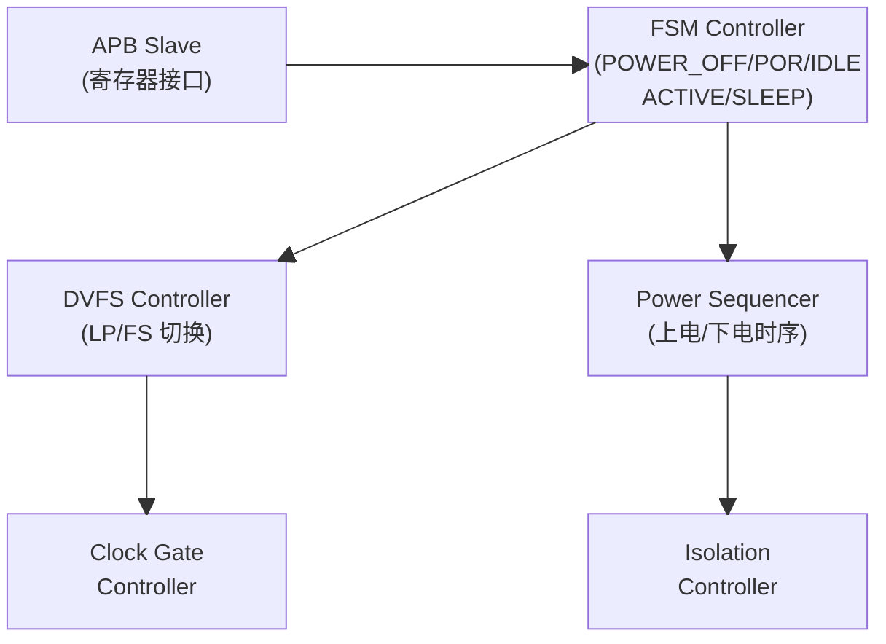
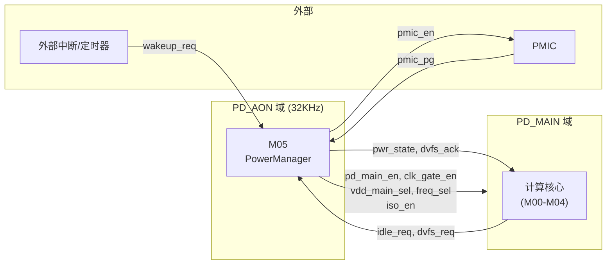

# M05 PowerManager — Datapath

## 模块框图



### 外部接口连接



## 电源域控制逻辑

### PD_MAIN 控制信号生成

```
pd_main_en  = (state == IDLE) || (state == ACTIVE)
iso_en      = (state == POWER_OFF) || (state == SLEEP) || (state == POR && !pmic_pg)
clk_gate_en = (state == ACTIVE) && !dvfs_busy
```

### DVFS 电压/频率选择

```
vdd_main_sel = (dvfs_cur == LP) ? 2'b01 :   // 0.8V
               (dvfs_cur == FS) ? 2'b10 :   // 0.9V
               2'b00                         // off

freq_sel     = (dvfs_cur == LP) ? 2'b01 :   // 250MHz
               (dvfs_cur == FS) ? 2'b10 :   // 500MHz
               2'b00                         // off
```

## DVFS 切换时序

### 升频时序（LP → FS）

```
时间轴（CLK_AON 周期，32KHz ≈ 31.25μs/cycle）

t0: dvfs_req = FS，dvfs_busy 拉高
t1: vdd_main_sel → 0.9V（升压开始）
t1+V_SETTLE_CNT: 电压稳定，freq_sel → 500MHz
t1+V_SETTLE_CNT+F_SETTLE_CNT: 频率稳定
t_end: dvfs_ack = FS，dvfs_busy 拉低

典型总延迟 ≈ (16+8) × 31.25μs ≈ 750μs（可通过 DVFS_CFG 调整）
```

### 降频时序（FS → LP）

```
t0: dvfs_req = LP，dvfs_busy 拉高
t1: freq_sel → 250MHz（先降频）
t1+F_SETTLE_CNT: 频率稳定，vdd_main_sel → 0.8V（降压）
t1+F_SETTLE_CNT+V_SETTLE_CNT: 电压稳定
t_end: dvfs_ack = LP，dvfs_busy 拉低
```

## 关键路径

| 路径 | 起点 | 终点 | 约束 |
|------|------|------|------|
| 唤醒路径 | wakeup_req | clk_gate_en | 异步，需同步到 CLK_AON |
| DVFS 请求 | dvfs_req | dvfs_busy | 1 CLK_AON 周期内响应 |
| 电源状态输出 | FSM 寄存器 | pwr_state | 组合逻辑，无额外延迟 |
