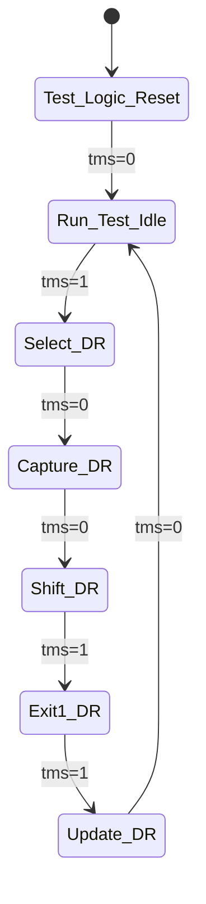

# M06_ClockManager DFT

## DFT 概述

时钟管理器 DFT 设计包括扫描链插入、BIST 支持和 JTAG 接口，确保芯片可测试性。

## 扫描链配置

### 扫描链结构
| 链编号 | 名称 | 触发器数量 | 长度 |
|--------|------|------------|------|
| SCAN_0 | FSM 状态寄存器 | 2 | 2 |
| SCAN_1 | 配置寄存器 | 72 | 72 |
| SCAN_2 | 计数器 | 32 | 32 |
| 总计 | - | 106 | 106 |

### 扫描信号
| 信号 | 位宽 | 方向 | 描述 |
|------|------|------|------|
| scan_en | 1 | input | 扫描使能 |
| scan_in | 1 | input | 扫描输入 |
| scan_out | 1 | output | 扫描输出 |
| scan_clk | 1 | input | 扫描时钟 |

### 扫描模式
- **正常模式**: scan_en=0，功能时钟运行
- **扫描模式**: scan_en=1，扫描时钟驱动，数据串行移位

## BIST 方案

### MBIST (Memory BIST)
虽然 ClockManager 本身无存储器，但提供 BIST 时钟支持：
- BIST 时钟频率：100MHz (降频测试)
- BIST 时钟源：PLL 5 分频
- BIST 模式切换：通过 JTAG 配置

### LBIST (Logic BIST)
| 参数 | 值 | 说明 |
|------|-----|------|
| PRPG 长度 | 32-bit LFSR | 伪随机模式生成器 |
| MISR 长度 | 32-bit | 多输入签名寄存器 |
| 测试向量数 | 1024 | 随机向量 |
| 故障覆盖率 | >95% | 目标覆盖率 |

### BIST 控制寄存器
| 寄存器 | 地址 | 描述 |
|--------|------|------|
| BIST_CTRL | 0x10 | BIST 控制 |
| BIST_STATUS | 0x14 | BIST 状态 |
| BIST_SIGNATURE | 0x18 | MISR 签名 |

## JTAG 接口

### JTAG 信号
| 信号 | 方向 | 描述 |
|------|------|------|
| tck | input | JTAG 时钟 |
| tms | input | 测试模式选择 |
| tdi | input | 测试数据输入 |
| tdo | output | 测试数据输出 |
| trst_n | input | JTAG 复位 |

### TAP 控制器
标准 IEEE 1149.1 TAP 状态机：


### JTAG 指令
| 指令 | 编码 | 描述 |
|------|------|------|
| BYPASS | 0xFF | 旁路测试 |
| IDCODE | 0x01 | 读取芯片 ID |
| SAMPLE | 0x02 | 采样边界扫描 |
| PRELOAD | 0x03 | 预加载边界扫描 |
| EXTEST | 0x04 | 外部测试 |
| INTEST | 0x05 | 内部测试 |
| BIST_START | 0x10 | 启动 BIST |
| BIST_READ | 0x11 | 读取 BIST 结果 |

## 边界扫描

### 边界扫描单元
| 端口 | BSR 位置 | 类型 |
|------|----------|------|
| clk_ref | 0 | input |
| rst_n | 1 | input |
| clk_sys | 2 | output |
| clk_aon | 3 | output |
| pll_lock | 4 | output |

### BSDL 文件
```vhdl
entity M06_ClockManager is
  generic (PHYSICAL_PIN_MAP : string := "PACKAGE_DEFAULT");
  port (
    clk_ref : in bit;
    rst_n : in bit;
    clk_sys : out bit;
    clk_aon : out bit;
    pll_lock : out bit
  );
  use STD_1149_1_2001.all;
  attribute COMPONENT_CONFORMANCE of M06_ClockManager : entity is "STD_1149_1_2001";
  attribute PIN_MAP of M06_ClockManager : entity is PHYSICAL_PIN_MAP;
end M06_ClockManager;
```

## 测试覆盖率

| 测试类型 | 覆盖率目标 | 说明 |
|----------|------------|------|
| 扫描覆盖率 | 100% | 所有触发器可扫描 |
| 故障覆盖率 | >95% | Stuck-at 故障 |
| 路径覆盖率 | >90% | 关键路径 |
| ATPG 向量数 | ~500 | 自动生成 |

## DFT 约束

- 扫描时钟频率：≤100MHz
- 扫描链最大长度：128 bits
- JTAG 时钟频率：≤50MHz
- 功耗增加：<5%
- 面积增加：<10%
