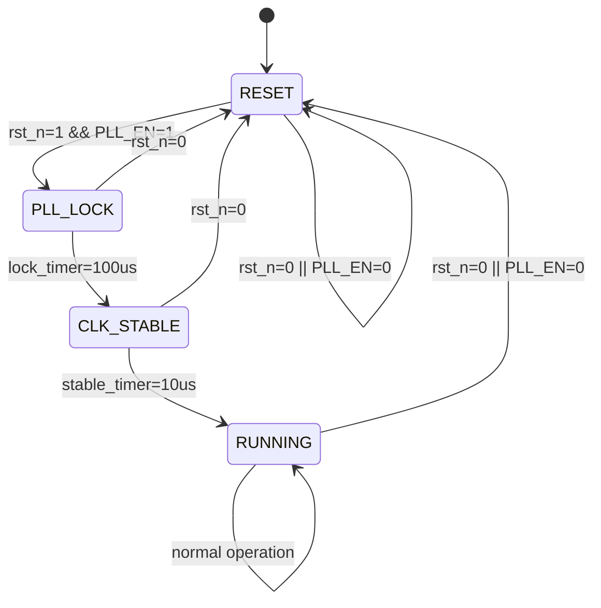

# M06_ClockManager FSM

## 状态机概述

时钟管理器状态机控制 PLL 启动、锁定和时钟稳定过程。

## 状态列表

| 状态 | 编码 | 描述 |
|------|------|------|
| RESET | 2'b00 | 复位状态，PLL 关闭 |
| PLL_LOCK | 2'b01 | PLL 锁定中，等待稳定 |
| CLK_STABLE | 2'b10 | 时钟稳定，等待使能 |
| RUNNING | 2'b11 | 正常运行，输出时钟 |

## 状态转移表

| 当前状态 | 条件 | 下一状态 | 动作 |
|----------|------|----------|------|
| RESET | rst_n=1 && PLL_EN=1 | PLL_LOCK | 启动 PLL |
| RESET | rst_n=0 或 PLL_EN=0 | RESET | 保持复位 |
| PLL_LOCK | lock_timer=100us | CLK_STABLE | 设置 pll_lock=1 |
| PLL_LOCK | rst_n=0 | RESET | 复位 PLL |
| CLK_STABLE | stable_timer=10us | RUNNING | 使能时钟输出 |
| CLK_STABLE | rst_n=0 | RESET | 复位 |
| RUNNING | rst_n=0 | RESET | 复位 |
| RUNNING | PLL_EN=0 | RESET | 关闭 PLL |
| RUNNING | 正常 | RUNNING | 持续输出时钟 |

## 状态图

## 时序约束

| 参数 | 值 | 说明 |
|------|-----|------|
| lock_timer | 100μs | PLL 锁定等待时间 |
| stable_timer | 10μs | 时钟稳定等待时间 |
| 状态切换延迟 | 1 cycle | 状态寄存器更新延迟 |

## 控制信号

| 信号 | 源状态 | 描述 |
|------|--------|------|
| pll_en_int | RESET→PLL_LOCK | 内部 PLL 使能 |
| pll_lock | PLL_LOCK→CLK_STABLE | PLL 锁定指示 |
| clk_out_en | CLK_STABLE→RUNNING | 时钟输出使能 |
