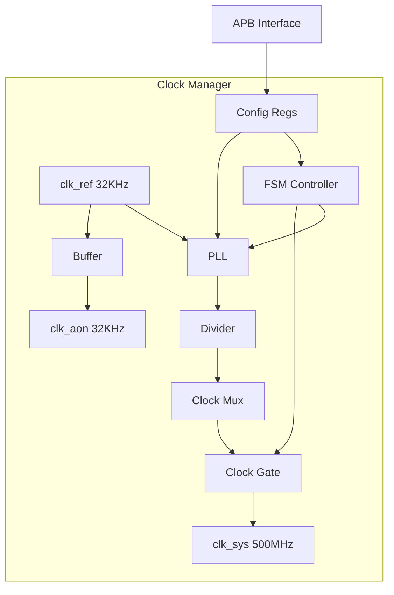

# M06_ClockManager Datapath

## 模块框图



## 时钟树结构

```
clk_ref (32KHz)
├── PLL (x15625)
│   └── clk_sys (500MHz)
│       ├── M00_SystolicArray
│       ├── M01_DataflowController
│       ├── M02_SRAM
│       ├── M03_DRAMController
│       └── M04_SystemBus
└── clk_aon (32KHz)
    ├── M05_PowerManager
    ├── M06_ClockManager
    └── M07_ResetManager
```

## 关键路径分析

### 路径 1: PLL 输出到系统时钟
- 起点：PLL 输出
- 终点：clk_sys 输出端口
- 延迟：2.0ns (500MHz 周期)
- 组成：PLL → Divider → Mux → Gate → Output Buffer

### 路径 2: 配置写到 PLL 更新
- 起点：cfg_wdata
- 终点：PLL 配置寄存器
- 延迟：31.25ns (32KHz 周期)
- 组成：APB Interface → Config Regs → PLL Control

### 路径 3: 门控使能到时钟输出
- 起点：clk_gate_en
- 终点：clk_sys
- 延迟：<10ns
- 组成：Gate Control → Clock Gate → Output

## 数据流

### PLL 配置流
1. APB 写入 PLL_CFG 寄存器
2. 配置数据传递到 PLL 控制逻辑
3. PLL 调整倍频系数和带宽
4. 锁定后输出稳定时钟

### 时钟门控流
1. clk_gate_en 信号输入
2. FSM 检查当前状态
3. 门控逻辑使能/禁用时钟
4. clk_sys 输出变化

## 资源估算

| 资源 | 数量 | 说明 |
|------|------|------|
| PLL | 1 | 模拟 IP |
| 分频器 | 1 | 数字逻辑 |
| 时钟门控单元 | 1 | ICG cell |
| 寄存器 | 12 | 配置寄存器 |
| 面积 | 0.01 mm² | 估算值 |
| 功耗 | 5 mW | 典型值 |
