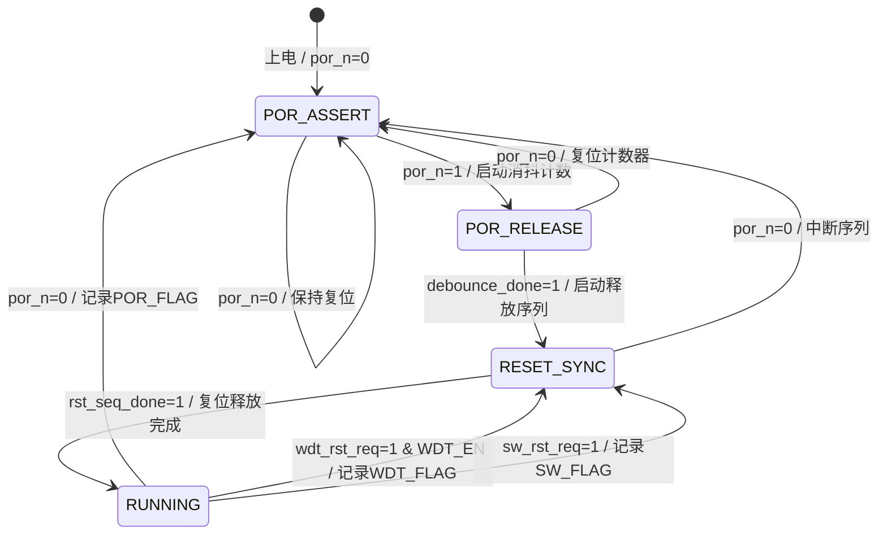

# M07 ResetManager — 状态机规范

## 1. 状态列表

| 状态编号 | 状态名       | 编码   | 描述                                          |
|---------|-------------|--------|-----------------------------------------------|
| S0      | POR_ASSERT  | 2'b00  | 上电复位有效，所有复位输出拉低                |
| S1      | POR_RELEASE | 2'b01  | por_n 已拉高，消抖计数中                      |
| S2      | RESET_SYNC  | 2'b10  | 消抖完成，按序释放各复位输出                  |
| S3      | RUNNING     | 2'b11  | 正常运行，监听 WDT/SW 复位请求                |

状态寄存器宽度：2 bit，时钟 CLK_AON，异步复位 por_n（低有效）。

---

## 2. 状态转移表

| 当前状态    | 条件                                      | 次态        | 动作                                      |
|------------|-------------------------------------------|-------------|-------------------------------------------|
| POR_ASSERT | por_n == 1                                | POR_RELEASE | 启动消抖计数器（16 CLK_AON）              |
| POR_ASSERT | por_n == 0                                | POR_ASSERT  | 保持，所有复位输出低                      |
| POR_RELEASE| debounce_done == 1                        | RESET_SYNC  | 清除 POR_FLAG，置位 rst_seq_start         |
| POR_RELEASE| por_n == 0（掉电）                        | POR_ASSERT  | 复位计数器，拉低所有复位输出              |
| RESET_SYNC | rst_seq_done == 1                         | RUNNING     | 所有复位输出已释放                        |
| RESET_SYNC | por_n == 0                                | POR_ASSERT  | 中断序列，重新复位                        |
| RUNNING    | por_n == 0                                | POR_ASSERT  | 拉低所有复位输出，记录 POR_FLAG           |
| RUNNING    | wdt_rst_req == 1 && WDT_EN == 1           | RESET_SYNC  | 拉低所有复位输出，记录 WDT_FLAG，重新释放 |
| RUNNING    | sw_rst_req == 1                           | RESET_SYNC  | 按 SCOPE 拉低对应复位，记录 SW_FLAG       |

---

## 3. 内部信号

| 信号名          | 位宽 | 描述                                    |
|----------------|------|-----------------------------------------|
| debounce_cnt   | 4    | 消抖计数器，计满 16 后置 debounce_done  |
| debounce_done  | 1    | 消抖完成标志                            |
| rst_seq_cnt    | 4    | 复位释放序列计数器                      |
| rst_seq_start  | 1    | 触发复位释放序列                        |
| rst_seq_done   | 1    | 复位释放序列完成                        |

复位释放序列（RESET_SYNC 内部）：
- cnt=0~1：rst_global_n 释放
- cnt=2~9：等待 8 周期后释放 rst_main_n
- cnt=10~13：等待 4 周期后释放 rst_sys_n
- cnt=14：rst_seq_done=1

---

## 4. Mermaid 状态图

