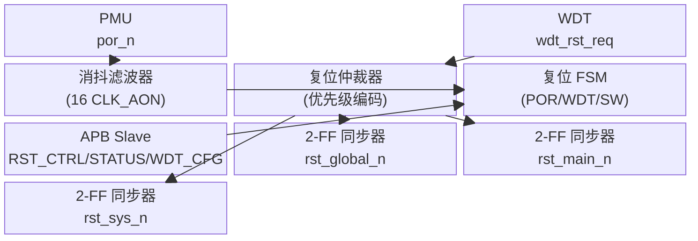

# M07 ResetManager — 数据路径规范

## 1. 模块框图



所有路径均在 CLK_AON（32 KHz）时钟域内，无跨域异步信号（por_n 经消抖后同步采样）。

---

## 2. 复位分发树

```
rst_global_n ──┬── PD_MAIN 所有时序单元
               ├── PD_SYS 所有时序单元
               └── ResetManager 内部（仅 POR 触发时自复位）

rst_main_n   ──── PD_MAIN（Systolic Array、SRAM、DMA 等）
                  在 rst_global_n 释放后 8 CLK_AON 延迟释放

rst_sys_n    ──── PD_SYS（系统总线、APB、中断控制器等）
                  在 rst_main_n 释放后 4 CLK_AON 延迟释放
```

释放顺序保证：全局 → 主域 → 系统域，避免总线在主域未就绪时发起事务。

---

## 3. 同步器结构

por_n 为异步输入，经两级 D 触发器同步后进入 FSM：

```
por_n (async) ──► [DFF1, clk_aon] ──► [DFF2, clk_aon] ──► por_n_sync
```

复位输出同步器（以 rst_global_n 为例）：

```
rst_raw_n (FSM输出) ──► [DFF1, clk_aon, async_rst=por_n] ──► [DFF2, clk_aon] ──► rst_global_n
```

同步器单元使用工艺库中的 SYNC2FF 标准单元（Samsung SF4 推荐），禁止综合工具优化。

---

## 4. 消抖滤波器

```
por_n_sync ──► 边沿检测（上升沿） ──► 计数器使能
计数器（4 bit，CLK_AON）──► 计满 16（≈500 µs）──► debounce_done
```

若计数期间 por_n_sync 再次拉低，计数器清零重新计数。

---

## 5. APB 寄存器访问路径

```
APB Master ──► apb_psel/penable/pwrite/paddr/pwdata
           ──► APB Slave 解码（偏移 0x00/0x04/0x08）
           ──► 寄存器堆（RST_CTRL, RST_STATUS, WDT_CFG）
           ──► FSM 控制信号（sw_rst_req, wdt_en, scope）
           ◄── apb_prdata（读路径）
```
