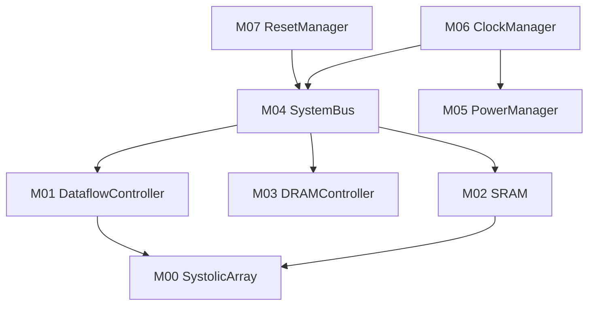

# TinyStories NPU MAS 实现计划

## 模块依赖图

## 并行实现矩阵

| 阶段 | 模块 | 类型 | 可并行 |
|------|------|------|--------|
| Phase 1 | M06_ClockManager | io | ✓ |
| Phase 1 | M07_ResetManager | io | ✓ |
| Phase 2 | M05_PowerManager | io | ✓ |
| Phase 2 | M04_SystemBus | interconnect | ✓ |
| Phase 3 | M02_SRAM | storage | ✓ |
| Phase 3 | M03_DRAMController | storage | ✓ |
| Phase 4 | M01_DataflowController | compute | - |
| Phase 5 | M00_SystolicArray | compute | - |

## 验证里程碑

| 里程碑 | 内容 | 目标日期 |
|--------|------|----------|
| MAS-M1 | Phase 1-2 模块 RTL 冻结 | 2026-09-30 |
| MAS-M2 | Phase 3 存储模块 RTL + MBIST | 2026-10-31 |
| MAS-M3 | M01 DataflowController RTL | 2026-11-30 |
| MAS-M4 | M00 SystolicArray RTL + 算力验证 | 2026-12-31 |
| MAS-M5 | 全芯片集成仿真 + 时序收敛 | 2027-03-31 |

## 关键风险

| 风险 | 模块 | 缓解措施 |
|------|------|----------|
| FP32 MAC 关键路径 ~1.8ns，500MHz margin 仅 0.2ns | M00 | 综合时施加 max_delay 约束，考虑流水线插入 |
| DRAM D2D 接口供应商未定 | M03 | 预留 LPDDR4X 和自定义接口两套方案 |
| 10 GB/s 带宽验证 | M03, M04 | 早期 RTL 仿真验证带宽，M04 已设计 16 GB/s 峰值 |
