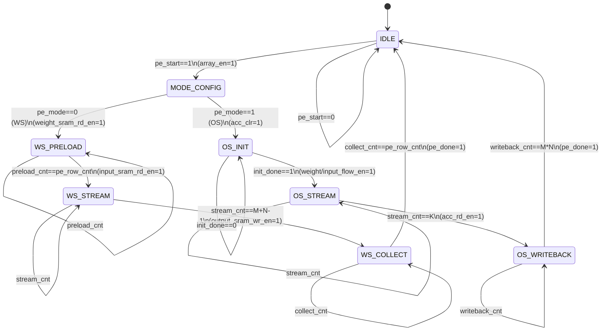

# M00 FSM: Systolic Array Mode Control

## State List

| State | Encoding | Description |
|-------|----------|-------------|
| IDLE | 3'b000 | 空闲状态，等待 `pe_start` 启动信号 |
| MODE_CONFIG | 3'b001 | 模式配置阶段，读取 `pe_mode` 和精度参数 |
| WS_PRELOAD | 3'b010 | WS 模式 Phase 1: 权重预加载到 PE 阵列 |
| WS_STREAM | 3'b011 | WS 模式 Phase 2: 输入数据流处理 |
| WS_COLLECT | 3'b100 | WS 模式 Phase 3: 输出结果收集 |
| OS_INIT | 3'b101 | OS 模式 Phase 1: 累加器初始化 |
| OS_STREAM | 3'b110 | OS 模式 Phase 2: 权重/输入流处理 |
| OS_WRITEBACK | 3'b111 | OS 模式 Phase 3: 结果写回 SRAM |

**注**: 状态编码采用 3-bit，便于扩展和调试。

## State Transition Table

| Current State | Condition | Target State | Output |
|---------------|-----------|--------------|--------|
| IDLE | `pe_start == 1` | MODE_CONFIG | `array_en = 1`, `ctrl_reg_load = 1` |
| IDLE | `pe_start == 0` | IDLE | 保持空闲 |
| MODE_CONFIG | `pe_mode == 0` (WS) | WS_PRELOAD | `weight_sram_rd_en = 1` |
| MODE_CONFIG | `pe_mode == 1` (OS) | OS_INIT | `acc_clr = 1` |
| WS_PRELOAD | `preload_cnt == pe_row_cnt` | WS_STREAM | `input_sram_rd_en = 1` |
| WS_PRELOAD | `preload_cnt < pe_row_cnt` | WS_PRELOAD | 继续加载权重 |
| WS_STREAM | `stream_cnt == pe_row_cnt + pe_col_cnt - 1` | WS_COLLECT | `output_sram_wr_en = 1` |
| WS_STREAM | `stream_cnt < max_stream` | WS_STREAM | 继续流处理 |
| WS_COLLECT | `collect_cnt == pe_row_cnt` | IDLE | `pe_done = 1`, `array_en = 0` |
| WS_COLLECT | `collect_cnt < pe_row_cnt` | WS_COLLECT | 继续收集输出 |
| OS_INIT | `init_done == 1` | OS_STREAM | `weight_flow_en = 1`, `input_flow_en = 1` |
| OS_INIT | `init_done == 0` | OS_INIT | 完成初始化 |
| OS_STREAM | `stream_cnt == K (internal)` | OS_WRITEBACK | `acc_rd_en = 1` |
| OS_STREAM | `stream_cnt < K` | OS_STREAM | 继续累加 |
| OS_WRITEBACK | `writeback_cnt == pe_row_cnt * pe_col_cnt` | IDLE | `pe_done = 1`, `array_en = 0` |
| OS_WRITEBACK | `writeback_cnt < total` | OS_WRITEBACK | 继续写回 |

**Counter Definitions**:
- `preload_cnt`: 权重预加载计数器 (0 to `pe_row_cnt`)
- `stream_cnt`: 数据流处理计数器
- `collect_cnt`: 输出收集计数器
- `writeback_cnt`: 写回计数器

## Mermaid State Diagram



## Mode Selection Logic (WS vs OS)

### 4.1 Mode Decision Criteria

| Criterion | WS Mode | OS Mode |
|-----------|---------|---------|
| Batch Size | >= 16 (大批量) | < 16 (小批量) |
| Reuse Pattern | Weight reuse high | Output reuse high |
| SRAM Access | Higher (output streaming) | Lower (output stationary) |
| Pipeline Efficiency | >= 80% (pipeline fill) | 100% (ideal) |
| Typical Use Case | Transformer FFN, Large MatMul | Single inference, Small batch |

**Decision Formula** (由 M01 Dataflow Controller 提供):
```
pe_mode = (batch_size >= threshold) ? WS : OS
threshold = 16 (default, configurable)
```

### 4.2 WS Mode Timing Breakdown

**Phase 1: Weight Preload** (`WS_PRELOAD` state)
```
Duration: M cycles (pe_row_cnt)
Operation:
  - SRAM[weight_addr + i] -> PE[i][*] weight register
  - Row-wise loading, 128 * data_w per cycle
  - Inactive rows: clock gating (pe_row_cnt < 128)
```

**Phase 2: Input Streaming** (`WS_STREAM` state)
```
Duration: M + N - 1 cycles (pipeline fill + drain)
Operation:
  - Input data flows column-wise through PE array
  - Partial sums accumulate along rows
  - PE pipeline latency: 5 cycles per PE
```

**Phase 3: Output Collection** (`WS_COLLECT` state)
```
Duration: M cycles (pe_row_cnt)
Operation:
  - Final results Y[M][*] stream out from right edge
  - Write to SRAM[output_addr + i]
```

**Total WS Latency**: `M + (M+N-1) + M = 3M + N - 1 cycles`
**Example (128x128)**: 383 cycles

### 4.3 OS Mode Timing Breakdown

**Phase 1: Output Initialize** (`OS_INIT` state)
```
Duration: 1 cycle
Operation:
  - Map output positions Y[i][j] to PE[i][j]
  - Clear all accumulators: acc_clr = 1
```

**Phase 2: Weight/Input Streaming** (`OS_STREAM` state)
```
Duration: K cycles (internal dimension)
Operation:
  - Weight W[i][*] flows row-wise
  - Input X[*][j] flows column-wise
  - PE[i][j] computes: acc += W[i][k] * X[k][j]
```

**Phase 3: Output Writeback** (`OS_WRITEBACK` state)
```
Duration: M * N cycles
Operation:
  - Read accumulator values from PE[i][j]
  - Write to SRAM[output_addr + i*N + j]
  - Support partial output for large matrices
```

**Total OS Latency**: `1 + K + M*N cycles`
**Example (128x128)**: 16512 cycles (无 pipeline 优势)

### 4.4 Precision Handling in FSM

| `pe_precision` | Precision | MAC Pipeline | Accumulator Width |
|----------------|-----------|--------------|-------------------|
| 2'b00 | FP8 (E4M3/E5M2) | FP8→FP16→MAC→FP32→FP8 | 32 bit |
| 2'b01 | FP16 | FP16→MAC→FP32→FP16 | 32 bit |
| 2'b10 | INT8 | INT8→MAC→FP32→INT8 | 32 bit |
| 2'b11 | FP32 | FP32→MAC→FP32 | 32 bit |

**Precision does NOT affect FSM state flow**, only affects:
- MAC unit configuration
- Quantization/Dequantization stages
- SRAM data width interpretation

### 4.5 Activity Control Integration

FSM respects `pe_row_cnt` and `pe_col_cnt` for dynamic array sizing:

```verilog
// State transition condition modification
always_comb begin
  max_stream = pe_row_cnt + pe_col_cnt - 1;
  max_writeback = pe_row_cnt * pe_col_cnt;
  
  // WS_PRELOAD: preload_cnt counts up to pe_row_cnt
  ws_preload_done = (preload_cnt == pe_row_cnt);
  
  // WS_COLLECT: collect_cnt counts up to pe_row_cnt
  ws_collect_done = (collect_cnt == pe_row_cnt);
  
  // OS_WRITEBACK: writeback_cnt counts up to M*N
  os_writeback_done = (writeback_cnt == max_writeback);
end
```

**Inactive PE Handling**:
- Rows > `pe_row_cnt`: Clock gating
- Columns > `pe_col_cnt`: Clock gating
- Power gating eligible when entire region inactive

## Control Signal Outputs

| Signal | Active States | Width | Function |
|--------|--------------|-------|----------|
| `array_en` | MODE_CONFIG → DONE | 1 | PE 阵阵使能 |
| `weight_sram_rd_en` | WS_PRELOAD | 1 | 权重 SRAM 读使能 |
| `input_sram_rd_en` | WS_STREAM | 1 | 输入 SRAM 读使能 |
| `output_sram_wr_en` | WS_COLLECT, OS_WRITEBACK | 1 | 输出 SRAM 写使能 |
| `weight_flow_en` | OS_STREAM | 1 | 权重流使能 (OS 模式) |
| `input_flow_en` | OS_STREAM | 1 | 输入流使能 (OS 模式) |
| `acc_clr` | OS_INIT | 1 | 累加器清零 |
| `acc_rd_en` | OS_WRITEBACK | 1 | 累加器读使能 |
| `pe_done` | IDLE (after completion) | 1 | 计算完成标志 |
| `ctrl_reg_load` | MODE_CONFIG | 1 | 控制寄存器加载 |

## Implementation Notes

### 6.1 Counter Design

```
Counter Structure:
  preload_cnt[8]:  0-127 (pe_row_cnt)
  stream_cnt[16]:  0-255 (M+N-1 or K)
  collect_cnt[8]:  0-127 (pe_row_cnt)
  writeback_cnt[14]: 0-16383 (M*N)
  
Counter Control:
  - Increment on each clock cycle in active state
  - Reset on state transition
  - Saturation at target value
```

### 6.2 Pipeline Synchronization

WS mode requires careful pipeline synchronization:

```
Time 0:   Row 0 weight preload
Time 1:   Row 1 weight preload, Row 0 input stream start
Time M:   Row M-1 weight preload, Row 0 input stream at PE[M-1]
Time M+N: Row 0 output ready
```

**Skew Management**: Input stream delayed by row index to align with preloaded weights.

### 6.3 OS Mode Optimization

For large matrices (K > 128), OS mode supports **tiled computation**:

```
Tile Size: 128x128 (full array)
Iterations: ceil(K / 128)
FSM loops: OS_INIT → OS_STREAM (128 cycles) → partial output
           Repeat for each tile
Final: OS_WRITEBACK (accumulate partial results)
```

### 6.4 Error Handling

| Error Condition | FSM Response |
|-----------------|--------------|
| `pe_row_cnt == 0` or `pe_col_cnt == 0` | Stay IDLE, `pe_done = 1` (no operation) |
| SRAM timeout | Hold current state, retry |
| Precision mismatch | Default to FP16, log warning |

### 6.5 DVFS Integration

FSM supports DVFS transition during IDLE state:

```
DVFS Commands (from M08 Scheduler):
  - freq_scale: Adjust clock frequency
  - volt_scale: Adjust supply voltage
  - FSM must be in IDLE state for DVFS transition
```

## Verification Checklist

| Test Case | Description | Expected Behavior |
|-----------|-------------|-------------------|
| WS Full Array | 128x128, all precision | State sequence: IDLE→CONFIG→PRELOAD→STREAM→COLLECT→IDLE |
| OS Full Array | 128x128, all precision | State sequence: IDLE→CONFIG→INIT→STREAM→WRITEBACK→IDLE |
| Partial Array | M=64, N=64 | FSM respects `pe_row_cnt/pe_col_cnt`, inactive PE gated |
| Small Matrix | M=8, N=8 | Correct counter limits, reduced latency |
| Mode Switch | WS→OS consecutive | FSM returns to IDLE between operations |
| Zero Operation | `pe_row_cnt=0` | FSM stays IDLE, `pe_done=1` immediately |
| DVFS Transition | IDLE state only | No FSM activity during DVFS |