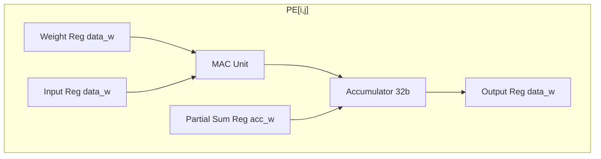
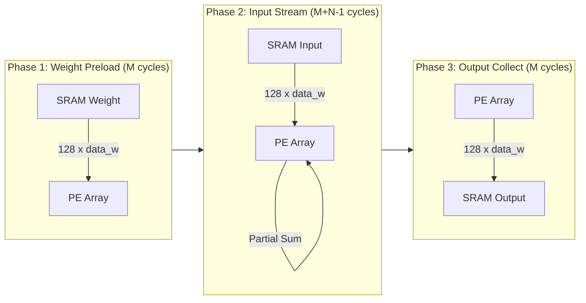
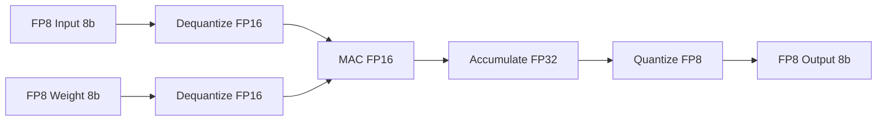

# Datapath Design - M00 Systolic Array

## Overview

128x128 PE Systolic Array with WS/OS Dual-Mode Operation, supporting FP8/FP16/INT8/FP32 precision.

| Parameter | Value | Description |
|-----------|-------|-------------|
| Array Size | 128x128 | 16384 PE units |
| Clock Domain | CLK_SYS | 250-500 MHz, DVFS support |
| Power Domain | PD_MAIN | Main power domain |
| Peak TOPS | 16.384 (FP8) | @ 500 MHz, 100% utilization |
| Effective TOPS | >= 2 (FP8) | REQ-COMPUTE-001, 80% utilization |

## Block Diagram (Mermaid)

```mermaid
graph TB
    subgraph Input["Input Stage"]
        IF[Input FIFO 128-entry]
        RB[Row Buffer 128x128]
        WF[Weight FIFO 128-entry]
        WB[Weight Buffer 128x128]
    end
    
    subgraph PEArray["PE Array 128x128"]
        PE00[PE[0,0]]
        PE01[PE[0,1]]
        PE0n[PE[0,127]]
        PE10[PE[1,0]]
        PE11[PE[1,1]]
        PE1n[PE[1,127]]
        PEm0[PE[127,0]]
        PEm1[PE[127,1]]
        PEmn[PE[127,127]]
    end
    
    subgraph Output["Output Stage"]
        OA[Output Accumulator 128x32b]
        OF[Output FIFO 128-entry]
        QZ[Quantizer FP8/FP16]
    end
    
    subgraph Control["Control Logic"]
        FSM[Mode FSM]
        PC[Precision Config]
        AC[Activity Control]
    end
    
    WF --> WB
    WB --> PEArray
    IF --> RB
    RB --> PEArray
    PEArray --> OA
    OA --> QZ
    QZ --> OF
    FSM --> PEArray
    PC --> QZ
    AC --> PEArray
```

## PE Microarchitecture

### PE Internal Structure



### PE Component Table

| Component | Width | Function | Latency |
|-----------|-------|----------|---------|
| Weight Register | data_w (8/16/32b) | Store weight value | 1 cycle |
| Input Register | data_w (8/16/32b) | Store input value | 1 cycle |
| Partial Sum Reg | acc_w (32b) | Receive upstream partial sum | 1 cycle |
| MAC Unit | data_w x data_w | Multiply + Add | 1 cycle |
| Accumulator | 32b | Sum accumulation | 1 cycle |
| Output Register | data_w | Final result output | 1 cycle |

### Data Width by Precision

| Precision | data_w | acc_w | MAC Input | MAC Output |
|-----------|--------|-------|-----------|------------|
| FP8 (E4M3) | 8 bit | 32 bit | FP8->FP16 | FP32 |
| FP8 (E5M2) | 8 bit | 32 bit | FP8->FP16 | FP32 |
| FP16 | 16 bit | 32 bit | FP16 | FP32 |
| INT8 | 8 bit | 32 bit | INT8->FP32 | FP32 |
| FP32 | 32 bit | 32 bit | FP32 | FP32 |

## Data Flow Modes

### WS Mode (Weight Stationary)

**Principle**: Weight preloaded to PE array, input flows column-wise, partial sums flow row-wise.



**WS Data Flow Timing**:

| Cycle | Row 0 | Row 1 | ... | Row M-1 | Activity |
|-------|-------|-------|-----|---------|----------|
| 0 | Load W[0] | - | ... | - | Weight preload start |
| 1 | Load W[1] | Load W[0] | ... | - | Skewed loading |
| M-1 | Load W[M-1] | Load W[M-2] | ... | Load W[0] | Preload complete |
| M | Input X[0] | W[0] ready | ... | W[M-1] ready | Stream start |
| M+N-1 | Output Y[0] | Partial sum | ... | Input at PE[M-1] | First output |
| M+2N-2 | Output Y[M-1] | Output Y[M-2] | ... | Output Y[0] | All output ready |

**WS Utilization Formula**:
```
Utilization_WS = M*N / (M+N-1) * Pipeline_Efficiency
Peak (M=N=128): 50% single cycle, >=80% with pipeline
```

**WS Suitable Scenarios**:
- Transformer FFN layer (weight fixed, activation streaming)
- Large batch size (batch >= 16)
- High weight reuse rate

### OS Mode (Output Stationary)

**Principle**: Output element fixed in PE accumulator, weight and input flow separately.

```mermaid
graph TB
    subgraph Phase1["Phase 1: Init (1 cycle)"]
        ACC_CLR[Accumulator Clear]
    end
    
    subgraph Phase2["Phase 2: Stream (K cycles)"]
        WF[Weight Flow Row-wise]
        IF[Input Flow Column-wise]
        PE[PE[i,j]]
        ACC[Accumulator]
        
        WF --> PE
        IF --> PE
        PE --> ACC
    end
    
    subgraph Phase3["Phase 3: Writeback (M*N cycles)"]
        ACC2[Accumulator Read]
        SRAM[SRAM Output]
        ACC2 --> SRAM
    end
    
    Phase1 --> Phase2
    Phase2 --> Phase3
```

**OS Data Flow Timing**:

| Cycle | PE[i,j] Activity | Data Flow |
|-------|------------------|-----------|
| 0 | Acc_clr = 1 | Initialize |
| 1 | Receive W[i,0], X[0,j] | Stream start |
| 2 | acc += W[i,1] * X[1,j] | Accumulate |
| K | Y[i,j] = acc complete | Final sum |
| K+1 | Read Y[0,0] | Writeback start |
| K+M*N | Write Y[M-1,N-1] | Writeback complete |

**OS Utilization Formula**:
```
Utilization_OS = K / K = 100% (ideal)
Actual: Pipeline fill overhead, overall >= 80%
```

**OS Suitable Scenarios**:
- Single inference (batch = 1)
- Small batch size (batch < 16)
- Output reuse high, reduce SRAM access

### Mode Comparison

| Metric | WS Mode | OS Mode |
|--------|---------|---------|
| Weight Access | Preload once | Stream K times |
| Input Access | Stream M+N-1 | Stream K times |
| Output Access | Stream out | Write once |
| SRAM Bandwidth | High | Low |
| Pipeline Efficiency | >=80% | 100% ideal |
| Best Batch Size | >= 16 | < 16 |

## Pipeline Structure

### PE Pipeline Stages

| Stage | Name | Operation | Latency |
|-------|------|-----------|---------|
| S0 | Input Reg | Data input capture | 1 cycle |
| S1 | Weight Reg | Weight capture (WS: preload, OS: flow) | 1 cycle |
| S2 | MAC | Multiply + Add | 1 cycle |
| S3 | Accumulator | Partial sum update | 1 cycle |
| S4 | Output Reg | Result output | 1 cycle |

**Total PE Pipeline**: 5 cycles per PE

### Array Pipeline Fill

```mermaid
gantt
    title WS Mode Pipeline Fill (128x128)
    dateFormat X
    axisFormat cycles
    
    section Row 0
    Weight Load :0, 128
    Input Stream :128, 128
    Output Collect :255, 128
    
    section Row 127
    Weight Load :0, 1
    Wait Skew :1, 127
    Input Stream :128, 128
    Output Collect :255, 128
```



**Pipeline Fill Time**:
- Full array fill: 128 + 127 = 255 cycles
- Single PE latency: 5 cycles
- WS total: 3M + N - 1 = 383 cycles (128x128)
- OS total: 1 + K + M*N = 16512 cycles (128x128, no pipeline)

### Input/Output FIFO Design

| FIFO | Depth | Width | Purpose |
|------|-------|-------|---------|
| Input FIFO | 128-entry | 128 x data_w | Buffer input stream |
| Weight FIFO | 128-entry | 128 x data_w | Buffer weight preload |
| Output FIFO | 128-entry | 128 x data_w | Buffer output collect |
| Row Buffer | 128x128 | data_w | Skew alignment |

## Critical Path Analysis

### Maximum Delay Path

```
Critical Path: Weight Reg -> MAC -> Accumulator -> Output Reg

Breakdown:
  - Weight Reg clock-to-Q: <= 1 ns
  - MAC multiply (FP16): <= 1.5 ns
  - MAC add (FP32): <= 0.8 ns
  - Accumulator update: <= 0.5 ns
  - Output Reg setup: <= 0.2 ns
  - Total: <= 4 ns (250 MHz worst case)
```

### Timing Constraints

| Constraint | Value @ 500MHz | Value @ 250MHz | Notes |
|------------|----------------|----------------|-------|
| Clock Period | 2 ns | 4 ns | CLK_SYS |
| Setup Time | <= 1.5 ns | <= 3.5 ns | After clock-to-Q |
| Hold Time | >= 0.5 ns | >= 0.5 ns | Minimum |
| Clock-to-Q | <= 1 ns | <= 1 ns | PE register |
| MAC Latency | <= 1.5 ns | <= 3 ns | FP16 multiply |

### Clock Distribution


**Clock Skew Target**: <= 100 ps across 128x128 array

### DVFS Operating Points

| OP Point | Frequency | Voltage | TOPS (FP8) | Power Ratio |
|----------|-----------|---------|------------|-------------|
| High | 500 MHz | 0.9 V | >= 2 TOPS | 100% |
| Medium | 350 MHz | 0.8 V | >= 1.4 TOPS | 70% |
| Low | 250 MHz | 0.7 V | >= 1 TOPS | 50% |

REQ-PWR-003: Support >= 2 DVFS operating points

## Precision Support

### Precision Configuration

| `pe_precision` | Mode | Input | Weight | Accumulate | Output |
|----------------|------|-------|--------|------------|--------|
| 2'b00 | FP8 E4M3 | 8b | 8b | 32b FP32 | 8b |
| 2'b00 | FP8 E5M2 | 8b | 8b | 32b FP32 | 8b |
| 2'b01 | FP16 | 16b | 16b | 32b FP32 | 16b |
| 2'b10 | INT8 | 8b | 8b | 32b FP32 | 8b |
| 2'b11 | FP32 | 32b | 32b | 32b FP32 | 32b |

### TOPS by Precision

| Precision | Peak TOPS | Util 80% | Effective TOPS | REQ Target | Status |
|-----------|-----------|----------|----------------|------------|--------|
| FP8 | 16.384 | 13.1 | >= 2 | REQ-COMPUTE-001 | PASS |
| FP16 | 8.192 | 6.55 | >= 1 | REQ-COMPUTE-002 | PASS |
| INT8 | 16.384 | 13.1 | >= 2 | REQ-COMPUTE-003 | PASS |
| FP32 | 4.096 | 3.28 | >= 0.5 | REQ-COMPUTE-007 | PASS |

**TOPS Calculation**:
```
TOPS = 128 * 128 * F_MHz * 2 * Utilization
     = 16384 * 500M * 2 * 0.8
     = 13.1 TOPS (FP8 @ 500MHz)
```

### FP8 Quantization Pipeline



### Rounding Modes

| `round_mode` | Name | Description |
|--------------|------|-------------|
| 2'b00 | RN | Round to Nearest (ties to even) |
| 2'b01 | RZ | Round toward Zero |
| 2'b10 | RU | Round toward +inf |
| 2'b11 | RD | Round toward -inf |

### Precision Error Budget

REQ-COMPUTE-007: INT8/FP8 precision loss <= 0.5% vs FP32 baseline

| Precision | Max Error | Test Method |
|-----------|-----------|-------------|
| FP8 E4M3 | <= 0.3% | Matrix multiply vs FP32 |
| FP8 E5M2 | <= 0.5% | Activation range test |
| INT8 | <= 0.2% | Quantization calibration |
| FP16 | <= 0.01% | Baseline comparison |

## Activity Control

### Dynamic Array Sizing

| Signal | Range | Purpose |
|--------|-------|---------|
| `pe_row_cnt` | 0-127 | Active row count |
| `pe_col_cnt` | 0-127 | Active column count |

**Inactive PE Handling**:
- Rows > `pe_row_cnt`: Clock gating
- Columns > `pe_col_cnt`: Clock gating
- Entire inactive region: Power gating eligible

### Power Optimization

| Technique | Application | Savings |
|-----------|-------------|---------|
| Clock Gating | Inactive PE rows/cols | 30-50% dynamic |
| Power Gating | Entire inactive region | 70-90% leakage |
| Precision Scaling | FP8/INT8 vs FP16 | 20-30% MAC power |
| DVFS | Frequency/Voltage scaling | 50% at Low OP |

## SRAM Bandwidth Requirement

| Operation | Bandwidth | Calculation |
|-----------|-----------|-------------|
| Weight Preload | 128 x data_w | 128 * 16b = 2048b/cycle |
| Input Stream | 128 x data_w | 128 * 16b = 2048b/cycle |
| Output Collect | 128 x data_w | 128 * 16b = 2048b/cycle |
| **Peak Total** | >= 4096b/cycle | 2 concurrent streams |

**Recommended**: SRAM bandwidth >= 256 x 16b = 4096 bit/cycle @ 500 MHz

## Interface Summary

| Interface | Width | Direction | Clock Domain |
|-----------|-------|-----------|--------------|
| pe_mode | 1 bit | Input | CLK_SYS |
| pe_precision | 2 bit | Input | CLK_SYS |
| pe_start/done | 2 bit | Input/Output | CLK_SYS |
| pe_row_cnt/col_cnt | 16 bit | Input | CLK_SYS |
| weight_in | 128 x data_w | Input | CLK_SYS |
| input_in | 128 x data_w | Input | CLK_SYS |
| output_out | 128 x data_w | Output | CLK_SYS |
| weight_addr/input_addr/output_addr | 48 bit | Input | CLK_SYS |
| fp8_format | 1 bit | Input | CLK_SYS |
| round_mode | 2 bit | Input | CLK_SYS |
| saturation | 1 bit | Input | CLK_SYS |

## References

- MAS.md: M00 Module Architecture Specification
- FSM.md: M00 Mode Control State Machine
- REQ-COMPUTE-001~007: Compute performance requirements
- REQ-PWR-003: DVFS support requirement
- module_tree.md: Module hierarchy and dependencies