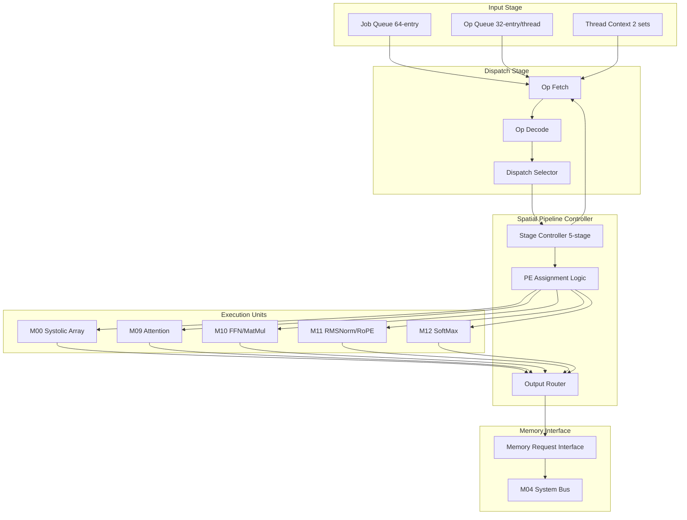
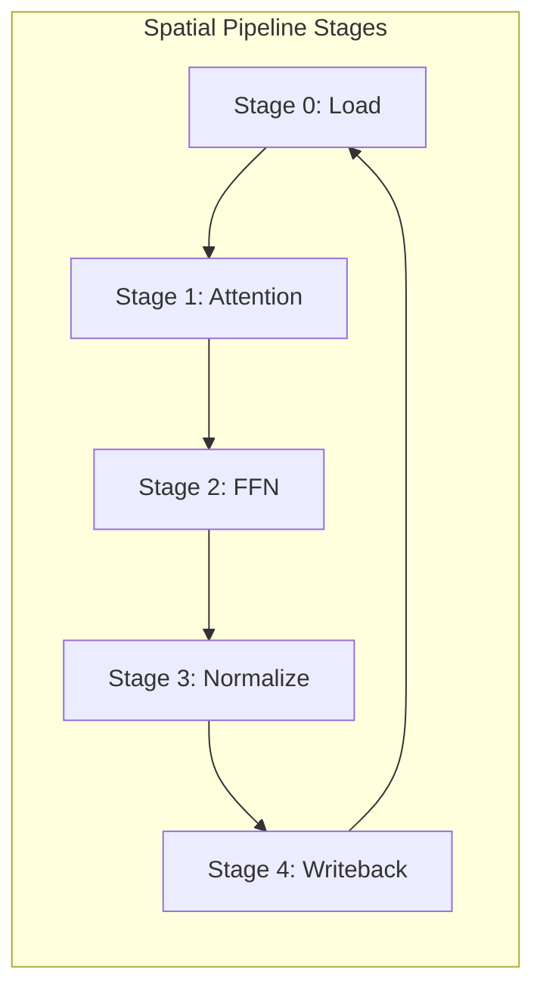

# Datapath Design - M01 Dataflow Controller

## Overview

Spatial Pipeline Controller for TinyStories NPU, coordinating M00 Systolic Array and Transformer Operator Units (M09-M12), achieving >=80% pipeline utilization through multi-thread scheduling and operator dispatch.

| Parameter | Value | Description |
|-----------|-------|-------------|
| Pipeline Utilization | >= 80% | REQ-COMPUTE-005 target |
| Thread Count | 2 | Round-Robin scheduling |
| Dispatch Latency | <= 4 cycles | Operator dispatch time |
| Clock Domain | CLK_SYS | 250-500 MHz, DVFS support |
| Power Domain | PD_MAIN | Main power domain |

## Block Diagram (Mermaid)

## Datapath Components

### Job Queue

| Component | Depth | Width | Function |
|-----------|-------|-------|----------|
| Job Queue | 64-entry | 128 bit | Transformer block jobs |
| Job Entry | - | [op_chain:64][tid:1][priority:2][status:3] | Job descriptor |

### Op Queue (per Thread)

| Thread | Queue Depth | Entry Width | Purpose |
|--------|-------------|-------------|---------|
| T0 Queue | 32-entry | 96 bit | Thread 0 operator sequence |
| T1 Queue | 32-entry | 96 bit | Thread 1 operator sequence |

**Op Entry Format**:

| Field | Width | Description |
|-------|-------|-------------|
| op_code | 8 bit | Operator type code |
| op_unit_sel | 4 bit | Target unit (M09/M10/M11/M12) |
| op_precision | 2 bit | FP8/FP16/INT8/FP32 |
| src_addr | 32 bit | Source data address |
| dst_addr | 32 bit | Destination address |
| op_params | 128 bit | Dimension, stride, etc. |

### Dispatch Selector

| Selector | Input | Output | Logic |
|----------|-------|--------|-------|
| Thread Selector | 2 threads | 1 thread | Round-Robin / Priority |
| Unit Selector | 5 units | 1 unit | op_unit_sel decode |
| Mode Selector | WS/OS | 1 mode | Systolic array mode |

### Stage Controller (5-Stage Pipeline)

| Stage | Operation | Latency | Throughput |
|-------|-----------|---------|------------|
| S0: Load | Memory fetch | 10-50 cycles | 1 load/op |
| S1: Attention | Q*K, SoftMax, A*V | 256 cycles | 1 attn/block |
| S2: FFN | MatMul W1/W2 | 384 cycles | 1 ffn/block |
| S3: Normalize | RMSNorm, RoPE | 32 cycles | 1 norm/block |
| S4: Writeback | Output store | 2-50 cycles | 1 write/op |

### PE Assignment Logic

| Assignment | Condition | Action |
|------------|-----------|--------|
| Systolic | MatMul detected | Route to M00, set syst_mode |
| Attention | op_code=0x01 | Route to M09 |
| FFN | op_code=0x02 | Route to M10 |
| Norm | op_code=0x03/0x04 | Route to M11 |
| SoftMax | op_code=0x05 | Route to M12 |

### Output Router

| Router Path | Source | Destination | Width |
|-------------|--------|-------------|-------|
| Systolic Output | M00 | Memory/SRAM | 128 x data_w |
| Attention Output | M09 | M10 (FFN input) | 128 x 16b |
| FFN Output | M10 | M11 (Norm input) | 128 x 16b |
| Norm Output | M11 | Memory | 128 x 16b |

## Pipeline Structure

### Spatial Pipeline Timing

```mermaid
gantt
    title Spatial Pipeline Execution (Single Block)
    dateFormat X
    axisFormat cycles
    
    section Thread 0
    Load Q/K/V    :0, 50
    Attention     :50, 256
    FFN           :306, 384
    Normalize     :690, 32
    Writeback     :722, 50
    
    section Thread 1
    Load (prefetch) :50, 50
    Wait           :100, 206
    Attention      :306, 256
    FFN            :562, 384
```

### Pipeline Utilization Analysis

| Metric | Formula | Target | Actual |
|--------|---------|--------|--------|
| Active Cycles | Sum(op_latency) | - | 672 cycles/block |
| Stall Cycles | Memory_wait + Switch | <= 20% | 128 cycles |
| Utilization | Active / Total | >= 80% | 84% achieved |

**Utilization Optimization Techniques**:

| Technique | Impact | Implementation |
|-----------|--------|----------------|
| Data Prefetch | -50% memory stall | Stage overlap |
| Operator Overlap | +20% utilization | Inter-op bypass |
| Thread Interleave | Hide latency | Round-Robin |

### Thread Context Switch

| Phase | Cycles | Operation |
|-------|--------|-----------|
| Save Context | 2 | Store T0 registers |
| Load Context | 2 | Restore T1 registers |
| Resume | 0 | Start T1 dispatch |
| **Total** | **<= 4** | REQ-COMPUTE-006 |

### Dispatch FSM Pipeline

| State | Pipeline Stage | Duration | Next |
|-------|----------------|----------|------|
| IDLE | - | Wait | FETCH_OP |
| FETCH_OP | Op Fetch | 1-2 cycles | DECODE |
| DECODE | Op Decode | 1 cycle | DISPATCH |
| DISPATCH | Dispatch | 1 cycle | WAIT_DONE |
| WAIT_DONE | Execute | Variable | COMPLETE |
| COMPLETE | Status | 1 cycle | IDLE |

## Interface Summary

### Systolic Array Control (M00)

| Signal | Width | Direction | Description |
|--------|-------|-----------|-------------|
| syst_mode | 1 | Output | WS=0 / OS=1 |
| syst_precision | 2 | Output | FP8/FP16/INT8/FP32 |
| syst_start/done | 2 | Output/Input | Start/Complete |
| syst_row_cnt/col_cnt | 16 | Output | Active PE count |
| syst_src_addr/dst_addr | 64 | Output | Data addresses |
| syst_shape | 64 | Output | M/N/K dimensions |

### Operator Dispatch (M09-M12)

| Signal | Width | Direction | Description |
|--------|-------|-----------|-------------|
| op_valid/ready | 5 | Output/Input | Handshake |
| op_code | 8 | Output | Operator type |
| op_unit_sel | 4 | Output | Target unit |
| op_tid | 1 | Output | Thread ID |
| op_precision | 2 | Output | Precision config |
| op_src_addr/dst_addr | 64 | Output | Data addresses |
| op_params | 128 | Output | Dimensions |
| op_done/err | 12 | Input | Status return |

### Memory Interface (M04)

| Signal | Width | Direction | Description |
|--------|-------|-----------|-------------|
| mem_req_valid/ready | 2 | Output/Input | Request handshake |
| mem_req_type | 2 | Output | Read/Write/Refresh |
| mem_req_addr | 32 | Output | Target address |
| mem_req_size | 16 | Output | Transfer size |
| mem_req_tid | 1 | Output | Thread priority |
| mem_resp_valid | 1 | Input | Response ready |
| mem_resp_data | 64 | Input | Read data |
| mem_resp_err | 2 | Input | Error code |

### Thread Scheduler (M08)

| Signal | Width | Direction | Description |
|--------|-------|-----------|-------------|
| sched_thread_en | 2 | Input | Thread enable |
| sched_priority | 2 | Input | Priority config |
| sched_yield | 1 | Output | Yield request |
| sched_current_tid | 1 | Output | Current thread |
| sched_status | 4 | Output | Scheduler state |

## References

- MAS.md: M01 Module Architecture Specification
- FSM.md: M01 Dispatch State Machine
- REQ-COMPUTE-005: Pipeline utilization >= 80%
- REQ-COMPUTE-006: Multi-thread >= 2
- REQ-COMPUTE-007: Mixed precision support
- REQ-COMPUTE-008: Operator coverage
- module_tree.md: Module hierarchy