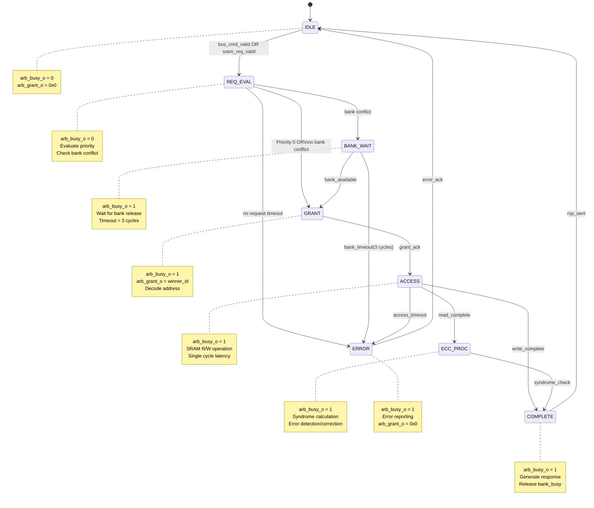

# M02 FSM: Memory Access Arbitration State Machine

## State List

| State | Encoding | Description | arb_busy_o | Access Activity |
|-------|----------|-------------|------------|-----------------|
| IDLE | 000 | 空闲状态，等待访问请求 | 0 | 无访问 |
| REQ_EVAL | 001 | 请求评估，检测有效请求并仲裁优先级 | 0 | 请求解析 |
| GRANT | 010 | 授权状态，选择获胜 Master 并发出 arb_grant_o | 1 | 授权信号 |
| BANK_WAIT | 011 | Bank 等待状态，等待 Bank Conflict 解决 | 1 | Bank 等待 |
| ACCESS | 100 | 访问状态，执行 SRAM 读写操作 | 1 | SRAM R/W |
| ECC_PROC | 101 | ECC 处理状态，单错纠正或双错检测（读操作） | 1 | ECC 计算 |
| COMPLETE | 110 | 完成状态，生成响应并释放授权 | 1 | 响应输出 |
| ERROR | 111 | 错误状态，Bank Conflict timeout 或非法访问 | 1 | 错误报告 |

## State Transition Table

| Current State | Condition | Next State | Output |
|---------------|-----------|------------|--------|
| IDLE | bus_cmd_valid_i OR sram_req_valid_i | REQ_EVAL | arb_busy_o = 0, start_arb_timer |
| IDLE | otherwise | IDLE | arb_busy_o = 0, arb_grant_o = 0x0 |
| REQ_EVAL | Priority 0 request (arb_priority_i = 0) | GRANT | arb_grant_o = master_id, preempt_active |
| REQ_EVAL | Priority 1-3 requests, no bank conflict | GRANT | arb_grant_o = winner_id (round-robin for P1) |
| REQ_EVAL | Bank conflict detected | BANK_WAIT | bank_wait_timer_start, arb_grant_o = pending_id |
| REQ_EVAL | No valid request after timeout | ERROR | arb_busy_o = 1, ecc_err_type = timeout |
| GRANT | grant_ack received | ACCESS | sram_addr decoded, bank selected |
| GRANT | grant_timeout (10 cycles) | ERROR | arb_grant_o = 0x0, error_report |
| BANK_WAIT | bank_available | GRANT | arb_grant_o = pending_id, bank_select |
| BANK_WAIT | bank_timeout (3 cycles) | ERROR | bank_conflict_abort, error_report |
| ACCESS | Read operation complete | ECC_PROC | rdata_loaded, ecc_syndrome_calc |
| ACCESS | Write operation complete | COMPLETE | wdata_written, bypass ECC |
| ACCESS | access_timeout (2 cycles) | ERROR | arb_grant_o = 0x0, error_report |
| ECC_PROC | No error (syndrome = 0) | COMPLETE | rdata_corrected = 0, ecc_err_valid_o = 0 |
| ECC_PROC | Single-bit error | COMPLETE | rdata_corrected = 1, ecc_err_valid_o = 1, ecc_err_type_o = 0 |
| ECC_PROC | Double-bit error | COMPLETE | rdata_uncorrectable, ecc_err_valid_o = 1, ecc_err_type_o = 1, ecc_irq_o = 1 |
| COMPLETE | rsp_sent | IDLE | arb_busy_o = 0, arb_grant_o = 0x0, bus_rsp_valid_o = 1 or sram_rsp_valid_o = 1 |
| ERROR | error_ack | IDLE | arb_busy_o = 0, error_clear |

## Priority Arbitration Logic

| Priority Level | Master ID | Arbitration Policy | Preemptive |
|----------------|-----------|--------------------|------------|
| 0 (Highest) | M00 (0x0) | 立即授权，可打断当前访问 | Yes |
| 1 | M09-M12 (0x1-0x4) | Round-robin among same priority | No |
| 2 | M13 (0x5) | 等待高优先级完成后授权 | No |
| 3 (Lowest) | M15 (0x6) | 空闲时授权 | No |

### Round-Robin Counter for Priority 1

```
round_robin_ptr[2:0]:  // 3-bit pointer for M09-M12
  0x0 -> M09 (0x1)
  0x1 -> M10 (0x2)
  0x2 -> M11 (0x3)
  0x3 -> M12 (0x4)
  // Increment after each grant
```

## Bank Conflict Detection

| Bank Addressing | Bank Select | Conflict Condition |
|-----------------|-------------|-------------------|
| Address[16:19] | bank_id[3:0] | Same bank_id as current access |
| 16 banks | 0x0-0xF | bank_busy[bank_id] = 1 |

### Bank Status Register

```
bank_busy[15:0]:  // 16-bit bank busy status
  bank_busy[i] = 1 if bank[i] is being accessed
  bank_busy[i] = 0 if bank[i] is available
```

## Mermaid State Diagram



## Timing Parameters

| Parameter | Value | Description |
|-----------|-------|-------------|
| t_idle_to_eval | 1 cycle | Request detection latency |
| t_eval_to_grant | < 1 cycle | Arbitration decision time |
| t_grant_to_access | 1 cycle | Grant to access latency |
| t_bank_wait | 0-3 cycles | Bank conflict resolution time |
| t_access | 1 cycle | SRAM read/write latency |
| t_ecc_proc | 0 cycle | ECC processing (parallel) |
| t_complete | 1 cycle | Response generation |
| t_total_latency | 2-4 cycles | Complete arbitration cycle |
| t_grant_timeout | 10 cycles | Grant acknowledge timeout |
| t_bank_timeout | 3 cycles | Bank conflict timeout |
| t_access_timeout | 2 cycles | Access operation timeout |

## State Encoding Details

```verilog
// State encoding (3-bit)
localparam [2:0]
    STATE_IDLE       = 3'b000,  // Wait for request
    STATE_REQ_EVAL   = 3'b001,  // Evaluate request priority
    STATE_GRANT      = 3'b010,  // Grant access to master
    STATE_BANK_WAIT  = 3'b011,  // Wait for bank available
    STATE_ACCESS     = 3'b100,  // SRAM read/write
    STATE_ECC_PROC   = 3'b101,  // ECC check/correct (read)
    STATE_COMPLETE   = 3'b110,  // Generate response
    STATE_ERROR      = 3'b111;  // Error state
```

## Output Actions by State

| State | arb_busy_o | arb_grant_o | bank_busy | ecc_err_valid_o | Response |
|-------|------------|-------------|-----------|-----------------|----------|
| IDLE | 0 | 0x0 | all_clear | 0 | None |
| REQ_EVAL | 0 | pending | no_change | 0 | None |
| GRANT | 1 | winner_id | set_busy | 0 | None |
| BANK_WAIT | 1 | pending_id | wait | 0 | None |
| ACCESS | 1 | current_id | busy | 0 | None |
| ECC_PROC | 1 | current_id | busy | syndrome_check | None |
| COMPLETE | 1 | current_id | clear | ecc_result | bus_rsp_valid or sram_rsp_valid |
| ERROR | 1 | 0x0 | clear | 1 | error_report |

## ECC Processing Details

### Syndrome Calculation (Parallel with Read)

| Syndrome Value | Condition | Action |
|----------------|-----------|--------|
| Syndrome = 0 | No error | Return data directly |
| Syndrome[6] = 1 | Single-bit error | Correct bit at position Syndrome[0:5] |
| Syndrome[6] = 0 | Double-bit error | Detect only, set IRQ |

### ECC Error Output Mapping

| ecc_err_type_o | ecc_err_valid_o | ecc_irq_o | Description |
|----------------|-----------------|-----------|-------------|
| 0 | 1 | 0 | Single-bit error corrected |
| 1 | 1 | 1 | Double-bit error detected |
| 0 | 0 | 0 | No error |

## 64-bit Access Handling

| Access Width | Bank Usage | State Behavior |
|--------------|------------|----------------|
| 32-bit | Single bank (bank_id) | Normal single-cycle access |
| 64-bit | Two adjacent banks (bank_id, bank_id+1) | ACCESS state extends 1 cycle |

### 64-bit Access State Extension

```
64-bit read:
  ACCESS (Cycle 0): Read bank_id
  ACCESS (Cycle 1): Read bank_id+1
  ECC_PROC: Check both banks
  COMPLETE: Return 64-bit data

64-bit write:
  ACCESS (Cycle 0): Write bank_id
  ACCESS (Cycle 1): Write bank_id+1
  COMPLETE: Acknowledge
```

## Power Mode Impact

| Power Mode | FSM Behavior | Access Allowed |
|------------|--------------|----------------|
| Active | Full FSM operation | Yes |
| Sleep | FSM frozen, state preserved | No (sram_retention_i = 1) |
| Deep Sleep | FSM reset, state lost | No (sram_power_gate_i = 1) |

### Power Transition Handling

| Transition | FSM Action |
|------------|------------|
| Active -> Sleep | Complete current access, freeze in IDLE |
| Sleep -> Active | Resume from frozen state |
| Active -> Deep Sleep | Abort current access, reset FSM |
| Deep Sleep -> Active | Initialize FSM to IDLE |

## DVFS Impact

| DVFS OP | Cycle Duration | FSM Timing |
|---------|----------------|------------|
| OP0 (500 MHz) | 2 ns | t_access = 1 cycle (2 ns) |
| OP1 (250 MHz) | 4 ns | t_access = 1 cycle (4 ns) |

FSM logic is clock-domain independent, but timing scales with DVFS OP.