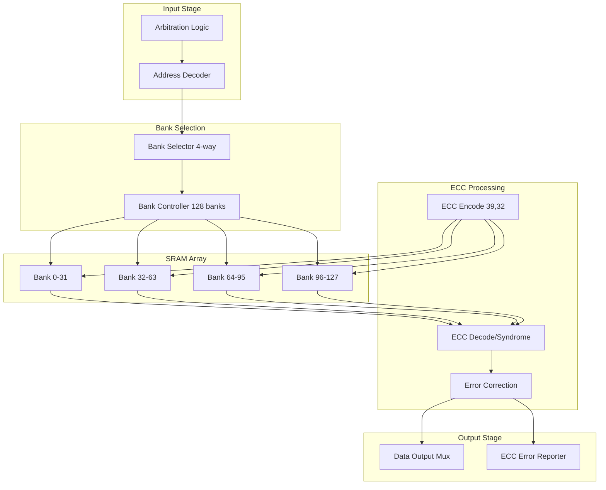
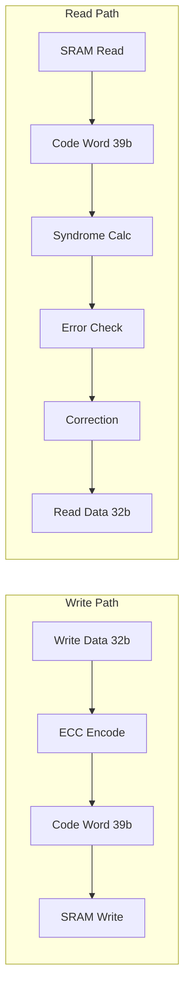
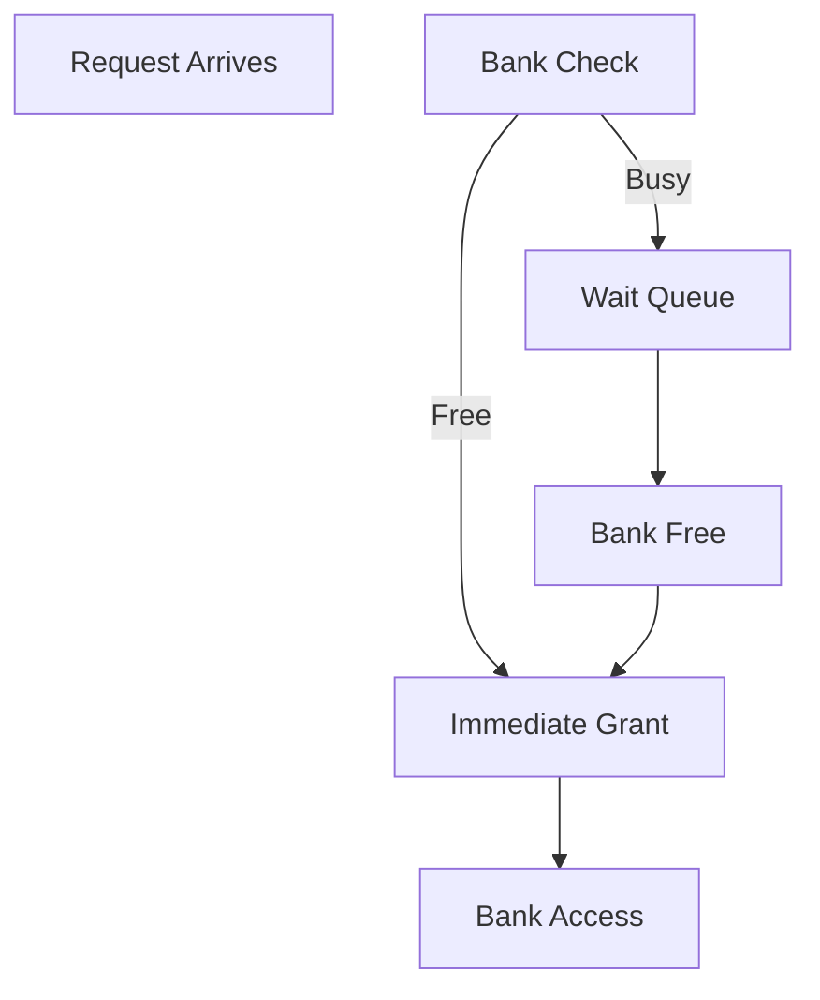

# Datapath Design - M02 SRAM Scratchpad

## Overview

512 KB High-Speed SRAM Scratchpad with SECDED ECC (39,32) protection, 4-way Bank Interleaving for high-bandwidth concurrent access, serving as activation buffer and KV cache storage for TinyStories NPU.

| Parameter | Value | Description |
|-----------|-------|-------------|
| Capacity | 512 KB | 128K x 32-bit words |
| ECC | SECDED (39,32) | Single error correction, double error detection |
| Bank Interleaving | 4-way | 128 banks, 1024 words/bank |
| Access Latency | 1 cycle | <= 2 ns @ 500 MHz |
| Bandwidth | >= 8 GB/s | Dual-port read+write |
| Clock Domain | CLK_SYS | 250-500 MHz, DVFS support |
| Power Domain | PD_MAIN | Main power domain |

## Block Diagram (Mermaid)



## Datapath Components

### Arbitration Logic

| Arbiter Type | Masters | Policy | Priority |
|--------------|---------|--------|----------|
| Priority Arbiter | 5 sources | Fixed + RR | M00=0, M09-M12=1, M13=2, M15=3 |

**Arbitration Timing**:

| Scenario | Latency | Description |
|----------|---------|-------------|
| Single request | 0 cycles | Immediate grant |
| Two requests | 1 cycle | Priority comparison |
| Bank conflict | 0-3 cycles | Wait for bank free |

### Address Decoder

| Address Field | Bits | Function |
|---------------|------|----------|
| Bank Select | addr[16:19] | 128 banks, 4-way interleaved |
| Row Address | addr[6:15] | 1024 rows per bank |
| Word Offset | addr[0:5] | 64 words per row |

**Address Map**:

```
Address Range: 0x8000_0000 - 0x8007_FFFF (512 KB)

Bank Interleaving:
  - addr[16:19] selects bank group (16 banks active)
  - 4-way interleaving reduces bank conflict
  - 64-bit access spans 2 adjacent banks
```

### Bank Selector

| Selector | Input | Output | Logic |
|----------|-------|--------|-------|
| Bank Group | addr[16:19] | bank_id[0:127] | 4-way decode |
| Access Width | width_cfg | bank_count | 1 bank (32b) / 2 banks (64b) |

**Bank Interleaving Pattern**:

| Address | Bank Group | Interleaving |
|---------|------------|--------------|
| 0x0000 | Bank 0,4,8,12 | 4-way interleaved |
| 0x0004 | Bank 1,5,9,13 | Next group |
| 0x0008 | Bank 2,6,10,14 | Next group |
| 0x000C | Bank 3,7,11,15 | Next group |

### ECC Implementation (SECDED 39,32)



**ECC Code Structure**:

| Bit Range | Content | Function |
|-----------|---------|----------|
| [0-31] | Data bits D0-D31 | Original data |
| [32-38] | Check bits C0-C6 | Hamming code |

**Check Bit Coverage**:

| Check Bit | Covers Positions | Description |
|-----------|------------------|-------------|
| C0 | 1,3,5,7,9,11... | Parity group 0 |
| C1 | 2,3,6,7,10,11... | Parity group 1 |
| C2 | 4-7,12-15,20-23... | Parity group 2 |
| C3 | 8-15,24-31 | Parity group 3 |
| C4 | 16-31 | Parity group 4 |
| C5 | 32-38 | Parity group 5 |
| C6 | All bits | Overall parity |

### Error Detection & Correction

| Error Type | Syndrome | Action | IRQ |
|------------|----------|---------|-----|
| No Error | 0 | Return data | None |
| Single-bit Data | Non-zero, parity OK | XOR correct | Optional |
| Single-bit ECC | Non-zero, ECC pos | Ignore, recalc | Optional |
| Double-bit | Non-zero, parity fail | Detect only | Required |
| Multi-bit | Invalid syndrome | Detect only | Required |

**Syndrome Decode Logic**:

```
Syndrome = Received_Parity XOR Expected_Parity

if Syndrome == 0:
    No error
elif Syndrome[6] == 1:  # Overall parity matches
    Single-bit error at position Syndrome[0:5]
    Correct by XOR at that position
else:
    Double-bit or multi-bit error detected
```

### SRAM Array Organization

| Parameter | Value | Description |
|-----------|-------|-------------|
| Total Banks | 128 | Parallel access banks |
| Bank Depth | 1024 words | 1024 x 39-bit per bank |
| Bank Width | 39 bit | 32 data + 7 ECC |
| Interleaving | 4-way | 4 banks per group |

**Bank Access Timing**:

| Operation | Latency | Description |
|-----------|---------|-------------|
| Bank Read | 1 cycle | SRAM array access |
| Bank Write | 1 cycle | SRAM array write |
| ECC Calc | Parallel | No additional latency |
| Total | 1 cycle | Single-cycle access |

## Pipeline Structure

### Single-Cycle Access Pipeline

```mermaid
gantt
    title SRAM Access Pipeline (Single Cycle)
    dateFormat X
    axisFormat ns
    
    section Read Path
    Arbitration  :0, 1
    Address Decode :1, 1
    Bank Access   :2, 1
    ECC Decode    :2, 1
    Data Output   :3, 1
    
    section Write Path
    Arbitration  :0, 1
    Address Decode :1, 1
    ECC Encode    :1, 1
    Bank Write    :2, 1
```



| Stage | Operation | Latency | Overlap |
|-------|-----------|---------|---------|
| S0 | Arbitration | <1 cycle | - |
| S1 | Address Decode | <1 cycle | With ECC |
| S2 | Bank Access | 1 cycle | Core access |
| S3 | ECC Process | Parallel | No overhead |
| S4 | Data Output | <1 cycle | - |

### Bank Conflict Handling



| Conflict Scenario | Wait Time | Resolution |
|-------------------|-----------|------------|
| Different bank | 0 cycles | Parallel access |
| Same bank, same priority | 1-3 cycles | Round-robin |
| Same bank, higher priority | Preemptive | Priority wins |

### Bandwidth Calculation

| Configuration | Read BW | Write BW | Total |
|---------------|---------|----------|-------|
| 32-bit @ 500 MHz | 2 GB/s | 2 GB/s | 4 GB/s |
| 64-bit @ 500 MHz | 4 GB/s | 4 GB/s | 8 GB/s |
| Dual-port @ 500 MHz | 4 GB/s | 4 GB/s | **>= 8 GB/s** |

**Bandwidth Efficiency**:

```
Effective BW = Peak BW * (1 - Bank_Conflict_Rate)

Target: >= 8 GB/s
Bank Conflict Rate: < 10% with 4-way interleaving
```

## Interface Summary

### System Bus Interface (TileLink/AXI)

| Signal | Width | Direction | Description |
|--------|-------|-----------|-------------|
| bus_cmd_valid/ready | 2 | Input/Output | Command handshake |
| bus_cmd_addr | 32 | Input | Byte address |
| bus_cmd_rw | 1 | Input | Read/Write flag |
| bus_cmd_width | 2 | Input | 32-bit/64-bit |
| bus_cmd_wdata | 64 | Input | Write data |
| bus_cmd_wstrb | 8 | Input | Byte enable |
| bus_rsp_valid | 1 | Output | Response ready |
| bus_rsp_rdata | 64 | Output | Read data |
| bus_rsp_error | 1 | Output | Error flag |

### Direct Access Interface (M00/M11/M12)

| Signal | Width | Direction | Description |
|--------|-------|-----------|-------------|
| sram_req_valid/ready | 2 | Input/Output | Request handshake |
| sram_req_addr | 20 | Input | Word address |
| sram_req_rw | 1 | Input | Read/Write |
| sram_req_wdata | 64 | Input | Write data |
| sram_req_wstrb | 8 | Input | Byte enable |
| sram_rsp_valid | 1 | Output | Response ready |
| sram_rsp_rdata | 64 | Output | Read data |
| sram_rsp_error | 1 | Output | Error flag |

### ECC Status Interface

| Signal | Width | Direction | Description |
|--------|-------|-----------|-------------|
| ecc_err_addr | 32 | Output | Error address |
| ecc_err_type | 1 | Output | Single/Double error |
| ecc_err_valid | 1 | Output | Error flag |
| ecc_irq | 1 | Output | Error interrupt |

### Power Management Interface

| Signal | Width | Direction | Description |
|--------|-------|-----------|-------------|
| sram_retention | 1 | Input | Retention mode enable |
| sram_power_gate | 1 | Input | Power gate enable |
| sram_power_status | 1 | Output | Power state |

## References

- MAS.md: M02 Module Architecture Specification
- FSM.md: M02 Access State Machine
- REQ-MEM-002: SRAM bandwidth >= 8 GB/s
- REQ-MEM-003: Access latency <= 2 ns
- REQ-MEM-004: 512 KB capacity
- REQ-MEM-005: ECC SECDED protection
- module_tree.md: Module hierarchy