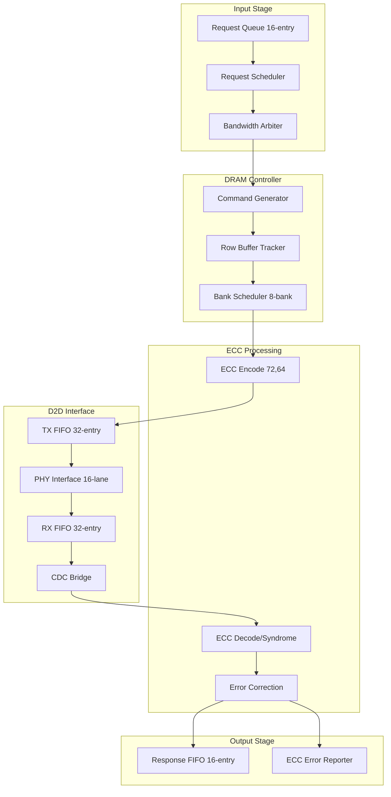
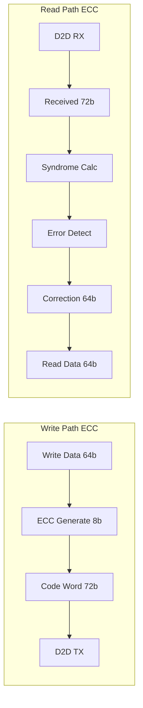
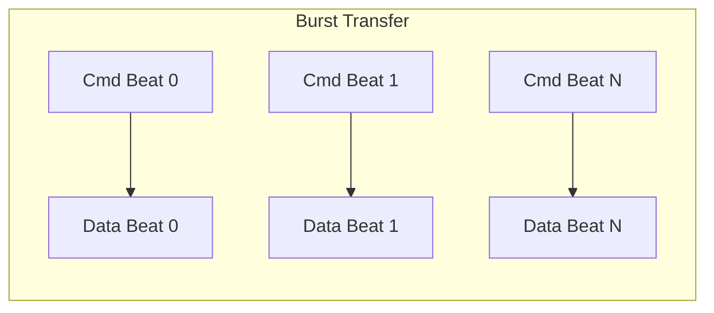

# Datapath Design - M03 DRAM Controller

## Overview

3D Stacked DRAM Controller managing 2 GB LPDDR4X DRAM die via Die-to-Die (D2D) interface, achieving >= 10 GB/s bandwidth with <= 100 ns row hit latency, SECDED ECC (72,64) protection for data reliability.

| Parameter | Value | Description |
|-----------|-------|-------------|
| Capacity | 2 GB | Model weights, KV cache, intermediate |
| Bandwidth | >= 10 GB/s | REQ-MEM-002 target |
| Row Hit Latency | <= 100 ns | REQ-MEM-003 target |
| ECC | SECDED (72,64) | Single error correction, double error detection |
| D2D Interface | Wafer-on-Wafer | 16-lane differential signaling |
| Clock Domain | CLK_SYS / CLK_D2D | 250-500 MHz + D2D PHY clock |
| Power Domain | PD_MAIN | Main power domain |

## Block Diagram (Mermaid)



## Datapath Components

### Request Queue

| Queue | Depth | Width | Purpose |
|-------|-------|-------|---------|
| Request Queue | 16-entry | 128 bit | Pending DRAM requests |
| Entry Format | - | [addr:32][rw:1][size:16][tid:4][priority:3] | Request descriptor |

### Request Scheduler

| Scheduler Type | Policy | Optimization |
|----------------|--------|--------------|
| Row-aware Scheduler | Row hit priority | Maximize row buffer hits |
| Bank Scheduler | 8-bank parallel | Bank interleaving |
| Bandwidth Arbiter | Priority + Round-Robin | Fair bandwidth allocation |

**Scheduling Algorithm**:

```
Scheduling Priority:
  1. Row hit requests (same bank, same row) - highest priority
  2. High priority master requests
  3. Round-robin among same priority

Reorder Window: 8 pending requests
Row Hit Target: >= 80% hit rate
```

### Bandwidth Arbiter

| Master | Priority | Bandwidth Allocation | Use Case |
|--------|----------|---------------------|----------|
| M00 Systolic | 0 (Highest) | 8 GB/s | Compute data |
| M09-M12 Operators | 1 | 4 GB/s | Transformer ops |
| M13 ISA Decoder | 2 | 1 GB/s | Instruction fetch |
| M15 JTAG | 3 | 0.5 GB/s | Debug access |

### Command Generator

| Command | LPDDR4X Code | Sequence | Latency |
|---------|--------------|----------|---------|
| ACT | Activate | ACT -> wait tACT | 50 ns |
| READ | Read | READ -> wait tRD | 50 ns |
| WRITE | Write | WRITE -> wait tWR | 50 ns |
| PRE | Precharge | PRE -> wait tPRE | 20 ns |
| REF | Refresh | REF -> wait tRFC | 350 ns |

**Access Sequence**:

| Scenario | Commands | Total Latency |
|----------|----------|---------------|
| Row Hit | READ/WRITE only | <= 100 ns |
| Row Miss | ACT -> READ/WRITE | <= 150 ns |
| Row Conflict | PRE -> ACT -> READ/WRITE | <= 170 ns |

### Row Buffer Tracker

| Tracker | Banks | Content | Purpose |
|---------|-------|---------|---------|
| Row Buffer Map | 8 | [bank_id][row_addr] | Track active row per bank |
| Hit/Miss Detector | - | Comparator | Fast row status check |

**Row Buffer Policy**:

| Policy | Description | Benefit |
|--------|-------------|---------|
| Open Page | Keep row open after access | Row hit optimization |
| Row Tracking | Track all bank states | Fast scheduling |
| Predictive | Prefetch likely rows | Reduce miss rate |

### ECC Implementation (SECDED 72,64)



**ECC Code Structure**:

| Field | Bits | Description |
|-------|------|-------------|
| Data | 64 | Original data D0-D63 |
| ECC | 8 | Check bits C0-C7 |
| Total | 72 | SECDED code word |

### D2D PHY Interface

| Parameter | Value | Description |
|-----------|-------|-------------|
| Lanes | 16 | Bidirectional data lanes |
| Lane Width | 1 bit | Differential signaling |
| Data Rate | 4267 Mbps/lane | LPDDR4X max rate |
| Total BW | >= 10 GB/s | 16 lanes @ 4267 Mbps |

**D2D Protocol Stack**:

| Layer | Function | Implementation |
|-------|----------|----------------|
| PHY | Physical signaling | 16-lane differential |
| Link | Clock alignment | PLL, deskew |
| Transport | Command framing | LPDDR4X encode |
| Protocol | DRAM commands | ACT, READ, WRITE |

### CDC Bridge

| Crossing | Direction | Method | Depth |
|----------|-----------|--------|-------|
| CLK_SYS -> CLK_D2D | Command/Data TX | Async FIFO | 32 entries |
| CLK_D2D -> CLK_SYS | Data RX | Async FIFO | 32 entries |
| CLK_D2D -> CLK_SYS | Status | 2-stage sync | Control signals |

**CDC Timing**:

| Path | Sync Latency | Total |
|------|--------------|-------|
| Request path | 2-3 cycles | CMD + FIFO |
| Response path | 2-3 cycles | FIFO + sync |

## Pipeline Structure

### DRAM Access Pipeline

```mermaid
gantt
    title DRAM Access Pipeline (Row Hit)
    dateFormat X
    axisFormat ns
    
    section Request
    Queue       :0, 2
    Schedule    :2, 1
    Command     :3, 1
    
    section D2D
    TX FIFO     :4, 2
    PHY TX      :6, 5
    DRAM Proc   :11, 50
    PHY RX      :61, 5
    RX FIFO     :66, 2
    
    section Response
    ECC Check   :68, 2
    Response    :70, 2
```



| Phase | Duration | Description |
|-------|----------|-------------|
| Request Processing | 2-4 cycles | Queue + Schedule |
| D2D TX | 5-10 ns | FIFO + PHY |
| DRAM Processing | 50-100 ns | DRAM die access |
| D2D RX | 5-10 ns | PHY + FIFO |
| ECC + Response | 2-4 cycles | Check + Output |
| **Total RTT** | **<= 100 ns** | Row hit latency |

### Burst Transfer Pipeline



| Burst Parameter | Value | Description |
|-----------------|-------|-------------|
| Burst Length | 16/32 | Configurable |
| Burst Interval | 4 clocks | Beat spacing |
| Burst Efficiency | >= 90% | Bandwidth utilization |

### Bandwidth Calculation

| Configuration | Lane BW | Total BW | Efficiency |
|---------------|---------|----------|------------|
| 16 lanes @ 4267 Mbps | 0.53 GB/s/lane | 8.5 GB/s | Peak |
| 16 lanes @ burst 16 | - | >= 10 GB/s | With burst |

**Bandwidth Efficiency**:

```
Effective BW = Peak BW * Burst_Efficiency * Row_Hit_Rate

Target: >= 10 GB/s
Burst Efficiency: >= 90%
Row Hit Rate: >= 80%
```

## Interface Summary

### System Bus Interface (TileLink/AXI)

| Signal | Width | Direction | Description |
|--------|-------|-----------|-------------|
| bus_cmd_valid/ready | 2 | Input/Output | Command handshake |
| bus_cmd_addr | 32 | Input | DRAM address |
| bus_cmd_rw | 1 | Input | Read/Write flag |
| bus_cmd_data | 72 | Input | Write data + ECC |
| bus_cmd_mask | 8 | Input | Byte enable |
| bus_rsp_valid | 1 | Output | Response ready |
| bus_rsp_data | 72 | Output | Read data + ECC |
| bus_rsp_error | 1 | Output | Error flag |
| bus_rsp_latency | 8 | Output | Access latency (ns) |

### D2D Interface Signals

| Signal | Width | Direction | Description |
|--------|-------|-----------|-------------|
| d2d_cmd_valid/ready | 2 | Output/Input | Command handshake |
| d2d_cmd_addr | 32 | Output | DRAM die address |
| d2d_cmd_rw | 1 | Output | Read/Write |
| d2d_cmd_burst | 8 | Output | Burst length |
| d2d_wdata_valid | 1 | Output | Write data valid |
| d2d_wdata | 72 | Output | Write data + ECC |
| d2d_wdata_last | 1 | Output | Last beat |
| d2d_rdata_valid | 1 | Input | Read data valid |
| d2d_rdata | 72 | Input | Read data + ECC |
| d2d_rdata_last | 1 | Input | Last beat |
| d2d_rdata_error | 1 | Input | ECC error flag |

### D2D PHY Interface

| Signal | Width | Direction | Description |
|--------|-------|-----------|-------------|
| d2d_tx_data | 16 | Output | TX data lanes |
| d2d_tx_clk | 1 | Output | TX clock |
| d2d_rx_data | 16 | Input | RX data lanes |
| d2d_rx_clk | 1 | Input | RX clock |
| d2d_pll_lock | 1 | Input | PLL locked |

### ECC Status Interface

| Signal | Width | Direction | Description |
|--------|-------|-----------|-------------|
| ecc_err_addr | 32 | Output | Error address |
| ecc_err_type | 2 | Output | Single/Double/Multi |
| ecc_err_valid | 1 | Output | Error flag |
| ecc_corrected | 1 | Output | Correction done |

### Power Management Interface

| Signal | Width | Direction | Description |
|--------|-------|-----------|-------------|
| dram_active | 1 | Output | Active state |
| dram_idle | 1 | Output | Idle state |
| dram_power_mode | 2 | Input | Active/SRefresh/DPD |
| dram_self_refresh_req/ack | 2 | Input/Output | Self-refresh control |

## References

- MAS.md: M03 Module Architecture Specification
- FSM.md: M03 DRAM State Machine
- REQ-MEM-001: 2 GB DRAM capacity
- REQ-MEM-002: >= 10 GB/s bandwidth
- REQ-MEM-003: <= 100 ns latency
- REQ-MEM-005: ECC SECDED protection
- REQ-D2D-001: D2D interface
- REQ-D2D-003: <= 5 pJ/bit energy
- REQ-D2D-004: <= 100 ns RTT
- module_tree.md: Module hierarchy