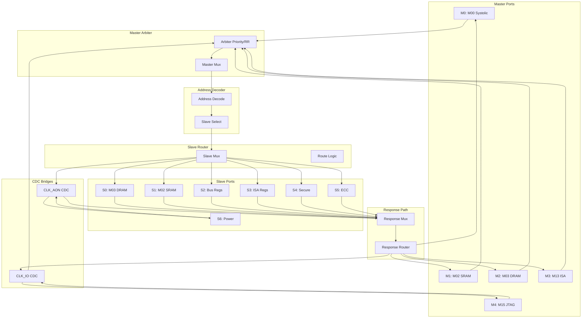
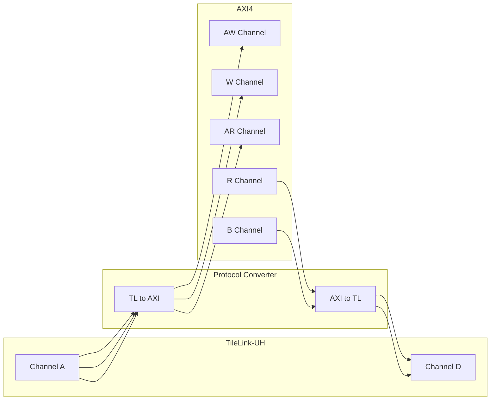
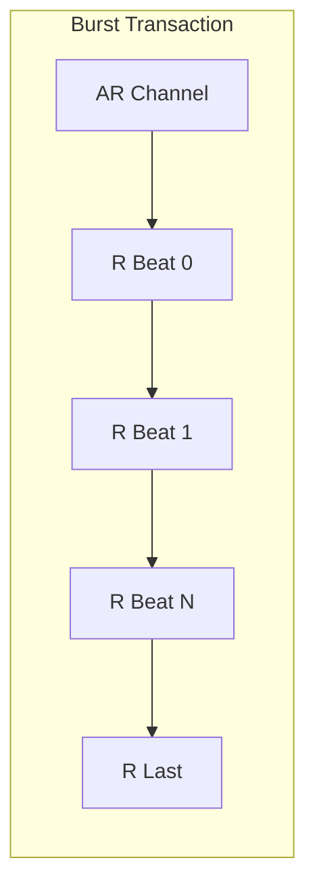

# Datapath Design - M04 System Bus

## Overview

System Interconnect Module implementing TileLink/AXI dual-protocol crossbar, connecting 5 Masters (M00 Systolic, M02 SRAM, M03 DRAM, M13 ISA, M15 JTAG) to 7 Slaves with priority-based arbitration and CDC synchronization for CLK_SYS/CLK_IO/CLK_AON domains.

| Parameter | Value | Description |
|-----------|-------|-------------|
| Masters | 5 | M00, M02, M03, M13, M15 |
| Slaves | 7 | DRAM, SRAM, Bus Regs, ISA, Secure, ECC, Power |
| Data Width | 128 bit | TileLink/AXI data path |
| Protocol | TileLink-UH / AXI4 | Dual-protocol support |
| Arbitration | Priority + RR | No starvation guarantee |
| CDC Domains | 3 | CLK_SYS, CLK_IO, CLK_AON |
| Clock Domain | CLK_SYS | 250-500 MHz |
| Power Domain | PD_MAIN | Main power domain |

## Block Diagram (Mermaid)



## Datapath Components

### Master Arbiter

| Arbiter Mode | Description | Use Case |
|--------------|-------------|----------|
| Priority | Fixed priority, highest wins | High-performance compute |
| Round-Robin | Fair rotation | Balanced bandwidth |
| Weighted RR | Weight-based rotation | Custom bandwidth allocation |

**Default Priority Assignment**:

| Master | Priority | Weight | Description |
|--------|----------|--------|-------------|
| M0 (Systolic) | 0 (Highest) | 8 | Compute data |
| M3 (ISA) | 1 | 4 | Instruction fetch |
| M1 (SRAM) | 2 | 2 | DMA control |
| M2 (DRAM) | 2 | 2 | DMA control |
| M4 (JTAG) | 3 (Lowest) | 1 | Debug access |

**Arbitration Timing**:

| Scenario | Latency | Description |
|----------|---------|-------------|
| Single request | 1 cycle | Immediate grant |
| Two requests | 2 cycles | Priority compare + grant |
| Multiple pending | 2-4 cycles | Winner selection |

### Address Decoder

| Address Range | Slave | Size | Description |
|---------------|-------|------|-------------|
| 0x0000_0000 - 0x7FFF_FFFF | S0 (DRAM) | 2 GB | Main memory |
| 0x8000_0000 - 0x8007_FFFF | S1 (SRAM) | 512 KB | Scratchpad |
| 0x8008_0000 - 0x8008_FFFF | S2 (Bus Regs) | 4 KB | Bus registers |
| 0x8009_0000 - 0x8009_FFFF | S3 (ISA Regs) | 4 KB | ISA registers |
| 0x800A_0000 - 0x800A_FFFF | S4 (Secure) | 4 KB | Secure Boot |
| 0x800B_0000 - 0x800B_FFFF | S5 (ECC) | 4 KB | ECC status |
| 0x800C_0000 - 0x800C_FFFF | S6 (Power) | 4 KB | Power Manager |

**Decode Logic**:

```
Address Decode:
  addr[31:29] == 0b00 --> S0 (DRAM)
  addr[31:29] == 0b10 --> Register space
    addr[28:16] == 0x000 --> S1 (SRAM)
    addr[28:16] == 0x008 --> S2 (Bus Regs)
    addr[28:16] == 0x009 --> S3 (ISA Regs)
    addr[28:16] == 0x00A --> S4 (Secure)
    addr[28:16] == 0x00B --> S5 (ECC)
    addr[28:16] == 0x00C --> S6 (Power)
  else --> Error (invalid address)
```

### Slave Router

| Router | Input | Output | Width |
|--------|-------|--------|-------|
| TileLink Router | Channel A | S0/S1 | 128 bit |
| Register Router | Reg Interface | S2-S6 | 32 bit |
| CDC Router | Async Bridge | S6/M4 | Variable |

### Protocol Converter



**Protocol Mapping**:

| TileLink Opcode | AXI Operation | Mapping |
|-----------------|---------------|---------|
| PutFullData (0) | AW+W channels | Write full |
| PutPartialData (1) | AW+W with wstrb | Write partial |
| Get (4) | AR channel | Read |
| AccessAck (0) | B channel | Write response |
| AccessAckData (1) | R channel | Read response |

### CDC Bridge

| Crossing | From -> To | Method | FIFO Depth |
|----------|------------|--------|------------|
| JTAG Request | CLK_IO -> CLK_SYS | 2-stage handshake | 4 entries |
| JTAG Response | CLK_SYS -> CLK_IO | 2-stage handshake | 4 entries |
| Power Request | CLK_SYS -> CLK_AON | Pulse synchronizer | 2 entries |
| Power Response | CLK_AON -> CLK_SYS | Handshake sync | 4 entries |

**CDC Timing**:

| Path | Sync Latency | Description |
|------|--------------|-------------|
| CLK_IO -> CLK_SYS | 2-3 cycles | JTAG request |
| CLK_SYS -> CLK_IO | 2-3 cycles | JTAG response |
| CLK_SYS -> CLK_AON | 4-6 cycles | Slow clock domain |
| CLK_AON -> CLK_SYS | 2-3 cycles | Fast clock domain |

### Response Path

| Response Router | Input | Output | Width |
|-----------------|-------|--------|-------|
| TileLink D Router | Slave D | Master D | 128 bit |
| AXI R/B Router | Slave R/B | Master R/B | 128 bit |
| Reg Response | Slave Reg | Master Reg | 32 bit |

## Pipeline Structure

### Transaction Pipeline

```mermaid
gantt
    title Bus Transaction Pipeline
    dateFormat X
    axisFormat cycles
    
    section Request Path
    Arbiter      :0, 2
    Address Decode :2, 1
    Slave Route   :3, 1
    Slave Accept  :4, 1
    
    section Slave Access
    DRAM Access   :5, 50
    SRAM Access   :5, 2
    Reg Access    :5, 2
    
    section Response Path
    Response Mux  :55, 1
    Response Route :56, 1
    Master Accept :57, 1
```



| Stage | Latency | Description |
|-------|---------|-------------|
| Arbitration | 2 cycles | Request priority comparison |
| Address Decode | 1 cycle | Slave selection |
| Slave Route | 1 cycle | Route to target |
| Slave Access | Variable | DRAM/SRAM/Reg latency |
| Response | 2 cycles | Response routing |

### Burst Transfer Pipeline



| Burst Parameter | AXI4 | TileLink-UH |
|-----------------|------|-------------|
| Max Burst Length | 256 beats | param field |
| Burst Type | INCR/FIXED/WRAP | Multiple beats |
| Beat Width | 128 bit | 128 bit |

### Bandwidth Calculation

| Metric | Target | Calculation |
|--------|--------|-------------|
| DRAM Bandwidth | >= 10 GB/s | 128 bit @ 500 MHz * burst efficiency |
| SRAM Bandwidth | >= 8 GB/s | 128 bit @ 500 MHz * access rate |
| Register BW | <= 1 GB/s | 32 bit @ 500 MHz |
| Arbitration Rate | >= 250 M req/s | @ 500 MHz |

## Interface Summary

### TileLink-UH Master Interface (M0, M1, M2)

| Signal | Width | Direction | Description |
|--------|-------|-----------|-------------|
| tl_a_valid/ready | 2 | Input/Output | Channel A handshake |
| tl_a_opcode | 3 | Input | Operation code |
| tl_a_param | 3 | Input | Burst parameter |
| tl_a_size | 3 | Input | Transaction size |
| tl_a_source | 4 | Input | Master ID |
| tl_a_address | 32 | Input | Target address |
| tl_a_mask | 16 | Input | Byte mask |
| tl_a_data | 128 | Input | Write data |
| tl_d_valid/ready | 2 | Output/Input | Channel D handshake |
| tl_d_opcode | 3 | Output | Response opcode |
| tl_d_size | 3 | Output | Response size |
| tl_d_source | 4 | Output | Master ID echo |
| tl_d_data | 128 | Output | Read data |
| tl_d_denied | 1 | Output | Access denied |

### AXI4 Master Interface (M3, M4)

| Signal | Width | Direction | Description |
|--------|-------|-----------|-------------|
| axi_awvalid/ready | 2 | Input/Output | Write address |
| axi_awaddr | 32 | Input | Write address |
| axi_awlen | 8 | Input | Burst length |
| axi_awsize | 3 | Input | Burst size |
| axi_wvalid/ready | 2 | Input/Output | Write data |
| axi_wdata | 128 | Input | Write data |
| axi_wstrb | 16 | Input | Write strobe |
| axi_wlast | 1 | Input | Last beat |
| axi_bvalid/ready | 2 | Output/Input | Write response |
| axi_bresp | 2 | Output | Response code |
| axi_arvalid/ready | 2 | Input/Output | Read address |
| axi_araddr | 32 | Input | Read address |
| axi_arlen | 8 | Input | Burst length |
| axi_rvalid/ready | 2 | Output/Input | Read data |
| axi_rdata | 128 | Output | Read data |
| axi_rlast | 1 | Output | Last beat |

### TileLink-UH Slave Interface (S0, S1)

| Signal | Width | Direction | Description |
|--------|-------|-----------|-------------|
| tl_s_a_valid/ready | 2 | Output/Input | Channel A to Slave |
| tl_s_a_opcode | 3 | Output | Operation code |
| tl_s_a_address | 32 | Output | Masked address |
| tl_s_a_data | 128 | Output | Write data |
| tl_s_d_valid/ready | 2 | Input/Output | Channel D from Slave |
| tl_s_d_data | 128 | Input | Read data |

### Register Slave Interface (S2-S6)

| Signal | Width | Direction | Description |
|--------|-------|-----------|-------------|
| reg_req_valid/ready | 2 | Output/Input | Request handshake |
| reg_req_addr | 16 | Output | Register offset |
| reg_req_rw | 1 | Output | Read/Write flag |
| reg_req_data | 32 | Output | Write data |
| reg_rsp_valid | 1 | Input | Response ready |
| reg_rsp_data | 32 | Input | Read data |
| reg_rsp_error | 1 | Input | Error flag |

### Control & Status

| Signal | Width | Direction | Description |
|--------|-------|-----------|-------------|
| bus_enable | 1 | Input | Bus enable |
| bus_busy | 1 | Output | Busy flag |
| bus_error | 1 | Output | Error flag |
| arb_winner | 4 | Output | Arbitration winner |
| route_target | 3 | Output | Target Slave ID |

## References

- MAS.md: M04 Module Architecture Specification
- FSM.md: M04 Arbitration State Machine
- REQ-MEM-002: >= 10 GB/s DRAM bandwidth
- REQ-IO-001: CLK_IO synchronization
- REQ-IO-002: CLK_AON synchronization
- module_tree.md: Module hierarchy