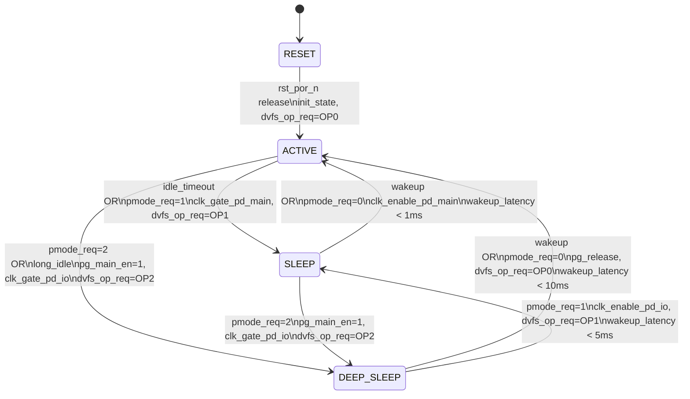

# M05 FSM: Power Mode State Machine

## State List
| State | Encoding | Description | Power Domains | DVFS OP | Wakeup Time |
|-------|----------|-------------|---------------|---------|-------------|
| RESET | 0x3 | 复态，POR 后初始状态 | PD_AON only | - | - |
| ACTIVE | 0x0 | 正常运行，全功能可用 | All (PD_MAIN, PD_AON, PD_IO) | OP0/OP1 | - |
| SLEEP | 0x1 | 低功耗待机，快速唤醒 | PD_AON, PD_IO | OP1 | < 1 ms |
| DEEP_SLEEP | 0x2 | 最低功耗，较长唤醒延迟 | PD_AON only | OP2 | < 10 ms |

## State Transition Table
| Current | Condition | Target | Output | Duration |
|---------|-----------|--------|--------|----------|
| RESET | rst_por_n release | ACTIVE | init_state, dvfs_op_req=OP0, pmode_ack=1 | < 100 us |
| ACTIVE | idle_timeout OR pmode_req=1 | SLEEP | dvfs_op_req=OP1, clk_gate_pd_main, pmode_state=0x1 | < 100 us |
| ACTIVE | pmode_req=2 OR long_idle | DEEP_SLEEP | dvfs_op_req=OP2, pg_main_en=1, clk_gate_pd_io, pmode_state=0x2 | < 1 ms |
| SLEEP | wakeup OR pmode_req=0 | ACTIVE | dvfs_op_req=OP0/OP1, clk_enable_pd_main, pmode_state=0x0 | < 1 ms |
| SLEEP | pmode_req=2 | DEEP_SLEEP | dvfs_op_req=OP2, pg_main_en=1, clk_gate_pd_io, pmode_state=0x2 | < 1 ms |
| DEEP_SLEEP | wakeup OR pmode_req=0 | ACTIVE | pg_release, dvfs_op_req=OP0, clk_enable_all, pmode_state=0x0 | < 10 ms |
| DEEP_SLEEP | pmode_req=1 | SLEEP | dvfs_op_req=OP1, clk_enable_pd_io, pmode_state=0x1 | < 5 ms |

## Mermaid State Diagram


## Timing
| Parameter | Value | Description |
|-----------|-------|-------------|
| t_reset_to_active | < 100 us | RESET 到 ACTIVE 转换时间 |
| t_active_to_sleep | < 100 us | ACTIVE 到 SLEEP 转换时间 |
| t_active_to_deep | < 1 ms | ACTIVE 到 DEEP_SLEEP 转换时间 |
| t_sleep_to_active | < 1 ms | SLEEP 到 ACTIVE 唤醒时间 |
| t_sleep_to_deep | < 1 ms | SLEEP 到 DEEP_SLEEP 转换时间 |
| t_deep_to_active | < 10 ms | DEEP_SLEEP 到 ACTIVE 唤醒时间 |
| t_deep_to_sleep | < 5 ms | DEEP_SLEEP 到 SLEEP 转换时间 |
| t_pg_enter | < 1 ms | Power Gate 进入时间 |
| t_pg_exit | < 10 ms | Power Gate 退出时间 |
| t_vdd_switch | < 100 us | 单步电压切换时间 |
| t_pll_lock | < 1 ms | PLL 锁定时间 |

## State Encoding Details
```verilog
// State encoding (2-bit)
localparam [1:0]
    STATE_RESET     = 2'b11,  // 0x3 - Initial state after POR
    STATE_ACTIVE    = 2'b00,  // 0x0 - Normal operation
    STATE_SLEEP     = 2'b01,  // 0x1 - Low power standby
    STATE_DEEP_SLEEP = 2'b10; // 0x2 - Minimum power
```

## Output Actions by State
| State | pg_main_en | pg_iso_en | dvfs_op_req | clk_pd_main | clk_pd_io | pmode_state |
|-------|------------|-----------|-------------|-------------|-----------|-------------|
| RESET | 1 | 1 | 0 (OP0) | Gate | Gate | 0x3 |
| ACTIVE | 0 | 0 | 0/1 (OP0/OP1) | Enable | Enable | 0x0 |
| SLEEP | 0 | 0 | 1 (OP1) | Gate | Enable | 0x1 |
| DEEP_SLEEP | 1 | 1 | 2 (OP2) | Gate | Gate | 0x2 |