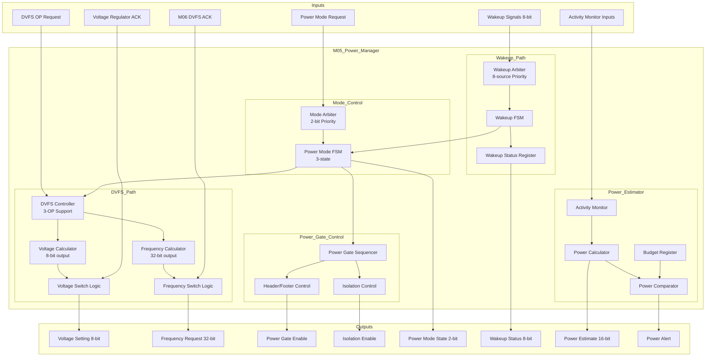

# M05: Power Manager - Datapath

## 1. Overview

M05 Power Manager 数据通路实现功耗管理的核心数据流，包括 DVFS 请求处理、Power Mode 状态转换、唤醒信号处理和功耗估算。数据通路位于 Always-On Power Domain (PD_AON)，确保在所有功耗模式下持续运行。

### 1.1 Key Datapath Features

| Feature | Description | Throughput |
|---------|-------------|------------|
| DVFS Control Path | Power Request → Mode Arbiter → DVFS Controller → V/F Switch | < 1.5 ms latency |
| Power Mode FSM | State transitions with power gate control | < 10 ms wake-up |
| Wakeup Processing | 8 wakeup sources with priority arbitration | < 1 ms response |
| Power Estimation | Activity monitoring → estimation calculation | 1 MHz update rate |

### 1.2 Data Flow Characteristics

| Parameter | Value | Description |
|-----------|-------|-------------|
| Clock Domain | CLK_AON | 1 MHz Always-On clock |
| Power Domain | PD_AON | 0.6-0.9 V, never power-gated |
| Target Latency | < 10 ms | Deep Sleep to Active wake-up |
| Power Budget | 7 mW | All datapath logic + storage |

## 2. Block Diagram



## 3. Datapath Components

### 3.1 Mode Arbiter

Power Mode 请求仲裁器，处理多个功耗模式请求源。

| Component | Width | Function |
|-----------|-------|----------|
| Request Queue | 4 entries | Store pending mode requests |
| Priority Encoder | 2-bit | Select highest priority request |
| Arbitration Logic | 2-bit output | Mode request selection |

**Priority Order:**

| Priority | Source | Request Type |
|----------|--------|--------------|
| 0 (Highest) | Error/Wakeup | Emergency wake-up |
| 1 | Software | Software mode request |
| 2 | Auto Idle | Idle timeout trigger |
| 3 (Lowest) | External | External power request |

### 3.2 DVFS Controller

动态电压频率调整控制器，管理 3 个 Operating Points。

| Component | Width | Function |
|-----------|-------|----------|
| OP Selector | 2-bit | Select target OP (0/1/2) |
| Voltage LUT | 8-bit x 3 | Voltage values for each OP |
| Frequency LUT | 32-bit x 3 | Frequency values for each OP |
| Switch Sequencer | State Machine | Control V-F switch sequence |
| Status Register | 8-bit | Current OP and transition status |

**Operating Points LUT:**

| OP | Voltage (8-bit) | Frequency (32-bit) |
|----|-----------------|-------------------|
| OP0 | 0.9V = 0x12 | 500 MHz = 0x1F4 |
| OP1 | 0.7V = 0x0E | 250 MHz = 0x0FA |
| OP2 | 0.6V = 0x0C | 1 MHz = 0x001 |

### 3.3 Voltage/Frequency Switch Logic

电压和频率切换逻辑，实现 DVFS 切换序列。

| Component | Width | Function |
|-----------|-------|----------|
| Voltage Sequencer | 8-bit output | Step-wise voltage adjustment |
| Frequency Request | 32-bit output | Frequency request to M06 |
| Handshake Control | req/ack | Protocol with regulators and M06 |
| Timeout Counter | 16-bit | Switch timeout detection |

**Switching Sequence (Up/Down):**

```
Frequency Up:
  1. Request voltage increase
  2. Wait for VDD_ACK
  3. Request frequency increase
  4. Wait for DVFS_ACK

Frequency Down:
  1. Request frequency decrease
  2. Wait for DVFS_ACK
  3. Request voltage decrease
  4. Wait for VDD_ACK
```

### 3.4 Power Gate Sequencer

Power Gate 控制序列器，管理 PD_MAIN 的电源门控。

| Component | Width | Function |
|-----------|-------|----------|
| Enter Sequencer | State Machine | Power gate enter sequence |
| Exit Sequencer | State Machine | Power gate exit sequence |
| Iso Control | 1-bit | Isolation cell enable/disable |
| Switch Control | 1-bit | Header/Footer switch control |
| Timer | 16-bit | Stabilization wait timer |

**Enter/Exit Sequences:**

| Phase | Enter Action | Exit Action | Duration |
|-------|--------------|-------------|----------|
| 1 | Iso Enable | Switch ON | 10 cycles |
| 2 | Wait stable | Wait stable | 100 us |
| 3 | Switch OFF | Iso Disable | 10 cycles |
| 4 | PG Enable | PG Disable | - |

### 3.5 Wakeup Arbiter

唤醒信号仲裁器，处理 8 个唤醒源。

| Component | Width | Function |
|-----------|-------|----------|
| Source Detector | 8-bit | Detect active wakeup sources |
| Enable Mask | 8-bit | Enabled wakeup sources |
| Priority Arbiter | 8-to-3 | Select highest priority source |
| Status Register | 8-bit | Wakeup source status |
| Clear Logic | 8-bit | Clear wakeup status |

**Wakeup Source Priority:**

| Source ID | Name | Priority | Response Time |
|-----------|------|----------|---------------|
| 0 | JTAG | High | < 10 us |
| 1 | ISA IF | High | < 10 us |
| 7 | Error | High | < 10 us |
| 2 | Timer | Medium | < 100 us |
| 3 | GPIO | Medium | < 100 us |
| 6 | Software | Medium | < 100 us |
| 4 | DRAM | Low | < 1 ms |
| 5 | Activity | Low | < 1 ms |

### 3.6 Power Estimator

功耗估算数据通路，实时计算系统功耗。

| Component | Width | Function |
|-----------|-------|----------|
| Activity Sampler | 3-bit input | Sample activity_main/io/dram |
| Activity Factor Calc | 8-bit | Calculate activity factor 0-100% |
| DVFS Factor Calc | 8-bit | Calculate V^2 * F factor |
| Power Multiplier | 16-bit | Total power calculation |
| Comparator | 16-bit | Compare with budget |
| Budget Register | 16-bit | Power budget threshold |

**Estimation Model Data Flow:**

```
Activity Inputs (3-bit) --> Activity Factor (8-bit)
DVFS State (OP) --> DVFS Factor (8-bit)
Activity Factor * DVFS Factor * Max_Power --> Power Estimate (16-bit)
Power Estimate > Budget --> Alert (1-bit)
```

## 4. Pipeline Structure

### 4.1 DVFS Switch Pipeline

DVFS 切换流水线，实现电压/频率切换。

| Stage | Function | Latency |
|-------|----------|---------|
| S1: Request Decode | Parse DVFS request, select OP | 1 cycle |
| S2: Voltage Request | Calculate target voltage, issue request | 1 cycle |
| S3: Voltage Wait | Wait for regulator ACK (timeout 100 us) | Variable |
| S4: Frequency Request | Calculate target frequency, issue request | 1 cycle |
| S5: Frequency Wait | Wait for M06 ACK (timeout 1 ms) | Variable |
| S6: Status Update | Update status registers, generate IRQ | 1 cycle |

**Pipeline Timing:**

| Scenario | Stages Active | Total Latency |
|----------|---------------|---------------|
| OP0 -> OP1 (Down) | S1-S6 | < 100 us |
| OP1 -> OP0 (Up) | S1-S6 | < 1.5 ms |
| OP2 -> OP0 (Wake-up) | S1-S6 + Power Gate | < 10 ms |

### 4.2 Power Mode Transition Pipeline

功耗模式转换流水线。

| Stage | Function | Latency |
|-------|----------|---------|
| S1: Request Arbiter | Select mode request by priority | 1 cycle |
| S2: FSM Transition | Execute FSM state transition | 1 cycle |
| S3: DVFS Trigger | Trigger DVFS if voltage/frequency change needed | 1 cycle |
| S4: Power Gate Control | Control power gate enter/exit | Variable |
| S5: Clock Control | Request clock gate/enable via M06 | 1 cycle |
| S6: Ack Generation | Generate pmode_ack | 1 cycle |

### 4.3 Wakeup Processing Pipeline

唤醒处理流水线。

| Stage | Function | Latency |
|-------|----------|---------|
| S1: Source Detect | Detect and latch wakeup sources | 1 cycle |
| S2: Enable Check | Check wakeup_en mask | 1 cycle |
| S3: Priority Arbiter | Select highest priority enabled source | 1 cycle |
| S4: FSM Trigger | Trigger Power Mode FSM wake-up | 1 cycle |
| S5: Status Update | Update wakeup_status, pending flag | 1 cycle |
| S6: IRQ Generation | Generate IRQ if enabled | 1 cycle |

### 4.4 Power Estimation Pipeline

功耗估算流水线（持续运行）。

| Stage | Function | Update Rate |
|-------|----------|-------------|
| S1: Activity Sample | Sample activity signals | Every cycle |
| S2: Factor Calculation | Calculate activity and DVFS factors | Every cycle |
| S3: Power Multiply | Compute total power estimate | Every cycle |
| S4: Budget Compare | Compare with budget, generate alert | Every cycle |

## 5. Interface Summary

### 5.1 Input Interfaces

| Interface | Width | Clock Domain | Description |
|-----------|-------|--------------|-------------|
| Power Mode Request | 2-bit | CLK_AON | Mode request from software/auto |
| DVFS OP Request | 2-bit | CLK_AON | OP selection request |
| Voltage ACK | 1-bit | CLK_AON | Regulator acknowledgment |
| DVFS ACK | 1-bit | CLK_AON | Clock Manager acknowledgment |
| Wakeup Sources | 8-bit | Async/CLK_AON | External wakeup signals |
| Activity Monitor | 3-bit | CLK_SYS (CDC) | Activity status from domains |
| Power Budget | 16-bit | CLK_AON | Budget threshold setting |

### 5.2 Output Interfaces

| Interface | Width | Clock Domain | Description |
|-----------|-------|--------------|-------------|
| Voltage Setting | 8-bit | CLK_AON | Target voltage to regulator |
| Frequency Request | 32-bit | CLK_AON | Target frequency to M06 |
| Power Gate Enable | 1-bit | CLK_AON | PD_MAIN power gate control |
| Isolation Enable | 1-bit | CLK_AON | Isolation cell control |
| Power Mode State | 2-bit | CLK_AON | Current mode state |
| Wakeup Status | 8-bit | CLK_AON | Wakeup source status |
| Power Estimate | 16-bit | CLK_AON | Current power estimate |
| Power Alert | 1-bit | CLK_AON | Over-budget alert |

### 5.3 CDC Requirements

| Crossing | From -> To | Method | Synchronizer |
|----------|------------|--------|--------------|
| Activity Monitor | CLK_SYS -> CLK_AON | Pulse Sync | 2-stage |
| DVFS Request | CLK_AON -> CLK_SYS | Handshake | Protocol |
| Wakeup External | Async -> CLK_AON | Level Sync | 2-stage |

## 6. Datapath Performance

### 6.1 Latency Summary

| Operation | Latency | Condition |
|-----------|---------|-----------|
| DVFS OP Switch | < 1.5 ms | OP0 <-> OP1 |
| Power Gate Enter | < 1 ms | Active -> Deep Sleep |
| Power Gate Exit | < 10 ms | Deep Sleep -> Active |
| Wakeup Response | < 1 ms | Sleep -> Active |
| Wakeup Response | < 10 ms | Deep Sleep -> Active |
| Power Estimate Update | 1 us | Per CLK_AON cycle |

### 6.2 Throughput Summary

| Metric | Rate | Description |
|--------|------|-------------|
| DVFS Switch Rate | 1 per 1.5 ms | Max switching frequency |
| Wakeup Processing | 8 sources | Concurrent detection |
| Power Estimation | 1 MHz | Continuous update |
| Activity Monitoring | 1 MHz | Sample rate |

### 6.3 Power Achievement

| Metric | Target | Achievement |
|--------|--------|-------------|
| Active Power (OP0) | 1.79 W | Full performance |
| Sleep Power (OP1) | 0.61 W | 66% reduction |
| Deep Sleep Power (OP2) | 0.09 W | 95% reduction |
| AON Power | 7 mW | Constant |