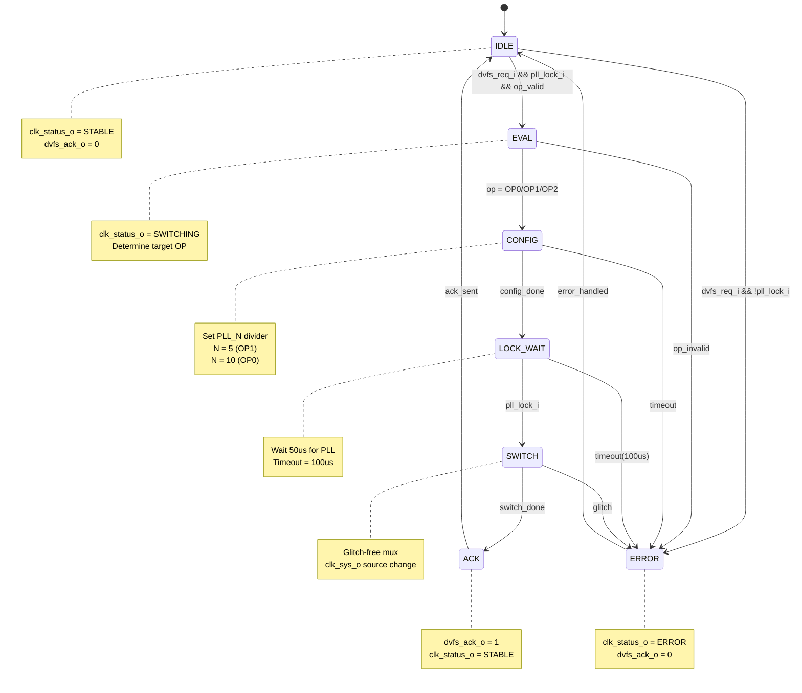

# M06 FSM: DVFS Clock Switching State Machine

## State List

| State | Encoding | Description |
|-------|----------|-------------|
| IDLE | 000 | 等待 DVFS 请求，稳定运行状态 |
| EVAL | 001 | 评估请求有效性，确定目标操作点 |
| CONFIG | 010 | 配置 PLL 分频系数 (N=5-10) |
| LOCK_WAIT | 011 | 等待 PLL 重新锁定 (50us timeout) |
| SWITCH | 100 | 无毛刺切换时钟输出源 |
| ACK | 101 | 生成 `dvfs_ack_o` 应答信号 |
| ERROR | 111 | PLL 锁定失败或非法操作点错误 |

## State Transition Table

| Current State | Condition | Next State | Output |
|---------------|-----------|------------|--------|
| IDLE | `dvfs_req_i` && `pll_lock_i` && `dvfs_op_i` valid | EVAL | `clk_status_o` = SWITCHING (001) |
| IDLE | `dvfs_req_i` && !`pll_lock_i` | ERROR | `clk_status_o` = ERROR (100) |
| IDLE | otherwise | IDLE | `clk_status_o` = STABLE (000) |
| EVAL | `dvfs_op_i` = OP0/OP1/OP2 | CONFIG | Start config timer |
| EVAL | `dvfs_op_i` invalid | ERROR | `clk_status_o` = ERROR (100) |
| CONFIG | config_done | LOCK_WAIT | PLL config applied |
| CONFIG | timeout (10us) | ERROR | Config timeout |
| LOCK_WAIT | `pll_lock_i` = 1 | SWITCH | Lock detected |
| LOCK_WAIT | timeout (100us) | ERROR | Lock timeout |
| SWITCH | switch_done | ACK | Clock source switched |
| SWITCH | glitch_detected | ERROR | Glitch fault |
| ACK | ack_sent | IDLE | `dvfs_ack_o` = 1, `clk_status_o` = STABLE |
| ERROR | error_ack_sent | IDLE | `dvfs_ack_o` = 0, `clk_status_o` = ERROR |

## Operating Point Mapping

| OP Code | Frequency | PLL Config (N) | Voltage |
|---------|-----------|----------------|---------|
| OP0 (2'b00) | 500 MHz | N=10 | 0.9 V |
| OP1 (2'b01) | 250 MHz | N=5 | 0.7 V |
| OP2 (2'b10) | 1 MHz | PLL_AON | 0.6 V |

## Mermaid State Diagram

## Timing Parameters

| Transition | Duration | Condition |
|------------|----------|-----------|
| IDLE -> EVAL | 1 cycle | Rising edge detection |
| EVAL -> CONFIG | 1 cycle | OP validation |
| CONFIG | < 10 us | PLL register write |
| LOCK_WAIT | 50 us (typ) | PLL lock time |
| SWITCH | 1 cycle | Clock mux switch |
| ACK | 1 cycle | Ack generation |
| Total latency | < 100 us | Full sequence |

## Clock Status Encoding

| Status | Encoding (clk_status_o) | Meaning |
|--------|------------------------|---------|
| STABLE | 000 | 时钟稳定运行 |
| SWITCHING | 001 | DVFS 切换进行中 |
| ERROR | 100 | 错误状态 |