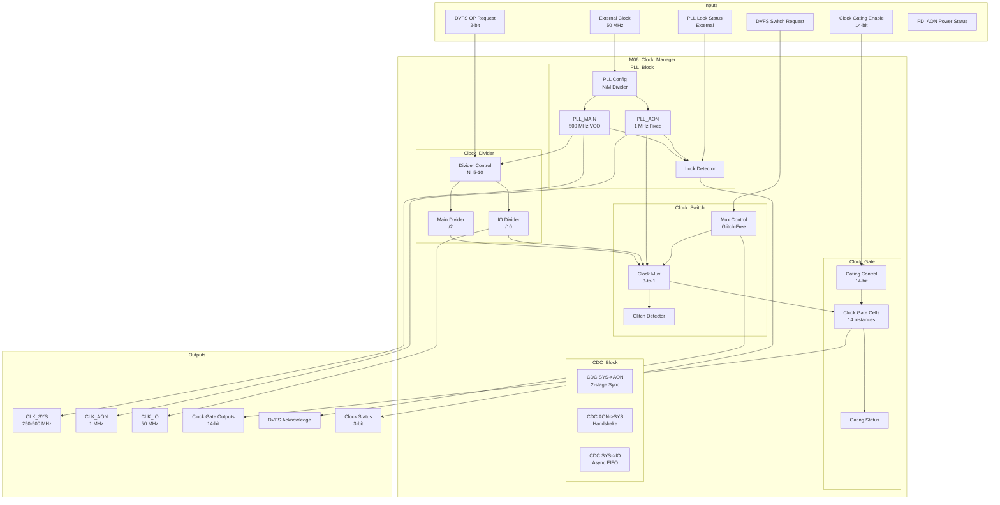

# M06: Clock Manager - Datapath

## 1. Overview

M06 Clock Manager 数据通路实现全系统时钟生成、分发和管理。作为 CDC 核心节点，处理 PLL 配置、DVFS 频率切换、时钟门控控制和跨时钟域信号同步。

### 1.1 Key Datapath Features

| Feature | Description | Throughput |
|---------|-------------|------------|
| PLL Clock Generation | External 50 MHz -> Internal 250-500 MHz | < 50 us lock time |
| DVFS Clock Switch | Frequency switching 250-500 MHz | < 100 us latency |
| Clock Gating | 14 module clock gate controls | < 10 cycles |
| CDC Handling | Multiple clock domain crossings | MTBF >= 10 years |

### 1.2 Data Flow Characteristics

| Parameter | Value | Description |
|-----------|-------|-------------|
| Input Clock | 50 MHz | External crystal oscillator |
| Output Clock Range | 1 MHz - 500 MHz | DVFS adjustable |
| Clock Domains | 3 (CLK_SYS, CLK_AON, CLK_IO) | Independent domains |
| CDC Paths | 6+ | Cross-domain synchronizers |

## 2. Block Diagram



## 3. Datapath Components

### 3.1 PLL Configuration Block

PLL 配置数据通路，控制 PLL 参数和锁定检测。

| Component | Width | Function |
|-----------|-------|----------|
| Reference Divider M | 8-bit | Input clock division (M=1) |
| Feedback Divider N | 8-bit | VCO frequency control (N=5-10) |
| VCO Range | 500-1000 MHz | PLL operating range |
| Lock Threshold | 1 ns | Phase error threshold |
| Lock Counter | 16-bit | Lock detection counter |

**PLL Parameters LUT:**

| OP | Input (MHz) | N Divider | VCO (MHz) | Output (MHz) |
|----|-------------|-----------|-----------|--------------|
| OP0 | 50 | 10 | 500 | 500 |
| OP1 | 50 | 5 | 500 | 250 |
| OP2 | 50 | - | - | 1 (AON PLL) |

### 3.2 Clock Divider Block

时钟分频器数据通路，生成各域时钟。

| Component | Width | Function |
|-----------|-------|----------|
| Main Divider | /1, /2 | CLK_SYS frequency selection |
| IO Divider | /10 | CLK_IO from PLL_MAIN |
| Divider Register | 8-bit | Divider value storage |
| Divider Sequencer | State Machine | Safe divider change sequence |

**Divider Configuration:**

| Clock | Divider | Input | Output | OP Dependency |
|-------|---------|-------|--------|---------------|
| CLK_SYS | /1 | 500 MHz | 500 MHz | OP0 |
| CLK_SYS | /2 | 500 MHz | 250 MHz | OP1 |
| CLK_IO | /10 | 500 MHz | 50 MHz | Fixed |
| CLK_AON | Fixed | 50 MHz | 1 MHz | Independent |

### 3.3 Clock Switch (Glitch-Free Mux)

无毛刺时钟切换器，实现 DVFS 频率切换。

| Component | Width | Function |
|-----------|-------|----------|
| Source Select | 2-bit | Select clock source |
| Mux Control | State Machine | Glitch-free switch sequence |
| Clock Mux | 3-to-1 | Clock source multiplexer |
| Glitch Detector | 1-bit | Detect switching glitches |
| Switch Timer | 16-bit | Switch completion timer |

**Glitch-Free Switch Sequence:**

```
1. Disable current clock output (gate)
2. Wait for clock edge alignment
3. Select new clock source
4. Enable new clock output
5. Generate DVFS_ACK
```

### 3.4 Clock Gate Block

时钟门控数据通路，控制各模块时钟。

| Component | Width | Function |
|-----------|-------|----------|
| Enable Register | 14-bit | Gating enable per module |
| Gate Cell Array | 14 cells | Integrated latch gate cells |
| Status Register | 14-bit | Gating status feedback |
| Gate Sequencer | State Machine | Safe gate enable/disable |

**Module Gate Mapping:**

| Bit | Module | Gate Cell | Latency |
|-----|--------|-----------|---------|
| 0 | M00 Dataflow | Cell 0 | < 10 cycles |
| 1 | M01 Dispatcher | Cell 1 | < 10 cycles |
| 2 | M02 SRAM Ctrl | Cell 2 | < 10 cycles |
| 3 | M03 DRAM Ctrl | Cell 3 | < 10 cycles |
| 4 | M04 System Bus | Cell 4 | < 10 cycles |
| 5-13 | M08-M16 | Cells 5-13 | < 5 cycles |

### 3.5 CDC Block

跨时钟域处理数据通路，处理信号同步。

| Component | Width | Function |
|-----------|-------|----------|
| SYS->AON Sync | 2-stage FF | Status signal synchronization |
| AON->SYS Handshake | Protocol | Control signal crossing |
| SYS->IO FIFO | 16-entry | Data transfer FIFO |
| FIFO Control | rd/wr pointers | FIFO management |

**CDC Path Details:**

| Path | Method | Width | Depth | MTBF |
|------|--------|-------|-------|------|
| =CLK_SYS -> CLK_AON | 2-stage sync | 8-bit | 2 FFs | >= 10 years |
| CLK_AON -> CLK_SYS | Handshake | 16-bit | Protocol | No violation |
| CLK_SYS -> CLK_IO | Async FIFO | 32-bit | 16 entries | No overflow |

## 4. Pipeline Structure

### 4.1 PLL Lock Pipeline

PLL 锁定流水线，实现 PLL 初始化和锁定。

| Stage | Function | Latency |
|-------|----------|---------|
| S1: PLL Config | Load divider parameters (N/M) | 1 cycle |
| S2: PLL Enable | Enable PLL VCO | 1 cycle |
| S3: Lock Wait | Wait for PLL lock detection | 50 us |
| S4: Lock Verify | Verify lock stability | 10 cycles |
| S5: Status Update | Update CLK_STATUS | 1 cycle |

### 4.2 DVFS Switch Pipeline

DVFS 频率切换流水线。

| Stage | Function | Latency |
|-------|----------|---------|
| S1: Request Decode | Parse DVFS OP request | 1 cycle |
| S2: Divider Config | Configure divider for target frequency | 1 cycle |
| S3: Clock Gate | Gate current clock output | 1 cycle |
| S4: Source Switch | Switch to new clock source (glitch-free) | 2 cycles |
| S5: Clock Enable | Enable new clock output | 1 cycle |
| S6: ACK Generation | Generate DVFS_ACK | 1 cycle |

**Pipeline Timing:**

| Scenario | Stages | Total Latency |
|----------|--------|---------------|
| OP0 -> OP1 (Down) | S1-S6 | < 100 us |
| OP1 -> OP0 (Up) | S1-S6 | < 100 us |
| OP2 -> OP0 (Wake-up) | S1-S6 + PLL relock | < 150 us |

### 4.3 Clock Gating Pipeline

时钟门控流水线。

| Stage | Function | Latency |
|-------|----------|---------|
| S1: Enable Decode | Parse gating enable bits | 1 cycle |
| S2: Gate Control | Control gate cell enable | 1 cycle |
| S3: Status Update | Update gating status | 1 cycle |

### 4.4 CDC Transfer Pipeline

CDC 数据传输流水线。

| Stage | Function | Latency |
|-------|----------|---------|
| S1: Source Capture | Capture data in source domain | 1 cycle |
| S2: Sync/Staging | Synchronize or stage in FIFO | 2 cycles (sync) / 1 cycle (FIFO) |
| S3: Destination Ready | Data ready in destination domain | 1 cycle |

## 5. Interface Summary

### 5.1 Input Interfaces

| Interface | Width | Clock Domain | Description |
|-----------|-------|--------------|-------------|
| External Clock | 1-bit | Async | 50 MHz crystal oscillator |
| DVFS OP Request | 2-bit | CLK_AON | Operating point selection |
| DVFS Switch Request | 1-bit | CLK_AON | Frequency switch trigger |
| Clock Gating Enable | 14-bit | CLK_AON | Module gating control |
| PLL Lock Input | 1-bit | CLK_AON | External PLL lock status |
| PD_AON Power | 1-bit | CLK_AON | AON domain power status |

### 5.2 Output Interfaces

| Interface | Width | Clock Domain | Description |
|-----------|-------|--------------|-------------|
| CLK_SYS | 1-bit | CLK_SYS | System clock 250-500 MHz |
| CLK_AON | 1-bit | CLK_AON | Always-on clock 1 MHz |
| CLK_IO | 1-bit | CLK_IO | IO clock 50 MHz |
| Clock Gate Outputs | 14-bit | Per-module | Gated clocks to modules |
| DVFS ACK | 1-bit | CLK_AON | DVFS completion acknowledge |
| Clock Status | 3-bit | CLK_AON | Clock stability status |

### 5.3 CDC Interface Requirements

| Direction | Source Domain | Dest Domain | Signal Type | Method |
|-----------|---------------|-------------|-------------|--------|
| To AON | CLK_SYS | CLK_AON | Status | 2-stage sync |
| From AON | CLK_AON | CLK_SYS | Control | Handshake |
| To IO | CLK_SYS | CLK_IO | Data | Async FIFO |

## 6. Datapath Performance

### 6.1 Latency Summary

| Operation | Latency | Condition |
|-----------|---------|-----------|
| PLL Lock | 50 us | Initial lock |
| PLL Relock | 50 us | DVFS triggered |
| DVFS Switch | < 100 us | OP transition |
| Clock Gate | < 10 cycles | Enable/disable |
| CDC Sync | 2 cycles | SYS -> AON |
| CDC Handshake | 4 cycles | AON -> SYS |

### 6.2 Clock Parameters

| Parameter | Value | Description |
|-----------|-------|-------------|
| CLK_SYS Period (OP0) | 2 ns | 500 MHz |
| CLK_SYS Period (OP1) | 4 ns | 250 MHz |
| CLK_AON Period | 1000 ns | 1 MHz |
| CLK_IO Period | 20 ns | 50 MHz |
| Clock Jitter | < 1% | All clocks |
| Duty Cycle | 50% | All clocks |

### 6.3 CDC Performance

| Metric | Value | Description |
|--------|-------|-------------|
| CDC Paths Covered | 100% | All cross-domain paths |
| MTBF | >= 10 years | Reliability target |
| FIFO Depth | 16 entries | SYS->IO buffer |
| Handshake Latency | 4 cycles | AON->SYS control |

## 7. Clock Domain Architecture

### 7.1 Clock Domain Overview

| Domain | Frequency | Source | Modules |
|--------|-----------|--------|---------|
| CLK_SYS | 250-500 MHz | PLL_MAIN/DIV | M00-M04, M08-M14 |
| CLK_AON | 1 MHz | PLL_AON | M05-M07 |
| CLK_IO | 50 MHz | PLL_MAIN/DIV_IO | M15-M16 |

### 7.2 DVFS Impact

| OP | CLK_SYS | CLK_AON | CLK_IO | Power Impact |
|----|----------|---------|---------|--------------|
| OP0 | 500 MHz | 1 MHz | 50 MHz | Max power |
| OP1 | 250 MHz | 1 MHz | 50 MHz | 50% reduction |
| OP2 | Gated | 1 MHz | Gated | Minimal power |

### 7.3 Reset Sequence Integration

| Step | Clock Action | Status |
|------|--------------|--------|
| 1 | POR asserted | All clocks reset |
| 2 | PLL configuration | PLL config registers loaded |
| 3 | PLL lock wait | pll_locked monitored |
| 4 | CLK_AON stable | 1 MHz output stable |
| 5 | PD_MAIN power-on | Clocks held in reset |
| 6 | CLK_SYS stable | PLL_MAIN output enabled |
| 7 | SW_RESET de-assert | Normal clock distribution |