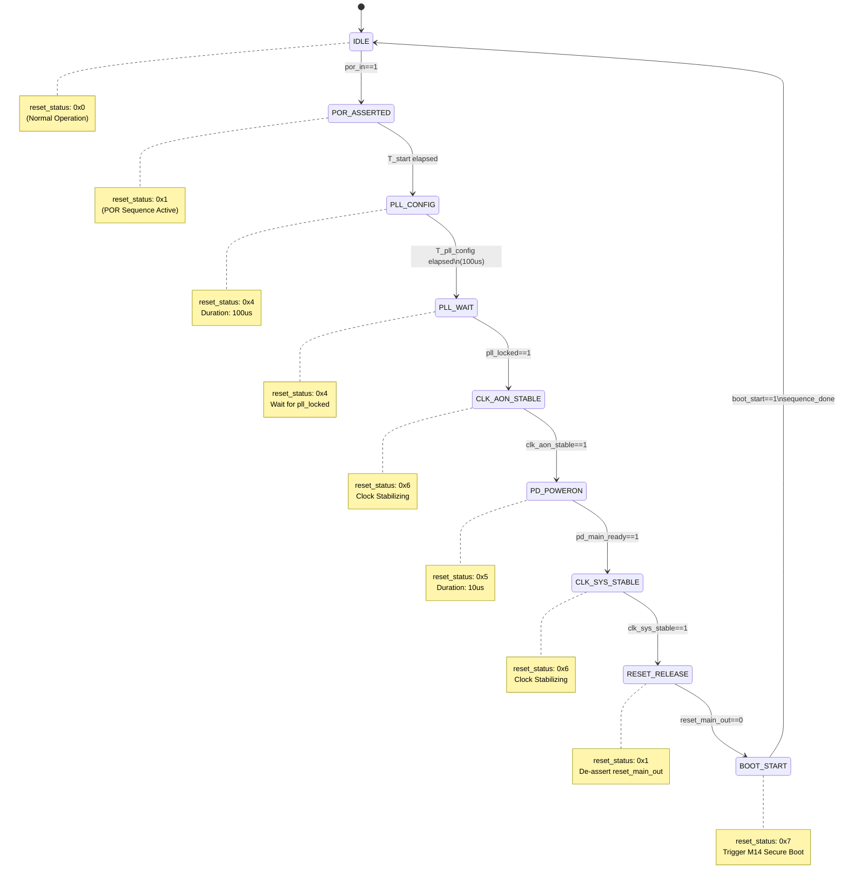

# M07 FSM: Reset Sequence State Machine

## State List

| State | Encoding | Description |
|-------|----------|-------------|
| IDLE | 0x0 | Normal operation, waiting for reset events |
| POR_ASSERTED | 0x1 | POR active, initiating reset sequence |
| PLL_CONFIG | 0x4 | PLL configuration in progress (100us) |
| PLL_WAIT | 0x4 | Waiting for PLL lock signal |
| CLK_AON_STABLE | 0x6 | CLK_AON stabilizing after PLL lock |
| PD_POWERON | 0x5 | PD_MAIN power-on sequence (10us) |
| CLK_SYS_STABLE | 0x6 | CLK_SYS stabilizing after PD_MAIN ready |
| RESET_RELEASE | 0x1 | Reset de-assertion, releasing reset_main_out |
| BOOT_START | 0x7 | Secure Boot trigger, initiating M14 boot |

## State Transition Table

| Current State | Next State | Condition | reset_status Output |
|---------------|------------|-----------|---------------------|
| IDLE | POR_ASSERTED | por_in == 1 | 0x1 (POR Active) |
| POR_ASSERTED | PLL_CONFIG | T_start elapsed | 0x4 (PLL Locking) |
| PLL_CONFIG | PLL_WAIT | T_pll_config elapsed (100us) | 0x4 (PLL Locking) |
| PLL_WAIT | CLK_AON_STABLE | pll_locked == 1 | 0x6 (Clock Stabilizing) |
| CLK_AON_STABLE | PD_POWERON | clk_aon_stable == 1 | 0x5 (Power-On In Progress) |
| PD_POWERON | CLK_SYS_STABLE | pd_main_ready == 1 | 0x6 (Clock Stabilizing) |
| CLK_SYS_STABLE | RESET_RELEASE | clk_sys_stable == 1 | 0x1 (POR Active) |
| RESET_RELEASE | BOOT_START | reset_main_out == 0 | 0x7 (Boot Starting) |
| BOOT_START | IDLE | boot_start == 1 && sequence_done | 0x0 (Idle/Normal) |

## Mermaid State Diagram

## Timing Summary

| Phase | State | Duration | Cumulative |
|-------|-------|----------|------------|
| POR Detection | POR_ASSERTED | 0 us | 0 us |
| PLL Configuration | PLL_CONFIG | 100 us | 100 us |
| PLL Lock Wait | PLL_WAIT | 50 us | 150 us |
| Clock AON Stable | CLK_AON_STABLE | - | 150+ us |
| Power Domain On | PD_POWERON | 10 us | 160+ us |
| Clock SYS Stable | CLK_SYS_STABLE | - | 160+ us |
| Reset Release | RESET_RELEASE | 1 cycle | 160+ us |
| Boot Start | BOOT_START | - | Sequence Complete |