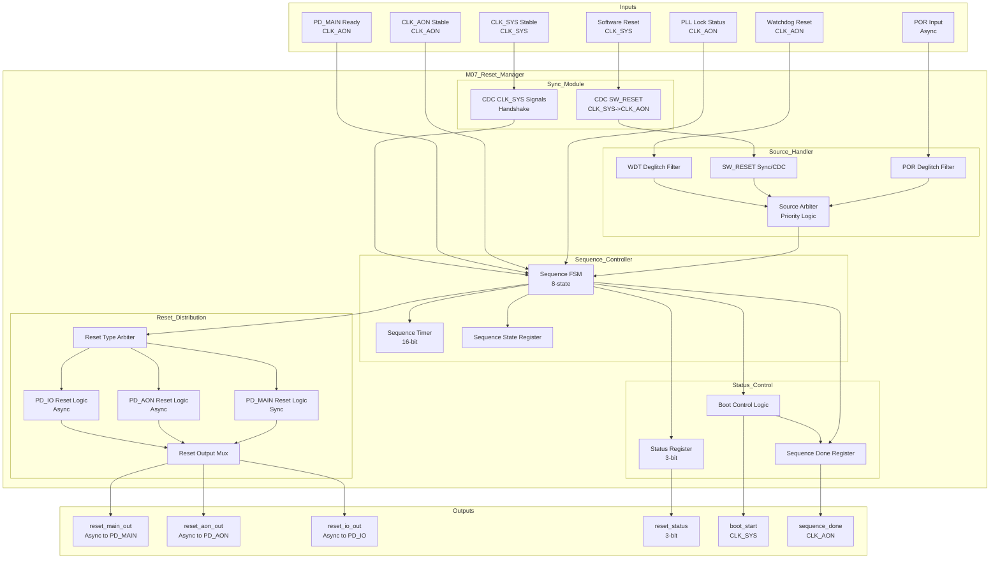

# M07: Reset Manager - Datapath

## 1. Overview

M07 Reset Manager 数据通路实现系统复位序列控制和复位信号分发。数据通路处理三种复位源（POR/SW_RESET/WDT_RESET），执行 8 步复位序列，并向所有模块分发复位信号。

### 1.1 Key Datapath Features

| Feature | Description | Throughput |
|---------|-------------|------------|
| Reset Source Arbitration | POR > WDT > SW priority | Immediate |
| 8-Step Sequence Control | POR -> PLL -> Power -> Boot | < 160 us |
| Reset Distribution | Global and domain-specific resets | < 1 cycle |
| Glitch Protection | Deglitch filter on all inputs | 2-cycle min pulse |

### 1.2 Data Flow Characteristics

| Parameter | Value | Description |
|-----------|-------|-------------|
| Clock Domain | CLK_AON | 1 MHz Always-On clock |
| Power Domain | PD_AON | 0.6-0.9 V, never power-gated |
| Sequence Duration | 160+ us | Total POR sequence |
| Reset Sources | 3 | POR, SW_RESET, WDT_RESET |

## 2. Block Diagram



## 3. Datapath Components

### 3.1 Reset Source Handler

复位源处理数据通路，包括去抖动和 CDC 处理。

| Component | Width | Function |
|-----------|-------|----------|
| POR Deglitch Filter | 2-cycle min | Filter POR input glitches |
| WDT Deglitch Filter | 2-cycle min | Filter WDT reset glitches |
| SW_RESET CDC | Handshake | Synchronize SW_RESET from CLK_SYS |
| Source Arbiter | 3-to-1 | Select active reset source by priority |

**Source Priority Logic:**

| Priority | Source | Code | Override |
|----------|--------|------|----------|
| 0 (Highest) | POR | 0x1 | Overrides all |
| 1 | WDT_RESET | 0x3 | Overrides SW_RESET |
| 2 (Lowest) | SW_RESET | 0x2 | Domain-specific only |

### 3.2 Sequence Controller (FSM)

复位序列控制 FSM，实现 8 步复位序列。

| Component | Width | Function |
|-----------|-------|----------|
| FSM State Register | 4-bit | Current sequence state |
| Transition Logic | Combinational | State transition conditions |
| Timer Counter | 16-bit | Sequence timing control |
| State Decoder | 8-to-3 | Status code generation |

**FSM States:**

| State | Code | Description | Duration |
|-------|------|-------------|----------|
| IDLE | 0x0 | Normal operation | - |
| POR_ASSERTED | 0x1 | POR active, waiting | Variable |
| PLL_CONFIG | 0x4 | PLL configuration | 100 us |
| PLL_WAIT | 0x4 | Waiting for PLL lock | 50 us |
| CLK_AON_STABLE | 0x6 | CLK_AON stabilizing | - |
| PD_POWERON | 0x5 | PD_MAIN power-on | 10 us |
| CLK_SYS_STABLE | 0x6 | CLK_SYS stabilizing | - |
| RESET_RELEASE | 0x1 | Reset de-assertion | 1 cycle |
| BOOT_START | 0x7 | Secure Boot trigger | - |

### 3.3 Sync Module (CDC)

同步模块处理跨时钟域信号。

| Component | Width | Function |
|-----------|-------|----------|
| SW_RESET Sync | 2-stage FF | CLK_SYS -> CLK_AON |
| CLK_SYS Stable Sync | Handshake | CLK_SYS -> CLK_AON |
| Boot Start CDC | Handshake | CLK_AON -> CLK_SYS |

**CDC Implementation:**

| Path | Source | Destination | Method | Depth |
|------|--------|-------------|--------|-------|
| SW_RESET | CLK_SYS | CLK_AON | 2-stage sync | 2 FFs |
| CLK_SYS_STABLE | CLK_SYS | CLK_AON | Handshake | Protocol |
| boot_start | CLK_AON | CLK_SYS | Handshake | Protocol |

### 3.4 Reset Distribution Logic

复位分发逻辑，向各电源域输出复位信号。

| Component | Width | Function |
|-----------|-------|----------|
| Reset Type Arbiter | 3-to-3 | Select reset per domain |
| MAIN Reset Logic | 1-bit | PD_MAIN reset (sync) |
| AON Reset Logic | 1-bit | PD_AON reset (async) |
| IO Reset Logic | 1-bit | PD_IO reset (async) |
| Reset Mux | 3-to-3 | Final reset output selection |

**Reset Distribution Matrix:**

| Domain | POR | SW_RESET | WDT_RESET | Reset Type | Modules |
|--------|-----|----------|-----------|------------|---------|
| PD_AON | Yes | No | No | Async | M05, M06, M07 |
| PD_MAIN | Yes | Yes | Yes | Sync | M00-M04, M08-M14 |
| PD_IO | Yes | No | No | Async | M15, M16 |

### 3.5 Status and Boot Control

状态和启动控制逻辑。

| Component | Width | Function |
|-----------|-------|----------|
| Status Register | 3-bit | Current reset status code |
| Boot Control | State Machine | Secure Boot trigger logic |
| Done Register | 1-bit | Sequence completion flag |

**Status Code Mapping:**

| Code | State | Description |
|------|-------|-------------|
| 0x0 | IDLE | Normal operation |
| 0x1 | POR_ASSERTED/RESET_RELEASE | POR active or release |
| 0x2 | SW_RESET_ACTIVE | Software reset processing |
| 0x3 | WDT_RESET_ACTIVE | Watchdog reset processing |
| 0x4 | PLL_LOCKING | PLL configuration/wait |
| 0x5 | POWER_ON | PD_MAIN power-on |
| 0x6 | CLOCK_STABILIZING | Clock stabilization |
| 0x7 | BOOT_STARTING | Secure Boot trigger |

## 4. Pipeline Structure

### 4.1 POR Sequence Pipeline

POR 复位序列流水线，实现 8 步序列。

| Stage | Function | Duration |
|-------|----------|----------|
| S1: POR Detection | Detect and latch POR input | 2 cycles (deglitch) |
| S2: Source Arbitration | Select POR as active source | 1 cycle |
| S3: PLL Configuration | Trigger PLL config in M06 | 100 us |
| S4: PLL Lock Wait | Wait for pll_locked signal | 50 us |
| S5: CLK_AON Stable | Wait for clk_aon_stable | - |
| S6: PD_MAIN Power | Wait for pd_main_ready | 10 us |
| S7: CLK_SYS Stable | Wait for clk_sys_stable | - |
| S8: Reset Release | De-assert reset_main_out | 1 cycle |
| S9: Boot Trigger | Generate boot_start to M14 | 1 cycle |

**Sequence Timing Diagram:**

```
Time (us):    0    100   150   150+  160+  160+  161  162
              |     |     |     |     |     |     |     |
POR:          |-----|     |     |     |     |     |     |
PLL Config:         |-----|     |     |     |     |     |
PLL Lock:                 |-----|     |     |     |     |
CLK_AON:                      |-----  |     |     |     |
PD_MAIN:                            |-----|     |     |
CLK_SYS:                                |-----  |     |
Reset Release:                              |-----|     |
Boot Start:                                     |-----|
```

### 4.2 SW_RESET Pipeline

软件复位流水线（仅 PD_MAIN）。

| Stage | Function | Latency |
|-------|----------|---------|
| S1: SW_RESET Capture | Capture SW_RESET in CLK_SYS | 1 cycle |
| S2: CDC Transfer | Transfer to CLK_AON domain | 2 cycles |
| S3: Source Arbitration | Select SW_RESET | 1 cycle |
| S4: Reset Assertion | Assert reset_main_out | 1 cycle |
| S5: Reset De-assertion | De-assert after 1 cycle | 1 cycle |
| S6: Status Update | Update status register | 1 cycle |

**Total Latency: 6 cycles (CLK_AON)**

### 4.3 WDT_RESET Pipeline

看门狗复位流水线（仅 PD_MAIN）。

| Stage | Function | Latency |
|-------|----------|---------|
| S1: WDT Detection | Detect and deglitch WDT input | 2 cycles |
| S2: Source Arbitration | Select WDT_RESET | 1 cycle |
| S3: Reset Assertion | Assert reset_main_out | 1 cycle |
| S4: WDT Clear Wait | Wait for WDT clear signal | Variable |
| S5: Reset De-assertion | De-assert reset | 1 cycle |
| S6: Status Update | Update status register | 1 cycle |

## 5. Interface Summary

### 5.1 Input Interfaces

| Interface | Width | Clock Domain | Description |
|-----------|-------|--------------|-------------|
| POR Input | 1-bit | Async | Power-on Reset from external |
| Software Reset | 1-bit | CLK_SYS | Software reset request |
| Watchdog Reset | 1-bit | CLK_AON | WDT timeout reset |
| PLL Locked | 1-bit | CLK_AON | PLL lock status from M06 |
| CLK_AON Stable | 1-bit | CLK_AON | CLK_AON stability from M06 |
| CLK_SYS Stable | 1-bit | CLK_SYS | CLK_SYS stability from M06 |
| PD_MAIN Ready | 1-bit | CLK_AON | Power-on ready from M05 |

### 5.2 Output Interfaces

| Interface | Width | Clock Domain | Description |
|-----------|-------|--------------|-------------|
| reset_main_out | 1-bit | Async | Reset to PD_MAIN modules |
| reset_aon_out | 1-bit | Async | Reset to PD_AON modules |
| reset_io_out | 1-bit | Async | Reset to PD_IO modules |
| reset_status | 3-bit | CLK_AON | Reset status code |
| boot_start | 1-bit | CLK_SYS | Secure Boot trigger |
| sequence_done | 1-bit | CLK_AON | Sequence completion |

### 5.3 CDC Requirements

| Crossing | From -> To | Method | Synchronizer |
|----------|------------|--------|--------------|
| SW_RESET | CLK_SYS -> CLK_AON | 2-stage sync | 2 FFs |
| CLK_SYS Stable | CLK_SYS -> CLK_AON | Handshake | Protocol |
| boot_start | CLK_AON -> CLK_SYS | Handshake | Protocol |

## 6. Datapath Performance

### 6.1 Latency Summary

| Operation | Latency | Clock Domain |
|-----------|---------|--------------|
| POR Sequence Total | 160+ us | CLK_AON |
| SW_RESET Response | 6 cycles | CLK_AON |
| WDT_RESET Response | Variable | CLK_AON |
| Reset Distribution | 1 cycle | Async |
| CDC Transfer | 2-4 cycles | Cross-domain |
| Boot Trigger | 1 cycle | CLK_SYS |

### 6.2 Sequence Timing Parameters

| Parameter | Value | Unit | Description |
|-----------|-------|------|-------------|
| T_por_min | 0 | us | Minimum POR assertion |
| T_pll_config | 100 | us | PLL configuration duration |
| T_pll_lock | 50 | us | PLL lock wait time |
| T_pd_poweron | 10 | us | PD_MAIN power-on time |
| T_reset_release | 1 | cycle | Reset de-assertion delay |
| T_seq_total | 160+ | us | Total sequence duration |

### 6.3 Reset Coverage

| Category | Coverage | Method |
|----------|----------|--------|
| Control Registers | 100% | Async reset to 0x0 |
| Status Registers | 100% | Async reset to 0x0 |
| Config Registers | 100% | Sync reset to defaults |
| Counter Registers | 100% | Async reset to 0x0 |
| SRAM (M02) | 100% | Power-on clear |
| FSM States | 100% | All states reachable |

## 7. Reset Domain Architecture

### 7.1 Reset Domain Overview

| Domain | Reset Type | Source Coverage | Modules |
|--------|------------|-----------------|---------|
| PD_AON | Async | POR only | M05, M06, M07 |
| PD_MAIN | Sync | POR + SW + WDT | M00-M04, M08-M14 |
| PD_IO | Async | POR only | M15, M16 |

### 7.2 Reset Priority

```
Priority Order (Highest to Lowest):
1. POR (Global, overrides all)
2. WDT_RESET (PD_MAIN, safety critical)
3. SW_RESET (PD_MAIN, software controlled)
```

### 7.3 Glitch Protection

| Protection | Method | Minimum Pulse |
|------------|--------|---------------|
| POR Input | Deglitch filter | 2 CLK_AON cycles |
| WDT Input | Deglitch filter | 2 CLK_AON cycles |
| SW_RESET | CDC + filter | 1 CLK_SYS cycle |

## 8. Reset Verification

### 8.1 Verification Checklist

| Check | Method | Coverage Target |
|-------|--------|-----------------|
| Sequence timing | Simulation | 100% paths |
| CDC analysis | STA tool | 100% cross-domain |
| FSM transitions | Formal | All states reachable |
| Reset coverage | Simulation | All registers initialized |
| Glitch protection | Simulation | All inputs tested |

### 8.2 Test Scenarios

| Scenario | Description | Expected Result |
|----------|-------------|-----------------|
| Normal POR | Power-on from cold start | Full 8-step sequence |
| SW_RESET | Software triggered reset | PD_MAIN reset only |
| WDT_TIMEOUT | Watchdog timeout reset | PD_MAIN reset + clear wait |
| POR during SW_RESET | POR overrides SW_RESET | Global reset |
| Glitch on POR | Short pulse on POR | Filtered, ignored |