# M08: Multi-thread Scheduler - Datapath

## 1. Overview

M08 Multi-thread Scheduler 数据通路实现多线程调度和执行上下文管理。数据通路处理线程创建、调度决策、上下文切换和分发到 Dataflow Controller (M01)，支持 Round-Robin/Priority/Hybrid 三种调度模式。

### 1.1 Key Datapath Features

| Feature | Description | Throughput |
|---------|-------------|------------|
| Thread Queue Management | 2-8 threads with priority queue | 8 threads max |
| Scheduling Decision | RR/Priority/Hybrid selection | 1-2 cycles |
| Context Switch | Save/Load thread context | 8-10 cycles |
| Dispatch Interface | Issue to M01 Dataflow Controller | 50 M dispatch/s |

### 1.2 Data Flow Characteristics

| Parameter | Value | Description |
|-----------|-------|-------------|
| Clock Domain | CLK_SYS | 250-500 MHz DVFS |
| Power Domain | PD_MAIN | 0.7-0.9 V, power-gatable |
| Max Threads | 8 | Configurable 2-8 |
| Context Size | 256 bits | Per-thread context storage |

## 2. Block Diagram

```mermaid
flowchart TB
    subgraph Inputs
        THREAD_CMD[Thread Command from M13]
        REG_REQ[Register Request from M04]
        DISPATCH_DONE[Dispatch Done from M01]
        DISPATCH_ERROR[Dispatch Error from M01]
        CLK_ENABLE[Clock Enable from M05]
        POWER_GATE[Power Gate N from M05]
    end

    subgraph M08_MultiThread_Scheduler
        subgraph Thread_Queue
            READY_Q[Ready Queue 8-entry]
            BLOCKED_Q[Blocked Queue 8-entry]
            PRIO_Q[Priority Queue 8-level]
            THREAD_VEC[Thread State Vector 8x2-bit]
        end

        subgraph Scheduler
            SCHED_CTRL[Scheduler Control Mode]
            RR_SELECT[Round-Robin Selector]
            PRIO_SELECT[Priority Selector]
            HYBRID_SELECT[Hybrid Selector]
            DISPATCH_DEC[Dispatch Decision Logic]
        end

        subgraph Resource_Allocator
            THREAD_ALLOC[Thread ID Allocator 3-bit]
            CONTEXT_ALLOC[Context Pointer Allocator]
            RESOURCE_CHECK[Resource Available Check]
        end

        subgraph Context_Manager
            CTX_STORAGE[Context Storage 8x256-bit]
            CTX_READ[Context Read Logic]
            CTX_WRITE[Context Write Logic]
            CTX_POINTER[Context Pointer 8-bit]
        end

        subgraph Issue_Logic
            ISSUE_ARB[Issue Arbiter]
            DISPATCH_MUX[Dispatch Mux]
            ISSUE_VALID[Issue Valid Generation]
            HANDSHAKE[Handshake Protocol to M01]
        end

        THREAD_CMD --> THREAD_ALLOC
        THREAD_ALLOC --> THREAD_VEC
        THREAD_VEC --> READY_Q
        THREAD_VEC --> BLOCKED_Q
        READY_Q --> RR_SELECT
        PRIO_Q --> PRIO_SELECT
        SCHED_CTRL --> RR_SELECT
        SCHED_CTRL --> PRIO_SELECT
        RR_SELECT --> DISPATCH_DEC
        PRIO_SELECT --> DISPATCH_DEC
        THREAD_ALLOC --> CONTEXT_ALLOC
        CONTEXT_ALLOC --> CTX_POINTER
        CTX_POINTER --> CTX_STORAGE
        CTX_READ --> CTX_STORAGE
        CTX_STORAGE --> ISSUE_ARB
        ISSUE_ARB --> DISPATCH_MUX
        DISPATCH_MUX --> HANDSHAKE
        DISPATCH_DONE --> HANDSHAKE
        HANDSHAKE --> CTX_WRITE
        CTX_WRITE --> CTX_STORAGE
    end

    subgraph Outputs
        DISPATCH_VALID[Dispatch Valid to M01]
        DISPATCH_THREAD_ID[Thread ID 3-bit]
        DISPATCH_ENTRY[Entry Address 32-bit]
        DISPATCH_CTX_PTR[Context Pointer 8-bit]
        DISPATCH_CMD[Dispatch Command 2-bit]
        THREAD_STATUS[Thread Status to M04]
        THREAD_IRQ[Thread Interrupt]
        SCHED_STATUS[Scheduler Status]
    end

    HANDSHAKE --> DISPATCH_VALID
    DISPATCH_MUX --> DISPATCH_THREAD_ID
    CTX_READ --> DISPATCH_ENTRY
    CTX_POINTER --> DISPATCH_CTX_PTR
    DISPATCH_DEC --> DISPATCH_CMD
    THREAD_VEC --> THREAD_STATUS
    ISSUE_ARB --> THREAD_IRQ
    SCHED_CTRL --> SCHED_STATUS
```



## 3. Datapath Components

### 3.1 Thread Queue

线程队列数据通路，管理线程状态和优先级。

| Component | Width | Function |
|-----------|-------|----------|
| Ready Queue | 8-entry | Ready state thread IDs |
| Blocked Queue | 8-entry | Blocked/Completed thread IDs |
| Priority Queue | 8-level x 3-bit | Thread ID per priority level |
| Thread State Vector | 8x2-bit | State per thread |

**Thread State Encoding:**

| State | Code | Description |
|-------|------|-------------|
| EMPTY | 0x0 | Context not initialized |
| READY | 0x1 | Ready for execution |
| RUNNING | 0x2 | Currently executing |
| BLOCKED | 0x3 | Blocked or Completed |

### 3.2 Scheduler

调度决策数据通路，实现三种调度算法。

| Component | Width | Function |
|-----------|-------|----------|
| Scheduler Control | 2-bit | Mode selection |
| Round-Robin Selector | 3-bit | Circular next thread |
| Priority Selector | 8-to-3 | Highest priority thread |
| Hybrid Selector | 3-bit | Priority group + RR |
| Dispatch Decision | 2-bit | Dispatch command type |

**Scheduling Mode:**

| Mode | Code | Selection Method |
|------|------|------------------|
| Round-Robin | 0x0 | Circular queue, equal slices |
| Priority | 0x1 | Priority queue, highest first |
| Hybrid | 0x2 | Priority groups + RR within |

### 3.3 Resource Allocator

资源分配数据通路。

| Component | Width | Function |
|-----------|-------|----------|
| Thread ID Allocator | 3-bit | Allocate available thread ID |
| Context Pointer Allocator | 8-bit | Allocate context pointer |
| Resource Check | 1-bit | Check dispatch resources |

### 3.4 Context Manager

上下文管理数据通路。

| Component | Width | Function |
|-----------|-------|----------|
| Context Storage | 8x256-bit | Thread context SRAM |
| Context Read Logic | 256-bit | Read from storage |
| Context Write Logic | 256-bit | Write to storage |
| Context Pointer | 8-bit | Current pointer |

**Context Structure (256 bits):**

| Field | Width | Description |
|-------|-------|-------------|
| PC | 32-bit | Program counter |
| GPR[0:7] | 64-bit | General purpose registers |
| FLAGS | 8-bit | Status flags |
| PRIORITY | 3-bit | Thread priority |
| STATE | 2-bit | Thread state |
| QUANTUM_CNT | 16-bit | Quantum counter |
| WAIT_ID | 4-bit | Wait/sync target |
| RESERVED | 131-bit | Reserved |

### 3.5 Issue Logic

分发逻辑数据通路。

| Component | Width | Function |
|-----------|-------|----------|
| Issue Arbiter | 8-to-1 | Arbitrate dispatch |
| Dispatch Mux | 32-bit | Select dispatch data |
| Issue Valid | 1-bit | Generate valid signal |
| Handshake Protocol | req/ack | Protocol with M01 |

**Dispatch Commands:**

| Command | Code | Description |
|---------|------|-------------|
| DISPATCH_START | 0x0 | Start new thread |
| DISPATCH_SWITCH | 0x1 | Context switch |
| DISPATCH_RESUME | 0x2 | Resume blocked thread |
| DISPATCH_STOP | 0x3 | Stop current thread |

## 4. Pipeline Structure

### 4.1 Thread Creation Pipeline

| Stage | Function | Latency |
|-------|----------|---------|
| S1: Command Decode | Parse THREAD_CREATE | 1 cycle |
| S2: Resource Allocate | Allocate thread ID | 2 cycles |
| S3: Context Init | Initialize context | 2 cycles |
| S4: Queue Update | Update thread vector | 1 cycle |
| S5: Status Return | Return thread ID | 1 cycle |

**Total: 5-8 cycles**

### 4.2 Context Switch Pipeline

| Stage | Function | Latency |
|-------|----------|---------|
| S1: Pause Current | Signal M01 pause | 1 cycle |
| S2: Save Context | Write to storage | 2-3 cycles |
| S3: State Update | Update vector | 1 cycle |
| S4: Select Next | Select thread | 1-2 cycles |
| S5: Load Context | Read from storage | 2-3 cycles |
| S6: Dispatch | Send to M01 | 1-2 cycles |

**Total: 8-10 cycles**

### 4.3 Dispatch Pipeline

| Stage | Function | Latency |
|-------|----------|---------|
| S1: Issue Arbitrate | Arbitrate request | 1 cycle |
| S2: Context Load | Load context | 2-3 cycles |
| S3: Valid Generation | Generate valid | 1 cycle |
| S4: Handshake | Wait ready | 1 cycle |
| S5: Send Data | Send to M01 | 1 cycle |
| S6: Wait Done | Wait for done | 2-4 cycles |

## 5. Interface Summary

### 5.1 Input Interfaces

| Interface | Width | Description |
|-----------|-------|-------------|
| Thread Command | 4-bit + 3-bit + 32-bit | From M13 ISA Decoder |
| Register Request | 12-bit + 32-bit | From M04 System Bus |
| Dispatch Done | 1-bit | From M01 |
| Dispatch Error | 1-bit | From M01 |
| Clock Enable | 1-bit | From M05 |
| Power Gate N | 1-bit | From M05 |

### 5.2 Output Interfaces

| Interface | Width | Description |
|-----------|-------|-------------|
| Dispatch Valid | 1-bit | To M01 |
| Thread ID | 3-bit | Dispatched thread |
| Entry Address | 32-bit | Thread entry |
| Context Pointer | 8-bit | Context location |
| Dispatch Command | 2-bit | Command type |
| Thread Status | 8x2-bit | State vector |
| Thread Interrupt | 1 + 3 + 4 bits | IRQ request |

### 5.3 Context Storage Interface

| Interface | Width | Description |
|-----------|-------|-------------|
| Read Pointer | 8-bit | Read address |
| Read Data | 256-bit | Context output |
| Write Pointer | 8-bit | Write address |
| Write Data | 256-bit | Context input |

## 6. Datapath Performance

### 6.1 Latency Summary

| Operation | Latency | Condition |
|-----------|---------|-----------|
| Thread Create | 5-8 cycles | New allocation |
| Scheduling Decision | 1-2 cycles | Mode selection |
| Priority Select | 1-2 cycles | Highest scan |
| RR Select | 1 cycle | Circular |
| Context Save | 2-3 cycles | Write |
| Context Load | 2-3 cycles | Read |
| Context Switch | 8-10 cycles | Complete |

### 6.2 Throughput Summary

| Metric | Target | Condition |
|--------|--------|-----------|
| Max Threads | 8 | Configurable |
| Dispatch Rate | >= 50 M/s | @ 500 MHz |
| Context Switch Rate | >= 50 M/s | @ 500 MHz |
| Pipeline Utilization | >= 80% | REQ-COMPUTE-006 |

### 6.3 Quantum Timing

| Parameter | Value | Description |
|-----------|-------|-------------|
| Quantum Min | 100 cycles | Minimum slice |
| Quantum Default | 1000 cycles | Default RR |
| Quantum Max | 10000 cycles | Maximum slice |

## 7. Scheduling Algorithm Data Flow

### 7.1 Round-Robin Flow

```
Ready Queue -> RR Selector -> Thread ID
    -> Context Load -> Dispatch (quantum)
    -> Quantum Counter -> Expire -> Context Switch
```

### 7.2 Priority Flow

```
Priority Queue -> Priority Selector (scan 7 to 0)
    -> Highest Thread ID -> Context Load -> Dispatch
    -> Complete/Block -> Select Next Highest
```

### 7.3 Hybrid Flow

```
Priority Groups -> Highest Group Selector
    -> Within-Group RR -> Thread ID -> Context Load -> Dispatch
    -> Group Complete -> Next Lower Group
```

## 8. Thread Lifecycle Data Flow

### 8.1 Creation Flow

```
THREAD_CREATE -> Thread ID Allocate -> Context Init
    -> State Update (EMPTY->READY) -> Queue Insert -> Return ID
```

### 8.2 Execution Flow

```
Scheduling -> Context Load -> Dispatch -> State (READY->RUNNING)
    -> Execute in M01 -> Complete/Error -> Context Save
    -> State Update (RUNNING->BLOCKED/EMPTY)
```

### 8.3 Termination Flow

```
THREAD_KILL -> State Check -> Context Clear -> State (->EMPTY)
    -> Queue Remove
```

## 9. Verification Coverage

### 9.1 Test Categories

| Category | Coverage | Method |
|----------|----------|--------|
| Thread Lifecycle | 100% states | Simulation |
| Scheduling Modes | All 3 modes | Simulation |
| Context Switch | 100% correctness | Simulation |
| Dispatch Handshake | Protocol | Formal |
| Interrupt Response | All types | Simulation |
| Performance | >= 80% util | Benchmark |

### 9.2 Key Test Scenarios

| Scenario | Description | Expected |
|----------|-------------|----------|
| 2-thread RR | Minimum threads | Fair scheduling |
| 8-thread Priority | Maximum threads | Priority order |
| Hybrid 4-thread | Mixed groups | Group + RR |
| Fast Context Switch | Rapid switching | 8-10 cycles |
| Interrupt Preempt | Priority preempt | Handler dispatch |