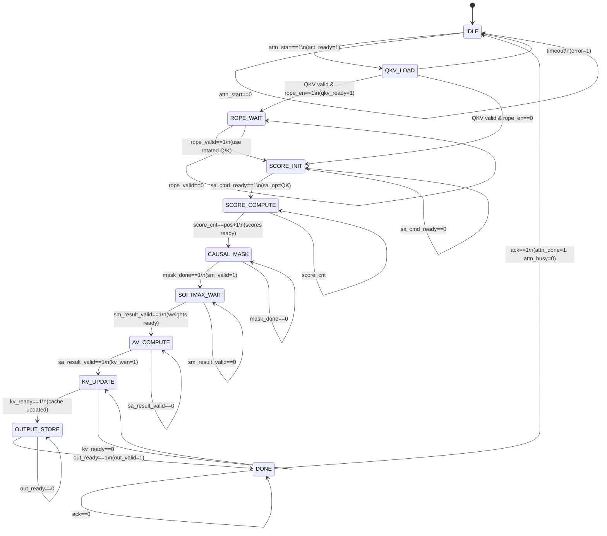

# M09 FSM: Attention Pipeline Control

## State List

| State | Encoding | Description |
|-------|----------|-------------|
| IDLE | 4'b0000 | 空闲状态，等待 `attn_start` 启动信号 |
| QKV_LOAD | 4'b0001 | Q/K/V 向量加载阶段，从 M02 SRAM 加载激活值 |
| ROPE_WAIT | 4'b0010 | RoPE 等待阶段，等待 M11 返回旋转后的 Q/K (可选) |
| SCORE_INIT | 4'b0011 | Score 初始化，配置 M00 Systolic Array 进行 Q·K^T 计算 |
| SCORE_COMPUTE | 4'b0100 | Score 计算阶段，逐位置计算 Q 与历史 K 的点积 |
| CAUSAL_MASK | 4'b0101 | Causal Mask 应用阶段，屏蔽未来位置 |
| SOFTMAX_WAIT | 4'b0110 | SoftMax 等待阶段，等待 M12 返回归一化结果 |
| AV_COMPUTE | 4'b0111 | Attention × V 计算阶段，通过 M00 计算 AV 输出 |
| KV_UPDATE | 4'b1000 | KV Cache 更新阶段，写入新的 K/V 到 M02 SRAM |
| OUTPUT_STORE | 4'b1001 | 输出存储阶段，Attention 结果写入 SRAM |
| DONE | 4'b1010 | 完成状态，发送 `attn_done` 信号并返回 IDLE |

**注**: 状态编码采用 4-bit，支持扩展调试状态。

## State Transition Table

| Current State | Condition | Target State | Output |
|---------------|-----------|--------------|--------|
| IDLE | `attn_start == 1` | QKV_LOAD | `act_ready_o = 1`, `kv_valid_o = 1` |
| IDLE | `attn_start == 0` | IDLE | 保持空闲 |
| QKV_LOAD | `q_valid & k_valid & v_valid == 1` | ROPE_WAIT (if `rope_en`) 或 SCORE_INIT (if `!rope_en`) | `qkv_ready_o = 1` |
| QKV_LOAD | `timeout == 1` | IDLE | `error = 1` (SRAM 访问超时) |
| ROPE_WAIT | `rope_valid_i == 1` | SCORE_INIT | 使用旋转后的 Q/K |
| ROPE_WAIT | `rope_valid_i == 0` | ROPE_WAIT | 继续等待 M11 |
| SCORE_INIT | `sa_cmd_ready_i == 1` | SCORE_COMPUTE | `sa_cmd_valid_o = 1`, `sa_op = QK` |
| SCORE_INIT | `sa_cmd_ready_i == 0` | SCORE_INIT | 等待 M00 就绪 |
| SCORE_COMPUTE | `score_cnt == current_pos + 1` | CAUSAL_MASK | Score 向量收集完成 |
| SCORE_COMPUTE | `score_cnt < current_pos + 1` | SCORE_COMPUTE | 继续计算 Q·K^T |
| CAUSAL_MASK | `mask_done == 1` | SOFTMAX_WAIT | `sm_valid_o = 1` |
| CAUSAL_MASK | `mask_done == 0` | CAUSAL_MASK | 继续应用掩码 |
| SOFTMAX_WAIT | `sm_result_valid_i == 1` | AV_COMPUTE | 获取 attention weights |
| SOFTMAX_WAIT | `sm_result_valid_i == 0` | SOFTMAX_WAIT | 继续等待 M12 |
| AV_COMPUTE | `sa_result_valid_i == 1` | KV_UPDATE | `kv_wen_o = 1` |
| AV_COMPUTE | `sa_result_valid_i == 0` | AV_COMPUTE | 继续计算 AV |
| KV_UPDATE | `kv_ready_i == 1` | OUTPUT_STORE | KV Cache 写入完成 |
| KV_UPDATE | `kv_ready_i == 0` | KV_UPDATE | 继续等待 SRAM |
| OUTPUT_STORE | `out_ready_i == 1` | DONE | `out_valid_o = 1` |
| OUTPUT_STORE | `out_ready_i == 0` | OUTPUT_STORE | 继续等待 SRAM |
| DONE | `ack == 1` | IDLE | `attn_done_o = 1`, `attn_busy_o = 0` |
| DONE | `ack == 0` | DONE | 等待确认 |

**Counter Definitions**:
- `score_cnt`: Score 计算位置计数器 (0 to `current_pos`)
- `head_cnt`: Head 索引计数器 (0 to `n_heads - 1`)
- `kv_idx`: KV Cache 位置索引 (0 to `seq_len - 1`)

## Mermaid State Diagram



## Phase Mode Selection (Prefill vs Decode)

### 4.1 Phase Decision Criteria

| Criterion | Prefill Phase | Decode Phase |
|-----------|---------------|--------------|
| Trigger | `attn_phase == PREFILL` | `attn_phase == DECODE` |
| Position Range | 0 to `prompt_len - 1` (批量) | `current_pos` (单次) |
| Score Compute | 每个 token 与所有历史 | Q 与 pos 个历史 K |
| KV Cache | 批量写入 | 读历史 + 写新 KV |
| Latency | pos × avg cycles | ~pos + 10 cycles |

**Phase Detection** (from M08 Scheduler):
```
phase_mode = (attn_phase_i == 0) ? PREFILL : DECODE
PREFILL: attn_phase_i = 0b00
DECODE:  attn_phase_i = 0b01
```

### 4.2 Prefill Phase FSM Flow

**Prefill 执行流程** (pos 从 0 到 prompt_len - 1):

```
Prefill Pipeline:
    |
    v
For pos in [0, prompt_len-1]:
    IDLE → QKV_LOAD → [ROPE_WAIT] → SCORE_INIT → SCORE_COMPUTE
        → CAUSAL_MASK → SOFTMAX_WAIT → AV_COMPUTE → KV_UPDATE → OUTPUT_STORE → DONE
    |
    v
    Return to IDLE, wait for next pos trigger
```

**Prefill 特殊行为**:
- Score Compute: 当前 pos 与历史 0..pos-1 的 K 点积
- Causal Mask: mask[pos+1..seq_len-1] = -inf
- KV Update: 每个 token 写入新 K/V
- Pipeline 重复: prompt_len 次迭代

**Prefill Latency Calculation**:
```
Prefill Total = prompt_len × (QKV_LOAD + ROPE + SCORE + MASK + SOFTMAX + AV + KV + OUTPUT)
             ≈ prompt_len × (4 + 2 + pos_avg + 1 + pos_avg + pos_avg + 2 + 4)
             ≈ prompt_len × (13 + 3×pos_avg)
Example (256 tokens, avg_pos=128): 256 × 397 = 101,152 cycles ≈ 202 ms @ 500 MHz
```

### 4.3 Decode Phase FSM Flow

**Decode 执行流程** (单个 token):

```
Decode Pipeline:
    |
    v
IDLE → QKV_LOAD → [ROPE_WAIT] → SCORE_INIT → SCORE_COMPUTE
    → CAUSAL_MASK → SOFTMAX_WAIT → AV_COMPUTE → KV_UPDATE → OUTPUT_STORE → DONE
    |
    v
Return to IDLE, ready for next token
```

**Decode 特殊行为**:
- Score Compute: 仅计算 Q 与 pos 个历史 K (1 次 Q·K^T)
- Causal Mask: mask[pos+1..seq_len-1] = -inf
- KV Update: 写入新 K/V 到 position pos
- 单次迭代: 每个 decode token 完整流程一次

**Decode Latency Calculation**:
```
Decode Single Token = QKV_LOAD + ROPE + SCORE + MASK + SOFTMAX + AV + KV + OUTPUT
                    = 4 + 2 + (pos+1) + 1 + (pos+1) + (pos+1) + 2 + 4
                    = 14 + 3×(pos+1)
Example (pos=256): 14 + 3×257 = 785 cycles ≈ 1.57 μs @ 500 MHz
```

### 4.4 MQA Head Processing

Multi-Query Attention 头共享机制:

| Head Group | Query Heads | Shared KV Head |
|------------|-------------|----------------|
| Group 0 | Head 0, 1 | KV Head 0 |
| Group 1 | Head 2, 3 | KV Head 1 |
| Group 2 | Head 4, 5 | KV Head 2 |
| Group 3 | Head 6, 7 | KV Head 3 |

**MQA FSM Behavior**:
```
For head_group in [0, 1, 2, 3]:
    Load shared K/V from KV Cache (once per group)
    For query_head in [group×2, group×2+1]:
        Compute Q·K^T using shared K
        Apply Causal Mask
        SoftMax (M12)
        Compute AV using shared V
        Store output for query_head
```

**MQA Optimization**: KV 只需加载 4 次，而非 8 次，节省 50% KV Cache带宽。

### 4.5 Precision Handling in FSM

| `data_precision` | Score Accumulator | SoftMax Input | AV Output |
|------------------|-------------------|---------------|-----------|
| FP32 | FP32 | FP32 | FP32 |
| FP16 | FP32 (accumulate) | FP16 | FP16 |
| FP8 | FP32 (accumulate) | FP16 | FP16 |
| INT8 | FP32 (accumulate) | FP16 | FP16 |

**Precision 不影响 FSM 状态流**，仅影响:
- M00 MAC 配置
- KV Cache 数据格式
- SoftMax 输入/输出精度

## Control Signal Outputs

| Signal | Active States | Width | Function |
|--------|--------------|-------|----------|
| `act_ready_o` | QKV_LOAD | 1 | 激活值接收就绪 |
| `qkv_ready_o` | QKV_LOAD | 1 | Q/K/V 接收就绪 |
| `kv_valid_o` | QKV_LOAD, KV_UPDATE | 1 | KV Cache 操作有效 |
| `kv_wen_o` | KV_UPDATE | 1 | KV Cache 写使能 |
| `kv_addr_o` | QKV_LOAD, KV_UPDATE | 20 | KV Cache 地址 |
| `sa_cmd_valid_o` | SCORE_INIT, AV_COMPUTE | 1 | Systolic Array 命令有效 |
| `sa_op_o` | SCORE_INIT, AV_COMPUTE | 2 | 操作类型 (0=QK, 1=AV) |
| `sa_head_o` | SCORE_INIT, AV_COMPUTE | 8 | Head 索引 |
| `sa_pos_o` | SCORE_INIT, AV_COMPUTE | 16 | Position 索引 |
| `sm_valid_o` | CAUSAL_MASK | 1 | SoftMax 输入有效 |
| `sm_data_o` | CAUSAL_MASK | 512 | SoftMax 输入数据 (score vector) |
| `sm_head_o` | CAUSAL_MASK | 8 | SoftMax Head 索引 |
| `out_valid_o` | OUTPUT_STORE, DONE | 1 | 输出有效 |
| `out_data_o` | OUTPUT_STORE | 64 | Attention 输出 |
| `out_layer_o` | OUTPUT_STORE | 8 | 层索引 |
| `attn_done_o` | DONE | 1 | Attention 计算完成 |
| `attn_busy_o` | All except IDLE, DONE | 1 | Attention 计算忙碌 |

## Implementation Notes

### 6.1 Counter Design

```
Counter Structure:
  score_cnt[16]:   0-511 (position count)
  head_cnt[8]:     0-7 (head index)
  kv_idx[20]:      0-511 (KV cache position index)
  retry_cnt[4]:    0-15 (timeout retry counter)
  
Counter Control:
  - Increment on each clock cycle in active state
  - Reset on state transition
  - Saturation at target value
```

### 6.2 Pipeline Synchronization

Score 和 AV 计算通过 M00 Systolic Array:

```
Score Compute (Q·K^T):
  Q[head][0:head_size-1] × K_history[0:pos][head][0:head_size-1]^T
  Result: score_vector[head][0:pos]
  
AV Compute (Attention × V):
  weights[head][0:pos] × V_history[0:pos][head][0:head_size-1]
  Result: output[head][0:head_size-1]
```

**Systolic Array Command Sequencing**:
- SCORE_INIT → SCORE_COMPUTE: 发送 QK 操作命令
- AV_COMPUTE: 发送 AV 操作命令

### 6.3 Causal Mask Implementation

掩码应用逻辑:

```
Causal Mask Algorithm:
  score_vector[0:current_pos] → keep (valid positions)
  score_vector[current_pos+1:seq_len-1] → set to -inf
  
Mask Value Selection:
  FP32: -1e20 (large negative)
  FP16: -65504 (max negative)
  FP8:  -240 (E4M3 max negative)
```

### 6.4 KV Cache Address Calculation

```
KV Cache Address Formula:
  Key Cache:
    addr = KV_KEY_BASE + (layer × seq_len × kv_dim) + (pos × kv_dim) + (kv_head × head_size)
    Example: Layer 0, pos=128, kv_head=1
    addr = 0x8004_0000 + (0 × 512 × 32) + (128 × 32) + (1 × 8)
         = 0x8004_0000 + 4096 + 8
         = 0x8004_1008
  
  Value Cache:
    addr = KV_VAL_BASE + (layer × seq_len × kv_dim) + (pos × kv_dim) + (kv_head × head_size)
    Base: 0x8006_0000
```

### 6.5 Error Handling

| Error Condition | FSM Response |
|-----------------|--------------|
| SRAM timeout | 返回 IDLE, `error = 1`, 等待 retry |
| M00 not ready | 持续等待, retry_cnt++ |
| M12 not ready | 持续等待, retry_cnt++ |
| M11 timeout | Skip RoPE, 使用原始 Q/K |
| Invalid position | 返回 IDLE, `error = 1` |

### 6.6 DVFS Integration

FSM 支持 DVFS 在 IDLE 状态切换:

```
DVFS Constraints:
  - FSM 必须在 IDLE 状态
  - attn_busy_o == 0 时才能切换频率
  - 切换后等待 stable 信号继续
```

## Verification Checklist

| Test Case | Description | Expected Behavior |
|-----------|-------------|-------------------|
| Prefill Full | 256 tokens, all heads | 状态序列: IDLE→QKV→ROPE→SCORE→MASK→SM→AV→KV→OUT→DONE × 256 |
| Decode Single | pos=256, single token | 状态序列: IDLE→QKV→ROPE→SCORE→MASK→SM→AV→KV→OUT→DONE |
| MQA Head Share | 8 Q heads, 4 KV heads | 每组 KV 加载 1 次, Score 计算 2 次 |
| Causal Mask | pos=100 | score[101-511] = -inf |
| RoPE Enabled | `rope_en=1` | 状态包含 ROPE_WAIT, 等待 M11 |
| RoPE Disabled | `rope_en=0` | 跳过 ROPE_WAIT, 直接进入 SCORE_INIT |
| Precision FP8 | KV FP8 compression | Score accumulator FP32, 输出 FP16 |
| SRAM Timeout | KV Cache 访问超时 | 返回 IDLE, error=1, retry |
| DVFS Transition | IDLE 状态切换 | FSM 无活动, 成功切换 |
| Zero Position | pos=0 | 仅计算 Q·K[0], mask[1-511]=-inf |