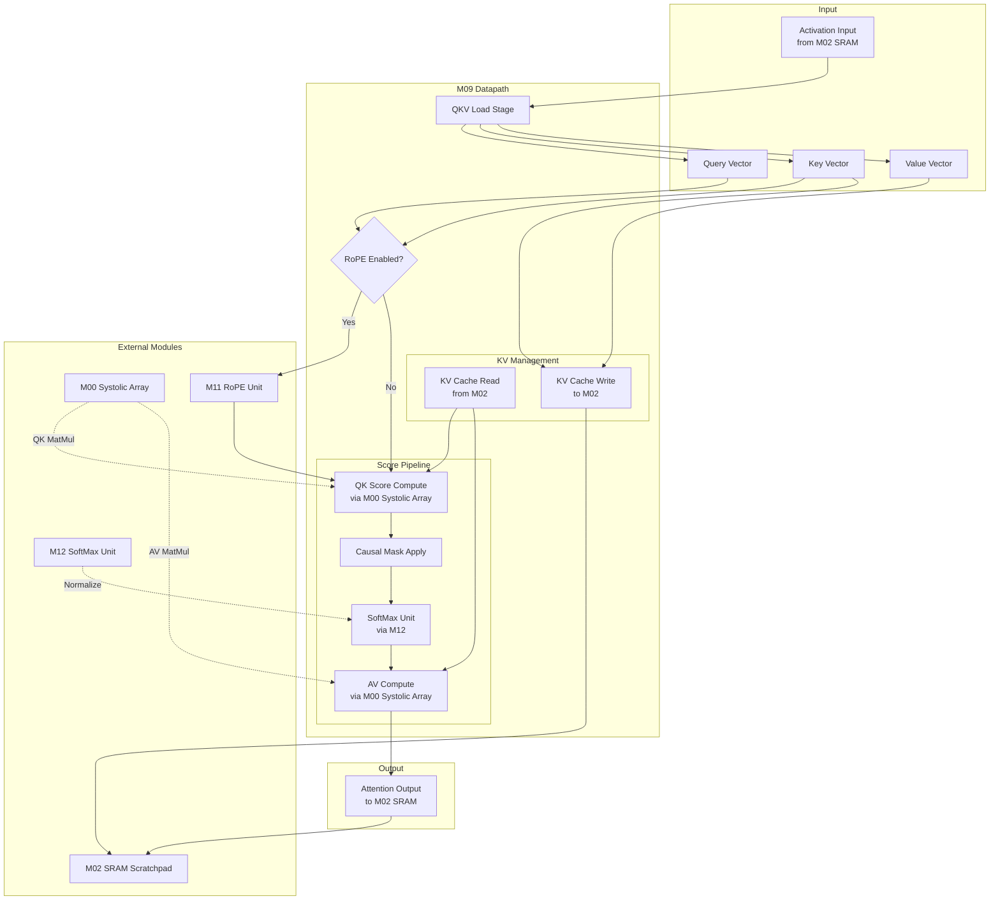
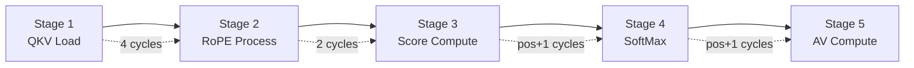
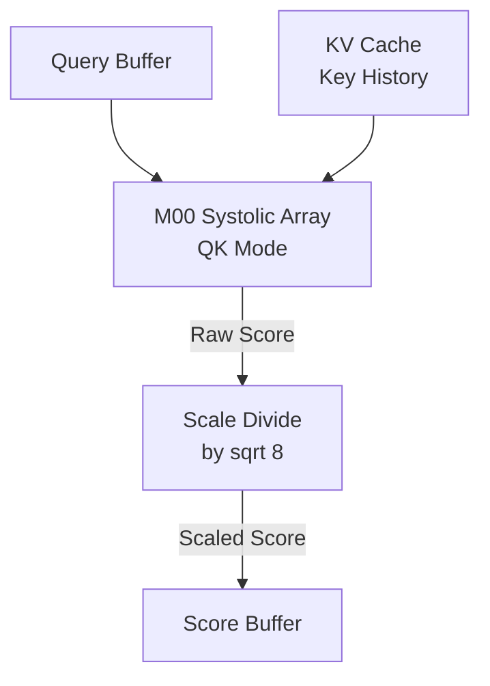
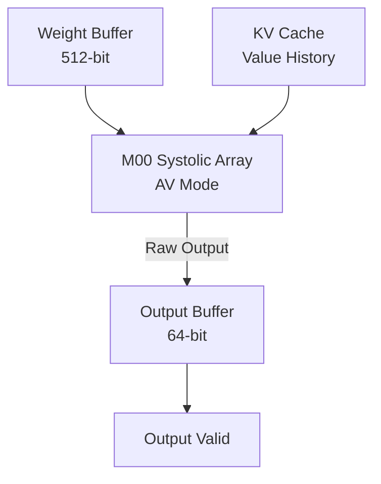
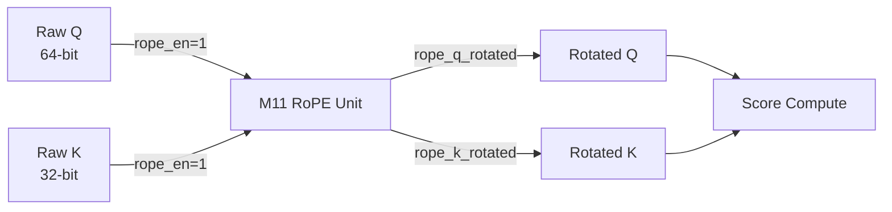
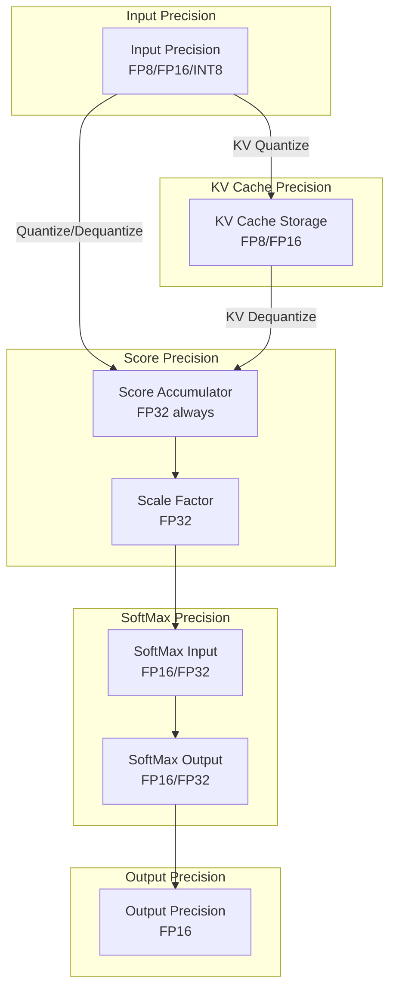

# Datapath Design - M09 Attention Unit

## Overview

Transformer Multi-Head Attention 算子专用数据通路，实现 Attention 计算、Causal Masking、KV Cache 管理。与 M00 Systolic Array、M12 SoftMax Unit、M11 RoPE Unit 协作完成完整的 Attention Pipeline。

**核心数据通路**：
```
Q × K^T → Score Matrix (via M00)
Score → Causal Mask → Masked Score
Masked Score → SoftMax (via M12) → Attention Weights
Attention Weights × V → Output (via M00)
```

## Block Diagram (Mermaid)



## Multi-head Architecture

### Head Configuration (TinyStories 15M)

| Parameter | Value | Description |
|-----------|-------|-------------|
| n_heads | 8 | Query 头数量 |
| n_kv_heads | 4 | Key/Value 头数量 (MQA) |
| head_size | 8 | 每个头的维度 |
| kv_dim | 32 | KV 向量维度 (4 × 8) |
| kv_mul | 2 | Query/KV 共享比 |

### Head Data Distribution

```mermaid
graph LR
    subgraph Query Heads
        Q0[Head 0<br/>8-dim]
        Q1[Head 1<br/>8-dim]
        Q2[Head 2<br/>8-dim]
        Q3[Head 3<br/>8-dim]
        Q4[Head 4<br/>8-dim]
        Q5[Head 5<br/>8-dim]
        Q6[Head 6<br/>8-dim]
        Q7[Head 7<br/>8-dim]
    end
    
    subgraph KV Heads (Shared)
        KV0[KV Head 0<br/>32-dim]
        KV1[KV Head 1<br/>32-dim]
        KV2[KV Head 2<br/>32-dim]
        KV3[KV Head 3<br/>32-dim]
    end
    
    Q0 -.->|Share| KV0
    Q1 -.->|Share| KV0
    Q2 -.->|Share| KV1
    Q3 -.->|Share| KV1
    Q4 -.->|Share| KV2
    Q5 -.->|Share| KV2
    Q6 -.->|Share| KV3
    Q7 -.->|Share| KV3
```

### MQA Head Mapping

| Head Group | Query Heads | Shared KV Head | Data Width |
|------------|-------------|----------------|------------|
| Group 0 | Head 0, 1 | KV Head 0 | Q: 16-dim, KV: 32-dim |
| Group 1 | Head 2, 3 | KV Head 1 | Q: 16-dim, KV: 32-dim |
| Group 2 | Head 4, 5 | KV Head 2 | Q: 16-dim, KV: 32-dim |
| Group 3 | Head 6, 7 | KV Head 3 | Q: 16-dim, KV: 32-dim |

## Pipeline Structure

### 5-Stage Attention Pipeline



### Stage Details

| Stage | Operation | Duration | Module | Description |
|-------|-----------|----------|--------|-------------|
| Stage 1 | QKV Load | 4 cycles | M02 | 从 SRAM 加载 Q/K/V 向量 |
| Stage 2 | RoPE | 2 cycles (optional) | M11 | 位置编码旋转 (可跳过) |
| Stage 3 | QK Score | pos+1 cycles | M00 | Q·K^T 点积计算 |
| Stage 4 | SoftMax | pos+1 cycles | M12 | Score 归一化 |
| Stage 5 | AV Compute | pos+1 cycles | M00 | Attention weights × V |

### Prefill Pipeline (Batch Processing)

```
For pos in [0, prompt_len-1]:
    Stage 1: Load Q[pos], K[0:pos], V[0:pos]
    Stage 2: Apply RoPE to Q[pos], K[pos] (optional)
    Stage 3: Compute score[pos] = Q·K^T[0:pos]
    Stage 4: SoftMax(score[pos])
    Stage 5: Compute output[pos] = weights × V[0:pos]
    Update: Write K[pos], V[pos] to KV Cache
```

### Decode Pipeline (Single Token)

```
For current_pos = prompt_len + decode_step:
    Stage 1: Load Q[current_pos], K[0:current_pos-1], V[0:current_pos-1]
    Stage 2: Apply RoPE to Q[current_pos], K[current_pos] (optional)
    Stage 3: Compute score = Q·K^T[0:current_pos-1] + Q·K[current_pos]
    Stage 4: SoftMax(score[0:current_pos])
    Stage 5: Compute output = weights × V[0:current_pos]
    Update: Write K[current_pos], V[current_pos] to KV Cache
```

## Datapath Components

### QKV Load Unit

| Component | Width | Function |
|-----------|-------|----------|
| Q Buffer | 64-bit (8 heads × 8-dim) | Query 向量缓存 |
| K Buffer | 32-bit (4 KV heads × 8-dim) | Key 向量缓存 |
| V Buffer | 32-bit (4 KV heads × 8-dim) | Value 向量缓存 |
| Position Register | 16-bit | 当前位置索引 |
| Layer Register | 8-bit | 当前层索引 |

**数据流**：
```
Activation Data (512-bit) --> Split into Q, K, V
Q: 64-bit --> Q Buffer
K: 32-bit --> K Buffer --> KV Cache Address Generator
V: 32-bit --> V Buffer --> KV Cache Address Generator
```

### Score Compute Unit

| Component | Width | Function |
|-----------|-------|----------|
| Score Accumulator | 256-bit (8 heads × pos) | Score 向量累加 |
| Scale Factor | 32-bit | 1/sqrt(head_size) = 1/sqrt(8) |
| M00 Interface | Custom | Systolic Array 命令/数据 |

**计算流程**：


**Scale Factor 计算**：
```
scale_factor = 1 / sqrt(head_size) = 1 / sqrt(8) = 0.35355
Implementation: FP16 constant or shift approximation
```

### Causal Mask Unit

| Component | Width | Function |
|-----------|-------|----------|
| Position Counter | 16-bit | 当前位置索引 |
| Mask Logic | Combinatorial | 掩码应用逻辑 |
| Mask Value Select | 32-bit | 精度相关掩码值 |

**掩码逻辑**：
```
For i in [0, seq_len-1]:
    if i > current_pos:
        score[i] = mask_value  // -inf equivalent
    else:
        score[i] = score[i]    // keep original
```

**Mask Value Selection**：

| Precision | Mask Value | Rationale |
|-----------|------------|-----------|
| FP32 | -1e20 | 足够大负数，softmax 后为 0 |
| FP16 | -65504 | FP16 最大负数 |
| FP8 E4M3 | -240 | E4M3 最大负数 |
| FP8 E5M2 | -57344 | E5M2 最大负数 |

### SoftMax Interface Unit

| Component | Width | Function |
|-----------|-------|----------|
| Score Vector Buffer | 512-bit | SoftMax 输入数据 |
| Head Index Register | 8-bit | Head 索引传递 |
| M12 Interface | Custom | SoftMax Unit 连接 |

**数据流**：


### AV Compute Unit

| Component | Width | Function |
|-----------|-------|----------|
| Weight Buffer | 512-bit | Attention weights |
| V History Buffer | Dynamic | Value Cache 数据 |
| M00 Interface | Custom | Systolic Array 命令/数据 |
| Output Buffer | 64-bit (8 heads × 8-dim) | Attention 输出 |

**计算流程**：


### KV Cache Address Generator

| Component | Width | Function |
|-----------|-------|----------|
| Layer Counter | 8-bit | 层索引 (0-4) |
| Position Counter | 16-bit | 位置索引 (0-511) |
| KV Head Counter | 8-bit | KV Head 索引 (0-3) |
| Base Address Register | 32-bit | KV Cache 基地址 |

**地址计算公式**：
```
Key Cache Address:
  addr = KV_KEY_BASE + (layer × seq_len × kv_dim × bytes) 
         + (pos × kv_dim × bytes) + (kv_head × head_size × bytes)
  
Value Cache Address:
  addr = KV_VAL_BASE + (layer × seq_len × kv_dim × bytes)
         + (pos × kv_dim × bytes) + (kv_head × head_size × bytes)
```

**地址映射示例**：

| Layer | Position | KV Head | Key Address | Value Address |
|-------|----------|---------|-------------|---------------|
| 0 | 0 | 0 | 0x8004_0000 | 0x8006_0000 |
| 0 | 128 | 1 | 0x8004_1008 | 0x8006_1008 |
| 2 | 256 | 2 | 0x8005_2010 | 0x8007_2010 |
| 4 | 511 | 3 | 0x8005_3FF8 | 0x8007_3FF8 |

## Interface with External Modules

### M00 Systolic Array Interface

| Signal | Direction | Width | Description |
|--------|-----------|-------|-------------|
| sa_cmd_valid | Output | 1 | Systolic Array 命令有效 |
| sa_cmd_ready | Input | 1 | Systolic Array 命令就绪 |
| sa_op | Output | 2 | 操作类型: 0=QK, 1=AV |
| sa_head | Output | 8 | Head 索引 |
| sa_pos | Output | 16 | Position 索引 |
| sa_result_valid | Input | 1 | 计算结果有效 |
| sa_result_data | Input | 256 | 计算结果数据 |

**操作类型定义**：

| sa_op | Operation | Matrix A | Matrix B | Output |
|-------|-----------|----------|----------|--------|
| 0 (QK) | Q·K^T | Q[head][head_size] | K[pos][head_size]^T | score[pos] |
| 1 (AV) | Attention×V | weights[pos] | V[pos][head_size] | output[head_size] |

### M02 SRAM Interface (KV Cache)

| Signal | Direction | Width | Description |
|--------|-----------|-------|-------------|
| kv_addr | Output | 20 | KV Cache SRAM 地址 |
| kv_wdata | Output | 64 | KV Cache 写数据 |
| kv_wen | Output | 1 | KV Cache 写使能 |
| kv_rdata | Input | 64 | KV Cache 读数据 |
| kv_valid | Output | 1 | KV Cache 操作有效 |
| kv_ready | Input | 1 | KV Cache 操作就绪 |

**KV Cache 数据组织**：

```mermaid
graph TB
    subgraph Key Cache Structure
        KC_L0[Layer 0 Key Cache<br/>32 KB]
        KC_L1[Layer 1 Key Cache<br/>32 KB]
        KC_L2[Layer 2 Key Cache<br/>32 KB]
        KC_L3[Layer 3 Key Cache<br/>32 KB]
        KC_L4[Layer 4 Key Cache<br/>32 KB]
    end
    
    subgraph Value Cache Structure
        VC_L0[Layer 0 Value Cache<br/>32 KB]
        VC_L1[Layer 1 Value Cache<br/>32 KB]
        VC_L2[Layer 2 Value Cache<br/>32 KB]
        VC_L3[Layer 3 Value Cache<br/>32 KB]
        VC_L4[Layer 4 Value Cache<br/>32 KB]
    end
    
    KC_L0 --> KC_L1 --> KC_L2 --> KC_L3 --> KC_L4
    VC_L0 --> VC_L1 --> VC_L2 --> VC_L3 --> VC_L4
```



### M12 SoftMax Unit Interface

| Signal | Direction | Width | Description |
|--------|-----------|-------|-------------|
| sm_valid | Output | 1 | SoftMax 输入有效 |
| sm_data | Output | 512 | SoftMax 输入数据 (score vector) |
| sm_head | Output | 8 | Head 索引 |
| sm_ready | Input | 1 | SoftMax 就绪 |
| sm_result_valid | Input | 1 | SoftMax 结果有效 |
| sm_result_data | Input | 512 | SoftMax 结果 (attention weights) |

### M11 RoPE Unit Interface

| Signal | Direction | Width | Description |
|--------|-----------|-------|-------------|
| rope_en | Input | 1 | RoPE 使能标志 |
| rope_q_rotated | Input | 64 | RoPE 处理后的 Q |
| rope_k_rotated | Input | 32 | RoPE 处理后的 K |
| rope_valid | Input | 1 | RoPE 结果有效 |

**RoPE 数据流**：


## Precision Handling

### Data Precision Path



### Precision Mode Configuration

| Mode | Q/K/V Input | Score Compute | KV Cache | SoftMax | Output |
|------|-------------|---------------|----------|---------|--------|
| FP16 | FP16 | FP32 (accum) | FP16 | FP16 | FP16 |
| FP8 KV | FP16 | FP32 (accum) | FP8 | FP16 | FP16 |
| INT8 | INT8 | FP32 (accum) | FP16 | FP16 | FP16 |

### Precision Conversion Units

| Conversion | Location | Operation |
|------------|----------|-----------|
| INT8 → FP16 | QKV Input | 反量化 (乘 scale, 加 zero_point) |
| FP16 → FP8 | KV Write | 量化 (clip + cast) |
| FP8 → FP16 | KV Read | 反量化 (cast + bias) |
| FP16 → FP32 | Score Accum | 扩展精度 |
| FP32 → FP16 | Output | 截断/舍入 |

## Data Flow Timing

### Prefill Phase Timing (256 tokens)

| Stage | Duration @ 500 MHz | Notes |
|-------|--------------------|-------|
| QKV Load (per token) | 4 cycles | 批量加载 |
| RoPE (per token) | 2 cycles | 可选 |
| Score Compute | pos_avg × 1 cycles | 平均 pos=128 |
| Causal Mask | 1 cycle | 组合逻辑 |
| SoftMax | pos_avg × 1 cycles | M12 处理 |
| AV Compute | pos_avg × 1 cycles | M00 处理 |
| KV Update | 2 cycles | 写入 Cache |
| Output Store | 4 cycles | 写入 SRAM |

**Prefill Total Latency**：
```
Prefill = prompt_len × (4 + 2 + pos_avg + 1 + pos_avg + pos_avg + 2 + 4)
        = prompt_len × (13 + 3 × pos_avg)
        = 256 × (13 + 3 × 128) = 256 × 397 ≈ 101,152 cycles
        ≈ 202 ms @ 500 MHz
```

### Decode Phase Timing (Single Token, pos=256)

| Stage | Duration @ 500 MHz | Notes |
|-------|--------------------|-------|
| QKV Load | 4 cycles | 单 token |
| KV Read (History) | 2 cycles × pos | 读取历史 KV |
| RoPE | 2 cycles | 可选 |
| Score Compute | pos cycles | Q·K^T 点积 |
| Causal Mask | 1 cycle | 组合逻辑 |
| SoftMax | pos cycles | M12 处理 |
| AV Compute | pos cycles | M00 处理 |
| KV Write | 2 cycles | 写入新 KV |
| Output Store | 4 cycles | 写入 SRAM |

**Decode Total Latency**：
```
Decode = 4 + 2 + 2 + 2 + (pos+1) + 1 + (pos+1) + (pos+1) + 2 + 4
       = 14 + 3 × (pos+1)
       = 14 + 3 × 257 = 785 cycles
       ≈ 1.57 μs @ 500 MHz
```

## Pipeline Control Signals

| Signal | Width | Function | Active Stage |
|--------|-------|----------|--------------|
| qkv_load_en | 1 | QKV 加载使能 | Stage 1 |
| rope_bypass | 1 | RoPE 跳过标志 | Stage 2 |
| score_start | 1 | Score 计算启动 | Stage 3 |
| causal_mask_en | 1 | Causal Mask 使能 | Stage 3 |
| softmax_start | 1 | SoftMax 启动 | Stage 4 |
| av_start | 1 | AV 计算启动 | Stage 5 |
| kv_write_en | 1 | KV Cache 写使能 | KV Update |
| output_valid | 1 | 输出有效 | Output Store |
| pipeline_busy | 1 | Pipeline 忙碌标志 | All active |

## Implementation Notes

### 1. MQA Bandwidth Optimization

KV Cache 访问优化：
- Standard Attention: 8 heads × 2 (KV) × seq_len × bytes
- MQA Attention: 4 heads × 2 (KV) × seq_len × bytes
- **节省**: 50% KV Cache 容量和带宽

### 2. Score Pipeline Bypass

当 `pos=0` (第一个 token) 时：
- Score Compute: 仅 1 cycle (Q·K[0])
- Causal Mask: 无效掩码 (无未来位置)
- SoftMax: 1 element (简化计算)

### 3. RoPE Optional Path

当 `rope_en=0` 时：
- 跳过 ROPE_WAIT 状态
- 直接使用原始 Q/K
- 减少 2 cycles latency

### 4. FP8 KV Cache Compression

FP8 KV Cache 优势：
- KV Cache 容量: 160 KB → 80 KB (减半)
- 带宽需求: 8 GB/s → 4 GB/s (减半)
- 精度损失: < 0.5% (E4M3 格式)

### 5. Systolic Array Reuse

M00 Systolic Array 双重使用：
- Score Compute (QK Mode): 矩阵乘法 Q·K^T
- AV Compute (AV Mode): 矩阵乘法 Attention×V
- 共享硬件资源，减少面积开销