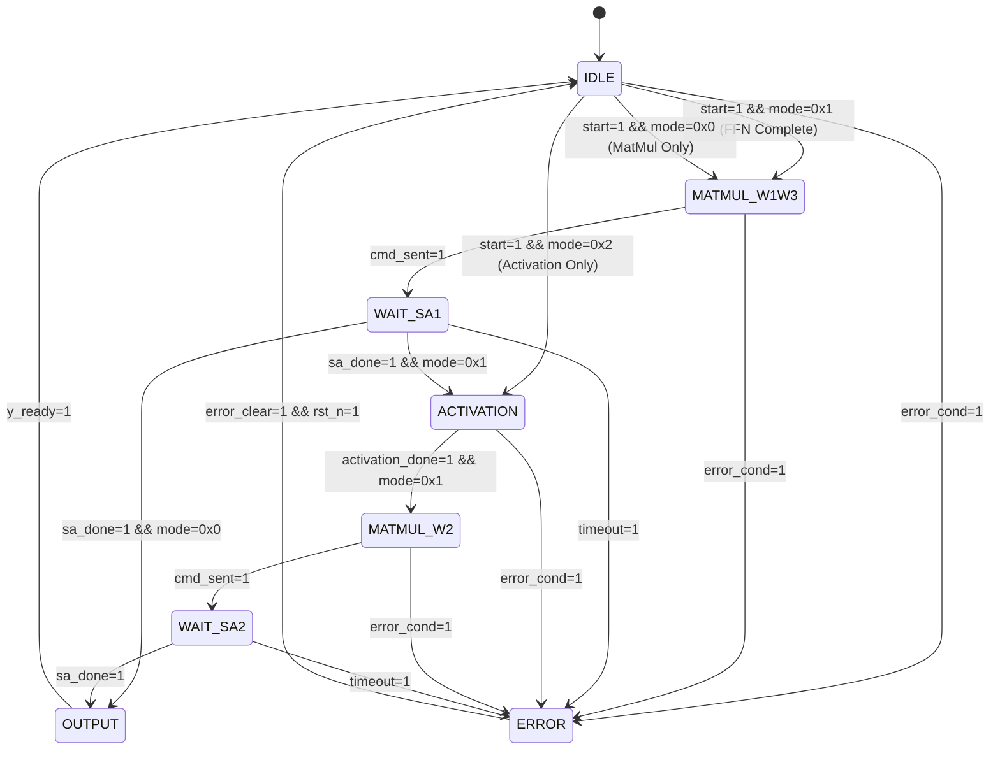

# M10 FFN/MatMul Unit FSM 规范

## 1. FSM 概述

### 1.1 FSM 类型

| FSM 名称 | 类型 | 描述 |
|----------|------|------|
| `FFN_FSM` | Pipeline Control | FFN 流水线主控制状态机 |

### 1.2 FSM 功能

- 控制 FFN Complete 流水线执行流程
- 管理 MatMul 调度到 Systolic Array (M00)
- 协调激活函数计算单元
- 处理三种操作模式：FFN Complete、MatMul Only、Activation Only

---

## 2. 状态定义

### 2.1 状态列表

| 状态名 | 编码 | 描述 | 持续条件 |
|--------|------|------|----------|
| `IDLE` | `0x0` (3'b000) | 空闲状态，等待 start | `start == 0` |
| `MATMUL_W1W3` | `0x1` (3'b001) | 执行 w1/w3 MatMul (并行) | `sa_cmd_sent == 0` |
| `WAIT_SA1` | `0x2` (3'b010) | 等待 Systolic Array 完成 w1/w3 | `sa_done == 0` |
| `ACTIVATION` | `0x3` (3'b011) | 计算 SwiGLU (sigmoid, SiLU, gate) | `activation_done == 0` |
| `MATMUL_W2` | `0x4` (3'b100) | 执行 w2 MatMul | `sa_cmd_sent == 0` |
| `WAIT_SA2` | `0x5` (3'b101) | 等待 Systolic Array 完成 w2 | `sa_done == 0` |
| `OUTPUT` | `0x6` (3'b110) | 输出结果，等待 y_ready | `y_ready == 0` |
| `ERROR` | `0x7` (3'b111) | 错误状态 | `error_clear == 0` |

### 2.2 状态编码说明

- 采用 **One-Hot 编码** 实现以降低功耗和简化逻辑
- 3-bit 状态编码支持 8 个状态（7 个有效 + 1 个预留）
- ERROR 状态作为最终状态，需外部 reset 或 error_clear 退出

---

## 3. 状态转移图

### 3.1 Mermaid 状态图



### 3.2 状态转移表（详细）

| 当前状态 | 转移条件 | 目标状态 | 输出变化 | 延迟 |
|----------|----------|----------|----------|------|
| `IDLE` | `start == 1 && mode == 0x1` | `MATMUL_W1W3` | `busy = 1`, `sa_cmd = CMD_MMUL`, `sa_dim = hidden_dim` | 1 cycle |
| `IDLE` | `start == 1 && mode == 0x0` | `MATMUL_W1W3` | `busy = 1`, `sa_cmd = CMD_MMUL`, `sa_dim = s_dim` | 1 cycle |
| `IDLE` | `start == 1 && mode == 0x2` | `ACTIVATION` | `busy = 1`, `act_start = 1` | 1 cycle |
| `IDLE` | `start == 0` | `IDLE` | - | 0 |
| `MATMUL_W1W3` | `cmd_sent == 1` | `WAIT_SA1` | - | 1 cycle |
| `MATMUL_W1W3` | `error_cond == 1` | `ERROR` | `error = 1` | 1 cycle |
| `WAIT_SA1` | `sa_done == 1 && mode == 0x1` | `ACTIVATION` | `act_start = 1`, `w1_out_valid = 1`, `w3_out_valid = 1` | 1 cycle |
| `WAIT_SA1` | `sa_done == 1 && mode == 0x0` | `OUTPUT` | `y_valid = 1` | 1 cycle |
| `WAIT_SA1` | `timeout == 1` | `ERROR` | `error = 1`, `error_code = TIMEOUT` | 1 cycle |
| `ACTIVATION` | `activation_done == 1 && mode == 0x1` | `MATMUL_W2` | `sa_cmd = CMD_MMUL`, `sa_dim = dim`, `gate_out_valid = 1` | 1 cycle |
| `ACTIVATION` | `activation_done == 1 && mode == 0x2` | `OUTPUT` | `y_valid = 1` | 1 cycle |
| `ACTIVATION` | `error_cond == 1` | `ERROR` | `error = 1` | 1 cycle |
| `MATMUL_W2` | `cmd_sent == 1` | `WAIT_SA2` | - | 1 cycle |
| `MATMUL_W2` | `error_cond == 1` | `ERROR` | `error = 1` | 1 cycle |
| `WAIT_SA2` | `sa_done == 1` | `OUTPUT` | `y_valid = 1` | 1 cycle |
| `WAIT_SA2` | `timeout == 1` | `ERROR` | `error = 1`, `error_code = TIMEOUT` | 1 cycle |
| `OUTPUT` | `y_ready == 1` | `IDLE` | `busy = 0`, `done = 1`, `y_valid = 0` | 1 cycle |
| `OUTPUT` | `y_ready == 0` | `OUTPUT` | - | 0 |
| `ERROR` | `error_clear == 1` | `IDLE` | `error = 0`, `busy = 0` | 1 cycle |
| `any` | `rst_n == 0` | `IDLE` | 所有寄存器复位 | Async |

---

## 4. 状态详细描述

### 4.1 IDLE 状态

**功能**：
- 等待 `start` 信号启动操作
- 根据 `mode` 选择执行路径

**状态寄存器**：
```verilog
// IDLE 状态内部变量
reg [1:0] mode_reg;        // 操作模式锁存
reg [15:0] dim_reg;        // 维度参数锁存
reg [31:0] w_base_reg;     // 权重基地址锁存
```

**状态逻辑**：
```verilog
always @(posedge clk or negedge rst_n) begin
    if (!rst_n) begin
        state <= IDLE;
        busy <= 0;
        done <= 0;
    end else if (state == IDLE) begin
        if (start) begin
            mode_reg <= mode;
            dim_reg <= dim;
            w_base_reg <= w_base;
            busy <= 1;
            
            case (mode)
                0x0: state <= MATMUL_W1W3;  // MatMul Only
                0x1: state <= MATMUL_W1W3;  // FFN Complete (先 MatMul)
                0x2: state <= ACTIVATION;   // Activation Only
                default: state <= ERROR;
            endcase
        end
    end
end
```

### 4.2 MATMUL_W1W3 状态

**功能**：
- 向 Systolic Array 发送 MatMul 命令
- w1 和 w3 并行发送（FFN Complete 模式）

**输出信号**：
```verilog
// MATMUL_W1W3 状态输出
assign sa_cmd = (state == MATMUL_W1W3) ? CMD_MMUL : 0;
assign sa_dim = (mode_reg == 0x1) ? hidden_dim : dim_reg;  // 256 for FFN, else user param
assign sa_w_base = w_base_reg;
assign sa_w_row = 0;  // 初始行索引
```

**计数器**：
```verilog
reg cmd_sent_cnt;  // 命令发送计数 (w1 + w3 = 2 次并行)
```

**转移条件**：
- `cmd_sent_cnt == 2` → `WAIT_SA1` (FFN Complete)
- `cmd_sent_cnt == 1` → `WAIT_SA1` (MatMul Only)

### 4.3 WAIT_SA1 状态

**功能**：
- 等待 Systolic Array 完成 w1/w3 MatMul
- 监控超时计数器

**超时机制**：
```verilog
reg [15:0] timeout_cnt;  // 超时计数器
localparam TIMEOUT_LIMIT = 16'hFFFF;  // 最大等待周期

always @(posedge clk) begin
    if (state == WAIT_SA1) begin
        timeout_cnt <= timeout_cnt + 1;
        if (timeout_cnt >= TIMEOUT_LIMIT) begin
            error <= 1;
            error_code <= TIMEOUT;
            state <= ERROR;
        end
    end else begin
        timeout_cnt <= 0;
    end
end
```

**结果接收**：
```verilog
// 接收 w1_out 和 w3_out
always @(posedge clk) begin
    if (state == WAIT_SA1 && sa_done) begin
        w1_out <= sa_result;      // w1 结果
        w3_out <= sa_result_alt;  // w3 结果 (并行端口)
    end
end
```

### 4.4 ACTIVATION 状态

**功能**：
- 执行 SwiGLU 激活函数流水线
- 包含 sigmoid lookup、SiLU 计算、gate multiplication

**内部子流水线**：
1. `sigmoid(w1_out)` → 4 cycles
2. `silu = w1_out * sigmoid_out` → 2 cycles
3. `gate = silu * w3_out` → 2 cycles

**状态变量**：
```verilog
reg [2:0] act_stage;      // 激活流水线阶段
reg [255:0] sigmoid_out;  // sigmoid 结果
reg [255:0] silu_out;     // SiLU 结果
reg [255:0] gate_out;     // gate 结果
reg [3:0] act_cnt;        // 激活计数器 (8 cycles total)
```

**激活逻辑**：
```verilog
always @(posedge clk) begin
    if (state == ACTIVATION) begin
        act_cnt <= act_cnt + 1;
        
        case (act_cnt)
            0: sigmoid_start <= 1;            // 启动 sigmoid lookup
            4: begin
                sigmoid_out <= lut_result;    // sigmoid 完成
                silu_start <= 1;              // 启动 SiLU mul
            end
            6: begin
                silu_out <= mul_result;       // SiLU 完成
                gate_start <= 1;              // 启动 gate mul
            end
            8: begin
                gate_out <= mul_result;       // gate 完成
                activation_done <= 1;
                state <= (mode_reg == 0x1) ? MATMUL_W2 : OUTPUT;
            end
        endcase
    end
end
```

### 4.5 MATMUL_W2 状态

**功能**：
- 向 Systolic Array 发送 w2 MatMul 命令
- 使用 `gate_out` 作为输入向量

**输出信号**：
```verilog
assign sa_cmd = (state == MATMUL_W2) ? CMD_MMUL : 0;
assign sa_dim = dim_reg;  // 输出维度 64
assign sa_input = gate_out;  // w2 输入
assign sa_w_base = w_base_reg + w2_offset;  // w2 权重偏移
```

### 4.6 WAIT_SA2 状态

**功能**：
- 等待 Systolic Array 完成 w2 MatMul
- 同样包含超时机制

**结果接收**：
```verilog
always @(posedge clk) begin
    if (state == WAIT_SA2 && sa_done) begin
        y_out <= sa_result;  // 最终输出
        state <= OUTPUT;
    end
end
```

### 4.7 OUTPUT 状态

**功能**：
- 输出结果到下游模块
- 等待 `y_ready` 信号

**握手逻辑**：
```verilog
always @(posedge clk) begin
    if (state == OUTPUT) begin
        y_valid <= 1;
        if (y_ready) begin
            y_valid <= 0;
            done <= 1;
            busy <= 0;
            state <= IDLE;
        end
    end
end
```

### 4.8 ERROR 状态

**功能**：
- 错误处理状态
- 保持 `error = 1` 直到外部清除

**错误类型**：
```verilog
reg [7:0] error_code;  // 错误编码

localparam TIMEOUT      = 0x01;  // Systolic Array 超时
localparam INVALID_MODE = 0x02;  // 无效模式
localparam ACT_ERROR    = 0x03;  // 激活函数错误
localparam SA_ERROR     = 0x04;  // Systolic Array 错误
```

---

## 5. 时序波形图

### 5.1 FFN Complete 模式完整波形

```wavedrom
{signal: [
  {name: 'clk', wave: 'p........................'},
  {name: 'rst_n', wave: '1........................'},
  {name: 'start', wave: '01.0....................'},
  {name: 'mode', wave: 'x=1x.....................'},
  {name: 'state', wave: 'x.=.=.=.=.=.=.=x', data: ['IDLE', 'MATMUL_W1W3', 'WAIT_SA1', 'ACTIVATION', 'MATMUL_W2', 'WAIT_SA2', 'OUTPUT', 'IDLE']},
  {name: 'busy', wave: '0.1..................10'},
  {name: 'sa_cmd', wave: 'x.=.x.......=.x.......', data: ['CMD_MMUL', 'CMD_MMUL']},
  {name: 'sa_done', wave: '0.......1.0.....1.0..'},
  {name: 'activation_done', wave: '0...........1.0.....'},
  {name: 'y_valid', wave: '0..................1.0'},
  {name: 'y_ready', wave: '1..................01'},
  {name: 'done', wave: '0...................10'}
], head: {text: 'FFN Complete (mode=0x1)'}}
```

### 5.2 MatMul Only 模式波形

```wavedrom
{signal: [
  {name: 'clk', wave: 'p.............'},
  {name: 'start', wave: '01.0..........'},
  {name: 'mode', wave: 'x=0x..........'},
  {name: 'state', wave: 'x.=.=.=.=x', data: ['IDLE', 'MATMUL_W1W3', 'WAIT_SA1', 'OUTPUT', 'IDLE']},
  {name: 'sa_cmd', wave: 'x.=.x.......', data: ['CMD_MMUL']},
  {name: 'sa_done', wave: '0.....1.0...'},
  {name: 'y_valid', wave: '0.......1.0.'},
  {name: 'done', wave: '0..........10'}
], head: {text: 'MatMul Only (mode=0x0)'}}
```

### 5.3 Activation Only 模式波形

```wavedrom
{signal: [
  {name: 'clk', wave: 'p.............'},
  {name: 'start', wave: '01.0..........'},
  {name: 'mode', wave: 'x=2x..........'},
  {name: 'state', wave: 'x.=.=.=x', data: ['IDLE', 'ACTIVATION', 'OUTPUT', 'IDLE']},
  {name: 'act_start', wave: '0.1.0.......'},
  {name: 'activation_done', wave: '0.....1.0..'},
  {name: 'y_valid', wave: '0......1.0..'},
  {name: 'done', wave: '0.......10..'}
], head: {text: 'Activation Only (mode=0x2)'}}
```

---

## 6. 并行 MatMul 处理

### 6.1 w1/w3 并行调度

**设计策略**：
- w1 和 w3 MatMul 同时发送到 Systolic Array
- Systolic Array 支持双端口并行接收
- 结果分别存储到 `w1_out` 和 `w3_out`

**接口信号**：
```verilog
// 双端口 MatMul 接口
output [3:0] sa_cmd_1;        // Port 1 command
output [3:0] sa_cmd_2;        // Port 2 command
output [15:0] sa_dim_1;      // Port 1 dimension
output [15:0] sa_dim_2;      // Port 2 dimension
output [31:0] sa_w_base_1;   // Port 1 weight base
output [31:0] sa_w_base_2;   // Port 2 weight base
input [255:0] sa_result_1;   // Port 1 result
input [255:0] sa_result_2;   // Port 2 result
input sa_done_1;             // Port 1 done
input sa_done_2;             // Port 2 done
```

**调度逻辑**：
```verilog
always @(posedge clk) begin
    if (state == MATMUL_W1W3) begin
        // 同时发送 w1 和 w3 命令
        sa_cmd_1 <= CMD_MMUL;
        sa_cmd_2 <= CMD_MMUL;
        sa_dim_1 <= hidden_dim;
        sa_dim_2 <= hidden_dim;
        sa_w_base_1 <= w_base_reg + w1_offset;
        sa_w_base_2 <= w_base_reg + w3_offset;
        
        cmd_sent_cnt <= cmd_sent_cnt + 2;  // 双命令发送
        
        if (cmd_sent_cnt >= 2) begin
            state <= WAIT_SA1;
            sa_cmd_1 <= 0;
            sa_cmd_2 <= 0;
        end
    end
end
```

**等待逻辑**：
```verilog
always @(posedge clk) begin
    if (state == WAIT_SA1) begin
        // 等待两个端口都完成
        if (sa_done_1 && sa_done_2) begin
            w1_out <= sa_result_1;
            w3_out <= sa_result_2;
            w1_out_valid <= 1;
            w3_out_valid <= 1;
            
            case (mode_reg)
                0x0: state <= OUTPUT;      // MatMul Only (仅用 w1)
                0x1: state <= ACTIVATION;  // FFN Complete
                default: state <= ERROR;
            endcase
        end
    end
end
```

---

## 7. 超时与错误处理

### 7.1 超时计数器

| 状态 | 超时限制 | 说明 |
|------|----------|------|
| `WAIT_SA1` | 65536 cycles | Systolic Array w1/w3 超时 |
| `WAIT_SA2` | 65536 cycles | Systolic Array w2 超时 |

**超时逻辑**：
```verilog
always @(posedge clk) begin
    if (state == WAIT_SA1 || state == WAIT_SA2) begin
        timeout_cnt <= timeout_cnt + 1;
        
        if (timeout_cnt >= TIMEOUT_LIMIT) begin
            error <= 1;
            error_code <= TIMEOUT;
            state <= ERROR;
        end
        
        if (sa_done) begin
            timeout_cnt <= 0;  // 正常完成，清零计数
        end
    end else begin
        timeout_cnt <= 0;
    end
end
```

### 7.2 错误状态机

**错误编码**：

| error_code | 值 | 描述 |
|------------|-----|------|
| `NO_ERROR` | 0x00 | 无错误 |
| `TIMEOUT` | 0x01 | Systolic Array 超时 |
| `INVALID_MODE` | 0x02 | 无效模式 (mode != 0x0/0x1/0x2) |
| `ACT_ERROR` | 0x03 | 激活函数计算错误 |
| `SA_ERROR` | 0x04 | Systolic Array 返回错误 |
| `BACKPRESSURE` | 0x05 | 输出阻塞超时 |

**错误状态逻辑**：
```verilog
always @(posedge clk or negedge rst_n) begin
    if (!rst_n) begin
        error <= 0;
        error_code <= NO_ERROR;
    end else if (state == ERROR) begin
        if (error_clear) begin
            error <= 0;
            error_code <= NO_ERROR;
            state <= IDLE;
        end
    end else begin
        // 错误检测逻辑
        if (mode_reg > 0x2) begin
            error <= 1;
            error_code <= INVALID_MODE;
            state <= ERROR;
        end
        
        if (sa_error_in) begin
            error <= 1;
            error_code <= SA_ERROR;
            state <= ERROR;
        end
    end
end
```

---

## 8. FSM 实现规格

### 8.1 状态寄存器

```verilog
// 状态编码
localparam [2:0]
    IDLE       = 3'b000,
    MATMUL_W1W3 = 3'b001,
    WAIT_SA1   = 3'b010,
    ACTIVATION = 3'b011,
    MATMUL_W2  = 3'b100,
    WAIT_SA2   = 3'b101,
    OUTPUT     = 3'b110,
    ERROR      = 3'b111;

reg [2:0] state, next_state;
```

### 8.2 控制寄存器

```verilog
// 模式和参数寄存器
reg [1:0] mode_reg;
reg [15:0] dim_reg;
reg [31:0] w_base_reg;

// 流水线状态寄存器
reg cmd_sent_cnt;       // 命令发送计数
reg [3:0] act_cnt;      // 激活计数器
reg [15:0] timeout_cnt; // 超时计数器

// 输出寄存器
reg busy, done, error;
reg y_valid;
reg [7:0] error_code;

// 数据寄存器
reg [255:0] w1_out;
reg [255:0] w3_out;
reg [255:0] sigmoid_out;
reg [255:0] silu_out;
reg [255:0] gate_out;
reg [255:0] y_out;
```

### 8.3 FSM RTL 模块接口

```verilog
module ffn_fsm (
    input clk,
    input rst_n,
    input enable,
    
    // 控制输入
    input start,
    input [1:0] mode,
    input [15:0] dim,
    input [31:0] w_base,
    
    // 状态输出
    output busy,
    output done,
    output error,
    output [7:0] error_code,
    
    // 数据输入
    input [255:0] x_in,
    input x_valid,
    output x_ready,
    
    // 数据输出
    output [255:0] y_out,
    output y_valid,
    input y_ready,
    
    // Systolic Array 接口 (M00)
    output [3:0] sa_cmd_1,
    output [3:0] sa_cmd_2,
    output [15:0] sa_dim_1,
    output [15:0] sa_dim_2,
    output [31:0] sa_w_base_1,
    output [31:0] sa_w_base_2,
    input [255:0] sa_result_1,
    input [255:0] sa_result_2,
    input sa_done_1,
    input sa_done_2,
    input sa_error_in,
    
    // 激活单元接口
    output [255:0] act_input,
    output act_start,
    input [255:0] act_result,
    input act_done,
    
    // 错误清除
    input error_clear
);
```

---

## 9. FSM 验证要求

### 9.1 状态覆盖

| 覆盖项 | 要求 |
|--------|------|
| 所有状态访问 | 100% |
| 所有状态转移 | 100% |
| 所有条件分支 | 100% |
| 错误状态进入 | 至少 1 次 |

### 9.2 验证场景

| 场景 | 类型 | 描述 |
|------|------|------|
| 正常 FFN Complete | 功能 | 从 IDLE 到 OUTPUT 完整路径 |
| MatMul Only | 功能 | mode=0x0 路径 |
| Activation Only | 功能 | mode=0x2 路径 |
| Systolic Array 超时 | 异常 | WAIT_SA1/WAIT_SA2 超时触发 ERROR |
| 无效模式 | 异常 | mode=0x3 进入 ERROR |
| Backpressure | 异常 | OUTPUT 状态 y_ready=0 持续 |
| 并行 MatMul | 性能 | w1/w3 同时完成时序验证 |
| 状态复位 | 边界 | rst_n 在任意状态拉低 |

---

## 10. 参考文档

- [MAS M10](./MAS.md) - 模块架构规范
- [M00 FSM](../M00/FSM.md) - Systolic Array FSM 参考
- [SwiGLU 算子](../../doc/operators/swiglu.md) - 激活函数定义
- [ISA 指令](../../doc/isa/instructions.md) - MMUL 指令规格

---

## 附录 A：状态延迟表

| 状态 | 最小延迟 | 最大延迟 | 说明 |
|------|----------|----------|------|
| `IDLE` | 0 | ∞ | 等待 start |
| `MATMUL_W1W3` | 1 | 2 | 命令发送 |
| `WAIT_SA1` | hidden_dim | TIMEOUT_LIMIT | 等待 SA 完成 |
| `ACTIVATION` | 8 | 8 | 固定 8 cycles |
| `MATMUL_W2` | 1 | 1 | 命令发送 |
| `WAIT_SA2` | dim | TIMEOUT_LIMIT | 等待 SA 完成 |
| `OUTPUT` | 0 | ∞ | 等待 y_ready |
| `ERROR` | 0 | ∞ | 等待 error_clear |

**FFN Complete 总延迟**：
- 正常路径：`IDLE(0) → MATMUL_W1W3(1) → WAIT_SA1(256) → ACTIVATION(8) → MATMUL_W2(1) → WAIT_SA2(64) → OUTPUT(0)`
- 总计：`330 cycles`（理论值 328 cycles + 2 cycles 状态转移）

---

## 附录 B：模式路径摘要

| mode | 状态路径 | 总延迟 |
|------|----------|--------|
| `0x0` | IDLE → MATMUL_W1W3 → WAIT_SA1 → OUTPUT → IDLE | s_dim + 4 cycles |
| `0x1` | IDLE → MATMUL_W1W3 → WAIT_SA1 → ACTIVATION → MATMUL_W2 → WAIT_SA2 → OUTPUT → IDLE | 330 cycles |
| `0x2` | IDLE → ACTIVATION → OUTPUT → IDLE | 10 cycles |

---

## 附录 C：FSM RTL 代码骨架

```verilog
module ffn_fsm (
    // 端口定义见 8.3
);

// ========== 状态定义 ==========
localparam [2:0] IDLE = 0, MATMUL_W1W3 = 1, WAIT_SA1 = 2,
                 ACTIVATION = 3, MATMUL_W2 = 4, WAIT_SA2 = 5,
                 OUTPUT = 6, ERROR = 7;

reg [2:0] state, next_state;

// ========== 寄存器定义 ==========
reg [1:0] mode_reg;
reg [15:0] dim_reg;
reg [31:0] w_base_reg;
reg cmd_sent_cnt;
reg [3:0] act_cnt;
reg [15:0] timeout_cnt;
reg busy, done, error, y_valid;
reg [7:0] error_code;
reg [255:0] w1_out, w3_out, gate_out, y_out;

// ========== 状态转移逻辑 ==========
always @(posedge clk or negedge rst_n) begin
    if (!rst_n) begin
        state <= IDLE;
        busy <= 0;
        done <= 0;
        error <= 0;
        // ... 其他复位
    end else begin
        state <= next_state;
        // 状态内部逻辑
    end
end

// ========== 下一状态计算 ==========
always @(*) begin
    case (state)
        IDLE: begin
            if (start) begin
                case (mode)
                    0x0, 0x1: next_state = MATMUL_W1W3;
                    0x2: next_state = ACTIVATION;
                    default: next_state = ERROR;
                endcase
            end else begin
                next_state = IDLE;
            end
        end
        
        MATMUL_W1W3: next_state = (cmd_sent_cnt >= 2) ? WAIT_SA1 : MATMUL_W1W3;
        
        WAIT_SA1: begin
            if (sa_done_1 && sa_done_2) begin
                next_state = (mode_reg == 0x1) ? ACTIVATION : OUTPUT;
            end else if (timeout_cnt >= TIMEOUT_LIMIT) begin
                next_state = ERROR;
            end else begin
                next_state = WAIT_SA1;
            end
        end
        
        ACTIVATION: next_state = (act_cnt >= 8) ? MATMUL_W2 : ACTIVATION;
        
        MATMUL_W2: next_state = (cmd_sent_cnt >= 1) ? WAIT_SA2 : MATMUL_W2;
        
        WAIT_SA2: begin
            if (sa_done_1) begin
                next_state = OUTPUT;
            end else if (timeout_cnt >= TIMEOUT_LIMIT) begin
                next_state = ERROR;
            end else begin
                next_state = WAIT_SA2;
            end
        end
        
        OUTPUT: next_state = (y_ready) ? IDLE : OUTPUT;
        
        ERROR: next_state = (error_clear) ? IDLE : ERROR;
        
        default: next_state = IDLE;
    endcase
end

endmodule
```