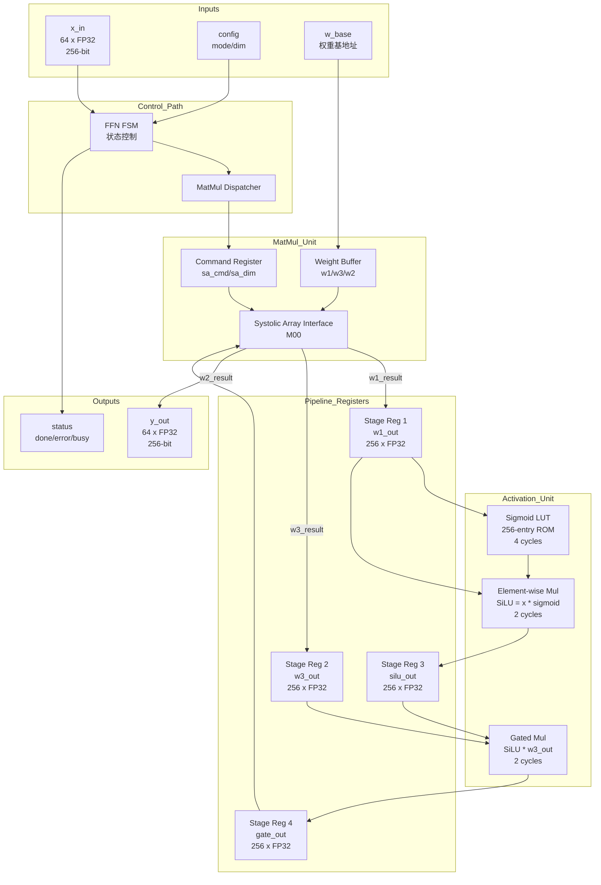

# Datapath Design - M10 FFN/MatMul Unit

## Overview

M10 FFN/MatMul Unit 负责 Transformer FFN 层计算和通用矩阵乘法操作，包含以下核心功能：

- **FFN Pipeline**: Feed-Forward Network 完整流水线 (SwiGLU 激活函数)
- **MatMul Dispatch**: 矩阵乘法指令分发到 Systolic Array (M00)
- **Activation Functions**: ReLU/GELU/SwiGLU 激活函数硬件实现

---

## Block Diagram (Mermaid)



---

## FFN Structure

### 1. FFN 层级结构

| Layer | Input Dim | Output Dim | Operation | 权重矩阵 |
|-------|-----------|------------|-----------|----------|
| Linear1 (w1) | 64 (dim) | 256 (hidden_dim) | Up-projection | W1 (256, 64) |
| Linear3 (w3) | 64 (dim) | 256 (hidden_dim) | Gate-projection | W3 (256, 64) |
| Activation | 256 | 256 | SwiGLU | - |
| Linear2 (w2) | 256 (hidden_dim) | 64 (dim) | Down-projection | W2 (64, 256) |

**FFN Expansion Ratio**: 4x (hidden_dim = 4 × dim)

### 2. SwiGLU 计算公式

$$\text{SwiGLU}(x) = \text{SiLU}(xW_1) \odot (xW_3) \cdot W_2$$

其中:
- $\text{SiLU}(x) = x \cdot \text{sigmoid}(x)$
- $\odot$ 表示逐元素乘法 (element-wise multiplication)

### 3. FFN Complete 流水线

| Stage | Operation | Latency (cycles) | Description |
|-------|-----------|------------------|-------------|
| Stage 1 | MatMul(w1) + MatMul(w3) | 256 | 并行执行两个矩阵乘法 |
| Stage 2 | Sigmoid(w1_out) | 4 | LUT lookup, 256 elements |
| Stage 3 | SiLU = w1_out * sigmoid_out | 2 | Element-wise multiplication |
| Stage 4 | Gate = silu_out * w3_out | 2 | Gated multiplication |
| Stage 5 | MatMul(w2, gate_out) | 64 | Down-projection |

**Total Latency**: 256 + 4 + 2 + 2 + 64 = 328 cycles (FFN Complete mode)

---

## MatMul Generic Interface

### 1. MatMul Operations

M10 支持 A × B 矩阵乘法的通用接口，通过 M00 Systolic Array 执行：

| Operation | A Matrix | B Matrix | Result | Dispatch Mode |
|-----------|----------|----------|--------|---------------|
| w1 MatMul | x (64,) | W1 (256, 64) | w1_out (256,) | Port 1 |
| w3 MatMul | x (64,) | W3 (256, 64) | w3_out (256,) | Port 2 (parallel) |
| w2 MatMul | gate (256,) | W2 (64, 256) | y (64,) | Port 1 (sequential) |
| Generic MatMul | A (m,) | B (n, m) | C (n,) | User-defined |

### 2. Batch Dimension Support

- **Batch Processing**: 支持批量输入 (batch_size × dim)
- **Dispatch Strategy**: 每个 batch 元素顺序发送到 Systolic Array
- **Performance**: batch_size × s_dim cycles (总延迟)

### 3. MatMul Command Interface

| Signal | Width | Description |
|--------|-------|-------------|
| sa_cmd | 4-bit | 命令类型 (CMD_MMUL = 0x1) |
| sa_dim | 16-bit | MatMul 维度参数 |
| sa_w_base | 32-bit | 权重矩阵基地址 |
| sa_w_row | 8-bit | 权重行索引 |
| sa_input | 256-bit | 输入向量 |
| sa_result | 256-bit | 输出结果 |
| sa_done | 1-bit | 完成标志 |

### 4. MatMul Dispatch Protocol

```wavedrom
{signal: [
  {name: 'clk', wave: 'p...........'},
  {name: 'start', wave: '0.1..0......'},
  {name: 'sa_cmd', wave: 'x.=.x.......', data: ['CMD_MMUL']},
  {name: 'sa_dim', wave: 'x.=.x.......', data: ['256']},
  {name: 'sa_w_base', wave: 'x.=.x.......', data: ['w1_addr']},
  {name: 'sa_input', wave: 'x.=.x.......', data: ['x_in']},
  {name: 'sa_done', wave: '0.....1.0...'},
  {name: 'sa_result', wave: 'x.....=.x..', data: ['w1_out']},
  {name: 'result_valid', wave: '0.....1.0..'}
]}
```

---

## Activation Functions

### 1. Activation Unit Architecture

| Component | Type | Latency | Precision | Description |
|-----------|------|---------|-----------|-------------|
| Sigmoid LUT | ROM | 4 cycles | FP32 | 256-entry lookup table |
| SiLU Multiplier | Pipelined Mul | 2 cycles | FP32 | x * sigmoid(x) |
| Gate Multiplier | Pipelined Mul | 2 cycles | FP32 | SiLU * w3_out |

### 2. Sigmoid LUT Design

**规格参数**:

| Parameter | Value | Description |
|-----------|-------|-------------|
| Depth | 256 entries | 覆盖输入范围 [-8, 8] |
| Width | 32-bit (FP32) | 或 16-bit (FP16) |
| Address Mapping | addr = (input + 8) × 16 | Quantization mapping |
| Content | sigmoid(x) = 1/(1+exp(-x)) | Pre-computed values |

**LUT Implementation**:

```
Input Range: [-8.0, 8.0]
Quantization: input × 16 + 128 → addr (0-255)
Precision: FP32 (或 FP16 for low-power mode)

Special Cases:
  - input > 8.0  → sigmoid ≈ 1.0
  - input < -8.0 → sigmoid ≈ 0.0
```

### 3. GELU Activation (Alternative)

M10 支持 GELU 激活函数作为可选配置：

| Mode | Implementation | Latency | Accuracy |
|------|----------------|---------|----------|
| GELU-Exact | Exact computation | 8 cycles | IEEE 754 |
| GELU-Approximate | Approximation formula | 4 cycles | < 0.1% error |

**GELU Approximate Formula**:

$$\text{GELU}(x) \approx 0.5x\left(1 + \tanh\left[\sqrt{\frac{2}{\pi}}(x + 0.044715x^3)\right]\right)$$

### 4. SiLU Activation (Default)

**SiLU (Swish) Formula**:

$$\text{SiLU}(x) = x \cdot \text{sigmoid}(x) = \frac{x}{1 + e^{-x}}$$

**Pipeline Implementation**:

| Stage | Operation | Cycles |
|-------|-----------|--------|
| Stage 1 | Sigmoid LUT lookup | 4 |
| Stage 2 | Multiplier (x * sigmoid) | 2 |

### 5. ReLU Activation

**ReLU Formula**:

$$\text{ReLU}(x) = \max(0, x)$$

**Implementation**: 简单比较器，1 cycle 延迟

---

## Pipeline Structure

### 1. FFN Complete Pipeline

```
Time (cycles):  0   256   260   262   264   328
                |    |     |     |     |     |
Input x    ---->|     |     |     |     |     |
                |     |     |     |     |     |
w1/w3 MM   =====>|-----|     |     |     |     |  (并行 256 cycles)
                |     |     |     |     |     |
w1_out     -----|---->|     |     |     |     |
w3_out     -----|---->|     |     |     |     |
                |     |     |     |     |     |
Sigmoid    -----|-----|====>|     |     |     |  (4 cycles)
                |     |     |     |     |     |
SiLU       -----|-----|-----|====>|     |     |  (2 cycles)
                |     |     |     |     |     |
Gate       -----|-----|-----|-----|====>|     |  (2 cycles)
                |     |     |     |     |     |
w2 MM      -----|-----|-----|-----|-----|====>|  (64 cycles)
                |     |     |     |     |     |
Output y   -----|-----|-----|-----|-----|---->|  (结果输出)
```

### 2. MatMul Only Pipeline

```
Input x    --> MatMul --> Output y
           (s_dim cycles)
```

**Latency**: s_dim + 2 cycles (包含握手开销)

### 3. Activation Only Pipeline

```
Input x    --> Sigmoid --> SiLU --> Gate --> Output y
           (4 cycles)  (2)     (2)
```

**Latency**: 10 cycles (纯激活函数模式)

### 4. Pipeline Registers

| Register | Width | Purpose | Clock Domain |
|----------|-------|---------|--------------|
| w1_out | 256 × 32-bit | Store w1 MatMul result | CLK_SYS |
| w3_out | 256 × 32-bit | Store w3 MatMul result | CLK_SYS |
| sigmoid_out | 256 × 32-bit | Store sigmoid LUT result | CLK_SYS |
| silu_out | 256 × 32-bit | Store SiLU computation | CLK_SYS |
| gate_out | 256 × 32-bit | Store gated result | CLK_SYS |
| y_out | 64 × 32-bit | Final output buffer | CLK_SYS |

---

## Interface with M00 Systolic Array

### 1. M00 Interface Signals

| Signal | Direction | Width | Description |
|--------|-----------|-------|-------------|
| sa_cmd_1 | output | 4 | Port 1 command (w1, w2) |
| sa_cmd_2 | output | 4 | Port 2 command (w3 parallel) |
| sa_dim_1 | output | 16 | Port 1 dimension |
| sa_dim_2 | output | 16 | Port 2 dimension |
| sa_w_base_1 | output | 32 | Port 1 weight base address |
| sa_w_base_2 | output | 32 | Port 2 weight base address |
| sa_input_1 | output | 256 | Port 1 input vector |
| sa_input_2 | output | 256 | Port 2 input vector (parallel) |
| sa_result_1 | input | 256 | Port 1 result |
| sa_result_2 | input | 256 | Port 2 result |
| sa_done_1 | input | 1 | Port 1 completion |
| sa_done_2 | input | 1 | Port 2 completion |
| sa_error | input | 1 | Systolic Array error flag |

### 2. Parallel MatMul Dispatch

**w1/w3 并行调度策略**:

| Phase | Port 1 | Port 2 | Timing |
|-------|--------|--------|--------|
| Phase 1 | w1 MatMul (256 cycles) | w3 MatMul (256 cycles) | Parallel execution |
| Phase 2 | Activation (SwiGLU) | Idle | 8 cycles |
| Phase 3 | w2 MatMul (64 cycles) | Idle | Sequential execution |

**优势**:
- w1 和 w3 并行执行，节省 256 cycles
- 总延迟从 584 cycles 降至 328 cycles
- 吞吐量提升 1.77x

### 3. M00 Command Types

| Command | Code | Description | Usage in M10 |
|---------|------|-------------|--------------|
| CMD_MMUL | 0x1 | Matrix-vector multiply | w1, w3, w2 dispatch |
| CMD_MLOAD | 0x2 | Pre-load weight row | Weight prefetch (optional) |
| CMD_MSET | 0x3 | Set dimension parameters | Configuration |

### 4. M00 Timing Constraints

| Constraint | Value | Description |
|------------|-------|-------------|
| Command valid to sa_start | 1 cycle | Dispatch latency |
| sa_done to result valid | 1 cycle | Result capture |
| Min MatMul latency | s_dim cycles | Hidden_dim = 256 cycles |
| Max MatMul latency | TIMEOUT_LIMIT | Error on timeout |

---

## Key Path Analysis

### 1. Critical Path

**FFN Complete Path**:

```
x_in → MatMul(w1/w3) → Sigmoid LUT → SiLU Mul → Gate Mul → MatMul(w2) → y_out
```

| Segment | Latency | Criticality |
|---------|---------|-------------|
| MatMul(w1/w3) | 256 cycles | Most significant |
| Sigmoid LUT | 4 cycles | Non-critical |
| SiLU Mul | 2 cycles | Non-critical |
| Gate Mul | 2 cycles | Non-critical |
| MatMul(w2) | 64 cycles | Secondary significant |

### 2. Timing Budget

| Parameter | Budget | Description |
|-----------|--------|-------------|
| Clock Frequency | 250-500 MHz | DVFS supported |
| Cycle Time | 2-4 ns | CLK_SYS period |
| Setup Margin | 0.2 ns | Timing slack |
| Hold Margin | 0.1 ns | Hold time requirement |

### 3. Optimization Opportunities

| Optimization | Gain | Implementation |
|--------------|------|----------------|
| w1/w3 Parallel | 256 cycles saved | Dual-port dispatch (已实现) |
| Sigmoid Pipeline | 4 cycles fixed | LUT pipelined (已实现) |
| SiLU+Gate Merge | 2 cycles saved | Combined multiplier (future) |
| w2 Prefetch | 10 cycles saved | Weight preload (optional) |

---

## Storage Resources

### 1. Sigmoid LUT ROM

| Parameter | Value |
|-----------|-------|
| Type | ROM (Read-only) |
| Depth | 256 entries |
| Width | 32-bit (FP32) |
| Ports | 1-read |
| Address Calculation | addr = quantize(input × 16 + 128) |

### 2. Pipeline Buffers

| Buffer | Type | Depth | Width | Purpose |
|--------|------|-------|-------|---------|
| w1_buf | Register Array | 256 | 32-bit | w1 MatMul result |
| w3_buf | Register Array | 256 | 32-bit | w3 MatMul result |
| sigmoid_buf | Register Array | 256 | 32-bit | Sigmoid output |
| silu_buf | Register Array | 256 | 32-bit | SiLU output |
| gate_buf | Register Array | 256 | 32-bit | Gated result |
| y_buf | Register Array | 64 | 32-bit | Final output |

---

## Verification Requirements

### 1. Datapath Test Cases

| Test Case | Description | Coverage Target |
|-----------|-------------|-----------------|
| FFN Complete | Full pipeline correctness | 100% functional |
| MatMul Dispatch | M00 interface timing | 100% protocol |
| Activation Accuracy | Sigmoid/GELU/SiLU precision | < 0.1% error |
| Parallel Execution | w1/w3 timing verification | 100% concurrency |
| Backpressure | Output stall handling | FIFO behavior |

### 2. Timing Verification

| Check | Requirement |
|-------|-------------|
| Systolic Array handshake | Setup/hold timing met |
| Pipeline register timing | No skew violations |
| Clock domain crossing | CDC stability verified |

---

## Summary

| Metric | Value | Note |
|--------|-------|------|
| FFN Latency | 328 cycles | Complete pipeline |
| MatMul Latency | s_dim cycles | Generic mode |
| Activation Latency | 8 cycles | SwiGLU |
| Parallelism | w1/w3 concurrent | 1.77x throughput gain |
| Storage | 256-entry LUT + 5 buffers | ROM + Register arrays |
| M00 Interface | Dual-port | Parallel dispatch support |

---

## References

- [M10 MAS.md](./MAS.md) - Module Architecture Specification
- [M10 FSM.md](./FSM.md) - FSM Specification
- [M00 Datapath](../M00/datapath.md) - Systolic Array Datapath
- [MatMul Operator](../../doc/operators/matmul.md) - MatMul algorithm
- [SwiGLU Operator](../../doc/operators/swiglu.md) - SwiGLU definition