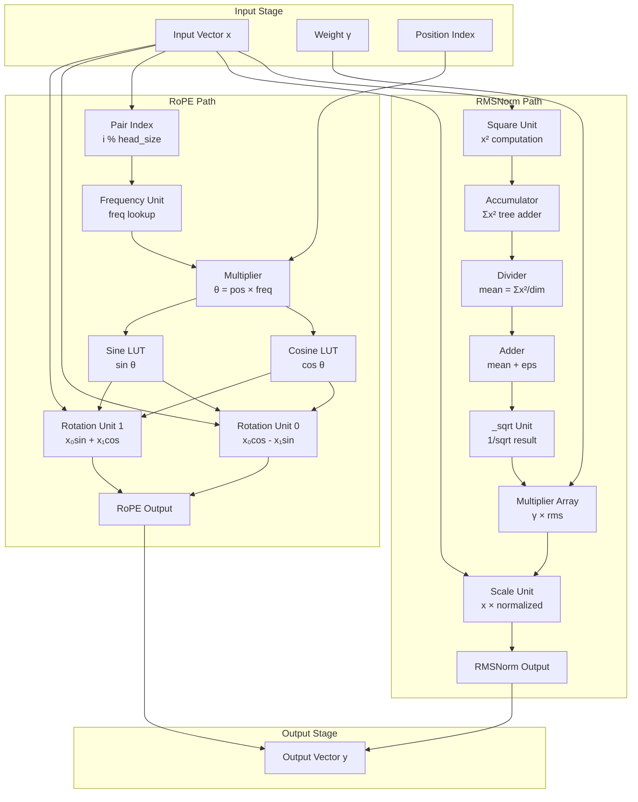

# Datapath Design - M11 RMSNorm/RoPE Unit

## Overview

M11 RMSNorm/RoPE Unit datapath 实现 Transformer 核心算子的硬件加速。包含两条独立计算路径：
- **RMSNorm Path**: Root Mean Square Normalization，用于 Layer Input 和 Attention Preprocess
- **RoPE Path**: Rotary Position Embedding，用于 Q/K 向量位置编码注入

### Design Parameters

| Parameter | Value | Description |
|-----------|-------|-------------|
| Vector Dimension | 64 | dim (stories260K) |
| Head Size | 8 | head_size = dim/n_heads |
| Precision | FP16/FP32 | 可配置精度 |
| Epsilon | 1e-5 | RMSNorm 防止除零 |
| RoPE Base | 10000 | 位置编码基数 |
| Max Seq Length | 1024 | 支持最大序列长度 |

## Block Diagram (Mermaid)



## RMSNorm Datapath

### 3.1 Algorithm

RMSNorm 公式：

$$y_i = \gamma_i \cdot \frac{x_i}{\sqrt{\frac{1}{n}\sum_{j=1}^{n} x_j^2 + \epsilon}}$$

分解为两步：
1. **RMS 计算**: `rms = 1/sqrt(mean(x²) + eps)`
2. **归一化缩放**: `y = γ × x × rms`

### 3.2 Datapath Components

#### 3.2.1 Square Unit

| Component | Description |
|-----------|-------------|
| Function | 计算输入向量平方 `x²` |
| Parallelism | 64 个并行乘法器 |
| Latency | 1 cycle |
| Input | `x[0..63]` |
| Output | `x_sq[0..63]` |

```verilog
// Square Unit - parallel multipliers
for (i = 0; i < 64; i++) {
    x_sq[i] = x[i] * x[i];  // FP16/FP32 multiply
}
```

#### 3.2.2 Accumulator (Tree Adder)

| Component | Description |
|-----------|-------------|
| Function | 计算平方和 `Σx²` |
| Structure | 7-level tree adder (64→32→16→8→4→2→1) |
| Latency | 7 cycles (tree depth) |
| Input | `x_sq[0..63]` |
| Output | `ss` (sum of squares) |

Tree Adder 结构：
```
Level 0: 64 inputs → 32 partial sums
Level 1: 32 → 16
Level 2: 16 → 8
Level 3: 8 → 4
Level 4: 4 → 2
Level 5: 2 → 1
Level 6: Final sum → ss
```

#### 3.2.3 Divider (Mean Computation)

| Component | Description |
|-----------|-------------|
| Function | `mean = ss / dim` |
| Implementation | 右移 6 位 (dim=64, log2(64)=6) |
| Latency | 1 cycle (shift) |
| Precision | FP16/FP32 |

对于 dim=64，除法简化为右移：
```verilog
mean = ss >> 6;  // equivalent to ss / 64
```

#### 3.2.4 Epsilon Adder

| Component | Description |
|-----------|-------------|
| Function | `mean_eps = mean + 1e-5` |
| Implementation | FP 加法器 |
| Latency | 1 cycle |
| Constant | eps = 1e-5 (pre-stored) |

#### 3.2.5 _sqrt Unit

| Component | Description |
|-----------|-------------|
| Function | `rms = 1/sqrt(mean_eps)` |
| Implementation | Newton-Raphson iteration 或 LUT |
| Latency | 3-4 cycles (N-R) 或 1 cycle (LUT) |
| Options | LUT (fast) 或 Iterative (accurate) |

**Newton-Raphson Method**:
```
y₀ = LUT approximation
y₁ = y₀(3 - x·y₀²) / 2
y₂ = y₁(3 - x·y₁²) / 2  // 2 iterations sufficient
```

#### 3.2.6 Multiplier Array (Scale Weight)

| Component | Description |
|-----------|-------------|
| Function | `scale_factor = γ × rms` |
| Parallelism | 64 个并行乘法器 |
| Latency | 1 cycle |
| Input | `γ[0..63]`, `rms` |

#### 3.2.7 Scale Unit

| Component | Description |
|-----------|-------------|
| Function | `y = x × scale_factor` |
| Parallelism | 64 个并行乘法器 |
| Latency | 1 cycle |
| Input | `x[0..63]`, `scale_factor[0..63]` |
| Output | `y[0..63]` |

### 3.3 RMSNorm Pipeline

```mermaid
gantt
    title RMSNorm Pipeline Timing (dim=64)
    dateFormat X
    axisFormat %s
    
    section Stage 1
    Square (x²) :0, 1
    
    section Stage 2-8
    Tree Adder :1, 7
    
    section Stage 9
    Mean (shift) :8, 1
    
    section Stage 10
    Add eps :9, 1
    
    section Stage 11-14
    sqrt/inv :10, 4
    
    section Stage 15
    Scale γ :14, 1
    
    section Stage 16
    Output :15, 1
```



**Total Latency**: ~16 cycles (RMSNorm 单次执行)

### 3.4 FLOP Analysis

| Operation | Count (dim=64) | FLOPs |
|-----------|----------------|-------|
| Square | 64 | 64 mul |
| Sum | 63 | 63 add |
| Divide | 1 | 1 shift |
| Add eps | 1 | 1 add |
| sqrt | 1 | ~4 ops (N-R) |
| Scale γ | 64 | 64 mul |
| Normalize | 64 | 64 mul |
| **Total** | | **~260 FLOPs** |

## RoPE Datapath

### 4.1 Algorithm

RoPE 旋转位置编码：

$$\theta_i = \text{position} \times \frac{1}{10000^{i/d}}$$

$$\begin{bmatrix} y_{2i} \\ y_{2i+1} \end{bmatrix} = \begin{bmatrix} \cos\theta_i & -\sin\theta_i \\ \sin\theta_i & \cos\theta_i \end{bmatrix} \begin{bmatrix} x_{2i} \\ x_{2i+1} \end{bmatrix}$$

即 pair-wise 旋转：
- `y₀ = x₀×cosθ - x₁×sinθ`
- `y₁ = x₀×sinθ + x₁×cosθ`

### 4.2 Datapath Components

#### 4.2.1 Position Index Generator

| Component | Description |
|-----------|-------------|
| Function | 生成 pair index `i % head_size` |
| Implementation | Counter + modulo |
| Output | `pair_idx` (0-7 循环) |
| Range | 32 pairs for dim=64 |

#### 4.2.2 Frequency LUT

| Component | Description |
|-----------|-------------|
| Function | 存储预计算频率 |
| Size | 8 entries (head_size=8) |
| Values | `1/10000^(i/head_size)` |
| Latency | 1 cycle (read) |

**Frequency Table (head_size=8)**:

| idx | freq | Value |
|-----|------|-------|
| 0 | 10000⁰ | 1.0000 |
| 1 | 10000⁻¹/⁸ | 0.3162 |
| 2 | 10000⁻²/⁸ | 0.1000 |
| 3 | 10000⁻³/⁸ | 0.0316 |
| 4 | 10000⁻⁴/⁸ | 0.0100 |
| 5 | 10000⁻⁵/⁸ | 0.0032 |
| 6 | 10000⁻⁶/⁸ | 0.0010 |
| 7 | 10000⁻⁷/⁸ | 0.0003 |

#### 4.2.3 Angle Multiplier

| Component | Description |
|-----------|-------------|
| Function | `θ = pos × freq` |
| Implementation | FP multiplier |
| Latency | 1 cycle |
| Input | `pos` (position), `freq` (from LUT) |

#### 4.2.4 Trigonometric LUT

| Component | Description |
|-----------|-------------|
| Function | cos/sin 查表 |
| Size | 1024 × 8 × 2 = 16KB |
| Address | `(pos × freq) normalized` |
| Latency | 1 cycle |

**LUT Organization**:
- 1024 positions × 8 frequencies × 2 (cos, sin)
- 可以预计算完整表，存储于 SRAM
- 或动态计算 cos/sin (CORDIC)

#### 4.2.5 Rotation Unit (Complex Multiplier)

| Component | Description |
|-----------|-------------|
| Function | 2D rotation matrix乘法 |
| Parallelism | 32 pairs (dim/2) |
| Operations | 4 mul + 2 add per pair |
| Latency | 2 cycles |

**Rotation Computation**:
```verilog
// For each pair (x[i], x[i+1]):
y[i]   = x[i] * cos - x[i+1] * sin;
y[i+1] = x[i] * sin + x[i+1] * cos;
```

### 4.3 RoPE Pipeline

```mermaid
gantt
    title RoPE Pipeline Timing (dim=64)
    dateFormat X
    axisFormat %s
    
    section Stage 1
    Index Compute :0, 1
    
    section Stage 2
    Frequency LUT :1, 1
    
    section Stage 3
    Angle θ :2, 1
    
    section Stage 4
    Cos/Sin LUT :3, 1
    
    section Stage 5-6
    Rotation (32 pairs) :4, 2
    
    section Stage 7
    Output :6, 1
```



**Total Latency**: ~7 cycles (RoPE 单次执行)

### 4.4 Memory Footprint

| Storage | Size | Description |
|---------|------|-------------|
| Frequency LUT | 8 × FP16 = 16 B | 固定频率表 |
| Cos/Sin LUT | 1024 × 8 × 2 × FP16 = 32 KB | 完整表 (可选) |
| Dynamic CORDIC | 0 | 不存储表时使用 |

### 4.5 FLOP Analysis

| Operation | Count (dim=64) | FLOPs |
|-----------|----------------|-------|
| Index compute | 32 | 32 mod |
| Angle multiply | 32 | 32 mul |
| Cos/Sin | 32 × 2 | 64 ops (LUT 或 CORDIC) |
| Rotation mul | 32 × 4 | 128 mul |
| Rotation add | 32 × 2 | 64 add |
| **Total** | | **~400 FLOPs** |

## Shared Resources

### 5.1 Multiplier Pool

| Resource | Count | Usage |
|----------|-------|-------|
| FP16 Mul | 128 | RMSNorm 64 + RoPE 64 |
| FP32 Mul | 64 | 可配置精度 |
| Sharing | Yes | 两路径时分复用 |

### 5.2 Adder Tree

| Resource | Description |
|----------|-------------|
| Tree Depth | 7 levels |
| Adders | 63 FP adders |
| Reuse | RMSNorm only |

### 5.3 LUT Storage

| LUT | Location | Size |
|-----|----------|------|
| Frequency | Internal | 16 B |
| Cos/Sin | M02 SRAM | 32 KB (optional) |
| _sqrt | Internal | 256 B (8-bit index) |

## Datapath Configuration

### 6.1 Precision Modes

| Mode | Precision | Throughput | Power |
|------|-----------|------------|-------|
| FP16 | 16-bit | Higher | Lower |
| FP32 | 32-bit | Lower | Higher |
| Mixed | FP16 input, FP32 acc | Balanced | Medium |

### 6.2 Operation Modes

| op_type | Operation | Description |
|---------|-----------|-------------|
| 0 | RMSNorm only | Single operator |
| 1 | RoPE only | Single operator |
| 2 | Combined | RMSNorm → RoPE sequence |
| 3 | Reserved | - |

### 6.3 Combined Operation Flow

当 `op_type = 2` (Combined):


**Combined Latency**: RMSNorm (16 cycles) + Buffer (2 cycles) + RoPE (7 cycles) = **25 cycles**

## Timing Summary

### 7.1 Operator Latency

| Operator | Cycles | @ 500 MHz | Notes |
|----------|--------|-----------|-------|
| RMSNorm | 16 | 32 ns | Full pipeline |
| RoPE | 7 | 14 ns | 32 pairs parallel |
| Combined | 25 | 50 ns | Sequential |

### 7.2 Throughput

| Metric | Value | Calculation |
|--------|-------|-------------|
| RMSNorm ops/s | 31.25 M | 500 MHz / 16 cycles |
| RoPE ops/s | 71.4 M | 500 MHz / 7 cycles |
| Per forward | 5 + 10 | 5 RMSNorm + 10 RoPE |
| Forward time | ~0.5 µs | (5×16 + 10×7) × 2 ns |

## Optimization Opportunities

### 8.1 RMSNorm Optimizations

| Technique | Benefit | Cost |
|-----------|---------|------|
| sqrt LUT | 3 cycles saved | 256 B storage |
| Fused γ×rms | 1 cycle saved | Control complexity |
| FP16 mode | 2× throughput | Precision loss |

### 8.2 RoPE Optimizations

| Technique | Benefit | Cost |
|-----------|---------|------|
| Pre-compute cos/sin | 1 cycle saved | 32 KB SRAM |
| CORDIC | Storage saved | 8 cycles added |
| Parallel pairs | 32× parallelism | 128 multipliers |

### 8.3 Area-Power Tradeoff

| Configuration | Area | Power | Latency |
|---------------|------|-------|---------|
| Minimal | Small | Low | High |
| Balanced | Medium | Medium | 16/7 cycles |
| Maximum | Large | High | Lower |

## Design Verification Checklist

- [ ] Square unit output matches x²
- [ ] Tree adder produces correct sum
- [ ] sqrt unit accuracy within tolerance
- [ ] Scale output y = γ × x × rms
- [ ] Frequency LUT values correct
- [ ] Rotation output matches 2D rotation
- [ ] Combined mode sequence correct
- [ ] FP16/FP32 precision modes work
- [ ] Pipeline timing meets specification