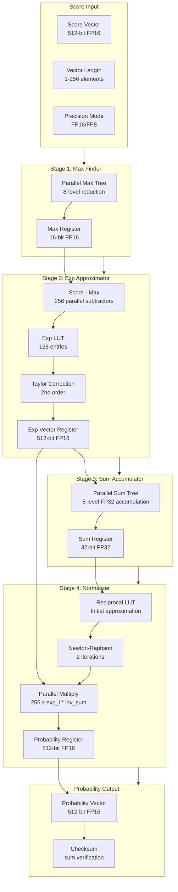
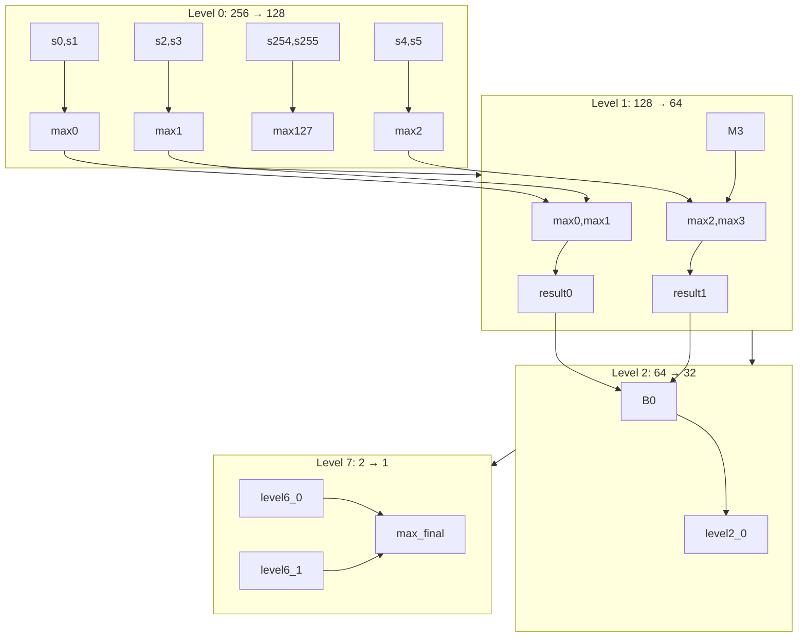
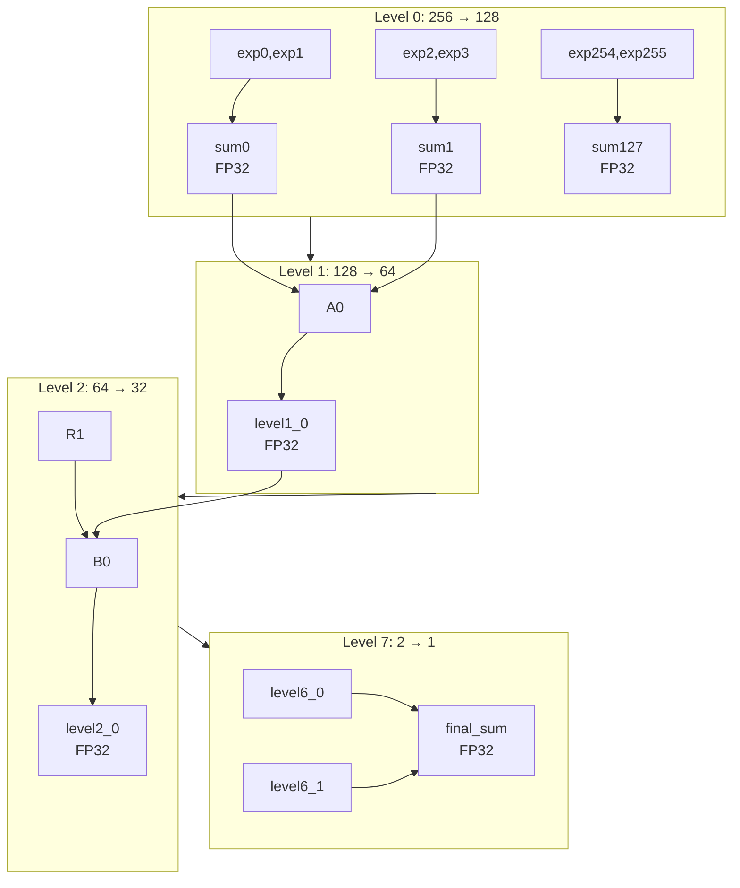
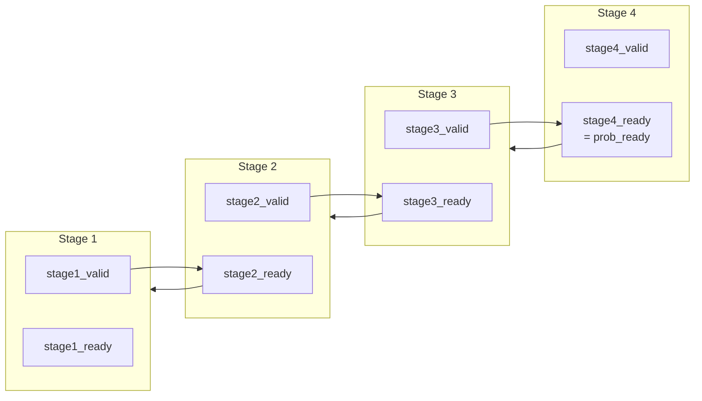
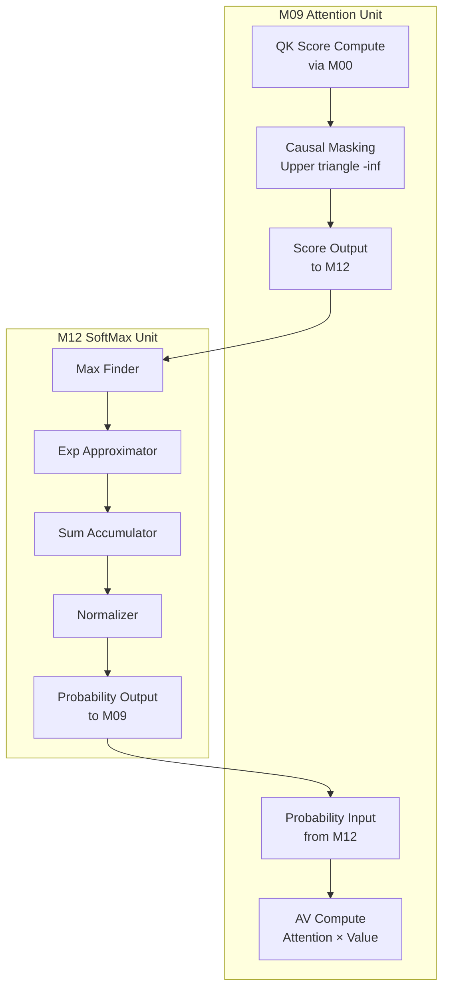

# Datapath Design - M12 SoftMax Unit

## 1. Overview

M12 SoftMax Unit Datapath 实现 Numerically Stable SoftMax 计算，采用 4-Stage Pipeline 架构，支持 Causal Masking 和多精度模式（FP16/FP8）。核心数据通路包括 Max Finder（并行树结构）、Exponential Approximator（LUT+Taylor 混合）、Sum Accumulator（并行累加树）和 Normalizer（Newton-Raphson 除法）。

### 1.1 Datapath Key Features

| Feature | Description | Performance |
|---------|-------------|-------------|
| Numerical Stability | Max subtraction before exp | Overflow prevention |
| Max Finder Tree | Parallel 8-level tree | log2(256) = 8 cycles |
| Hybrid Exp Approximation | LUT + Taylor correction | < 0.02% error, 2 cycles |
| Parallel Sum Tree | 8-level adder tree | log2(256) = 8 cycles |
| Newton-Raphson Division | 2-3 iterations | < 0.1% error, 3 cycles |
| Precision Accumulator | FP32 internal for FP16 | Precision retention |

### 1.2 SoftMax Mathematical Flow

```
SoftMax(x_i) = exp(x_i - max(x)) / sum(exp(x_j - max(x)))

Pipeline Stages:
  Stage 1: max(x) = max(scores)         -- Numerical stability
  Stage 2: exp_i = exp(score_i - max)   -- Safe range [-8, 0]
  Stage 3: sum = sum(exp_vec)           -- Parallel accumulation
  Stage 4: prob_i = exp_i / sum         -- Normalization
```

## 2. Block Diagram

### 2.1 Top-Level Datapath



### 2.2 Pipeline Timing Diagram

```
Cycle: | 0 | 1 | 2 | 3 | 4 | 5 | 6 | 7 | 8 | 9 |10 |11 |12 |13 |14 |15 |16 |17 |18 |19 |20 |21 |
-------|---|---|---|---|---|---|---|---|---|---|---|---|---|---|---|---|---|---|---|---|---|---|
Stage1: |--[Max Tree Level 0-7]-----------|--|
        | 256->128->64->32->16->8->4->2->1 |
Stage2: |                                  |--[LUT+Taylor]--|
        |                                    Cycle 9-10   |
Stage3: |                                      |--[Sum Tree Level 0-7]-----------|--|
        |                                        256->128->64->32->16->8->4->2->1 |
Stage4: |                                          |                                  |--[NR+Norm]---|--|
        |                                            Cycle 18-19: NR iterations       Cycle 20-21   |
Output: |                                            |                                  |              |--[Valid]--|
        |                                              prob_valid asserted at cycle 21

Total Pipeline Latency: 21 cycles (typical)
```

## 3. Numerical Stability Techniques

### 3.1 Max Subtraction Strategy

| Technique | Purpose | Implementation |
|-----------|---------|----------------|
| Max Pre-subtraction | Prevent exp overflow | Stage 1 finds max, Stage 2 subtracts before exp |
| Safe Input Range | Clamp to [-8, 0] | exp(-8) ≈ 0.000335, guaranteed non-overflow |
| Max as Reference | exp(max - max) = 1 | At least one element = 1, sum >= 1 |

**Numerical Stability Analysis**:

```
Without Max Subtraction:
  exp(large_value) -> overflow (FP16 max ≈ 65504)
  
With Max Subtraction:
  shifted_values = scores - max(scores)
  shifted_range: [-max_diff, 0] where max_diff <= 8 (clamped)
  exp(shifted_values): [exp(-8), exp(0)] = [0.000335, 1]
  
Result:
  - No overflow guaranteed
  - Sum >= 1 (at least exp(max-max) = exp(0) = 1)
  - Division always valid (non-zero denominator)
```

### 3.2 Precision Retention

| Conversion | Stage | Width | Purpose |
|------------|-------|-------|---------|
| FP16 Input → FP16 | Input | 16-bit | Original scores |
| FP16 Max → FP16 | Stage 1 | 16-bit | Max value |
| FP16 Shifted → FP16 | Stage 2 | 16-bit | shifted scores |
| FP16 Exp → FP32 | Stage 3 | 32-bit | Precision accumulation |
| FP32 Sum → FP32 | Stage 3-4 | 32-bit | Division precision |
| FP16 × FP32 → FP16 | Stage 4 | 16-bit | Output quantization |

**FP32 Accumulator Benefit**:

```
FP16 Sum Accumulation (256 elements):
  - FP16 precision: ~3 decimal digits
  - Accumulation error grows with N
  - 256 × FP16 additions: ~0.5% error
  
FP32 Accumulator:
  - FP32 precision: ~7 decimal digits
  - Accumulation error negligible
  - 256 × FP16 inputs → FP32 accumulator: < 0.01% error
```

### 3.3 Overflow/Underflow Detection

| Condition | Threshold | Action |
|-----------|-----------|--------|
| Input Overflow | > FP16_MAX (65504) | Saturate + flag |
| Exp Overflow | > FP16_MAX | Saturate + flag |
| Exp Underflow | < FP16_MIN (6e-5) | Saturate to 0 |
| Sum Zero | = 0 | Error flag + bypass |
| Division Error | inv_sum = inf | Error flag |

## 4. Pipeline Stage Datapath

### 4.1 Stage 1: Max Finder

#### 4.1.1 Max Finder Tree Structure



#### 4.1.2 Max Finder Datapath Parameters

| Parameter | Value | Description |
|-----------|-------|-------------|
| Input Width | 512 bits | 256 × 16-bit FP16 |
| Comparator Count | 255 | Tree reduction (256→1) |
| Comparator Width | 16 bits | FP16 comparison |
| Tree Depth | 8 levels | log2(256) levels |
| Pipeline Registers | 8 | One per level |
| Output Width | 16 bits | max_val (FP16) |

#### 4.1.3 Max Comparator Datapath

```verilog
// FP16 Max Comparator Datapath
module fp16_max_comparator (
    input  logic [15:0] a,        // FP16 input A
    input  logic [15:0] b,        // FP16 input B
    output logic [15:0] max_out   // FP16 max output
);

    // FP16 comparison (IEEE 754 half-precision)
    // Sign bit: [15], Exponent: [14:10], Mantissa: [9:0]
    
    logic a_is_nan, b_is_nan;
    logic a_sign, b_sign;
    logic [4:0] a_exp, b_exp;
    logic [9:0] a_man, b_man;
    logic a_greater;
    
    // NaN detection
    assign a_is_nan = (a_exp == 5'b11111) && (a_man != 0);
    assign b_is_nan = (b_exp == 5'b11111) && (b_man != 0);
    
    // Sign extraction
    assign a_sign = a[15];
    assign b_sign = b[15];
    
    // Exponent and mantissa
    assign a_exp = a[14:10];
    assign b_exp = b[14:10];
    assign a_man = a[9:0];
    assign b_man = b[9:0];
    
    // Comparison logic (FP16 specific)
    // Positive numbers: larger exp/man = larger value
    // Negative numbers: larger exp/man = smaller value
    
    always_comb begin
        if (a_is_nan) max_out = b;  // NaN propagates
        else if (b_is_nan) max_out = a;
        else if (a_sign != b_sign) begin
            // Different signs: positive > negative
            max_out = a_sign ? b : a;  // If a is negative, b is max
        end else begin
            // Same sign: compare exponent and mantissa
            if (a_sign) begin  // Both negative
                // For negative, smaller absolute value is larger
                if ({a_exp, a_man} < {b_exp, b_man}) max_out = a;
                else max_out = b;
            end else begin  // Both positive
                // For positive, larger absolute value is larger
                if ({a_exp, a_man} > {b_exp, b_man}) max_out = a;
                else max_out = b;
            end
        end
    end
    
endmodule
```

#### 4.1.4 Max Finder Timing

| Level | Cycle | Operation | Output Count |
|-------|-------|-----------|--------------|
| Level 0 | 1 | 256 inputs → 128 comparisons | 128 max values |
| Level 1 | 2 | 128 → 64 comparisons | 64 max values |
| Level 2 | 3 | 64 → 32 comparisons | 32 max values |
| Level 3 | 4 | 32 → 16 comparisons | 16 max values |
| Level 4 | 5 | 16 → 8 comparisons | 8 max values |
| Level 5 | 6 | 8 → 4 comparisons | 4 max values |
| Level 6 | 7 | 4 → 2 comparisons | 2 max values |
| Level 7 | 8 | 2 → 1 comparison | 1 final max |

### 4.2 Stage 2: Exponential Approximator

#### 4.2.1 Exp Approximation Block Diagram

```mermaid
graph TB
    subgraph INPUT["Input Processing"]
        SCORE[score_i<br/>FP16]
        MAX[max_val<br/>FP16]
        SUB[Subtractor<br/>score_i - max_val]
        CLAMP[Clamp Logic<br/>[-8, 0]]
    end
    
    subgraph LUT["LUT Approximation"]
        ADDR[LUT Address<br/>Calculation]
        TABLE[Exp LUT<br/>128 entries]
        BASE[exp_base<br/>FP16]
        BASE_NEXT[exp_next<br/>FP16]
    end
    
    subgraph INTERP["Linear Interpolation"]
        FRAC[Fractional Part<br/>extraction]
        INTERP_LIN[Linear Interp<br/>base + frac × delta]
    end
    
    subgraph TAYLOR["Taylor Correction"]
        RESIDUAL[Residual<br/>x - lut_base_x]
        TAYLOR_EXP[taylor_correction<br/>1 + r + r²/2]
    end
    
    subgraph OUTPUT["Final Output"]
        FINAL[exp_result<br/>interpolated × taylor_corr]
        EXP_OUT[exp_i<br/>FP16]
    end
    
    SCORE --> SUB
    MAX --> SUB
    SUB --> CLAMP
    CLAMP --> ADDR
    CLAMP --> RESIDUAL
    ADDR --> TABLE
    TABLE --> BASE
    TABLE --> BASE_NEXT
    BASE --> INTERP_LIN
    BASE_NEXT --> INTERP_LIN
    ADDR --> FRAC
    FRAC --> INTERP_LIN
    INTERP_LIN --> FINAL
    RESIDUAL --> TAYLOR_EXP
    TAYLOR_EXP --> FINAL
    FINAL --> EXP_OUT
```

#### 4.2.2 LUT Configuration

| Parameter | Value | Description |
|-----------|-------|-------------|
| LUT Entries | 128 | Default, configurable 16-256 |
| Input Range | [-8, 0] | Normalized shifted scores |
| Address Width | 7 bits | log2(128) |
| Entry Width | 16 bits | FP16 exp value |
| Total LUT Size | 2 KB | 128 × 16 bits |

**LUT Address Calculation**:

```
Input: shifted_value ∈ [-8, 0]

Address Mapping:
  addr = floor((shifted_value + 8) / 8 × 127)
  addr = clamp(addr, 0, 127)

Example:
  shifted_value = -8 → addr = 0 → exp = exp(-8) ≈ 0.000335
  shifted_value = -4 → addr = 63 → exp = exp(-4) ≈ 0.0183
  shifted_value = 0 → addr = 127 → exp = exp(0) = 1
```

#### 4.2.3 Linear Interpolation

```verilog
// Linear Interpolation between LUT entries
module lut_interpolation (
    input  logic [6:0]   lut_addr,      // Base LUT address
    input  logic [15:0]  exp_base,      // LUT[addr]
    input  logic [15:0]  exp_next,      // LUT[addr+1]
    input  logic [7:0]   frac_part,     // Fractional part (8-bit)
    output logic [15:0]  exp_interp     // Interpolated exp
);

    logic [15:0] delta;
    logic [23:0] interp_product;
    
    // Delta between consecutive LUT entries
    assign delta = exp_next - exp_base;
    
    // Linear interpolation: exp_base + frac × delta
    // frac_part is 8-bit fixed point (0-255 representing 0-1)
    assign interp_product = delta * frac_part;  // 24-bit product
    assign exp_interp = exp_base + (interp_product >> 8);  // Scale back
    
endmodule
```

#### 4.2.4 Taylor Expansion Correction

| Order | Formula | Error | Hardware |
|-------|---------|-------|----------|
| 1st | 1 + x | ~10% | 1 adder |
| 2nd | 1 + x + x²/2 | ~1% | 1 multiplier, 1 adder |
| 3rd | 1 + x + x²/2 + x³/6 | ~0.1% | 2 multipliers, 2 adders |
| 4th | 1 + x + x²/2 + x³/6 + x⁴/24 | ~0.01% | 3 multipliers, 3 adders |

**M12 Default: 2nd Order Taylor**:

```verilog
// 2nd Order Taylor Correction
module taylor_correction (
    input  logic [15:0]  residual,      // x - lut_base_x
    output logic [15:0]  taylor_factor   // Correction factor
);

    logic [15:0] residual_sq;
    logic [15:0] half_residual_sq;
    logic [15:0] one_fp16;
    
    // Pre-computed constants
    assign one_fp16 = 16'h3C00;  // FP16 = 1.0
    
    // residual² / 2
    // Using FP16 multiplier
    fp16_multiplier u_mul (
        .a(residual),
        .b(residual),
        .product(residual_sq)
    );
    
    // Divide by 2 (shift or subtract exponent)
    // FP16: dividing by 2 = subtract 1 from exponent
    assign half_residual_sq = {residual_sq[15], residual_sq[14:10] - 5'd1, residual_sq[9:0]};
    
    // Taylor: 1 + residual + residual²/2
    fp16_adder u_add1 (
        .a(one_fp16),
        .b(residual),
        .sum(taylor_factor_temp)
    );
    
    fp16_adder u_add2 (
        .a(taylor_factor_temp),
        .b(half_residual_sq),
        .sum(taylor_factor)
    );
    
endmodule
```

#### 4.2.5 Hybrid Approximation Accuracy

| Method | Latency | Area | Max Error | Typical Error |
|--------|---------|------|-----------|---------------|
| LUT Only | 1 cycle | Medium | 0.05% | 0.02% |
| Taylor 2nd | 1 cycle | Small | 1% | 0.5% |
| Taylor 4th | 2 cycles | Small | 0.01% | 0.005% |
| **Hybrid** | 2 cycles | Medium | **0.02%** | **0.01%** |

### 4.3 Stage 3: Sum Accumulator

#### 4.3.1 Sum Accumulator Tree Structure



#### 4.3.2 FP32 Adder Datapath

```verilog
// FP32 Adder for Sum Accumulation
module fp32_adder_tree (
    input  logic [31:0] exp_vec [0:255],  // 256 FP16 exp values
    output logic [31:0] sum_out           // FP32 sum
);

    // Internal FP32 representation
    logic [31:0] level0 [0:127];
    logic [31:0] level1 [0:63];
    logic [31:0] level2 [0:31];
    logic [31:0] level3 [0:15];
    logic [31:0] level4 [0:7];
    logic [31:0] level5 [0:3];
    logic [31:0] level6 [0:1];
    
    // FP16 to FP32 conversion (parallel)
    logic [31:0] fp32_vec [0:255];
    
    always_comb begin
        for (int i = 0; i < 256; i++) begin
            fp32_vec[i] = fp16_to_fp32(exp_vec[i]);
        end
    end
    
    // Level 0: 256 FP32 inputs -> 128 additions
    always_comb begin
        for (int i = 0; i < 128; i++) begin
            level0[i] = fp32_add(fp32_vec[2*i], fp32_vec[2*i+1]);
        end
    end
    
    // Level 1: 128 -> 64
    always_comb begin
        for (int i = 0; i < 64; i++) begin
            level1[i] = fp32_add(level0[2*i], level0[2*i+1]);
        end
    end
    
    // ... Levels 2-6 similarly
    
    // Level 7: 2 -> 1 (final sum)
    assign sum_out = fp32_add(level6[0], level6[1]);
    
endmodule
```

#### 4.3.3 Precision Handling

| Precision Mode | Input | Accumulator | Output | Precision Loss |
|----------------|-------|-------------|--------|----------------|
| FP16 | FP16 | FP32 | FP32 | < 0.01% |
| FP8 E4M3 | FP8 | FP16 | FP16 | < 0.5% |
| FP8 E5M2 | FP8 | FP16 | FP16 | < 0.5% |

**FP16 → FP32 Conversion**:

```verilog
// FP16 to FP32 Conversion
function automatic [31:0] fp16_to_fp32;
    input logic [15:0] fp16_in;
    
    logic sign;
    logic [4:0] exp_fp16;
    logic [9:0] man_fp16;
    logic [7:0] exp_fp32;
    logic [22:0] man_fp32;
    
    sign = fp16_in[15];
    exp_fp16 = fp16_in[14:10];
    man_fp16 = fp16_in[9:0];
    
    // Special cases
    if (exp_fp16 == 0) begin
        // Zero or denormal
        if (man_fp16 == 0) begin
            // Zero
            fp16_to_fp32 = {sign, 31'b0};
        end else begin
            // Denormal: convert to FP32 normal
            // Requires normalization
            fp16_to_fp32 = fp16_denormal_to_fp32(fp16_in);
        end
    end else if (exp_fp16 == 31) begin
        // Inf or NaN
        fp16_to_fp32 = {sign, 8'hFF, man_fp16 == 0 ? 22'b0 : {22'b0, |man_fp16}};
    end else begin
        // Normal number
        // FP16 bias: 15, FP32 bias: 127
        exp_fp32 = exp_fp16 + 127 - 15;  // Bias adjustment
        man_fp32 = {man_fp16, 13'b0};    // Mantissa extension
        fp16_to_fp32 = {sign, exp_fp32, man_fp32};
    end
    
endfunction
```

### 4.4 Stage 4: Normalizer

#### 4.4.1 Newton-Raphson Division Block Diagram

```mermaid
graph TB
    subgraph INPUT["Division Input"]
        SUM[sum_val<br/>FP32]
        EXP_VEC[exp_vec<br/>256 × FP16]
    end
    
    subgraph RECIP["Reciprocal Approximation"]
        RECIP_LUT[Reciprocal LUT<br/>Initial 1/sum]
        INIT_INV[inv_init<br/>FP32]
    end
    
    subgraph NR1["Newton-Raphson Iteration 1"]
        MUL1A[sum × inv_init]
        SUB1[2 - mul1a]
        MUL1B[inv_init × sub1]
        INV1[inv_1<br/>FP32]
    end
    
    subgraph NR2["Newton-Raphson Iteration 2"]
        MUL2A[sum × inv_1]
        SUB2[2 - mul2a]
        MUL2B[inv_1 × sub2]
        INV_FINAL[inv_final<br/>FP32]
    end
    
    subgraph NORM["Normalization"]
        MUL_NORM[256 parallel<br/>exp_i × inv_final]
        CLAMP_NORM[Clamp to [0, 1]]
        PROB_VEC[prob_vec<br/>256 × FP16]
    end
    
    SUM --> RECIP_LUT
    SUM --> MUL1A
    RECIP_LUT --> INIT_INV
    INIT_INV --> MUL1A
    INIT_INV --> MUL1B
    MUL1A --> SUB1
    SUB1 --> MUL1B
    MUL1B --> INV1
    INV1 --> MUL2A
    INV1 --> MUL2B
    SUM --> MUL2A
    MUL2A --> SUB2
    SUB2 --> MUL2B
    MUL2B --> INV_FINAL
    INV_FINAL --> MUL_NORM
    EXP_VEC --> MUL_NORM
    MUL_NORM --> CLAMP_NORM
    CLAMP_NORM --> PROB_VEC
```

#### 4.4.2 Newton-Raphson Algorithm

**Iteration Formula**:

```
Newton-Raphson for 1/sum:

Initial: x_0 = lut_reciprocal(sum)  -- LUT-based approximation

Iteration: x_{n+1} = x_n × (2 - sum × x_n)

Error Analysis:
  - Initial (LUT): ~5% error
  - 1 iteration: ~1% error
  - 2 iterations: ~0.1% error
  - 3 iterations: ~0.01% error

M12 Default: 2 iterations (3 cycles)
```

#### 4.4.3 Reciprocal LUT

| Parameter | Value | Description |
|-----------|-------|-------------|
| LUT Entries | 64 | Reciprocal approximation |
| Input Range | [1, 256] | Expected sum range |
| Address Width | 6 bits | log2(64) |
| Entry Width | 32 bits | FP32 approximation |
| Total LUT Size | 256 bytes | 64 × 32 bits |

**Reciprocal LUT Address**:

```verilog
// Reciprocal LUT Address Calculation
function automatic [5:0] reciprocal_lut_addr;
    input logic [31:0] sum_val;
    
    // Normalize sum to LUT range
    // sum range: [1, 256] (typical)
    // LUT covers common values
    
    logic [7:0] exp_sum;
    logic [22:0] man_sum;
    
    exp_sum = sum_val[30:23];
    man_sum = sum_val[22:0];
    
    // Address based on leading bits
    // This provides coarse approximation
    reciprocal_lut_addr = {exp_sum[7:4], man_sum[22:19]};
    
endfunction
```

#### 4.4.4 Newton-Raphson Datapath

```verilog
// Newton-Raphson Division Datapath
module nr_divider (
    input  logic [31:0]  sum_val,       // FP32 sum
    output logic [31:0]  inv_sum        // FP32 1/sum
);

    // LUT-based initial approximation
    logic [5:0]  lut_addr;
    logic [31:0] inv_init;
    logic [31:0] inv_iter1;
    
    // Newton-Raphson iteration 1
    logic [31:0] sum_times_inv0;
    logic [31:0] two_minus;
    logic [31:0] inv_iter1;
    
    // Newton-Raphson iteration 2
    logic [31:0] sum_times_inv1;
    logic [31:0] two_minus2;
    
    // Initial LUT lookup
    assign lut_addr = reciprocal_lut_addr(sum_val);
    assign inv_init = reciprocal_lut[lut_addr];
    
    // Iteration 1: x_1 = x_0 × (2 - sum × x_0)
    fp32_multiplier u_mul0 (
        .a(sum_val),
        .b(inv_init),
        .product(sum_times_inv0)
    );
    
    fp32_adder u_sub0 (
        .a(32'h40000000),  // FP32 = 2.0
        .b(~sum_times_inv0 + 1),  // 2 - product (negate)
        .sum(two_minus)
    );
    
    fp32_multiplier u_mul1 (
        .a(inv_init),
        .b(two_minus),
        .product(inv_iter1)
    );
    
    // Iteration 2: x_2 = x_1 × (2 - sum × x_1)
    fp32_multiplier u_mul2 (
        .a(sum_val),
        .b(inv_iter1),
        .product(sum_times_inv1)
    );
    
    fp32_adder u_sub1 (
        .a(32'h40000000),  // FP32 = 2.0
        .b(~sum_times_inv1 + 1),
        .sum(two_minus2)
    );
    
    fp32_multiplier u_mul3 (
        .a(inv_iter1),
        .b(two_minus2),
        .product(inv_sum)
    );
    
endmodule
```

#### 4.4.5 Parallel Normalization

```verilog
// Parallel Normalization (256 elements)
module parallel_normalizer (
    input  logic [15:0]  exp_vec [0:255],  // 256 FP16 exp values
    input  logic [31:0]  inv_sum,          // FP32 reciprocal
    output logic [15:0]  prob_vec [0:255]  // 256 FP16 probabilities
);

    // 256 parallel multipliers
    logic [31:0] prob_fp32 [0:255];
    
    // FP32 × FP16 multiplication (parallel)
    always_comb begin
        for (int i = 0; i < 256; i++) begin
            // exp_i (FP16) × inv_sum (FP32) → FP32 intermediate
            prob_fp32[i] = fp32_fp16_mul(inv_sum, exp_vec[i]);
            
            // FP32 → FP16 conversion with clamping
            prob_vec[i] = fp32_to_fp16_clamp(prob_fp32[i], 0.0, 1.0);
        end
    end
    
endmodule
```

### 4.5 Pipeline Control Datapath

#### 4.5.1 Stage Valid/Ready Handshake



#### 4.5.2 Backpressure Handling

| Condition | Action | Pipeline Effect |
|-----------|--------|-----------------|
| `score_valid=0` | Stage 1 stalls | Pipeline start blocked |
| `prob_ready=0` | Stage 4 stalls | Internal stages continue (buffer) |
| Both stall | Full pipeline stall | No data loss |

**Stage Buffer Implementation**:

```verilog
// Pipeline Stage Buffer with Backpressure
module pipeline_stage_buffer (
    input  logic        clk,
    input  logic        rst_n,
    input  logic        stage_in_valid,
    input  logic        stage_out_ready,
    input  logic [511:0] stage_in_data,
    output logic        stage_in_ready,
    output logic        stage_out_valid,
    output logic [511:0] stage_out_data
);

    // Internal buffer register
    logic [511:0] buffer_data;
    logic         buffer_valid;
    
    // Ready/Valid handshake
    assign stage_in_ready = !buffer_valid || stage_out_ready;
    assign stage_out_valid = buffer_valid;
    assign stage_out_data = buffer_data;
    
    // Buffer update
    always_ff @(posedge clk or negedge rst_n) begin
        if (!rst_n) begin
            buffer_valid <= 0;
            buffer_data <= 0;
        end else begin
            if (stage_in_valid && stage_in_ready) begin
                // Load new data
                buffer_data <= stage_in_data;
                buffer_valid <= 1;
            end else if (stage_out_ready && buffer_valid) begin
                // Clear buffer when output consumed
                buffer_valid <= 0;
            end
        end
    end
    
endmodule
```

## 5. Interface with M09 Attention Unit

### 5.1 Score Input Interface

| Signal | Width | Direction | Timing | Description |
|--------|-------|-----------|--------|-------------|
| `score_valid` | 1 | Input | Async | Score data valid |
| `score_ready` | 1 | Output | 1 cycle | Ready to receive |
| `score_data` | 512 | Input | Valid/Ready | Score vector (256 × FP16) |
| `score_len` | 8 | Input | Valid/Ready | Vector length (1-256) |
| `score_head` | 8 | Input | Valid/Ready | Head index (0-7) |
| `score_pos` | 16 | Input | Valid/Ready | Position index |

**Interface Timing**:

```
M09 Attention Score Output:
  score_valid asserted when QK scores ready
  M12 SoftMax:
    score_ready asserted when pipeline ready (IDLE/COMPLETE state)
  
Handshake:
  Transfer occurs when score_valid AND score_ready both high
  M12 captures score_data, score_len, score_head, score_pos
  Pipeline starts (Stage 1 Max Finder)
```

### 5.2 Probability Output Interface

| Signal | Width | Direction | Timing | Description |
|--------|-------|-----------|--------|-------------|
| `prob_valid` | 1 | Output | 21 cycles after start | Probability valid |
| `prob_ready` | 1 | Input | Async | Ready to receive |
| `prob_data` | 512 | Output | Valid/Ready | Probability vector |
| `prob_len` | 8 | Output | Valid/Ready | Vector length |
| `prob_head` | 8 | Output | Valid/Ready | Head index |
| `prob_pos` | 16 | Output | Valid/Ready | Position index |
| `prob_checksum` | 32 | Output | Valid/Ready | Sum verification |

**Interface Timing**:

```
M12 SoftMax Output:
  prob_valid asserted at COMPLETE state (cycle 21)
  
M09 Attention:
  prob_ready asserted when ready for attention weights
  If prob_ready=0: M12 Stage 4 stalls, maintains prob_data
  
Checksum Verification:
  M09 can verify: sum(prob_data) ≈ prob_checksum ≈ 1.0
```

### 5.3 Data Flow with M09



### 5.4 Attention-SoftMax Pipeline Timing

| Phase | M09 Operation | M12 Operation | Total Latency |
|-------|---------------|---------------|---------------|
| Score Compute | QK via M00 | - | pos cycles |
| Mask Apply | Causal mask | - | 1 cycle |
| **SoftMax** | - | **21 cycles** | **21 cycles** |
| AV Compute | prob × V | - | pos cycles |

**Complete Attention Latency** (Decode, pos=256):

```
Total Attention Latency:
  QK Score: 256 cycles (via M00)
  Causal Mask: 1 cycle
  SoftMax: 21 cycles
  AV Output: 256 cycles
  
Total: ~534 cycles @ 500 MHz ≈ 1.07 μs
```

## 6. Causal Masking Support

### 6.1 Masking in Datapath

M12 SoftMax 不直接处理 Causal Masking，Masking 在 M09 Attention 中完成。但 SoftMax 需要：
1. 正确处理 `-inf` score（exp(-inf) = 0）
2. `-inf` 不影响 max 查找（使用特殊比较逻辑）

**FP16 -inf Handling**:

```verilog
// FP16 Max Comparator with -inf handling
module fp16_max_comparator_masked (
    input  logic [15:0] a,        // FP16 input A (may be -inf)
    input  logic [15:0] b,        // FP16 input B (may be -inf)
    output logic [15:0] max_out   // FP16 max output
);

    // FP16 -inf: sign=1, exp=31, mantissa=0
    logic a_is_inf_neg, b_is_inf_neg;
    
    assign a_is_inf_neg = (a == 16'hFC00);  // -inf
    assign b_is_inf_neg = (b == 16'hFC00);  // -inf
    
    always_comb begin
        if (a_is_inf_neg && b_is_inf_neg) begin
            // Both -inf: return -inf (should not happen in valid attention)
            max_out = 16'hFC00;
        end else if (a_is_inf_neg) begin
            // A is -inf, B is valid: return B
            max_out = b;
        end else if (b_is_inf_neg) begin
            // B is -inf, A is valid: return A
            max_out = a;
        end else begin
            // Normal comparison
            max_out = fp16_max(a, b);
        end
    end
    
endmodule
```

### 6.2 Masked Score Processing

```
Masked Score Vector (position p):
  score[0] to score[p]: valid scores
  score[p+1] to score[255]: -inf (masked future positions)

Max Finder Behavior:
  - Max comparison skips -inf values
  - max_val = max(score[0:p])
  - Masked positions ignored in max calculation

Exp Processing:
  - score[i] - max: valid for i <= p
  - score[i] - max: -inf - max = -inf for i > p
  - exp(-inf) = 0: masked positions contribute 0 to sum

Sum Result:
  - sum = sum(exp(score[0:p] - max))
  - Masked positions (exp = 0) do not affect sum

Normalization:
  - prob[i] = 0 for i > p (masked)
  - prob[i] = exp_i / sum for i <= p
```

## 7. Datapath Parameters Summary

### 7.1 Datapath Component Parameters

| Component | Width | Count | Latency | Area Est. |
|-----------|-------|-------|---------|-----------|
| Max Comparator | 16-bit | 255 | 8 cycles | 15,000 μm² |
| FP16 Subtractor | 16-bit | 256 | 1 cycle | 5,000 μm² |
| Exp LUT | 16-bit × 128 | 1 | 1 cycle | 20,000 μm² |
| Taylor Logic | 16-bit | 256 | 1 cycle | 10,000 μm² |
| FP32 Adder | 32-bit | 255 | 8 cycles | 15,000 μm² |
| FP16→FP32 Conv | 16→32 | 256 | 0 cycles | 2,000 μm² |
| Reciprocal LUT | 32-bit × 64 | 1 | 1 cycle | 5,000 μm² |
| Newton-Raphson | 32-bit | 1 | 2 cycles | 18,000 μm² |
| Parallel Multiplier | 32×16 | 256 | 1 cycle | 8,000 μm² |
| **Total** | - | - | **21 cycles** | **~88,000 μm²** |

### 7.2 Pipeline Register Distribution

| Register Type | Width | Count | Purpose |
|---------------|-------|-------|---------|
| Score Input Reg | 512 + 34 | 1 | Capture input vector |
| Max Tree Level Regs | 16-bit × 128/64/32/16/8/4/2/1 | 8 levels | Max finder pipeline |
| Max Output Reg | 16-bit | 1 | Max value output |
| Exp Vector Reg | 512-bit | 1 | Exp results buffer |
| Sum Tree Level Regs | 32-bit × 128/64/32/16/8/4/2/1 | 8 levels | Sum accumulator pipeline |
| Sum Output Reg | 32-bit | 1 | Sum value output |
| Inv Sum Reg | 32-bit | 1 | Reciprocal result |
| Prob Vector Reg | 512-bit | 1 | Probability output buffer |

### 7.3 Clock and Timing Parameters

| Parameter | Value @ 500 MHz | Value @ 250 MHz |
|-----------|-----------------|-----------------|
| CLK_SYS Period | 2 ns | 4 ns |
| Pipeline Latency | 21 cycles = 42 ns | 21 cycles = 84 ns |
| Max Finder Latency | 8 cycles = 16 ns | 8 cycles = 32 ns |
| Exp Approx Latency | 2 cycles = 4 ns | 2 cycles = 8 ns |
| Sum Acc Latency | 8 cycles = 16 ns | 8 cycles = 32 ns |
| Normalizer Latency | 3 cycles = 6 ns | 3 cycles = 12 ns |
| Throughput | 23.8M vectors/s | 11.9M vectors/s |

## 8. Implementation Guidelines

### 8.1 RTL Coding Guidelines

| Guideline | Description |
|-----------|-------------|
| FP16 Operations | Use IEEE 754 half-precision compliant modules |
| FP32 Accumulator | Internal precision retention, not exposed externally |
| Pipeline Registers | Insert at each tree level for timing closure |
| LUT Implementation | Use SRAM-based LUT for area efficiency |
| Clock Gating | Disable pipeline clocks in IDLE state |

### 8.2 Timing Constraints

| Path | Target @ 500 MHz | Implementation |
|------|------------------|----------------|
| Max Comparator Chain | < 2 ns | 8-level pipeline |
| FP16 Adder | < 2 ns | Single-cycle |
| FP16 Multiplier | < 2 ns | Single-cycle |
| LUT Access | < 2 ns | SRAM read |
| FP32 Adder | < 2 ns | Single-cycle |
| FP32 Multiplier | < 2 ns | Single-cycle |

### 8.3 Area Optimization

| Technique | Savings | Description |
|-----------|---------|-------------|
| Shared LUT | 1 KB | Single exp LUT shared across 256 elements |
| Tree Reduction | 50% | Log2(N) comparators/adders vs N-1 |
| FP32 Accumulator | 15% | Only at sum stage, not full pipeline |
| Clock Gating | 20% power | Idle pipeline clocks disabled |

## 9. References

- **Parent MAS**: `/spec_mas/M12/MAS.md` - Complete module specification
- **FSM Design**: `/spec_mas/M12/FSM.md` - Pipeline state machine
- **M09 Interface**: `/spec_mas/M09/MAS.md` Section 2.1.6 - SoftMax interface
- **Module Tree**: `/spec_mas/module_tree.md` - M12 module classification