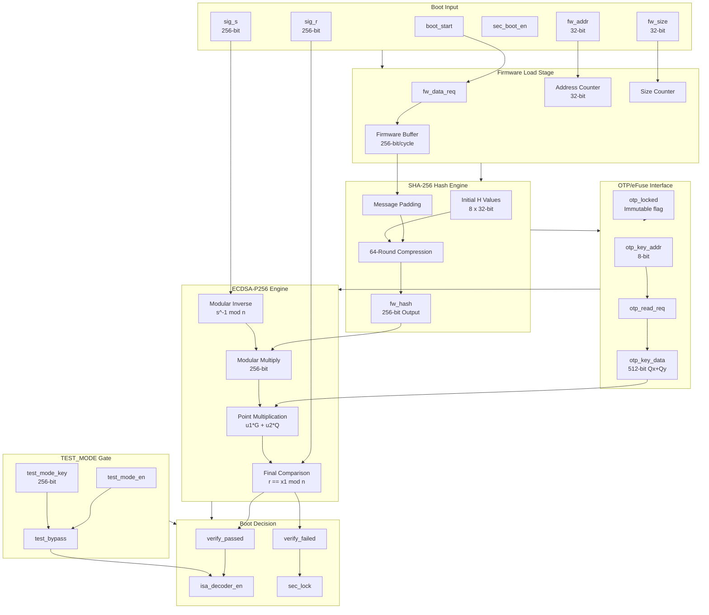

# Datapath Design - M14 Secure Boot

## 1. Overview

M14 Secure Boot Datapath 实现固件完整性验证和安全启动流程控制，采用流水化验证架构。核心数据通路包括 SHA-256 Hash Engine、ECDSA-P256 Verification Engine、OTP/eFuse Key Interface 和 TEST_MODE Control Gate，确保系统仅加载经授权签名的固件。

### 1.1 Datapath Key Features

| Feature | Description | Performance |
|---------|-------------|-------------|
| SHA-256 Hash | 64-round compression function | 64 cycles per block |
| ECDSA-P256 Verify | NIST P-256 curve verification | ~50K cycles |
| OTP/eFuse Interface | 公钥安全存储访问 | ~10 us latency |
| TEST_MODE Gate | 物理访问认证绕过 | Security gating |
| Retry & Lockout | 3次重试后锁定 | Anti-brute-force |

### 1.2 Secure Boot Mathematical Flow

```
Secure Boot Verification Flow:
  Step 1: Firmware Load    -- fw_size / 32B per cycle
  Step 2: Hash Compute     -- SHA-256(firmware) -> fw_hash
  Step 3: OTP Key Read     -- Public key Q = (Qx, Qy)
  Step 4: Signature Verify -- ECDSA-P256: Verify(sig, hash, Q)
  Step 5: Boot Decision    -- pass -> ENABLE, fail -> LOCKOUT

ECDSA-P256 Verification:
  1. w = s^-1 mod n          -- Modular inverse
  2. u1 = e * w mod n        -- Message hash scaled
  3. u2 = r * w mod n        -- Signature R scaled
  4. (x1, y1) = u1*G + u2*Q  -- Point multiplication
  5. Verify: r == x1 mod n   -- Final comparison
```

## 2. Block Diagram

### 2.1 Top-Level Datapath



### 2.2 Boot Timing Diagram (1 MB Firmware)

```
Phase:   | Firmware Load | Hash Compute | OTP Read | ECDSA Verify | Decision |
---------|---------------|--------------|----------|--------------|----------|
Cycles:  | ~32K cycles   | ~1M cycles   | ~5K cycles| ~50K cycles  | 1 cycle  |
Time@500:| ~64 us        | ~2 ms        | ~10 us   | ~100 us      | 2 ns     |
Percent: | ~3%           | ~80%         | ~0.5%    | ~5%          | ~0%      |

Total Boot Time: ~1.1M cycles = ~2.2 ms @ 500 MHz
```

## 3. Datapath Components

### 3.1 Firmware Load Stage

#### 3.1.1 Address Counter

```verilog
// Firmware Address Counter
module fw_address_counter (
    input  logic        clk_sys,
    input  logic        rst_sys_n,
    input  logic        fw_load_start,
    input  logic [31:0] fw_addr_base,
    input  logic [31:0] fw_size,
    output logic [31:0] fw_data_addr,
    output logic        fw_data_req,
    output logic        fw_data_last
);

    logic [31:0] addr_counter;
    logic [31:0] size_counter;
    
    always_ff @(posedge clk_sys or negedge rst_sys_n) begin
        if (!rst_sys_n) begin
            addr_counter <= 32'b0;
            size_counter <= 32'b0;
            fw_data_req <= 1'b0;
        end else if (fw_load_start) begin
            addr_counter <= fw_addr_base;
            size_counter <= fw_size;
            fw_data_req <= 1'b1;
        end else if (fw_data_req && size_counter > 0) begin
            addr_counter <= addr_counter + 32;  // 32 bytes per cycle
            size_counter <= size_counter - 32;
        end else begin
            fw_data_req <= 1'b0;
        end
    end
    
    assign fw_data_addr = addr_counter;
    assign fw_data_last = (size_counter <= 32);

endmodule
```

#### 3.1.2 Firmware Buffer

| Parameter | Value | Description |
|-----------|-------|-------------|
| Buffer Width | 256 bits | 32 bytes per cycle |
| Buffer Depth | 2 blocks | SHA-256 block buffer |
| Alignment | 64-byte blocks | SHA-256 input |

### 3.2 SHA-256 Hash Engine

#### 3.2.1 SHA-256 Block Diagram

```mermaid
graph TB
    subgraph INPUT["Message Input"]
        MSG[fw_data<br/>256-bit/cycle]
        LEN[fw_size<br/>Message Length]
    end
    
    subgraph PAD["Padding"]
        BLOCK[Block Buffer<br/>64-byte]
        PAD_LOGIC[Padding Logic<br/>1 + 64-bit length]
    end
    
    subgraph INIT["Initialize"]
        H0[H0 = 0x6a09e667]
        H1[H1 = 0xbb67ae85]
        H2-H7[H2-H7 Initial Values]
    end
    
    subgraph COMP["64-Round Compression"]
        W_SCHED[Message Schedule<br/>W[0..63]]
        ROUND[Round Function<br/>a,b,c,d,e,f,g,h]
        ADD_H[H Update<br/>H += a,b,c,d,e,f,g,h]
    end
    
    subgraph OUTPUT["Hash Output"]
        FW_HASH[fw_hash<br/>256-bit]
        HASH_DONE[hash_complete]
    end
    
    MSG --> BLOCK
    LEN --> PAD_LOGIC
    BLOCK --> PAD_LOGIC
    PAD_LOGIC --> W_SCHED
    H0 --> ROUND
    H1 --> ROUND
    H2-H7 --> ROUND
    W_SCHED --> ROUND
    ROUND --> ADD_H
    ADD_H --> FW_HASH
    FW_HASH --> HASH_DONE
```

#### 3.2.2 SHA-256 Compression Function

| Round | Operations | Latency |
|-------|------------|---------|
| 0-63 | W expansion + round function | 1 cycle per round |
| Total | 64 rounds per block | 64 cycles |

**Round Function Logic**:

```
Round i:
  T1 = h + Sigma1(e) + Ch(e,f,g) + K[i] + W[i]
  T2 = Sigma0(a) + Maj(a,b,c)
  h = g
  g = f
  f = e
  e = d + T1
  d = c
  c = b
  b = a
  a = T1 + T2
  
Sigma0(x) = ROTR2(x) ^ ROTR13(x) ^ ROTR22(x)
Sigma1(x) = ROTR6(x) ^ ROTR11(x) ^ ROTR25(x)
Ch(x,y,z) = (x & y) ^ (~x & z)
Maj(x,y,z) = (x & y) ^ (x & z) ^ (y & z)
```

### 3.3 OTP/eFuse Interface

#### 3.3.1 OTP Key Memory Map

| Address | Content | Size | Description |
|---------|---------|------|-------------|
| 0x00-0x03 | Qx | 128-bit | Public key X coordinate |
| 0x04-0x07 | Qy | 128-bit | Public key Y coordinate |
| 0x08 | Key_ID | 32-bit | Key identifier |
| 0x09 | Version | 32-bit | Key version (rollback protect) |
| 0x0A | Lock_Status | 32-bit | Lock flag |

#### 3.3.2 OTP Read Protocol

| Step | Signal | Direction | Description |
|------|--------|-----------|-------------|
| 1 | otp_key_addr | Output | Address selection |
| 2 | otp_read_req | Output | Read request |
| 3 | otp_read_ack | Input | Read acknowledge |
| 4 | otp_key_data | Input | 512-bit key data |
| 5 | otp_key_valid | Input | Data valid |
| 6 | otp_locked | Input | Key locked (immutable) |

### 3.4 ECDSA-P256 Engine

#### 3.4.1 ECDSA Block Diagram

```mermaid
graph TB
    subgraph INPUT["ECDSA Input"]
        E[e = fw_hash<br/>256-bit]
        R[sig_r<br/>256-bit]
        S[sig_s<br/>256-bit]
        QX[Qx from OTP<br/>256-bit]
        QY[Qy from OTP<br/>256-bit]
    end
    
    subgraph VALID["Input Validation"]
        R_CHECK[r in [1, n-1]]
        S_CHECK[s in [1, n-1]]
        Q_CHECK[Q on curve]
    end
    
    subgraph MOD["Modular Arithmetic"]
        INV[w = s^-1 mod n]
        MUL1[u1 = e * w mod n]
        MUL2[u2 = r * w mod n]
    end
    
    subgraph POINT["Point Operations"]
        G_MUL[G1 = u1 * G]
        Q_MUL[Q1 = u2 * Q]
        ADD[Point Add<br/>G1 + Q1]
    end
    
    subgraph CMP["Final Verification"]
        X1[x1 from result]
        CMP_R[r == x1 mod n]
    end
    
    subgraph RESULT["Verification Result"]
        PASS[verify_passed = 1]
        FAIL[verify_failed = 1]
    end
    
    E --> VALID
    R --> VALID
    S --> VALID
    QX --> Q_CHECK
    QY --> Q_CHECK
    
    VALID --> INV
    E --> MUL1
    INV --> MUL1
    INV --> MUL2
    R --> MUL2
    
    MUL1 --> G_MUL
    MUL2 --> Q_MUL
    G_MUL --> ADD
    Q_MUL --> ADD
    
    ADD --> X1
    X1 --> CMP_R
    R --> CMP_R
    
    CMP_R --> PASS
    CMP_R --> FAIL
```

#### 3.4.2 P-256 Curve Parameters

| Parameter | Value | Description |
|-----------|-------|-------------|
| Prime p | 0xFFFFFFFF...FFFFFFFF | 256-bit prime |
| Order n | 0xFFFFFFFF...FC632551 | Curve order |
| Generator G.x | 0x6B17D1F2...898C296 | Base point X |
| Generator G.y | 0x4FE342E2...37BF51F5 | Base point Y |

#### 3.4.3 ECDSA Timing

| Operation | Latency | Description |
|-----------|---------|-------------|
| Input Validation | 100 cycles | Range checks |
| Modular Inverse | 5,000 cycles | Extended Euclidean |
| Modular Multiply | 500 cycles each | 256-bit multiply |
| Point Multiplication | 40,000 cycles | Scalar multiplication |
| Point Addition | 500 cycles | Point add |
| Final Comparison | 100 cycles | Verification check |
| **Total** | **~50,000 cycles** | Complete verification |

### 3.5 TEST_MODE Control Gate

#### 3.5.1 TEST_MODE Security Gating

| Condition | TEST_MODE | SEC_BOOT_EN | Result |
|-----------|-----------|-------------|--------|
| Normal Boot | 0 | 1 | Full verification required |
| Secure Disabled | - | 0 | Bypass verification |
| TEST_MODE Auth | 1 + key valid | 1 | Bypass with authentication |
| TEST_MODE Fail | 1 + key invalid | 1 | Full verification required |

#### 3.5.2 TEST_MODE Authentication Flow

```
TEST_MODE Activation:
  1. test_mode_en = 1 (JTAG physical access)
  2. test_mode_key input (256-bit authentication key)
  3. test_auth_req -> test_auth_done
  4. test_bypass = 1 enabled
  
TEST_MODE Bypass Levels:
  - Level 0: No bypass (normal operation)
  - Level 1: Hash-only mode (skip signature verification)
  - Level 2: Full bypass (skip all verification)
```

## 4. Pipeline Structure

### 4.1 Boot State Pipeline

| State | Duration | Description |
|-------|----------|-------------|
| IDLE | Wait | Wait for boot_start |
| LOAD_FW | fw_size/32B cycles | Firmware load |
| COMPUTE_HASH | fw_size/64 * 64 cycles | SHA-256 computation |
| READ_OTP | ~10 us | OTP/eFuse access |
| VERIFY_SIG | ~50K cycles | ECDSA verification |
| COMPLETE | Persistent | Boot success |
| FAILED | Transient | Verification failure |
| LOCKED | Persistent | Lockout state |

### 4.2 Retry Mechanism

| Parameter | Value | Description |
|-----------|-------|-------------|
| Max Retry | 3 | Maximum attempts |
| Retry Delay | 100 ms | Wait between retries |
| Fail Counter | 0-3 | Failure tracking |
| Lockout Trigger | fail_counter >= 3 | Enter LOCKED state |

## 5. Interface Summary

### 5.1 Firmware Interface

| Signal | Width | Direction | Description |
|--------|-------|-----------|-------------|
| fw_addr | 32 | Input | Firmware start address |
| fw_size | 32 | Input | Firmware size (bytes) |
| fw_data_req | 1 | Output | Data request |
| fw_data_addr | 32 | Output | Read address |
| fw_data_valid | 1 | Input | Data valid |
| fw_data | 256 | Input | Data (32 bytes) |
| fw_data_last | 1 | Input | Last packet flag |

### 5.2 Signature Interface

| Signal | Width | Direction | Description |
|--------|-------|-----------|-------------|
| sig_r | 256 | Input | ECDSA R component |
| sig_s | 256 | Input | ECDSA S component |
| sig_valid | 1 | Input | Signature valid |

### 5.3 OTP/eFuse Interface

| Signal | Width | Direction | Description |
|--------|-------|-----------|-------------|
| otp_key_addr | 8 | Output | Key address |
| otp_key_data | 512 | Input | Public key data |
| otp_key_valid | 1 | Input | Data valid |
| otp_read_req | 1 | Output | Read request |
| otp_locked | 1 | Input | Lock status |

### 5.4 Boot Control Interface

| Signal | Width | Direction | Description |
|--------|-------|-----------|-------------|
| boot_start | 1 | Input | Start boot |
| boot_complete | 1 | Output | Boot success |
| boot_fail | 1 | Output | Boot failure |
| isa_decoder_en | 1 | Output | Enable M13 |
| sec_lock | 1 | Output | Security lock |

## 6. Datapath Parameters Summary

### 6.1 Component Parameters

| Component | Width | Latency | Area Est. |
|-----------|-------|---------|-----------|
| Firmware Buffer | 256-bit | fw_size/32 cycles | 20,000 um2 |
| SHA-256 Engine | 256-bit | 64 cycles/block | 80,000 um2 |
| OTP Interface | 512-bit | ~10 us | 5,000 um2 |
| ECDSA Engine | 256-bit | ~50K cycles | 150,000 um2 |
| TEST_MODE Gate | 256-bit | Authentication | 10,000 um2 |
| **Total** | - | **~1.1M cycles** | **~265,000 um2** |

### 6.2 Timing Parameters @ 500 MHz (1 MB FW)

| Operation | Cycles | Time | Percentage |
|-----------|--------|------|------------|
| FW Load | 32K | 64 us | ~3% |
| SHA-256 | 1M | 2 ms | ~80% |
| OTP Read | 5K | 10 us | ~0.5% |
| ECDSA | 50K | 100 us | ~5% |
| **Total** | **1.1M** | **~2.2 ms** | **100%** |

## 7. Security Properties

### 7.1 Threat Mitigation

| Threat | Mitigation | Implementation |
|--------|------------|----------------|
| Firmware Tampering | ECDSA-P256 signature | REQ-SEC-001 |
| Key Extraction | OTP/eFuse read-only | Immutable after lock |
| Brute Force | Retry limit + lockout | fail_counter >= 3 |
| Remote Attack | TEST_MODE physical only | JTAG required |
| Timing Attack | Constant-time crypto | ECDSA optimized |

### 7.2 Security States

| State | SEC_BOOT_EN | TEST_MODE | Boot Result |
|-------|-------------|-----------|-------------|
| Normal Boot | 1 | 0 | Pass/Fail |
| Secure Disabled | 0 | 0 | Bypass |
| TEST_MODE Auth | 1 | 1 | Bypass (authenticated) |
| Lockout | - | - | No boot |

## 8. References

- **Parent MAS**: `/spec_mas/M14/MAS.md` - Complete module specification
- **FSM Design**: `/spec_mas/M14/FSM.md` - Boot state machine
- **M13 Interface**: `/spec_mas/M13/MAS.md` - ISA Decoder control
- **Module Tree**: `/spec_mas/module_tree.md` - M14 module classification