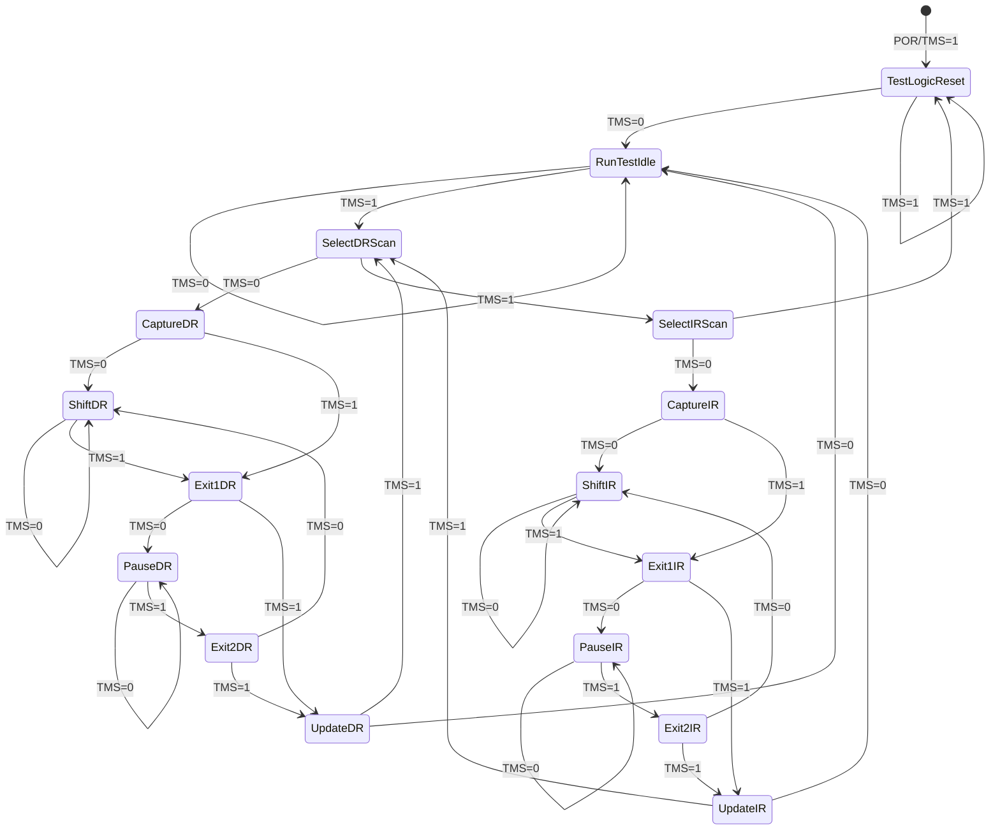
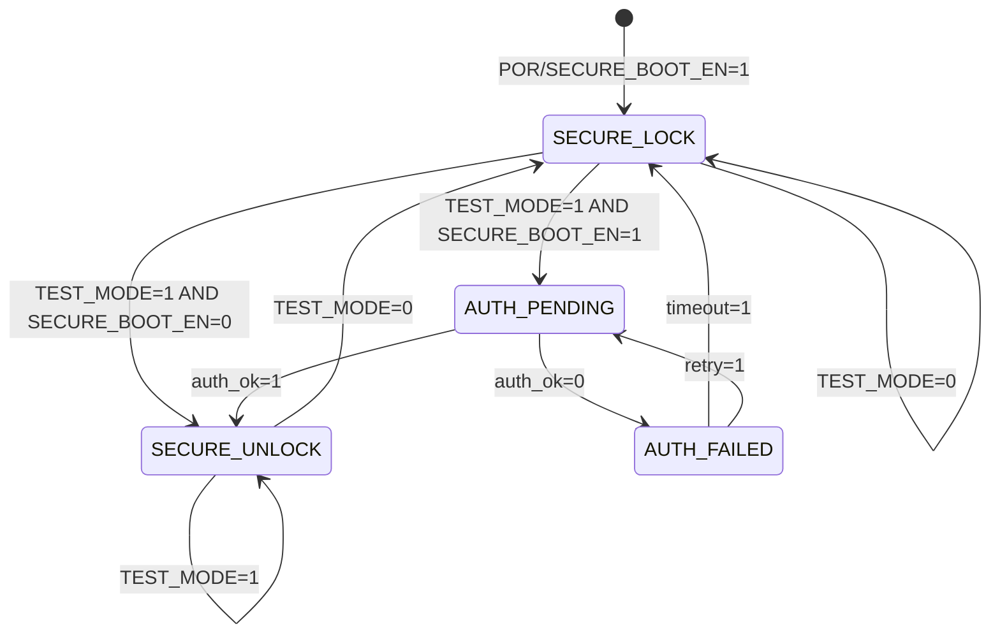

# FSM Design - M15 JTAG Interface

## Overview

IEEE 1149.1 TAP Controller with TEST_MODE Security Gating

| 属性 | 值 |
|------|-----|
| Clock Domain | CLK_IO (异步, TCK) |
| Power Domain | PD_IO |
| FSM Count | 2 |
| Security Level | Medium (TEST_MODE gating) |

## FSM 1: TAP Controller (IEEE 1149.1)

### 状态列表

| 状态 | 编码 (4-bit) | 描述 |
|------|--------------|------|
| Test-Logic-Reset | 0x0 | 复位状态, TAP控制器禁用 |
| Run-Test/Idle | 0x1 | 空闲状态, 执行测试或等待 |
| Select-DR-Scan | 0x2 | 选择 Data Register 扫描路径 |
| Capture-DR | 0x3 | 捕获 DR 数据到移位寄存器 |
| Shift-DR | 0x4 | DR 数据移位状态 |
| Exit1-DR | 0x5 | DR 移位结束临时状态 |
| Pause-DR | 0x6 | DR 移位暂停状态 |
| Exit2-DR | 0x7 | DR 暂停结束临时状态 |
| Update-DR | 0x8 | 更新 DR 目标寄存器 |
| Select-IR-Scan | 0x9 | 选择 Instruction Register 扫描路径 |
| Capture-IR | 0xA | 捕获 IR 数据到移位寄存器 |
| Shift-IR | 0xB | IR 指令移位状态 |
| Exit1-IR | 0xC | IR 移位结束临时状态 |
| Pause-IR | 0xD | IR 移位暂停状态 |
| Exit2-IR | 0xE | IR 暂停结束临时状态 |
| Update-IR | 0xF | 更新 IR 目标寄存器 |

### 状态转移表

| 当前状态 | TMS | 下一个状态 | 输出动作 |
|----------|-----|------------|----------|
| Test-Logic-Reset | 0 | Run-Test/Idle | 退出复位, 启用测试逻辑 |
| Test-Logic-Reset | 1 | Test-Logic-Reset | 保持复位状态 |
| Run-Test/Idle | 0 | Run-Test/Idle | 保持空闲或执行测试 |
| Run-Test/Idle | 1 | Select-DR-Scan | 选择 DR 扫描路径 |
| Select-DR-Scan | 0 | Capture-DR | 进入 DR 捕获状态 |
| Select-DR-Scan | 1 | Select-IR-Scan | 进入 IR 选择状态 |
| Capture-DR | 0 | Shift-DR | 捕获完成, 开始移位 |
| Capture-DR | 1 | Exit1-DR | 直接跳到 Exit1 |
| Shift-DR | 0 | Shift-DR | 继续移位 (TDI→TDO) |
| Shift-DR | 1 | Exit1-DR | 结束移位 |
| Exit1-DR | 0 | Pause-DR | 进入暂停 |
| Exit1-DR | 1 | Update-DR | 直接更新 |
| Pause-DR | 0 | Pause-DR | 保持暂停 |
| Pause-DR | 1 | Exit2-DR | 退出暂停 |
| Exit2-DR | 0 | Shift-DR | 返回继续移位 |
| Exit2-DR | 1 | Update-DR | 进入更新状态 |
| Update-DR | 0 | Run-Test/Idle | 返回空闲状态 |
| Update-DR | 1 | Select-DR-Scan | 选择新的 DR 扫描 |
| Select-IR-Scan | 0 | Capture-IR | 进入 IR 捕获状态 |
| Select-IR-Scan | 1 | Test-Logic-Reset | 返回复位状态 |
| Capture-IR | 0 | Shift-IR | 捕获完成, 开始移位 |
| Capture-IR | 1 | Exit1-IR | 直接跳到 Exit1 |
| Shift-IR | 0 | Shift-IR | 继续移位 (TDI→TDO) |
| Shift-IR | 1 | Exit1-IR | 结束移位 |
| Exit1-IR | 0 | Pause-IR | 进入暂停 |
| Exit1-IR | 1 | Update-IR | 直接更新 |
| Pause-IR | 0 | Pause-IR | 保持暂停 |
| Pause-IR | 1 | Exit2-IR | 退出暂停 |
| Exit2-IR | 0 | Shift-IR | 返回继续移位 |
| Exit2-IR | 1 | Update-IR | 进入更新状态 |
| Update-IR | 0 | Run-Test/Idle | 返回空闲状态, 执行新指令 |
| Update-IR | 1 | Select-DR-Scan | 选择 DR 扫描 |

### Mermaid 状态图



### 指令寄存器 (IR) 编码

| IR 值 | 指令名称 | 功能描述 |
|-------|----------|----------|
| 0x00 | EXTEST | 外部测试, 驱动边界扫描输出 |
| 0x01 | SAMPLE/PRELOAD | 采样边界扫描或预加载 |
| 0x02 | INTEST | 内部测试 (可选) |
| 0x03 | BYPASS | 直通模式, TDI→TDO 1-bit延迟 |
| 0x04 | IDCODE | 返回器件ID (32-bit) |
| 0x05 | USERCODE | 返回用户代码 (32-bit) |
| 0x06 | HIGHZ | 所有输出高阻态 |
| 0x07 | CLAMP | 边界扫描输出钳位 |
| 0x0F-0xFE | 用户自定义 | 扩展指令 |
| 0xFF | 安全模式 | 禁用所有测试功能 |

## FSM 2: Security Gating Controller

### 状态列表

| 状态 | 编码 (2-bit) | 描述 |
|------|--------------|------|
| SECURE_LOCK | 0x0 | 安全锁定状态, JTAG禁用 |
| SECURE_UNLOCK | 0x1 | 安全解锁状态, JTAG启用 |
| AUTH_PENDING | 0x2 | 认证等待状态, 等待TEST_MODE验证 |
| AUTH_FAILED | 0x3 | 认证失败状态, 暂时锁定 |

### 状态转移表

| 当前状态 | TEST_MODE | SECURE_BOOT_EN | 下一个状态 | 输出动作 |
|----------|-----------|----------------|------------|----------|
| SECURE_LOCK | 0 | 0 | SECURE_LOCK | 保持锁定 |
| SECURE_LOCK | 1 | 0 | SECURE_UNLOCK | TEST_MODE解锁 |
| SECURE_LOCK | 0 | 1 | SECURE_LOCK | Secure Boot强制锁定 |
| SECURE_LOCK | 1 | 1 | AUTH_PENDING | 进入认证流程 |
| SECURE_UNLOCK | 0 | - | SECURE_LOCK | TEST_MODE释放, 锁定 |
| SECURE_UNLOCK | 1 | - | SECURE_UNLOCK | 保持解锁状态 |
| AUTH_PENDING | auth_ok=1 | 1 | SECURE_UNLOCK | 认证成功, 解锁 |
| AUTH_PENDING | auth_ok=0 | 1 | AUTH_FAILED | 认证失败 |
| AUTH_FAILED | timeout=1 | - | SECURE_LOCK | 超时后返回锁定 |
| AUTH_FAILED | retry=1 | 1 | AUTH_PENDING | 允许重试认证 |

### Mermaid 状态图



### 安全机制说明

| 机制 | 条件 | 行为 |
|------|------|------|
| 生产模式锁定 | SECURE_BOOT_EN=1, TEST_MODE=0 | JTAG完全禁用, TAP复位 |
| 调试模式解锁 | TEST_MODE=1, SECURE_BOOT_EN=0 | JTAG正常访问 |
| 认证解锁 | TEST_MODE=1, SECURE_BOOT_EN=1 | 需要密钥认证后解锁 |
| 紧急锁定 | 安全异常触发 | 立即锁定JTAG, 进入复位 |

### JTAG 访问权限矩阵

| 模式 | SECURE_BOOT_EN | TEST_MODE | JTAG 访问 |
|------|----------------|-----------|-----------|
| 生产 | 1 | 0 | 禁用 |
| 调试 | 0 | 1 | 完全启用 |
| 认证调试 | 1 | 1 | 认证后启用 |
| 正常运行 | 0 | 0 | 禁用 (无测试需求) |

## FSM 交互关系

```mermaid
flowchart TB
    subgraph TAP["TAP Controller FSM"]
        TL[Test-Logic-Reset]
        RT[Run-Test/Idle]
        DR[DR States]
        IR[IR States]
    end

    subgraph SEC["Security FSM"]
        SL[SECURE_LOCK]
        SU[SECURE_UNLOCK]
        AP[AUTH_PENDING]
        AF[AUTH_FAILED]
    end

    subgraph IO["外部信号"]
        TM[TEST_MODE Pin]
        SB[SECURE_BOOT_EN<br/>from M14]
        TCK[TCK Clock]
        TMS[TMS Control]
        TDI[TDI Data In]
        TDO[TDO Data Out]
    end

    TM --> SEC
    SB --> SEC
    SEC --> |"JTAG_ENABLE"| TAP
    TCK --> TAP
    TMS --> TAP
    TDI --> TAP
    TAP --> TDO

    SEC --> |"LOCK"| TL: 强制复位
```

## 设计约束

| 约束 ID | 描述 | 验证方法 |
|---------|------|----------|
| C1 | TCK 异步时钟域, 需要 CDC 处理 | CDC 检查 |
| C2 | TEST_MODE 为异步输入, 需同步化 | 两级同步器 |
| C3 | SECURE_BOOT_EN 来自 M14, 需跨模块握手 | 接口协议验证 |
| C4 | 安全锁定必须在 TAP 复位后生效 | 功能仿真 |
| C5 | JTAG 禁用时 TDO 保持高阻态 | IO 仿真 |

## 寄存器接口

| 寄存器 | 地址 | 位宽 | 功能 |
|--------|------|------|------|
| JTAG_ENABLE | 0x00 | 1 | Security FSM 输出, 控制 TAP 启用 |
| SECURE_STATUS | 0x01 | 2 | 当前安全状态编码 |
| AUTH_KEY | 0x02 | 128 | 认证密钥寄存器 (写保护) |
| TAP_STATE | 0x03 | 4 | 当前 TAP 状态编码 (只读) |
| IR_VALUE | 0x04 | 8 | 当前指令寄存器值 |
| DR_LENGTH | 0x05 | 16 | 当前 DR 长度 |

## 参考

- IEEE 1149.1-2013: Standard for Test Access Port and Boundary-Scan Architecture
- M14 Secure Boot Interface: SECURE_BOOT_EN 信号握手协议