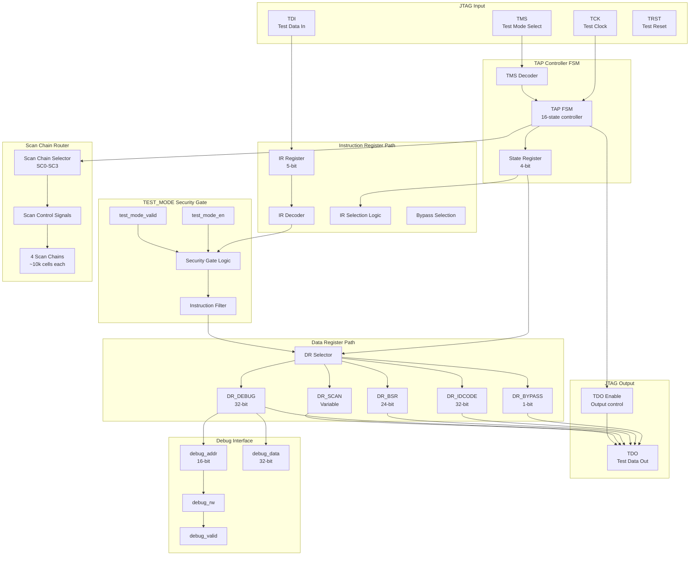

# Datapath Design - M15 JTAG Interface

## 1. Overview

M15 JTAG Interface Datapath 实现 IEEE 1149.1 标准 JTAG TAP Controller，提供调试与测试访问通道。核心数据通路包括 TAP FSM Controller、Instruction Register Path、Data Register Path、TEST_MODE Security Gate 和 Scan Chain Router，支持边界扫描、内建自测试访问和调试模式切换。

### 1.1 Datapath Key Features

| Feature | Description | Performance |
|---------|-------------|-------------|
| IEEE 1149.1 TAP | 标准 16-state TAP Controller | TCK up to 50 MHz |
| 4 Data Registers | BYPASS, IDCODE, BSR, DEBUG | REQ-IO-001 |
| TEST_MODE Gate | Security gating for sensitive instructions | REQ-SEC-001 |
| 4 Scan Chains | ~10k cells per chain | REQ-DFT-001 |
| Debug Access | 32-bit debug data register | REQ-DFT-002 |

### 1.2 JTAG Data Flow

```
JTAG TAP Controller Flow:
  TDI -> Shift-DR/Shift-IR -> Data/Instruction Register -> TDO
  
TAP State Machine:
  Test-Logic-Reset -> Run-Test/Idle -> Select-DR/IR -> Capture -> Shift -> Exit -> Update
  
TEST_MODE Security Gate:
  TEST_MODE=0: BYPASS/IDCODE only
  TEST_MODE=1 + auth: All instructions enabled
```

## 2. Block Diagram

### 2.1 Top-Level Datapath



### 2.2 TAP State Timing Diagram

```
TCK:     _|‾|_|‾|_|‾|_|‾|_|‾|_|‾|_|‾|_|‾|_|‾|_|‾|_|‾|_|‾|_|‾|_|‾|_
TMS:     ___|‾‾‾|___|‾‾‾|___|___|___|___|‾‾‾|___|___|___|___|___|_
         (Reset) (Select)  (Capture) (Shift)    (Exit)   (Update)

State:   Reset->Idle->Select-DR->Capture-DR->Shift-DR->Exit1-DR->Update-DR->Idle

TDI:     <==================DATA SHIFT==================>
TDO:     _______________<================DATA OUT========

Instruction Cycle: Capture-IR -> Shift-IR -> Update-IR
Data Cycle:        Capture-DR -> Shift-DR -> Update-DR
```

## 3. Datapath Components

### 3.1 TAP FSM Controller

#### 3.1.1 TAP State Register

```verilog
// TAP State Register (16-state encoding)
module tap_state_register (
    input  logic        tck,
    input  logic        trst_n,
    input  logic        tms,
    output logic [3:0]  tap_state,
    output logic        dr_scan_active,
    output logic        ir_scan_active
);

    // State encoding (4-bit)
    localparam TEST_LOGIC_RESET = 4'h0;
    localparam RUN_TEST_IDLE    = 4'h1;
    localparam SELECT_DR_SCAN   = 4'h2;
    localparam CAPTURE_DR       = 4'h3;
    localparam SHIFT_DR         = 4'h4;
    localparam EXIT1_DR         = 4'h5;
    localparam PAUSE_DR         = 4'h6;
    localparam EXIT2_DR         = 4'h7;
    localparam UPDATE_DR        = 4'h8;
    localparam SELECT_IR_SCAN   = 4'h9;
    localparam CAPTURE_IR       = 4'hA;
    localparam SHIFT_IR         = 4'hB;
    localparam EXIT1_IR         = 4'hC;
    localparam PAUSE_IR         = 4'hD;
    localparam EXIT2_IR         = 4'hE;
    localparam UPDATE_IR        = 4'hF;
    
    always_ff @(posedge tck or negedge trst_n) begin
        if (!trst_n) begin
            tap_state <= TEST_LOGIC_RESET;
        end else begin
            case (tap_state)
                TEST_LOGIC_RESET: tap_state <= tms ? TEST_LOGIC_RESET : RUN_TEST_IDLE;
                RUN_TEST_IDLE:    tap_state <= tms ? SELECT_DR_SCAN : RUN_TEST_IDLE;
                SELECT_DR_SCAN:   tap_state <= tms ? SELECT_IR_SCAN : CAPTURE_DR;
                CAPTURE_DR:       tap_state <= tms ? EXIT1_DR : SHIFT_DR;
                SHIFT_DR:         tap_state <= tms ? EXIT1_DR : SHIFT_DR;
                EXIT1_DR:         tap_state <= tms ? UPDATE_DR : PAUSE_DR;
                PAUSE_DR:         tap_state <= tms ? EXIT2_DR : PAUSE_DR;
                EXIT2_DR:         tap_state <= tms ? UPDATE_DR : SHIFT_DR;
                UPDATE_DR:        tap_state <= tms ? SELECT_DR_SCAN : RUN_TEST_IDLE;
                SELECT_IR_SCAN:   tap_state <= tms ? TEST_LOGIC_RESET : CAPTURE_IR;
                CAPTURE_IR:       tap_state <= tms ? EXIT1_IR : SHIFT_IR;
                SHIFT_IR:         tap_state <= tms ? EXIT1_IR : SHIFT_IR;
                EXIT1_IR:         tap_state <= tms ? UPDATE_IR : PAUSE_IR;
                PAUSE_IR:         tap_state <= tms ? EXIT2_IR : PAUSE_IR;
                EXIT2_IR:         tap_state <= tms ? UPDATE_IR : SHIFT_IR;
                UPDATE_IR:        tap_state <= tms ? SELECT_DR_SCAN : RUN_TEST_IDLE;
                default:          tap_state <= TEST_LOGIC_RESET;
            endcase
        end
    end
    
    assign dr_scan_active = (tap_state >= CAPTURE_DR && tap_state <= UPDATE_DR);
    assign ir_scan_active = (tap_state >= CAPTURE_IR && tap_state <= UPDATE_IR);

endmodule
```

#### 3.1.2 TAP State Definitions

| State | Code | Description | Action |
|-------|------|-------------|--------|
| Test-Logic-Reset | 0x0 | Reset state | IR=BYPASS, DR disabled |
| Run-Test/Idle | 0x1 | Idle | Wait for operation |
| Select-DR | 0x2 | Select DR path | Prepare DR operation |
| Capture-DR | 0x3 | Capture DR | Load DR current value |
| Shift-DR | 0x4 | Shift DR | TDI -> DR -> TDO |
| Exit1-DR | 0x5 | DR exit 1 | End shift |
| Pause-DR | 0x6 | DR pause | Pause shift |
| Exit2-DR | 0x7 | DR exit 2 | Resume/end |
| Update-DR | 0x8 | Update DR | Apply DR changes |
| Select-IR | 0x9 | Select IR path | Prepare IR operation |
| Capture-IR | 0xA | Capture IR | Load IR current value |
| Shift-IR | 0xB | Shift IR | TDI -> IR -> TDO |
| Exit1-IR | 0xC | IR exit 1 | End shift |
| Pause-IR | 0xD | IR pause | Pause shift |
| Exit2-IR | 0xE | IR exit 2 | Resume/end |
| Update-IR | 0xF | Update IR | Apply IR changes |

### 3.2 Instruction Register Path

#### 3.2.1 Instruction Register

```verilog
// Instruction Register (5-bit with parity)
module instruction_register (
    input  logic        tck,
    input  logic        trst_n,
    input  logic        shift_ir,
    input  logic        update_ir,
    input  logic        tdi,
    output logic        tdo_ir,
    output logic [4:0]  ir_value,
    output logic        ir_valid
);

    logic [4:0] ir_shift_reg;
    logic [4:0] ir_update_reg;
    
    always_ff @(posedge tck or negedge trst_n) begin
        if (!trst_n) begin
            ir_shift_reg <= 5'b0;
            ir_update_reg <= 5'b00001;  // Default: IDCODE
        end else if (shift_ir) begin
            ir_shift_reg <= {tdi, ir_shift_reg[4:1]};
        end else if (update_ir) begin
            ir_update_reg <= ir_shift_reg;
        end
    end
    
    assign tdo_ir = ir_shift_reg[0];
    assign ir_value = ir_update_reg;
    assign ir_valid = (ir_update_reg != 5'b0);

endmodule
```

#### 3.2.2 Instruction Set

| IR Value | Instruction | DR Selected | Security | Description |
|----------|-------------|-------------|----------|-------------|
| 0x00 | BYPASS | DR_BYPASS | Always | Bypass mode |
| 0x01 | IDCODE | DR_IDCODE | Always | Device ID |
| 0x02 | EXTEST | DR_BSR | TEST_MODE | External test |
| 0x03 | INTEST | DR_BSR | TEST_MODE | Internal test |
| 0x04 | SCAN_IN | DR_SCAN | TEST_MODE | Scan chain input |
| 0x05 | SCAN_OUT | DR_SCAN | TEST_MODE | Scan chain output |
| 0x07 | DEBUG | DR_DEBUG | TEST_MODE | Debug access |
| 0x08 | MBIST_CTRL | DR_MBIST | TEST_MODE | MBIST control |

### 3.3 Data Register Path

#### 3.3.1 DR Selector

```verilog
// Data Register Selector
module dr_selector (
    input  logic [4:0]  ir_value,
    input  logic        test_mode_valid,
    output logic        select_bypass,
    output logic        select_idcode,
    output logic        select_bsr,
    output logic        select_debug,
    output logic        select_scan
);

    // Security gating
    logic instr_allowed;
    
    always_comb begin
        // TEST_MODE gating for sensitive instructions
        instr_allowed = test_mode_valid || (ir_value == 0x00 || ir_value == 0x01);
        
        select_bypass  = (ir_value == 0x00) || !instr_allowed;  // Default fallback
        select_idcode  = (ir_value == 0x01) && instr_allowed;
        select_bsr     = (ir_value >= 0x02 && ir_value <= 0x03) && instr_allowed;
        select_debug   = (ir_value == 0x07) && instr_allowed;
        select_scan    = (ir_value >= 0x04 && ir_value <= 0x06) && instr_allowed;
    end

endmodule
```

#### 3.3.2 DR_BYPASS (1-bit)

```verilog
// Bypass Register (1-bit delay)
module dr_bypass (
    input  logic tck,
    input  logic trst_n,
    input  logic shift_dr,
    input  logic tdi,
    output logic tdo
);

    logic bypass_bit;
    
    always_ff @(posedge tck or negedge trst_n) begin
        if (!trst_n) begin
            bypass_bit <= 1'b0;
        end else if (shift_dr) begin
            bypass_bit <= tdi;
        end
    end
    
    assign tdo = bypass_bit;

endmodule
```

#### 3.3.3 DR_IDCODE (32-bit)

| Bit Field | Value | Description |
|-----------|-------|-------------|
| [0:11] | 0xABC | Manufacturer ID |
| [12:27] | 0x12345 | Part Number |
| [28:31] | 0x1 | Version |

**IDCODE = 0x1_12345_ABC**

### 3.4 TEST_MODE Security Gate

#### 3.4.1 Security Gating Logic

| Condition | TEST_MODE | SEC_BOOT_EN | Instruction Access |
|-----------|-----------|-------------|-------------------|
| Production | 0 | 1 | BYPASS/IDCODE only |
| Development | 0 | 0 | All instructions |
| Authenticated | 1 | 1 | All instructions (after auth) |
| Unauthorized | 1 | 0 | BYPASS/IDCODE only |

#### 3.4.2 Instruction Filter

```verilog
// TEST_MODE Instruction Filter
module instruction_filter (
    input  logic [4:0]  ir_value,
    input  logic        test_mode_en,
    input  logic        test_mode_valid,
    input  logic        sec_boot_en,
    output logic [4:0]  filtered_ir,
    output logic        access_denied
);

    always_comb begin
        // Public instructions (always allowed)
        if (ir_value == 0x00 || ir_value == 0x01) begin
            filtered_ir = ir_value;
            access_denied = 1'b0;
        end
        // TEST_MODE required instructions
        else if (test_mode_en && test_mode_valid) begin
            filtered_ir = ir_value;
            access_denied = 1'b0;
        end
        // Blocked: return BYPASS
        else begin
            filtered_ir = 5'b00000;  // Force BYPASS
            access_denied = 1'b1;
        end
    end

endmodule
```

### 3.5 Scan Chain Router

#### 3.5.1 Scan Chain Definition

| Chain ID | Name | Length | Target Modules |
|----------|------|--------|----------------|
| SC0 | Logic Chain 0 | ~10k cells | M00, M01, M08, M09 |
| SC1 | Logic Chain 1 | ~10k cells | M02, M10, M11 |
| SC2 | Logic Chain 2 | ~10k cells | M03, M04, M12 |
| SC3 | Logic Chain 3 | ~10k cells | M05, M06, M07, M13 |

#### 3.5.2 Scan Control Signals

| Signal | Width | Direction | Description |
|--------|-------|-----------|-------------|
| scan_select | 4 | Output | Chain selection |
| scan_enable | 1 | Output | Scan mode enable |
| scan_in | 1 | Output | Scan data input |
| scan_out | 1 | Input | Scan data output |
| scan_capture | 1 | Output | Capture control |
| scan_update | 1 | Output | Update control |

## 4. Pipeline Structure

### 4.1 JTAG Operation Timing

| Operation | States | Cycles | Description |
|-----------|--------|--------|-------------|
| IR Update | Capture-IR -> Shift-IR -> Update-IR | 3 + IR_length | Instruction change |
| DR Update | Capture-DR -> Shift-DR -> Update-DR | 3 + DR_length | Data operation |
| Bypass | Shift-DR | 1 cycle | 1-bit pass-through |
| Scan Chain | Shift-DR | ~10k cycles | Full chain shift |

### 4.2 Debug Access Timing

| Parameter | Value | Description |
|-----------|-------|-------------|
| Address Setup | 1 cycle | debug_addr valid |
| Data Valid | 2 cycles | Read data return |
| Write | 1 cycle | Write complete |

## 5. Interface Summary

### 5.1 JTAG Port Interface

| Signal | Width | Direction | Voltage | Description |
|--------|-------|-----------|---------|-------------|
| tck | 1 | Input | 1.8V | Test Clock (up to 50 MHz) |
| tms | 1 | Input | 1.8V | Test Mode Select |
| tdi | 1 | Input | 1.8V | Test Data In |
| tdo | 1 | Output | 1.8V | Test Data Out |
| trst_n | 1 | Input | 1.8V | Test Reset (optional) |

### 5.2 TEST_MODE Interface

| Signal | Width | Direction | Description |
|--------|-------|-----------|-------------|
| test_mode_en | 1 | Input | TEST_MODE enable (from M14) |
| test_mode_valid | 1 | Input | TEST_MODE authentication valid |
| test_access_grant | 1 | Output | Access granted |
| test_access_denied | 1 | Output | Access denied (alarm) |

### 5.3 Scan Chain Interface

| Signal | Width | Direction | Description |
|--------|-------|-----------|-------------|
| scan_select | 4 | Output | Chain ID (SC0-SC3) |
| scan_enable | 1 | Output | Scan mode |
| scan_in | 1 | Output | Scan input data |
| scan_out | 1 | Input | Scan output data |

### 5.4 Debug Interface

| Signal | Width | Direction | Description |
|--------|-------|-----------|-------------|
| debug_addr | 16 | Output | Debug address |
| debug_data_in | 32 | Output | Write data |
| debug_data_out | 32 | Input | Read data |
| debug_rw | 1 | Output | Read/Write |
| debug_valid | 1 | Output | Access valid |

## 6. Datapath Parameters Summary

### 6.1 Component Parameters

| Component | Width | Count | Latency | Area Est. |
|-----------|-------|-------|---------|-----------|
| TAP FSM | 4-bit state | 16 states | TCK cycle | 15,000 um2 |
| IR Register | 5-bit | 1 | 5 TCK cycles | 5,000 um2 |
| DR Selector | mux | 5 DRs | 1 TCK cycle | 8,000 um2 |
| DR_BYPASS | 1-bit | 1 | 1 cycle | 1,000 um2 |
| DR_IDCODE | 32-bit | 1 | 32 cycles | 10,000 um2 |
| DR_BSR | 24-bit | 1 | 24 cycles | 8,000 um2 |
| DR_DEBUG | 32-bit | 1 | 32 cycles | 10,000 um2 |
| Security Gate | logic | 1 | 1 cycle | 5,000 um2 |
| Scan Router | 4-chain | 4 | ~10k cycles | 20,000 um2 |
| **Total** | - | - | **Variable** | **~82,000 um2** |

### 6.2 Timing Parameters @ 50 MHz TCK

| Parameter | Value | Description |
|-----------|-------|-------------|
| TCK Period | 20 ns | 50 MHz max |
| TMS Setup | 2 ns | To TCK rising edge |
| TDI Setup | 2 ns | To TCK rising edge |
| TDO Valid | 5 ns max | After TCK falling |
| IR Shift | 5 cycles | 5-bit instruction |
| Scan Chain Shift | ~200 us | 10k cells @ 50 MHz |

## 7. References

- **Parent MAS**: `/spec_mas/M15/MAS.md` - Complete module specification
- **FSM Design**: `/spec_mas/M15/FSM.md` - TAP FSM and Security FSM
- **IEEE 1149.1**: Standard JTAG specification
- **Module Tree**: `/spec_mas/module_tree.md` - M15 module classification