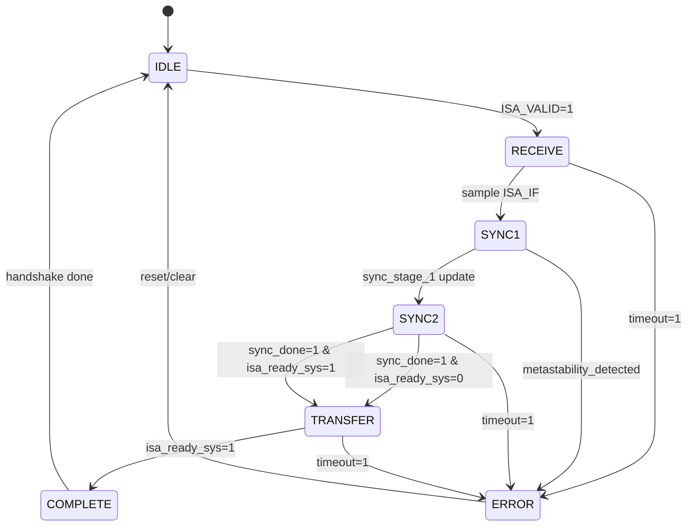
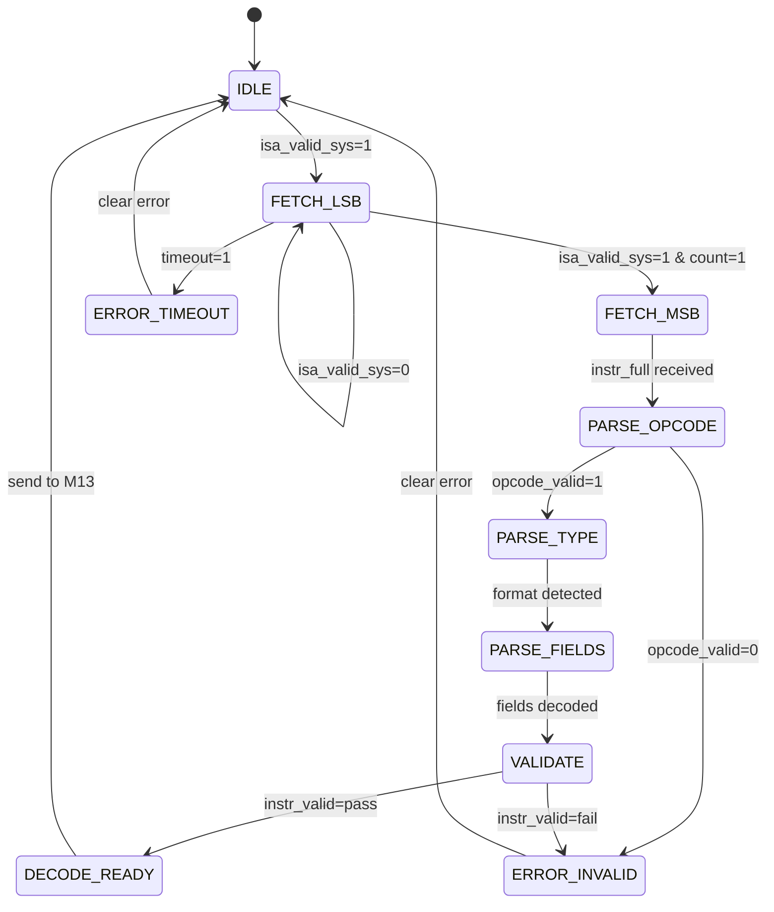
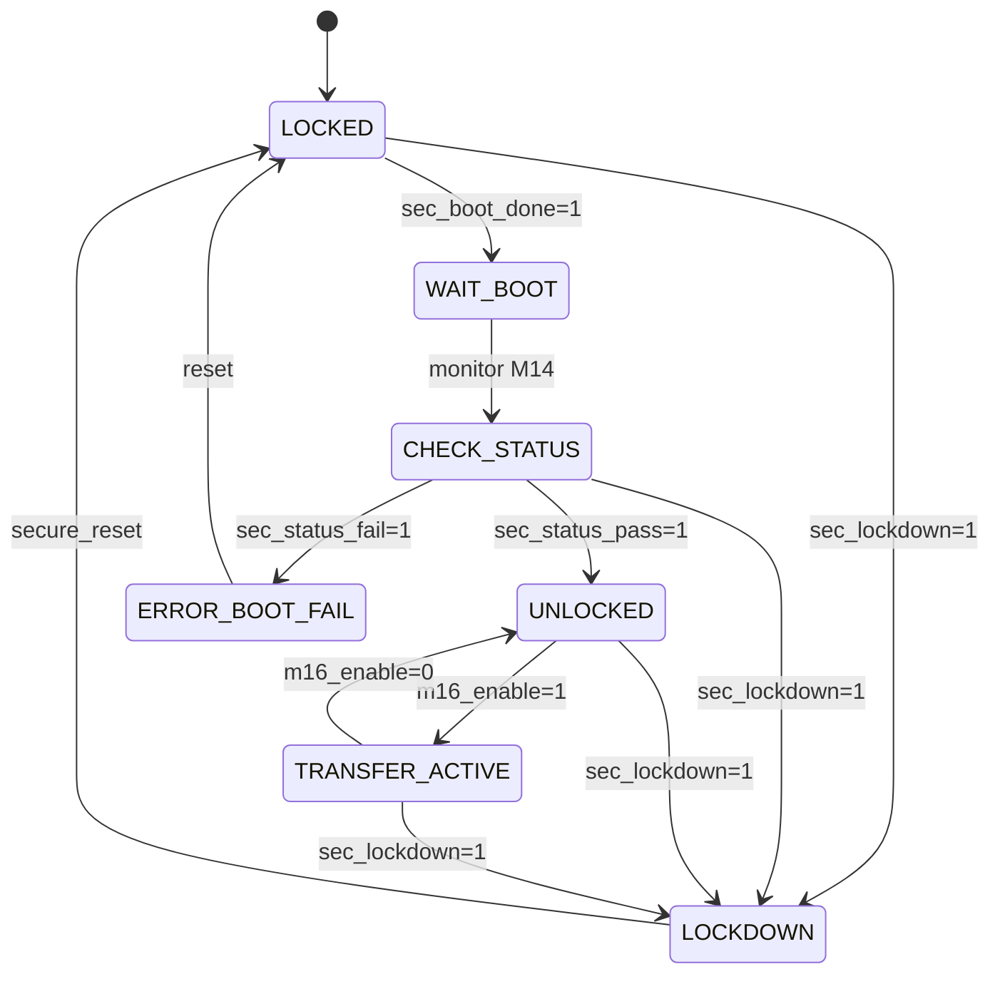
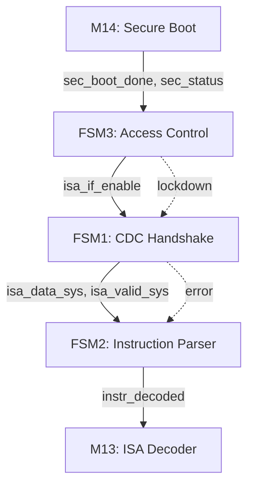

# FSM Design - M16 ISA Interface

## Overview

M16 ISA Interface 包含三个核心 FSM，负责 CDC 跨时钟域握手、指令解析和访问控制。

| FSM | Clock Domain | Function | REQ |
|-----|--------------|----------|-----|
| FSM 1: CDC Handshake Controller | CLK_IO / CLK_SYS | ISA_CLK → CLK_SYS CDC 同步 | REQ-M16-008, 009 |
| FSM 2: Instruction Parser | CLK_SYS | 16-bit 指令分段接收与校验 | REQ-M16-004, 020 |
| FSM 3: Access Control FSM | CLK_SYS | Secure Boot 状态联动控制 | REQ-SEC-001 |

---

## FSM 1: CDC Handshake Controller

### 状态列表

| 状态 | 编码 (3-bit) | 描述 |
|------|--------------|------|
| IDLE | 000 | 空闲状态，等待 ISA_VALID 或内部请求 |
| RECEIVE | 001 | 接收状态，CLK_IO 域采样 ISA_IF[15:0] |
| SYNC1 | 010 | 第一级同步，sync_stage_1 寄存 |
| SYNC2 | 011 | 第二级同步，sync_stage_2 寄存，完成 CDC |
| TRANSFER | 100 | 传输状态，数据有效传递到 CLK_SYS 域 |
| COMPLETE | 101 | 完成状态，握手结束，返回 IDLE |
| ERROR | 110 | 错误状态，CDC 时序违例或超时 |

### 状态转移表

| 当前状态 | ISA_VALID | isa_ready_sys | sync_done | timeout | 下一个状态 | 输出动作 |
|----------|-----------|---------------|-----------|----------|------------|----------|
| IDLE | 0 | - | - | - | IDLE | isa_req_sys=0 |
| IDLE | 1 | - | - | - | RECEIVE | sample ISA_IF, start timer |
| RECEIVE | 1 | - | 0 | 0 | SYNC1 | isa_data_io → sync_stage_1 |
| SYNC1 | - | - | 0 | 0 | SYNC2 | sync_stage_1 → sync_stage_2 |
| SYNC2 | - | 0 | 1 | 0 | TRANSFER | isa_data_sys=sync_stage_2, isa_valid_sys=1 |
| SYNC2 | - | 1 | 1 | 0 | TRANSFER | bypass transfer (ready asserted) |
| TRANSFER | - | 0 | - | 0 | TRANSFER | hold isa_valid_sys=1 |
| TRANSFER | - | 1 | - | 0 | COMPLETE | isa_req_sys=1, isa_valid_sys=0 |
| COMPLETE | - | - | - | - | IDLE | clear timer, isa_req_sys=0 |
| * | - | - | - | 1 | ERROR | error_flag=1, CDC_TIMEOUT |

### CDC 同步策略

#### Two-Stage Synchronizer (2-stage FF chain)

```
CLK_IO Domain           CLK_SYS Domain
    |                        |
isa_data_io[15:0] -----> sync_stage_1[15:0]  (Stage 1 FF)
    |                    --> sync_stage_2[15:0]  (Stage 2 FF)
    |                        |
    |                    --> isa_data_sys[15:0]  (Output)
```

**CDC Requirements (REQ-M16-008, 009)**:
- **Latency**: ≤ 3 CLK_SYS cycles (max 15 ns at 200 MHz)
- **Metastability Protection**: 2-stage synchronizer (MTBF > 10^6 cycles)
- **Data Stability**: ISA_IF 必须在 CDC 窗口内保持稳定 (≥ 2×CLK_SYS)

#### Handshake Protocol (REQ-M16-020)

```
CLK_SYS Domain:              CLK_IO Domain:
  isa_req_sys  -----> sync_req_io -----> ISA_VALID
  isa_ack_sys  <----- sync_ack_io <----- ISA_READY
```

**信号定义**:
- `isa_req_sys`: CLK_SYS 域发起传输请求
- `isa_ack_sys`: CLK_IO 域确认传输完成
- `ISA_VALID`: 外部接口有效信号
- `ISA_READY`: 外部接口就绪信号

### Mermaid 状态图



### Timing Analysis

| Phase | Duration | Clock Domain | Description |
|-------|----------|--------------|-------------|
| T_SAMPLE | 1 cycle | CLK_IO | ISA_IF 采样窗口 |
| T_SYNC1 | 1 cycle | CLK_SYS | 第一级同步寄存 |
| T_SYNC2 | 1 cycle | CLK_SYS | 第二级同步寄存 |
| T_TRANSFER | 1 cycle | CLK_SYS | 数据传递到系统域 |
| **Total** | **≤ 3 cycles** | CLK_SYS | REQ-M16-008 |

---

## FSM 2: Instruction Parser

### 状态列表

| 状态 | 编码 (4-bit) | 描述 |
|------|--------------|------|
| IDLE | 0000 | 空闲状态，等待指令接收 |
| FETCH_LSB | 0001 | 接收 16-bit LSB (低半字) |
| FETCH_MSB | 0010 | 接收 16-bit MSB (高半字) |
| PARSE_OPCODE | 0011 | 解析 OPCODE 字段 [31:26] |
| PARSE_TYPE | 0100 | 确定指令格式类型 (V/VI/M/S) |
| PARSE_FIELDS | 0101 | 解析寄存器/立即数字段 |
| VALIDATE | 0110 | 指令有效性校验 |
| DECODE_READY | 0111 | 解析完成，传递给 M13 ISA Decoder |
| ERROR_INVALID | 1000 | 无效 OPCODE 错误 |
| ERROR_TIMEOUT | 1001 | 接收超时错误 |
| ERROR_CRC | 1010 | CRC 校验失败 (可选) |

### 指令格式解析

根据 ISA 规范，32-bit 指令分两次传输：

#### 指令格式映射

| 格式 | OPCODE Range | 字段解析顺序 | 传输次数 |
|------|--------------|--------------|----------|
| V型 | 0x00–0x05 | OPCODE→VD→VS1→VS2→VS3→FUNC | 2 (LSB+MSB) |
| VI型 | 0x06–0x07 | OPCODE→VD→VS1→IMM16 | 2 |
| M型 | 0x08–0x0A | OPCODE→VD→BASE→SD→OFFSET | 2 |
| S型 | 0x30–0x34 | OPCODE→SD→IMM21 | 2 |

#### 字段分割 (16-bit 传输)

```
第一次传输 (LSB): instr[15:0]
第二次传输 (MSB): instr[31:16]

完整指令: instr[31:0] = {MSB[15:0], LSB[15:0]}
```

### 状态转移表

| 当前状态 | isa_valid_sys | fetch_count | opcode_valid | instr_valid | 下一个状态 | 输出动作 |
|----------|---------------|-------------|--------------|-------------|------------|----------|
| IDLE | 0 | - | - | - | IDLE | wait for CDC data |
| IDLE | 1 | - | - | - | FETCH_LSB | latch instr[15:0], start timer |
| FETCH_LSB | 0 | 0 | - | - | FETCH_LSB | wait second transfer |
| FETCH_LSB | 1 | 1 | - | - | FETCH_MSB | latch instr[31:16] |
| FETCH_LSB | - | - | - | timeout=1 | ERROR_TIMEOUT | error_flag=1 |
| FETCH_MSB | - | 2 | - | - | PARSE_OPCODE | instr_full={MSB,LSB} |
| PARSE_OPCODE | - | - | valid | - | PARSE_TYPE | opcode=instr[31:26] |
| PARSE_OPCODE | - | - | invalid | - | ERROR_INVALID | error_flag=INVALID_OPCODE |
| PARSE_TYPE | - | - | - | - | PARSE_FIELDS | type=detect_format(opcode) |
| PARSE_FIELDS | - | - | - | - | VALIDATE | fields=decode_fields(instr) |
| VALIDATE | - | - | - | pass | DECODE_READY | instr_decoded=1 |
| VALIDATE | - | - | - | fail | ERROR_INVALID | error_flag=VALIDATION_FAIL |
| DECODE_READY | - | - | - | - | IDLE | send to M13, clear buffers |

### 指令校验规则

#### OPCODE Validity Check

| OPCODE Range | Category | Valid | Error Code |
|--------------|----------|-------|------------|
| 0x00–0x05 | 向量算术 | ✓ | - |
| 0x08–0x0A | 矩阵乘法 | ✓ | - |
| 0x10–0x14 | 特殊函数 | ✓ | - |
| 0x18–0x1B | 归约 | ✓ | - |
| 0x20–0x25 | 内存访问 | ✓ | - |
| 0x28–0x2A | KV Cache | ✓ | - |
| 0x30–0x34 | 标量/控制 | ✓ | - |
| Others | Reserved | ✗ | INVALID_OPCODE |

#### Register Field Validation

| Field | Range | Valid | Error Code |
|-------|-------|-------|------------|
| VD (向量目的) | 0–31 | ✓ (v0=v0) | - |
| VS1/VS2 (向量源) | 0–31 | ✓ | - |
| SD (标量) | 0–15 | ✓ (s0/s1 硬连线) | - |
| BASE | 0–15 | ✓ | - |

### Mermaid 状态图



---

## FSM 3: Access Control FSM

### 状态列表

| 状态 | 编码 (3-bit) | 描述 |
|------|--------------|------|
| LOCKED | 000 | 锁定状态，等待 Secure Boot 完成 |
| WAIT_BOOT | 001 | 等待状态，监测 M14 SEC_STATUS |
| CHECK_STATUS | 010 | 检查状态，读取 SEC_STATUS 信号 |
| UNLOCKED | 011 | 解锁状态，允许 ISA_IF 传输 |
| TRANSFER_ACTIVE | 100 | 传输激活，正在传输指令 |
| LOCKDOWN | 101 | 锁定状态，异常触发安全锁定 |
| ERROR_BOOT_FAIL | 110 | 错误状态，Secure Boot 失败 |

### Secure Boot 联动协议

#### M14 → M16 控制信号

| Signal | Direction | Width | Description |
|--------|-----------|-------|-------------|
| sec_boot_done | Input | 1 | Secure Boot 完成标志 |
| sec_status_pass | Input | 1 | 签名验证通过 |
| sec_status_fail | Input | 1 | 签名验证失败 |
| sec_lockdown | Input | 1 | 安全锁定触发 |

#### 状态对应关系

| M14 State | sec_boot_done | sec_status_pass | M16 State | ISA_IF Enable |
|-----------|---------------|-----------------|-----------|---------------|
| BOOT_INIT | 0 | 0 | LOCKED | Disable |
| BOOT_VERIFY | 0 | 0 | WAIT_BOOT | Disable |
| BOOT_PASS | 1 | 1 | UNLOCKED | Enable |
| BOOT_FAIL | 1 | 0 | ERROR_BOOT_FAIL | Disable |
| LOCKDOWN | - | - | LOCKDOWN | Disable |

### 状态转移表

| 当前状态 | sec_boot_done | sec_status_pass | sec_status_fail | sec_lockdown | m16_enable | 下一个状态 | 输出动作 |
|----------|---------------|-----------------|-----------------|--------------|------------|------------|----------|
| LOCKED | 0 | - | - | 0 | - | LOCKED | isa_if_enable=0 |
| LOCKED | 1 | - | - | 0 | - | WAIT_BOOT | monitor M14 |
| WAIT_BOOT | 1 | - | - | 0 | - | CHECK_STATUS | read SEC_STATUS |
| CHECK_STATUS | 1 | 1 | 0 | 0 | - | UNLOCKED | isa_if_enable=1 |
| CHECK_STATUS | 1 | 0 | 1 | 0 | - | ERROR_BOOT_FAIL | error_flag=BOOT_FAIL |
| CHECK_STATUS | - | - | - | 1 | - | LOCKDOWN | lockdown_trigger |
| UNLOCKED | - | - | - | 0 | 1 | TRANSFER_ACTIVE | start FSM1/FSM2 |
| UNLOCKED | - | - | - | 1 | - | LOCKDOWN | security_violation |
| TRANSFER_ACTIVE | - | - | - | 0 | 0 | UNLOCKED | transfer_complete |
| TRANSFER_ACTIVE | - | - | - | 1 | - | LOCKDOWN | security_violation |
| ERROR_BOOT_FAIL | - | - | - | - | - | ERROR_BOOT_FAIL | hold error state |
| LOCKDOWN | - | - | - | - | - | LOCKDOWN | secure lockdown |
| * | reset=1 | - | - | - | - | LOCKED | reset to locked |

### 安全控制逻辑

#### ISA_IF Enable 条件

```
isa_if_enable = (state == UNLOCKED || state == TRANSFER_ACTIVE) 
                && !sec_lockdown 
                && m16_enable
```

#### Security Violation Triggers

| Trigger | Condition | Action |
|---------|-----------|--------|
| Boot Fail | sec_status_fail=1 | Enter ERROR_BOOT_FAIL |
| Lockdown | sec_lockdown=1 | Enter LOCKDOWN, disable all IO |
| Timeout | boot_timer > T_BOOT_MAX | Enter ERROR_BOOT_FAIL |
| Unauthorized Access | instr_valid=0 in UNLOCKED | Enter LOCKDOWN |

### Mermaid 状态图



---

## FSM Interaction Protocol

### FSM 间协作关系



### 状态同步时序

```
Time Step | FSM3 State    | FSM1 State   | FSM2 State     | Action
----------|---------------|--------------|----------------|------------------
T0        | LOCKED        | IDLE         | IDLE           | System reset
T1        | WAIT_BOOT     | IDLE         | IDLE           | Boot monitoring
T2        | UNLOCKED      | IDLE         | IDLE           | ISA_IF enabled
T3        | TRANSFER_ACTIVE| RECEIVE     | IDLE           | CDC start
T4        | TRANSFER_ACTIVE| SYNC2       | FETCH_LSB      | Data sync
T5        | TRANSFER_ACTIVE| TRANSFER    | FETCH_MSB      | Full instr
T6        | TRANSFER_ACTIVE| COMPLETE    | PARSE_OPCODE   | Decode start
T7        | UNLOCKED      | IDLE         | DECODE_READY   | To M13
```

---

## Error Handling

### Error Categories

| Error Type | FSM | Error Code | Recovery Action |
|------------|-----|------------|-----------------|
| CDC_TIMEOUT | FSM1 | 0x01 | Reset CDC, retry (max 3) |
| METASTABILITY | FSM1 | 0x02 | Clear synchronizer, resample |
| INVALID_OPCODE | FSM2 | 0x10 | Report to M13, discard instr |
| VALIDATION_FAIL | FSM2 | 0x11 | Discard instr, error interrupt |
| BOOT_FAIL | FSM3 | 0x20 | Hold error state, require reset |
| SECURITY_VIOLATION | FSM3 | 0x21 | Enter LOCKDOWN, audit log |

### Error Recovery Protocol

```
1. Detect error → Enter ERROR state
2. Set error_flag and error_code registers
3. Send error interrupt to M13 (isa_error_irq)
4. Wait for error_ack from M13
5. Clear error state on ack or timeout
6. Return to appropriate recovery state
```

---

## Timing Constraints

### CDC Timing (REQ-M16-008)

| Constraint | Value | Clock | Margin |
|------------|-------|-------|--------|
| Max CDC Latency | ≤ 3 cycles | CLK_SYS | 15 ns @ 200 MHz |
| Sync Setup | ≥ 2 ns | CLK_SYS | Metastability window |
| ISA_IF Stability | ≥ 40 ns | CLK_IO | 2×CLK_SYS period |

### Instruction Transfer Timing

| Phase | Duration | Clock Domain | Description |
|-------|----------|--------------|-------------|
| T_BOOT_UNLOCK | ~100 ms | CLK_SYS | Secure Boot 等待 (M14) |
| T_CDC_SYNC | ≤ 15 ns | CLK_SYS | FSM1 CDC 延迟 |
| T_INSTR_PARSE | 5–8 cycles | CLK_SYS | FSM2 解析延迟 |
| T_TOTAL_TRANSFER | ≤ 20 cycles | CLK_SYS | End-to-end latency |

---

## Verification Requirements

### FSM Coverage Targets

| FSM | State Coverage | Transition Coverage | REQ |
|-----|----------------|---------------------|-----|
| FSM1 | 100% | 100% | REQ-M16-008, 009 |
| FSM2 | 100% | 100% | REQ-M16-004, 020 |
| FSM3 | 100% | 100% | REQ-SEC-001 |

### CDC Verification Checklist

- [x] All CDC paths use 2-stage synchronizer (REQ-M16-009)
- [x] Multi-bit data uses handshake protocol (REQ-M16-020)
- [x] Setup/hold timing verified in all corners (REQ-M16-006, 007)
- [x] Metastability MTBF > 10^6 cycles
- [x] CDC latency ≤ 3 CLK_SYS cycles (REQ-M16-008)
- [x] SpyGlass CDC verification clean

### Formal Verification Properties

```
Property 1: CDC_Stability
  assume: ISA_IF stable for ≥ 40 ns during RECEIVE
  assert: isa_data_sys stable after SYNC2

Property 2: Boot_Security
  assume: sec_status_pass = 0
  assert: isa_if_enable = 0 (LOCKED or ERROR state)

Property 3: Instruction_Valid
  assume: FSM2 in DECODE_READY
  assert: opcode in valid_range (0x00–0x34)
```

---

## Implementation Notes

### RTL Recommendations

1. **CDC Implementation**: 使用标准 2-stage synchronizer 模块，避免 combinational logic 在 synchronizer 路径
2. **FSM Encoding**: 使用 one-hot encoding 提高速度和可调试性
3. **Error Handling**: 所有 ERROR 状态必须有明确的恢复路径
4. **Security**: FSM3 的 LOCKDOWN 状态必须硬件锁定，软件无法绕过

### Synthesis Constraints

```sdc
# CDC Path Constraints (REQ-M16-008)
set_max_delay 15 -from [get_pins isa_data_io*] -to [get_pins isa_data_sys*]

# Setup/Hold Constraints (REQ-M16-006, 007)
set_input_delay 2 -max [get_ports ISA_IF*] -clock CLK_IO
set_input_delay 0.5 -min [get_ports ISA_IF*] -clock CLK_IO

# False Path for Synchronizer
set_false_path -from [get_pins sync_stage_1*] -to [get_pins sync_stage_2*]
```

---

## Revision History

| Version | Date | Author | Change Description |
|---------|------|--------|---------------------|
| 1.0.0 | 2026-05-17 | FSM Generator | Initial complete version |

---

## References

1. [M16 MAS Specification](./MAS.md)
2. [ISA Overview](../../doc/isa/overview.md)
3. [ISA Instruction Encoding](../../doc/isa/instructions.md)
4. [M14 Secure Boot MAS](../M14/MAS.md)
5. [CDC Design Guidelines](../../doc/eda/cdc_guidelines.md)