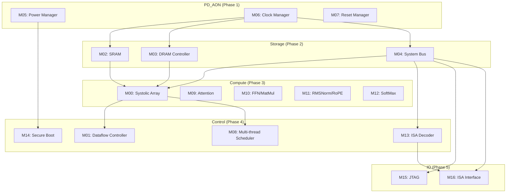

# Module Tree

## Overview

TinyStories NPU 共 17 个功能模块，按电源域和功能分类：

| Power Domain | Modules | Count |
|--------------|---------|-------|
| PD_MAIN | M00-M04, M08-M14 | 11 |
| PD_AON | M05-M07 | 3 |
| PD_IO | M15-M16 | 2 |

## Module Classification

| Type | Modules | Description |
|------|---------|-------------|
| **compute** | M00, M09-M12 | Systolic Array + Transformer Operators |
| **storage** | M02, M03 | SRAM Scratchpad + DRAM Controller |
| **interconnect** | M04, M08 | System Bus + Multi-thread Scheduler |
| **io** | M15, M16 | JTAG + ISA Interface |
| **control** | M01, M05-M07, M13, M14 | Dataflow + Power/Clock/Reset + ISA Decoder + Secure Boot |

## Module Hierarchy

```
TinyStories_NPU/
├── PD_MAIN/
│   ├── COMPUTE/
│   │   ├── M00_SystolicArray/      @compute  @D2D
│   │   ├── M09_AttentionUnit/      @compute
│   │   ├── M10_FFNMatMul/          @compute
│   │   ├── M11_RMSNormRoPE/        @compute
│   │   └── M12_SoftMax/            @compute
│   ├── CONTROL/
│   │   ├── M01_DataflowController/ @control
│   │   ├── M08_MultiThreadScheduler/ @interconnect
│   │   ├── M13_ISADecoder/         @control
│   │   └── M14_SecureBoot/         @control  @PWR
│   ├── STORAGE/
│   │   ├── M02_SRAMScratchpad/     @storage  @D2D
│   │   └── M03_DRAMController/     @storage  @D2D  @CDC
│   └── INTERCONNECT/
│   │   └── M04_SystemBus/          @interconnect
├── PD_AON/
│   ├── M05_PowerManager/           @control  @PWR
│   ├── M06_ClockManager/           @control  @CDC
│   └── M07_ResetManager/           @control
└── PD_IO/
│   ├── M15_JTAGInterface/          @io
│   └── M16_ISAInterface/           @io  @CDC
```

## Module Details

### L1 Modules (Leaf)

| ID | Name | Clock Domain | Power Domain | Type | Features |
|----|------|--------------|--------------|------|----------|
| M00 | Systolic Array | CLK_SYS | PD_MAIN | compute | WS/OS Dual-Mode, FP8/FP16/INT8 |
| M01 | Dataflow Controller | CLK_SYS | PD_MAIN | control | Spatial Pipeline, >=80% utilization |
| M02 | SRAM Scratchpad | CLK_SYS | PD_MAIN | storage | 512KB, ECC SECDED |
| M03 | DRAM Controller | CLK_SYS | PD_MAIN | storage | 3D Stacked, >=10 GB/s, ECC, @D2D |
| M04 | System Bus | CLK_SYS | PD_MAIN | interconnect | TileLink/AXI |
| M05 | Power Manager | CLK_AON | PD_AON | control | DVFS, Power Mode FSM |
| M06 | Clock Manager | CLK_AON | PD_AON | control | PLL, DVFS Clock Gen, @CDC |
| M07 | Reset Manager | CLK_AON | PD_AON | control | Reset Sequence |
| M08 | Multi-thread Scheduler | CLK_SYS | PD_MAIN | interconnect | Threads >=2 |
| M09 | Attention Unit | CLK_SYS | PD_MAIN | compute | Transformer Attention |
| M10 | FFN/MatMul Unit | CLK_SYS | PD_MAIN | compute | FFN, MatMul |
| M11 | RMSNorm/RoPE Unit | CLK_SYS | PD_MAIN | compute | Norm + Position Encoding |
| M12 | SoftMax Unit | CLK_SYS | PD_MAIN | compute | SoftMax Operator |
| M13 | ISA Decoder | CLK_SYS | PD_MAIN | control | Custom NPU ISA |
| M14 | Secure Boot | CLK_SYS | PD_MAIN | control | Signature Verify, OTP/eFuse |
| M15 | JTAG Interface | CLK_IO | PD_IO | io | IEEE 1149.1, TEST_MODE Control |
| M16 | ISA Interface | CLK_IO | PD_IO | io | 16-bit Instruction I/O, @CDC |

## Implementation Priority

| Phase | Modules | Dependencies |
|-------|---------|--------------|
| P1 | M05, M06, M07 | None (AON, independent) |
| P2 | M02, M03, M04 | M06 (clock) |
| P3 | M00, M09-M12 | M02, M03, M04 |
| P4 | M01, M08 | M00, M09-M12 |
| P5 | M13, M14 | M04, M05 |
| P6 | M15, M16 | M04, M13 |

## Parallel Implementation Matrix

| Batch | Modules | Max Parallel |
|-------|---------|--------------|
| Batch 1 | M05, M06, M07 | 3 |
| Batch 2 | M02, M03, M04 | 3 |
| Batch 3 | M00, M09, M10, M11, M12 | 5 |
| Batch 4 | M01, M08, M13, M14 | 4 |
| Batch 5 | M15, M16 | 2 |

## Module Dependency Graph



## Next Steps

1. 为每个 L1 模块生成 5 个文件：MAS.md, FSM.md, datapath.md, verification.md, DFT.md
2. 按 Phase 顺序并行填充（每批 ≤ 6 个 agent）
3. 生成全局 plan.md