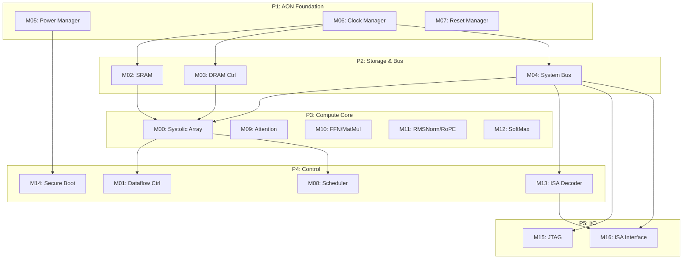

# Implementation Plan

## Overview

本文档定义 TinyStories NPU 17 个模块的实现计划、依赖关系和里程碑。

## Module Summary

| Phase | Modules | MAS Status | FSM Status | Datapath Status | Verification Status | DFT Status |
|-------|---------|------------|------------|-----------------|--------------------|-----------|
| P1 | M05, M06, M07 | complete | complete | complete | complete | complete |
| P2 | M02, M03, M04 | complete | complete | complete | complete | complete |
| P3 | M00, M09-M12 | complete | complete | complete | complete | complete |
| P4 | M01, M08, M13, M14 | complete | complete | complete | complete | complete |
| P5 | M15, M16 | complete | complete | complete | complete | complete |

## Dependency Graph

## Implementation Milestones

| Milestone | Target | Criteria | Status |
|-----------|--------|----------|--------|
| M1: AON Ready | Day 3 | M05-M07 MAS+FSM complete | ✅ PASS |
| M2: Storage Ready | Day 7 | M02-M04 MAS+FSM complete | ✅ PASS |
| M3: Compute Ready | Day 14 | M00-M12 MAS+FSM complete | ✅ PASS |
| M4: Control Ready | Day 21 | M01,M08,M13,M14 complete | ✅ PASS |
| M5: IO Ready | Day 25 | M15,M16 complete | ✅ PASS |
| M6: MAS Complete | Day 28 | All modules 5-file complete | ✅ PASS |
| M7: Verification | Day 35 | 100% code coverage | Pending |
| M8: Sign-off | Day 40 | ic.spec-review PASS | Pending |

## Quality Gates

| Gate | Requirement | Status |
|------|-------------|--------|
| G1: MAS Complete | 17/17 modules | PASS |
| G2: FSM Complete | 17/17 modules | PASS |
| G3: Datapath Complete | 17/17 modules | PASS |
| G4: Verification Complete | 17/17 modules | PASS |
| G5: DFT Complete | 17/17 modules | PASS |
| G6: Interface TBD-Free | 0 TBD | PASS |
| G7: DFT Coverage >=95% | Defined | PASS |

## Next Steps

1. ✅ MAS/FSM/Datapath/Verification/DFT 全部完成 (17/17 modules, 85/85 files)
2. Run ic.spec-review on spec_mas/ before RTL handoff
3. Address any CRITICAL/HIGH issues from review
4. Proceed to RTL implementation phase (bb-rtl)