# 第 1 章：AI 原生芯片设计范式

> **核心理念**：AI 原生不是"AI 辅助"，而是"AI 主导执行、人主导决策"——人写规范，Agent 生成，人审结果，迭代收敛。

## 1.1 从传统流程到 AI 原生流程

芯片设计是一个高度复杂的工程活动，传统流程中工程师需要亲手完成从需求定义到版图签核的每一个环节。随着 AI 能力的飞速发展，我们正在经历一场设计范式的根本性变革。Babel 项目将芯片设计流程分为三种模式，理解它们的区别是掌握 AI 原生方法论的前提。

### 模式一：传统 IC 设计——人是执行者

在传统 IC 设计流程中，工程师是每一步的直接执行者。从撰写设计文档、编写 RTL 代码、搭建验证环境、调试综合约束到完成物理设计，所有工作都由人手工完成。这种模式的核心瓶颈在于：

- **人力密集**：一个中等规模的 SoC 项目通常需要数十名工程师协作数月甚至数年
- **迭代缓慢**：每次设计变更都需要人工修改文档、代码、测试用例，牵一发而动全身
- **知识孤岛**：关键设计决策和经验往往存储在个别资深工程师的脑中，难以传承和复用

### 模式二：AI 辅助设计——人是执行者，AI 帮忙

AI 辅助模式是当前业界较为普遍的做法。工程师仍然是主要的执行者，但在局部环节借助 AI 工具提升效率：

- 代码编辑器中的 AI 补全（如 Copilot 辅助写 Verilog）
- AI 聊天工具帮助解释报错信息或查找文档
- AI 辅助生成部分测试用例或脚本

这种模式的核心局限是：AI 只是"工具"，不参与设计决策，不驱动流程，不生成系统级输出。工程师的思维模式仍然是"我来做，AI 帮帮忙"。

### 模式三：AI 原生设计——AI 是执行者，人做决策

这是 Babel 项目所实践的范式。在 AI 原生模式中，角色发生了根本性的转变：

- **人**的角色：定义需求（PRD）、做架构决策、审查 Agent 输出、把控质量标准
- **AI Agent** 的角色：从规范文档生成架构设计、微架构规范、RTL 代码、验证环境、综合脚本、物理设计——覆盖芯片设计的全流程

```mermaid
flowchart TB
    subgraph Traditional["传统模式：人是执行者"]
        direction LR
        T1[工程师写文档] --> T2[工程师写 RTL]
        T2 --> T3[工程师写 TB]
        T3 --> T4[工程师调综合]
        T4 --> T5[工程师做 PD]
    end

    subgraph AIAssisted["AI 辅助模式：人执行 + AI 帮忙"]
        direction LR
        A1[工程师写文档] --> A2[工程师写 RTL<br/>AI 补全]
        A2 --> A3[工程师写 TB<br/>AI 补全]
        A3 --> A4[工程师调综合<br/>AI 建议]
        A4 --> A5[工程师做 PD<br/>AI 建议]
    end

    subgraph AINative["AI 原生模式：AI 执行 + 人决策"]
        direction LR
        N1[人写 PRD] --> N2[Agent 生成<br/>ARCH]
        N2 --> N3[Agent 生成<br/>MAS]
        N3 --> N4[Agent 生成<br/>RTL + TB]
        N4 --> N5[Agent 执行<br/>综合 + PD]
        N5 -.->|人审查反馈| N1
    end
```



关键区别不在于"用了多少 AI"，而在于**谁在执行、谁在决策**。在 AI 原生模式中，人从"执行者"转变为"架构师 + 审查者"，Agent 承担了绝大部分的重复性、规则性和可形式化的工作。

## 1.2 Babel 项目核心理念

Babel 项目是一个开源的 AI 原生 Chiplet 设计流程，它将上述理念落地为一套可操作的方法论和工具链。其核心理念包含四个支柱：

### 支柱一：Spec-Driven Development（规范驱动开发）

规范文档是整个设计流程的**唯一真相源**（Single Source of Truth）。Agent 不从口头讨论、聊天记录或模糊的需求描述中获取信息——它只从结构化的规范文档中读取输入。

Babel 的规范文档层次为：

```
PRD (Product Requirements Document)  ← 产品需求，人来定义
  └── ARCH (Architecture Spec)        ← 架构规范，人定方向 + Agent 展开
       └── MAS (Micro-Architecture Spec) ← 微架构规范，Agent 生成 + 人审查
            └── RTL Code              ← 寄存器传输级代码，Agent 生成
```

每一层文档都有明确的格式要求和质量标准，确保 Agent 能够获得充分且无歧义的输入。以 Babel 的 PRD 为例，每一条需求都有唯一的 REQ ID、可量化的指标和明确的验证方法。例如：

| REQ ID | 需求描述 | 量化指标 |
|--------|---------|---------|
| REQ-COMPUTE-001 | FP8 峰值吞吐量 | >= 2 TOPS @ TT/0.9V, 500 MHz |
| REQ-MEM-002 | DRAM 聚合带宽 | >= 10 GB/s（读+写） |
| REQ-PWR-001 | 峰值 TDP | <= 2 W（设计目标 <= 1.8 W） |

这种精确的需求定义是 Agent 能够正确生成下游输出的前提。

### 支柱二：Agent Pipeline（智能体流水线）

Babel 将芯片设计分解为一条由专业 Agent 组成的流水线：

```
PRD → ARCH → MAS → RTL → VER → SYN → PD
```

每个阶段由专门的 Agent 负责执行：
- `bba-architect`：负责架构设计阶段，从 PRD 生成 ARCH 和 MAS 文档
- `bba-guru-rtl`：负责 RTL 生成，从 MAS 生成可综合的 SystemVerilog 代码
- `bba-guru-verification`：负责验证闭环，生成 Testbench 并驱动覆盖率收敛
- `bba-guru-synthesis`：负责逻辑综合，自动编写 SDC 约束并迭代到时序收敛
- `bba-guru-pd`：负责物理设计，执行 Floorplan 到 GDSII 的全流程

每个 Agent 都有明确的输入、输出和质量门控（Quality Gate），上游的输出经过质量检查后才能流入下游。

### 支柱三：Quality Gates（质量门控）

每个阶段的输出都必须通过自动化的质量检查，Babel 定义了四类质量门控：

| 质量门控 | 检查对象 | 通过标准 |
|---------|---------|---------|
| RTL Quality Gate | SystemVerilog 代码 | Lint clean、CDC clean、可综合性验证 |
| Test Quality Gate | Testbench 与仿真结果 | 功能覆盖率 100%、代码覆盖率 100% |
| Synthesis Quality Gate | 综合报告与网表 | WNS >= 0（时序收敛）、面积在预算内 |
| PD Quality Gate | 版图与物理验证结果 | DRC = 0、LVS clean、Post-PD 时序满足 |

Agent 会自动运行质量门控检查，不达标则自动迭代修复，直到满足标准或报告给人工决策。

### 支柱四：开源 EDA 工具链

Babel 全部基于开源 EDA 工具构建，降低芯片设计的准入门槛：

| 工具 | 版本 | 功能 |
|------|------|------|
| Yosys | 0.35 | RTL 综合 |
| OpenSTA | 2.2.0 | 静态时序分析 |
| Verilator | latest | Verilog 仿真 |
| Magic | 8.3.641 | 版图查看与 DRC |
| Netgen | 1.5 | LVS 网表比对 |
| QRouter | 1.4 | 详细布线 |
| KLayout | 0.30.8 | GDSII 查看与 DRC |

工艺库采用 ASAP7（7nm 预测性工艺），这是一个学术界的开源 PDK，让任何人都可以在没有商业许可的情况下学习和实践芯片设计。

## 1.3 Babel 项目结构速览

了解项目的目录结构是开始实践的第一步。Babel 项目的核心目录组织如下：

```
Babel/
├── spec/                    # 规范文档（唯一真相源）
│   ├── PRD/                 # 产品需求文档
│   │   └── PRD.md           # 产品需求定义
│   ├── ARCH/                # 架构规范
│   │   ├── chip_overview.md # 芯片概览
│   │   ├── block_diagram.md # 模块框图与模块索引
│   │   └── ...              # IO、地址映射、时钟规划等
│   └── MAS/                 # 微架构规范
│       ├── module_tree.md   # 模块层次树
│       ├── plan.md          # 实现计划与并行矩阵
│       └── ...              # 各模块详细规范
│
├── rtl/                     # RTL 设计源码
│   └── designs/             # 设计项目
│       ├── NPU_top/         # NPU 顶层项目
│       └── tinystories_npu/ # TinyStories NPU 项目
│
├── designs/                 # 设计输出（GDSII、综合报告、PD 报告）
│   ├── NPU_top/
│   └── tinystories_npu/
│
├── doc/                     # 技术文档
│   ├── operators/           # 算子文档（attention, matmul, rmsnorm, rope）
│   ├── isa/                 # NPU 指令集文档
│   └── eda/                 # EDA 工具文档
│
├── wiki/                    # 知识库
│   ├── cbb/                 # Common Building Blocks（可复用模块）
│   ├── codingstyle/         # 编码规范
│   └── protocols/           # 协议文档
│
├── libs/                    # 技术库（ASAP7 7nm PDK）
├── .claude/                 # Claude Code 配置
│   └── skills/              # 自定义 Skills（bb-* 系列命令）
│
├── CLAUDE.md                # 项目级 AI 协作规则
└── tutorial/                # 本教程
```

**关键文件说明**：

- **`CLAUDE.md`**：项目级的 AI 协作配置文件。Claude Code 启动时会自动读取这个文件，了解项目的目录结构、工具链配置、可用 Skill 等信息。它是 Agent 理解项目上下文的入口。
- **`spec/`**：规范文档目录。这是整个设计流程的"宪法"，所有 Agent 的输出都源于这里的定义。
- **`.claude/skills/`**：自定义 Skill 定义目录。Babel 定义了数十个专用 Skill（如 `bb-invoke-yosys`、`bb-check-lint` 等），它们是 Agent 执行具体任务的标准化接口。
- **`spec/MAS/plan.md`**：MAS 实现计划，定义了模块的实现顺序（叶子优先）和并行矩阵，指导 Agent 按正确的依赖顺序生成 RTL。

## 1.4 角色转变：从"工程师"到"架构师 + 审查者"

AI 原生模式最深刻的变化不是工具，而是**人的角色定位**。在传统流程中，工程师的时间分配大致为：20% 思考设计、80% 编码和调试。在 AI 原生模式下，这个比例被翻转：80% 的时间用于规范定义、输出审查和关键决策，20% 的时间用于手动干预和调试。

### 人机分工矩阵

| 任务 | 传统模式 | AI 原生模式 | 人的角色变化 |
|------|---------|------------|-------------|
| 需求定义 | 人独立完成 | 人主导，AI 辅助细化和一致性检查 | 决策者（不变） |
| 架构设计 | 人独立完成 | 人定核心决策，Agent 展开细节文档 | 决策者 + 审查者 |
| 微架构规范 | 人手工撰写 | Agent 从 ARCH 生成，人审查确认 | 审查者 |
| RTL 编码 | 人逐行编写 | Agent 从 MAS 自动生成，人审查关键模块 | 审查者 |
| 验证 | 人写 TB + 跑仿真 | Agent 生成 TB + 驱动覆盖率收敛 | 审查者 + 验收者 |
| 综合 | 人调约束 + 分析报告 | Agent 迭代约束到时序收敛，人审查结果 | 审查者 |
| 物理设计 | 人做 FP/Placement/Routing | Agent 执行全流程，人审查 DRC/LVS | 审查者 |

### 你需要做什么

作为 AI 原生模式下的工程师，你的核心职责包括：

1. **写清楚规范**：PRD 中的每一条需求都应该是 SMART 的（Specific、Measurable、Achievable、Relevant、Time-bound）。模糊的需求会导致 Agent 生成模糊的输出。

2. **做关键决策**：架构层面的核心选择（如数据通路宽度、存储层次结构、时钟域划分）需要人来做。Agent 可以提供分析和建议，但决策权在人。

3. **审查 Agent 输出**：Agent 生成的每一份文档、每一段代码、每一个报告都需要经过人的审查。审查不是逐行检查，而是聚焦于功能正确性、设计合理性和与规范的一致性。

4. **提供有效反馈**：当 Agent 的输出不符合预期时，你需要能够清晰地描述问题所在，给出修正方向。这是迭代收敛的关键。

### Agent 做什么

Agent 在你的指挥下承担以下工作：

- 从规范文档生成下游输出（文档、代码、脚本）
- 运行 EDA 工具并分析结果
- 自动修复质量门控检查中发现的问题
- 维护文档间的一致性和可追溯性
- 记录设计决策和变更历史

## 1.5 与传统 IC 设计流程的完整对比

下表从多个维度对比传统 IC 设计流程与 Babel AI 原生流程的差异：

| 维度 | 传统 IC 设计 | Babel AI 原生设计 |
|------|-------------|------------------|
| **设计起点** | 工程师根据经验开始编码 | 从结构化 PRD 文档开始 |
| **知识载体** | 工程师的经验和记忆 | 规范文档 + Agent 知识库 |
| **迭代方式** | 手工修改后重新验证 | Agent 自动迭代后由人审查确认 |
| **质量保证** | 同行评审 + 人工检查 | 自动化 Quality Gate + 人审查 |
| **文档作用** | 事后记录，常与实际脱节 | 唯一真相源，驱动全流程 |
| **工具使用** | 工程师手动操作 EDA 工具 | Agent 通过标准化 Skill 调用工具 |
| **错误定位** | 人工分析波形和日志 | Agent 自动分析并定位根因 |
| **版本管理** | Git 管理代码 | Git 管理代码 + 规范文档 + 设计产物 |
| **知识传承** | 依赖文档和培训 | 规范文档即知识，新人可直接驱动 Agent |
| **准入门槛** | 需要数年 IC 设计经验 | 有基础知识即可开始，Agent 弥补经验差距 |
| **设计复用** | IP 库 + 手动集成 | 规范模板 + Agent 自动生成 |
| **项目周期** | 数月到数年 | 显著缩短（Agent 承担大量重复性工作） |

### 一个具体的例子：NPU 脉动阵列设计

以 Babel 项目中的 NPU 脉动阵列（Systolic Array, M00）设计为例，展示两种模式下的工作差异。

**传统模式**：
1. 工程师阅读论文，理解脉动阵列原理（2-3 天）
2. 工程师设计 PE（Processing Element）结构，画出框图（1-2 天）
3. 工程师编写 PE 的 Verilog 代码（2-3 天）
4. 工程师搭建阵列并编写顶层代码（2-3 天）
5. 工程师编写 Testbench 验证功能（2-3 天）
6. 工程师调试时序，可能修改流水线级数（1-2 天）

**AI 原生模式**：
1. 人在 PRD 中定义：支持 FP8/FP16/INT8 精度，WS/OS 双模式，峰值算力 >= 2 TOPS（PRD REQ-COMPUTE-001 ~ 004）
2. 人在 ARCH 中决策：脉动阵列规模、数据流方向、累加器结构
3. 调用 `/bba-architect` 生成 MAS，细化 M00 的端口、时序、行为定义
4. 调用 `/bba-guru-rtl` 生成 SystemVerilog 代码，自动通过 Lint/CDC 检查
5. 调用 `/bba-guru-verification` 驱动验证覆盖率到 100%
6. 人审查关键模块代码和验证结果

人的时间从"亲手编码"转移到"定义清楚要什么"和"审查结果对不对"。

### 什么时候 AI 原生模式最有效

AI 原生模式并不是万能的。它在以下场景中最能发挥价值：

- **有明确规范的项目**：需求可量化、接口可定义、行为可描述
- **规则性强的设计**：标准单元、协议接口、存储控制器等
- **迭代密集型任务**：综合约束调整、时序优化、DRC 修复等
- **教学和研究场景**：快速探索设计方案，降低试错成本

而在以下场景中，人的判断仍然不可或缺：

- **创新性架构**：全新的计算范式、非标准的流水线结构
- **模拟/混合信号设计**：PLL、ADC/DAC 等需要物理直觉的电路
- **极端优化**：对面积、功耗、性能有极致要求的场景
- **工艺相关的决策**：特定工艺节点的设计规则、可靠性约束

## 本章小结

1. **AI 原生不等于 AI 辅助**：AI 辅助是"人干活，AI 帮忙"；AI 原生是"AI 干活，人决策"。这是根本性的范式转变，不是程度差异。

2. **规范文档是唯一真相源**：Babel 流程中的一切——架构、代码、验证、综合、版图——都从规范文档推导而来。写好规范是整个流程成败的关键。

3. **Agent Pipeline 驱动全流程**：PRD → ARCH → MAS → RTL → VER → SYN → PD，每个阶段由专业 Agent 执行，通过 Quality Gate 保证质量。

4. **人的角色是架构师 + 审查者**：你负责定义"要什么"和判断"对不对"，Agent 负责"怎么做"。这种分工让工程师能够将精力集中在最有价值的决策上。

5. **开源工具链降低门槛**：Babel 基于 Yosys、OpenSTA、Verilator 等开源 EDA 工具和 ASAP7 开源 PDK，让任何人都可以学习和实践 AI 原生芯片设计。
