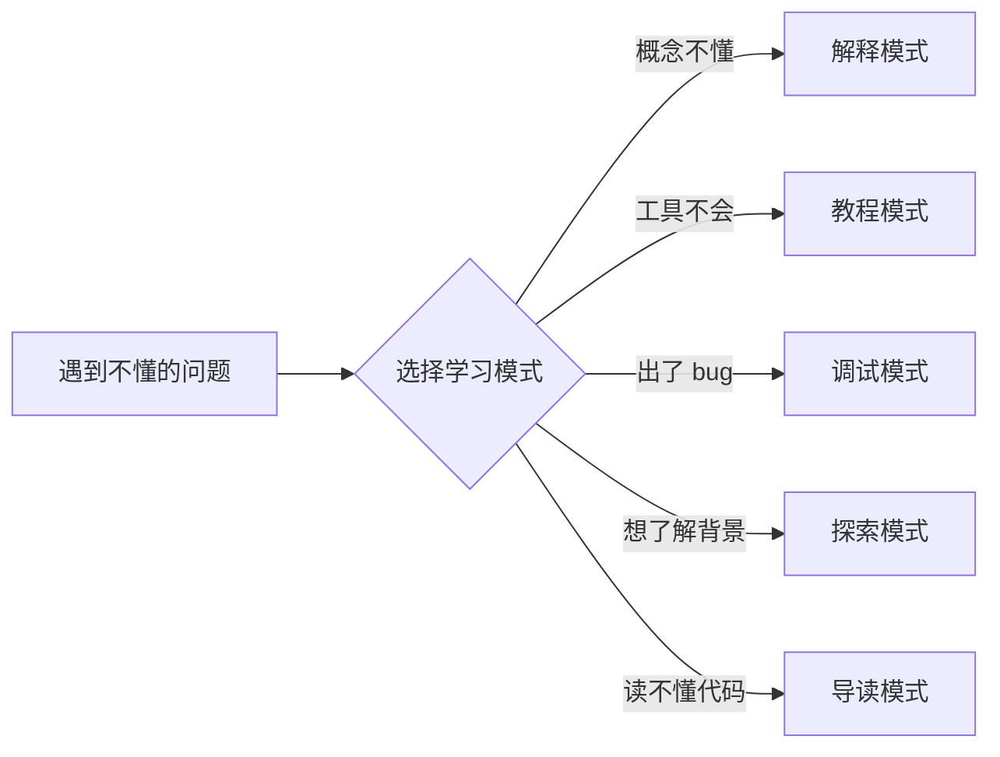

# 第 3 章：用 Claude Code 学习/研究/搜索任何问题

> **本章核心**：AI 原生不只是"用 AI 干活"，更是"用 AI 学习"——Claude Code 是你随时可调用的 24/7 专家导师，掌握对话式学习的能力将极大加速你的成长。

## 3.1 AI 辅助学习的范式转变

### 从"查文档 + 搜索引擎"到"对话式学习"

传统的学习路径是线性的、被动的：遇到问题 → 搜索引擎 → 翻文档 → 看论坛帖子 → 拼凑答案。这个过程往往耗时且碎片化，尤其是对于芯片设计这种专业领域——很多关键知识散落在论文、教科书、EDA 工具手册和资深工程师的经验中，不容易找到。

AI 辅助学习彻底改变了这个模式。通过 Claude Code，你可以：

- **即时获得专家级解答**：无需等待，无需筛选搜索结果
- **深度追问**：不满足于表面答案，可以继续深挖底层原理
- **个性化学习**：AI 会根据你的知识水平和学习目标调整解释的深度
- **跨领域连接**：AI 能够帮你建立不同概念之间的联系

### Claude Code 作为 24/7 专家导师

Claude Code 的优势在于它不仅是一个聊天机器人，还是一个可以直接操作你的项目环境的 Agent。这意味着：

- 它可以**读取你项目中的文件**来回答与你项目相关的问题
- 它可以**运行命令**来验证答案（如运行仿真、检查工具版本）
- 它可以**生成示例代码**并直接在你的项目中测试
- 它可以**分析错误日志**并给出具体的修复建议

例如，你可以直接问："读取 `spec/ARCH/block_diagram.md`，告诉我 M00_SystolicArray 的接口信号有哪些？每个信号的位宽是多少？"——Claude Code 会直接读取文件并给出精确回答。

### 学习不等于记忆

一个常见的误区是把"学到了"等同于"记住了"。在 AI 时代，学习的核心不是记忆事实，而是**建立知识连接**——理解概念之间的关系、掌握推理方法、形成直觉判断。

Claude Code 可以帮你建立这些连接：当你学习一个新的硬件设计概念时，让 AI 将它与你已知的概念做类比、指出它们的关系和区别。这样建立的知识网络比孤立的事实更加牢固。

## 3.2 五种学习模式

面对不同的学习需求，Babel 项目中常用的学习模式可以归纳为五种。每种模式都有对应的 Prompt 模板和最佳实践。



### 模式 1：概念理解（Explain Mode）

**场景**：遇到不懂的专业术语或概念。

**Prompt 模板**：
```
用 3 个层次解释 [概念]：
1. 一句话通俗解释（给外行听）
2. 技术解释（给电子系本科生听）
3. 深入细节（包含数学/物理原理）
最后给一个类比帮助理解。
```

**芯片设计示例**：

**示例 1**："用三个层次解释 setup time 和 hold time。"

AI 的回答会覆盖：
- 通俗层：就像赶火车——你得在火车开之前到站台（setup），火车来了之后你得站稳别掉下去（hold）
- 技术层：setup time 是数据在时钟边沿之前必须稳定的最小时间；hold time 是数据在时钟边沿之后必须继续保持稳定的最小时间
- 物理层：由触发器内部传输路径延迟差异决定，违反会导致亚稳态（metastability）

**示例 2**："什么是亚稳态？为什么跨时钟域需要两级同步器？"

**示例 3**："脉动阵列为什么适合矩阵乘法？它相比直接并行乘加有什么优势？"

### 模式 2：工具教程（Tutorial Mode）

**场景**：学习某个 EDA 工具或技术的使用方法。

**Prompt 模板**：
```
我要学习 [工具名] 的 [具体功能]。
请给出：
1. 最小可运行示例（Hello World 级别）
2. 逐步解释每一行在做什么
3. 常见错误和解决方法
4. 进阶用法
```

**芯片设计示例**：

**示例 1**："教我如何用 Yosys 综合一个 4-bit 计数器。"

AI 会给出完整的综合流程：

```tcl
# Yosys 综合脚本示例
read_verilog counter.v        # 读取 RTL
hierarchy -top counter         # 设置顶层模块
proc; opt; fsm; opt; memory; opt  # 标准优化流程
techmap; opt                   # 技术映射
dfflibmap -liberty asap7.lib  # 映射到工艺库触发器
abc -liberty asap7.lib        # 逻辑优化与映射
write_verilog counter_synth.v # 输出综合后网表
stat -liberty asap7.lib       # 统计面积和单元数
```

然后逐行解释每个命令的作用、为什么按这个顺序执行、如果跳过某步会发生什么。

**示例 2**："Verilator 怎么生成 VCD 波形文件？"

**示例 3**："OpenSTA 的 SDC 约束怎么写？create_clock 和 set_input_delay 分别是什么意思？"

### 模式 3：问题诊断（Debug Mode）

**场景**：遇到错误、bug、不符合预期的行为。

**Prompt 模板**：
```
我遇到了这个问题：
[粘贴错误信息或描述现象]

我的代码/环境是：
[粘贴相关代码或环境信息]

请：
1. 分析可能的原因（列出 3-5 个最可能的）
2. 给出验证每个假设的方法
3. 给出最可能的解决方案
```

**芯片设计示例**：

**示例 1**："综合报告里有 setup time violation，WNS = -0.3ns，关键路径经过 M00_SystolicArray 的 FP32 乘法器。怎么定位和修复？"

AI 的分析可能包括：
- 原因 1：FP32 乘法器关键路径过长（PRD 风险表中提到 ~1.8ns，500MHz 周期 2ns，margin 仅 0.2ns）
- 原因 2：SDC 约束的 clock period 设置不合理
- 原因 3：工艺映射未选择最优速度的单元
- 验证方法：查看 OpenSTA 的 path report，确认每一级的延迟贡献
- 解决方案：插入流水线寄存器拆分关键路径、调整约束或换用更快（面积更大）的工艺库单元

**示例 2**："Verilator 仿真结果和预期不符，波形显示 AXI valid 信号一直是 X（不定态），为什么？"

### 模式 4：知识探索（Explore Mode）

**场景**：想了解某个领域的背景、现状、发展趋势。

**Prompt 模板**：
```
我想深入了解 [主题]。请给出：
1. 历史背景（这个技术为什么出现？）
2. 核心原理（它是怎么工作的？）
3. 当前应用（谁在用？用在哪？）
4. 发展趋势（未来方向是什么？）
5. 推荐资源（论文/书籍/课程）
```

**芯片设计示例**：

**示例 1**："Chiplet 技术的前世今生。为什么业界从单片 SoC 转向 Chiplet？"

AI 的回答会涵盖：从摩尔定律放缓 → 光罩极限（reticle limit）→ 良率问题 → Chiplet 的优势（异构集成、良率提升、设计复用）→ 当前应用（AMD EPYC、Intel Ponte Vecchio）→ 标准进展（UCIe）→ 未来方向（3D 堆叠、光互连）。

**示例 2**："开源 EDA 工具的发展现状。与商业工具（Synopsys/Cadence）的差距在哪里？"

**示例 3**："RISC-V 为什么火？和 ARM 的竞争格局如何？"

### 模式 5：代码导读（Code Reading Mode）

**场景**：阅读开源代码或项目中的复杂模块。

**Prompt 模板**：
```
我要读懂 [文件/模块名] 的代码。
请：
1. 先给出整体架构（这个模块做什么？输入输出是什么？）
2. 逐段解释关键代码（标注行号）
3. 画出数据流图或状态转移图
4. 指出设计亮点和潜在问题
```

**芯片设计示例**：

**示例 1**："导读 NPU_top 的 dataflow_controller.v，我想知道它的状态机是怎么调度脉动阵列的。"

Claude Code 可以直接读取项目中的 RTL 文件，逐段分析代码逻辑，画出状态转移图，并指出设计中的关键决策点。

**示例 2**："这个 AXI4-Lite slave 模块是怎么处理握手的？valid/ready 信号在什么条件下会拉高？"

## 3.3 高效提问的技巧

掌握以下技巧可以显著提高你从 AI 获得的学习质量。

### 技巧 1：提供上下文

不要问孤立的问题。给出背景信息让 AI 理解你的知识水平和学习目标。

**差**："什么是 CDC？"

**好**："我正在审查 Babel NPU 的 RTL 代码，发现 Magic 报告了 CDC 违规，信号从 CLK_SYS（500MHz）域传到 CLK_IO（50MHz）域。我有数字电路基础但不太了解跨时钟域处理。请解释 CDC 问题的本质，以及为什么两级触发器同步是最基本的解决方案。"

### 技巧 2：明确目标

告诉 AI 你想达到什么目的，而不仅仅是问一个问题。

**差**："讲讲 AXI 协议。"

**好**："我需要在 Babel NPU 的 System Bus（M04）中实现 AXI4 接口。请重点讲解 AXI4 的突发传输（burst）机制和响应信号（BRESP/RRESP），以及如何验证一个 AXI master 的行为是否符合协议。"

### 技巧 3：分步提问

复杂问题拆成多个小问题，逐步深入。

```
第一步：AXI-Stream 和 AXI4 有什么区别？
第二步：AXI-Stream 的 tready/tvalid 握手时序是怎样的？
第三步：如果 tready 拉低时 tvalid 已经拉高，数据会丢失吗？
第四步：如何在两个 AXI-Stream 模块之间插入 FIFO 做解耦？
```

### 技巧 4：追问细节

不满足于一知半解，继续深挖直到真正理解。

```
"你说 setup time violation 可以通过插入流水线寄存器解决。
请具体解释：
1. 流水线寄存器插在哪里？
2. 插入后对延迟和吞吐量有什么影响？
3. 如果关键路径跨越多个模块，怎么处理？"
```

### 技巧 5：要求验证方法

让 AI 不仅给出答案，还给出验证答案正确性的方法。

```
"你给出的 SDC 约束看起来合理。请告诉我如何用 OpenSTA 验证
这些约束是否被正确应用，以及如何检查是否有意外的 false path
被设置导致某些路径没有被分析到。"
```

## 3.4 验证 AI 回答的可靠性

AI 不是万能的，它可能给出错误或过时的信息。学会验证 AI 的回答是负责任的学习方式。

### 交叉验证

用官方文档或教科书确认关键信息。例如：
- AI 给出的 AXI 协议细节 → 对照 ARM 官方的 AXI 规范文档（IHI0022）
- AI 给出的 Yosys 命令 → 对照 Yosys 官方手册
- AI 给出的时序约束语法 → 对照 OpenSTA 的 SDC 参考手册

### 实验验证

让 AI 给出可运行的示例，亲自测试：

```
"你解释的原理我大概理解了。请给我一个最小的 Verilog 示例和
对应的 Testbench，让我用 Verilator 仿真验证这个行为。"
```

亲手运行代码、观察波形，比任何文字解释都更有说服力。

### 逻辑验证

检查 AI 的推理过程是否合理：
- 因果关系是否成立？
- 是否有逻辑跳跃或隐含假设？
- 结论是否与已知事实矛盾？

### 边界验证

问 AI "什么情况下这个答案会失效"：

```
"你给出的这个 FIFO 深度计算公式在什么条件下不适用？
有没有边界情况会导致 FIFO 溢出？比如当写入速率不是恒定值而是突发写入时？"
```

这种提问方式能帮你发现知识的边界和适用条件，避免在实际设计中踩坑。

## 3.5 构建个人知识库

AI 辅助学习的一个重要副产品是：每次对话都是一次知识积累。学会系统地整理和复用这些知识。

### 让 Claude Code 帮你整理学习笔记

每次深度学习一个主题后，可以让 AI 帮你整理成结构化的笔记：

```
"请把我们刚才关于 AXI-Stream 协议的讨论整理成一份学习笔记，
包含：核心概念、时序图描述、设计要点、常见问题。
保存到 wiki/protocols/axi-stream-notes.md。"
```

### 建立术语表

芯片设计领域有大量专业术语。让 AI 帮你建立中英对照的术语表：

```
"请整理我们在本项目中遇到的所有芯片设计术语，
格式为：英文术语 | 中文翻译 | 一句话解释。
按类别分组（时序分析、综合、物理设计、验证）。"
```

### 收集常用 Prompt 模板

将有效的 Prompt 模板收集起来，形成自己的"Prompt 工具箱"。好的 Prompt 是可复用的资产。随着项目推进，你会发现某些类型的提问反复出现——将它们模板化可以大幅提高效率。

### 记录踩坑经验

遇到问题时，让 AI 帮你分析根因并记录：

```
"刚才的 Lint 错误是因为我在时序逻辑中用了阻塞赋值（=）而非非阻塞赋值（<=）。
请帮我总结这次踩坑的经验教训，包含：
问题描述、根因分析、正确做法、预防措施。
保存到 wiki/codingstyle/verilog-pitfalls.md。"
```

## 3.6 实战案例：从零学习 AXI-Stream 协议

下面用一个完整的案例展示如何利用 Claude Code 从零学习一个陌生的协议。假设 Babel 项目的 System Bus（M04）需要使用 AXI-Stream 接口连接某个算子模块，但你从未接触过这个协议。

### Step 1：建立整体认知

```
"我需要了解 AXI-Stream 协议。请用探索模式给我介绍：
1. AXI-Stream 和 AXI4 是什么关系？
2. AXI-Stream 适用于什么场景？
3. 它的核心信号有哪些？
4. 与 AXI4 的主要区别是什么？"
```

通过这一步，你建立起对 AXI-Stream 的整体认知框架：它是一个简化的、单向的流式传输协议，没有地址信号，适用于连续数据流传输——非常适合 NPU 内部模块之间的数据传输。

### Step 2：获取最小示例

```
"请给我一个最简单的 AXI-Stream master 和 slave 连接的 Verilog 示例。
Master 发送递增数据，Slave 接收并校验。
要求代码可以直接用 Verilator 仿真。"
```

AI 生成的示例代码让你看到协议在实际电路中的样子——信号如何连接、握手如何进行、数据如何传输。

### Step 3：逐行理解代码

```
"请逐行解释上面这个 AXI-Stream master 的代码。
特别是：
1. tvalid 和 tready 的握手逻辑是怎么实现的？
2. tlast 信号在什么时候拉高？
3. 如果 slave 的 tready 一直为低，master 会怎样？数据会丢失吗？"
```

### Step 4：测试理解程度

```
"请出 5 道关于 AXI-Stream 协议的选择题，
测试我是否真正理解了握手时序和数据传输规则。
每道题给出后等我回答，然后解释正确答案。"
```

这种互动式测试是检验学习效果的最佳方式。AI 可以针对你的薄弱环节出题，比被动阅读更有效。

### Step 5：动手实践

```
"现在请帮我用 AXI-Stream 接口实现一个同步 FIFO。
要求：
- 数据宽度 64 bit（匹配 NPU 的数据通路宽度）
- FIFO 深度 16
- AXI-Stream master 接口（写端）和 slave 接口（读端）
- 空/满标志
请先生成代码，然后生成一个 Testbench 验证基本功能。"
```

### Step 6：遇到问题时 Debug

```
"仿真波形显示当 FIFO 满时，master 的 tvalid 仍然为高，
但 slave 的 tready 已经拉低。按照 AXI-Stream 协议，
这种情况下 master 应该怎么处理？我的代码哪里有问题？"
```

通过这个完整的六步流程，你从零开始学习了一个陌生的协议，不仅理解了原理，还动手实践了代码实现，并通过调试加深了对细节的理解。整个过程中，Claude Code 充当了一个耐心的、知识渊博的导师角色——它不会因为你的问题"太基础"而不耐烦，也不会因为反复追问同一个话题而厌烦。

### 学习方法总结

| 步骤 | 做什么 | 目的 |
|------|--------|------|
| 1. 整体认知 | 了解概念、场景、核心信号 | 建立知识框架 |
| 2. 最小示例 | 获取可运行的代码 | 将抽象概念具体化 |
| 3. 逐行理解 | 解释每一行代码的作用 | 深入理解实现细节 |
| 4. 测试验证 | 让 AI 出题检验理解程度 | 发现知识盲点 |
| 5. 动手实践 | 自己写代码实现一个模块 | 将知识转化为技能 |
| 6. 调试深化 | 遇到问题让 AI 帮你分析 | 加深对边界条件的理解 |

## 本章小结

1. **对话式学习取代了碎片化搜索**：Claude Code 作为 24/7 专家导师，能够提供即时、深度、个性化的学习体验。它不仅回答问题，还能读取项目文件、运行命令、生成代码，让学习与实践紧密结合。

2. **五种学习模式覆盖全场景**：解释模式（概念理解）、教程模式（工具使用）、调试模式（问题诊断）、探索模式（背景研究）、导读模式（代码阅读）——根据学习需求灵活切换。

3. **高效提问是核心技能**：提供上下文、明确目标、分步提问、追问细节、要求验证——这五个技巧决定了你从 AI 获得的知识质量。好的提问比好的回答更重要。

4. **验证 AI 回答是负责任的学习方式**：交叉验证（对照文档）、实验验证（运行代码）、逻辑验证（检查推理）、边界验证（追问失效条件）——不要盲目信任 AI 的输出，要养成验证的习惯。

5. **系统化积累形成知识资产**：整理学习笔记、建立术语表、收集 Prompt 模板、记录踩坑经验——每次对话都应该转化为可复用的知识，让学习效果持续累积。
