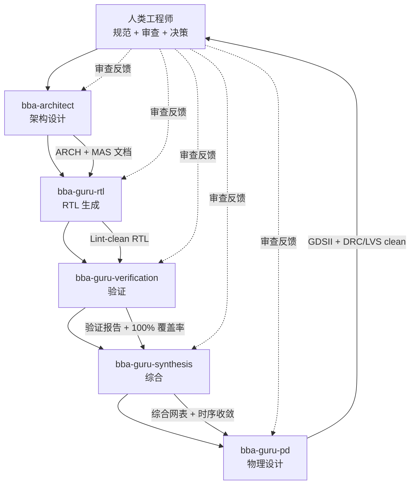
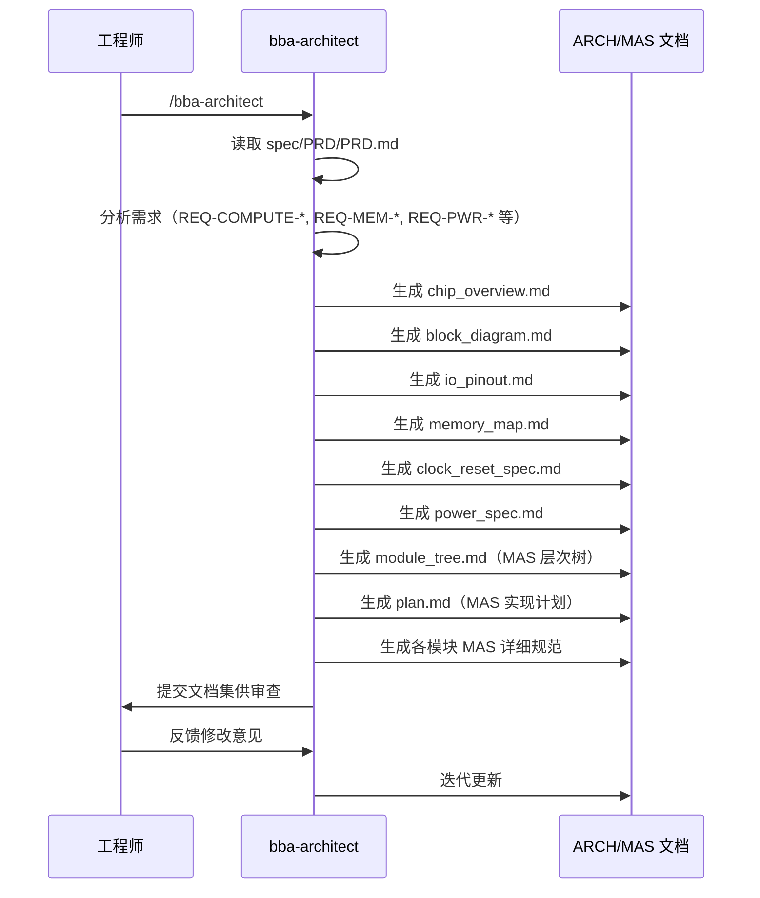
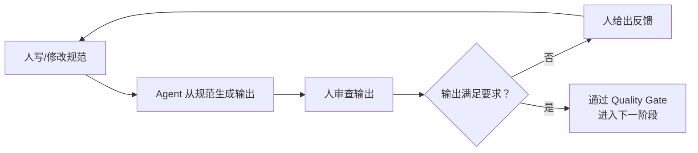
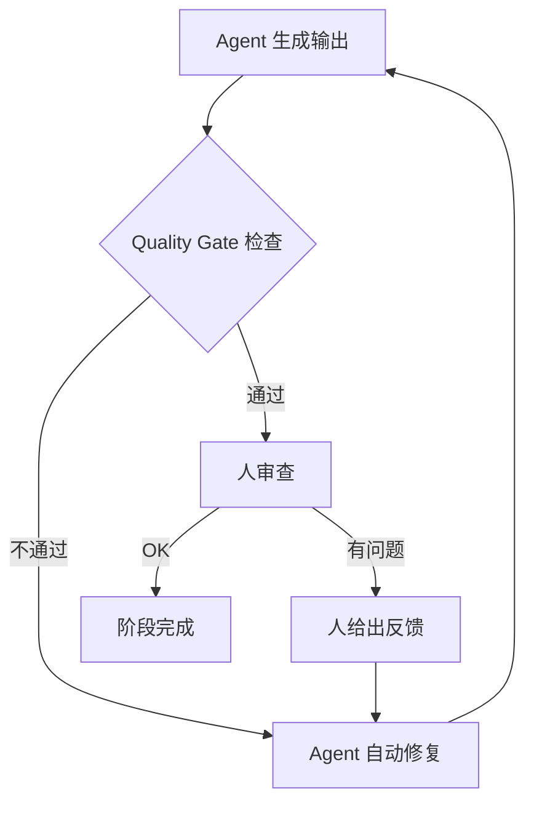

# 第 4 章：人机协作模式

> **本章核心**：学会如何高效地与 AI Agent 协作完成芯片设计——理解 Agent 角色体系、掌握 Skill 命令、熟悉协作循环、避开常见陷阱。

## 4.1 Babel Agent 角色体系

Babel 项目定义了一套完整的 Agent 角色体系，每个 Agent 专注于芯片设计流程中的一个阶段。理解这些角色的分工和协作关系，是高效使用 Babel 的前提。



### 五大核心 Agent

| Agent | 调用命令 | 输入 | 输出 | 质量门控 |
|-------|---------|------|------|---------|
| bba-architect | `/bba-architect` | PRD 文档 | ARCH + MAS 文档集 | 文档完整性与一致性检查 |
| bba-guru-rtl | `/bba-guru-rtl` | MAS 文档 | SystemVerilog RTL 代码 | RTL Quality Gate（Lint/CDC clean） |
| bba-guru-verification | `/bba-guru-verification` | RTL + 验证计划 | Testbench + 测试报告 | Test Quality Gate（覆盖率 100%） |
| bba-guru-synthesis | `/bba-guru-synthesis` | RTL + MAS 约束 | 综合网表 + 综合报告 | Synthesis Quality Gate（WNS >= 0） |
| bba-guru-pd | `/bba-guru-pd` | 网表 + IO/时钟规划 | GDSII 版图 + PD 报告 | PD Quality Gate（DRC=0, LVS clean） |

每个 Agent 都是一个"专家系统"，内含该阶段所需的专业知识和操作规范。例如，`bba-guru-rtl` 内置了 SystemVerilog 编码规范、可综合性规则、命名约定等；`bba-guru-synthesis` 内置了 SDC 约束语法、Yosys 优化策略、时序分析方法等。

### 辅助 Skill

除了五大核心 Agent，Babel 还提供了大量辅助 Skill，用于执行具体的工具操作或检查任务。

**工具调用类**（`bb-invoke-*`）：

| Skill | 调用的工具 | 用途 |
|-------|----------|------|
| `/bb-invoke-yosys` | Yosys 0.35 | RTL 综合 |
| `/bb-invoke-verilator` | Verilator | 仿真验证 |
| `/bb-invoke-opensta` | OpenSTA 2.2.0 | 静态时序分析 |
| `/bb-invoke-magic` | Magic 8.3.641 | 版图查看与 DRC |
| `/bb-invoke-netgen` | Netgen 1.5 | LVS 网表比对 |
| `/bb-invoke-qrouter` | QRouter 1.4 | 详细布线 |
| `/bb-invoke-klayout` | KLayout 0.30.8 | GDSII 查看 |

**质量检查类**（`bb-check-*`、`bb-gate-*`）：
- `/bb-check-lint`：RTL Lint 检查（代码质量、可综合性）
- `/bb-check-cdc`：跨时钟域检查（同步器、亚稳态风险）
- `/bb-gate-rtl-quality`：RTL 质量门控（综合检查）
- `/bb-gate-test-quality`：测试质量门控（覆盖率检查）
- `/bb-gate-synth-quality`：综合质量门控（时序、面积检查）
- `/bb-gate-pd-quality`：物理设计质量门控（DRC、LVS 检查）

**设计辅助类**：
- `/bb-generate-tb`：生成 Testbench 框架
- `/bb-create-sdc`：生成 SDC 时序约束文件
- `/bb-create-floorplan`：生成 Floorplan 配置
- `/bb-create-verif-plan`：生成验证计划
- `/bb-collect-coverage`：采集仿真覆盖率数据

**Issue 管理类**：
- `/bb-create-issue`：创建 Issue（追踪设计问题）
- `/bb-list-issues`：列出当前所有 Issue
- `/bb-close-issue`：关闭已修复的 Issue

## 4.2 Skill 命令与 Agent 调用

### 如何调用 Agent

在 Claude Code 中，调用 Agent 或 Skill 的方式非常简单——直接输入对应的斜杠命令：

```
# 启动架构设计流程
/bba-architect

# 启动 RTL 生成流程
/bba-guru-rtl

# 对当前 RTL 运行 Lint 检查
/bb-check-lint

# 调用 Yosys 综合
/bb-invoke-yosys
```

每个 Skill 被调用后，Agent 会自动执行预定义的工作流。你可以通过自然语言与 Agent 交互，提供额外的指令或反馈。

### Agent 的典型工作流

以 `/bba-architect` 为例，展示 Agent 被调用后的典型工作流：



### 核心 Agent 与辅助 Skill 的配合

在实际工作中，核心 Agent 会在内部自动调用辅助 Skill。例如：

- `/bba-guru-rtl` 在生成 RTL 后会自动调用 `/bb-check-lint` 和 `/bb-check-cdc`
- `/bba-guru-verification` 会自动调用 `/bb-invoke-verilator` 和 `/bb-collect-coverage`
- `/bba-guru-synthesis` 会自动调用 `/bb-invoke-yosys`、`/bb-invoke-opensta` 和 `/bb-create-sdc`

你也可以单独调用这些辅助 Skill，用于手动检查或调试特定环节。这种灵活性让你既可以让 Agent 自动完成整个流程，也可以在任意节点介入进行手动操作。

## 4.3 协作模式详解

Babel 项目中的人机协作可以归纳为三种核心模式，它们在不同场景下交替使用。

### 模式一：Spec → Agent → Review 循环

这是最基本的协作模式，贯穿整个设计流程：



**具体示例**：RTL 生成阶段

1. **人写规范**：MAS 文档定义了 M01_DataflowController 的端口、状态机行为、握手协议
2. **Agent 生成**：调用 `/bba-guru-rtl`，Agent 从 MAS 生成 SystemVerilog 代码
3. **人审查**：你阅读生成的代码，发现状态机缺少 ERROR 状态处理
4. **反馈迭代**：告诉 Agent "M01 的状态机需要添加一个 ERROR 状态，当检测到非法操作时转入 ERROR 状态并拉高 interrupt 信号"
5. **Agent 更新**：Agent 修改代码，重新通过 Lint 检查
6. **再次审查**：你确认修改正确，继续审查其他部分

### 模式二：Quality Gate 驱动

Agent 会自动运行质量门控检查，不达标则自动迭代修复。在这个模式下，人的角色主要是定义质量标准和审查最终结果。



**具体示例**：验证阶段

1. 调用 `/bba-guru-verification`
2. Agent 生成 Testbench，运行 Verilator 仿真，采集覆盖率
3. 代码覆盖率只有 85%——Quality Gate 不通过（要求 100%）
4. Agent 自动分析未覆盖的代码分支，生成补充测试用例
5. 重新运行仿真，覆盖率达到 92%——仍不通过
6. Agent 继续分析，发现某个边界条件难以触发，设计特殊测试用例
7. 覆盖率 100%——Quality Gate 通过
8. Agent 提交测试报告（test_report）供人审查

### 模式三：Issue 驱动修复

当在审查过程中发现问题时，使用 Issue 系统追踪问题的修复过程：

1. **发现问题**：审查 RTL 代码时发现 M02_SRAM 的 ECC 编码器可能有逻辑错误
2. **创建 Issue**：调用 `/bb-create-issue`，描述问题、影响范围和预期修复
3. **Agent 修复**：Agent 分析问题根因，修改代码，运行验证
4. **验证修复**：确认修复有效且未引入新问题（回归测试）
5. **关闭 Issue**：调用 `/bb-close-issue`，记录修复结果

Issue 系统的价值在于：所有问题都有记录、可追踪、可审计，避免"改了又忘"的问题。通过 `/bb-list-issues` 可以随时查看当前待处理的问题列表。

## 4.4 Prompt 设计技巧（面向芯片设计）

好的 Prompt 是高效协作的起点。在芯片设计场景下，Prompt 设计有其特殊的要点。

### 如何描述设计意图（而非实现细节）

**核心原则**：告诉 Agent "要什么"，而不是"怎么做"。Agent 有能力从规范推导出实现，你的职责是确保规范正确。

**面向意图的 Prompt**：
```
M01_DataflowController 需要支持两种调度模式：
- WS 模式：权重固定在 PE 中，输入数据按行流入
- OS 模式：输出结果在 PE 中累加，权重按列流入
模式切换通过 cfg_mode 信号控制，切换时需要排空流水线。
请参考 spec/MAS/M01_DataflowController.md 的详细定义。
```

**面向实现的 Prompt**（不推荐）：
```
请写一个 always 块，在 clk 上升沿检查 cfg_mode 信号，
如果 cfg_mode 从 0 变 1 就把 state 设为 DRAIN，
然后用一个 for 循环清空 pipeline_reg...
```

面向实现的 Prompt 的问题在于：你在替 Agent 做设计决策，而这些决策可能不是最优的。你应该关注"功能需求"，让 Agent 选择最佳的实现方式。

### 如何给出验收标准

好的 Prompt 应该包含明确的验收标准，让 Agent 知道"什么算做完了"：

```
请生成 M04_SystemBus 的 RTL 代码，验收标准：
1. 支持 1 master 到 4 slave 的地址解码
2. 地址解码逻辑使用 spec/ARCH/memory_map.md 中定义的地址范围
3. 通过 /bb-check-lint 无 warning
4. 通过 /bb-check-cdc 无违规
5. 所有端口在 reset 后有确定的初始值
```

### 如何引用 spec 文档

直接引用 spec 文档中的章节或 REQ ID 可以避免歧义：

```
根据 PRD REQ-COMPUTE-004，脉动阵列需要同时支持 WS 和 OS 模式。
根据 spec/ARCH/block_diagram.md 中 M00 的接口定义，
数据通路宽度为 128 bit。
请基于这些要求生成 M00 的 PE 模块。
```

### 反面案例：模糊指令 vs 精确指令

| 模糊指令（低效） | 精确指令（高效） |
|----------------|----------------|
| "帮我设计一个好的 FIFO" | "生成一个同步 FIFO，数据宽度 64 bit，深度 16，AXI-Stream 接口，空/满/将空/将满标志，异步复位" |
| "优化一下时序" | "M00_SystolicArray 的关键路径在 FP32 乘法器到累加器之间，延迟 1.8ns。请在乘法器输出端插入一级流水线寄存器，使每级延迟 < 1ns" |
| "这个设计有问题" | "M01 的状态机在 COMPUTE 状态时，如果输入 valid 拉低但 pipeline 中还有数据，当前代码会直接回到 IDLE 导致数据丢失。应该先进入 DRAIN 状态排空流水线" |
| "帮我写个 Testbench" | "为 M02_SRAM 生成 Testbench，覆盖以下场景：正常读写、ECC 单 bit 纠错、ECC 双 bit 检错、满/空边界条件、连续读写背靠背操作" |

## 4.5 审查 Agent 输出的检查清单

审查 Agent 输出是你的核心职责。以下是针对不同阶段输出的审查清单。

### RTL 审查要点

| 审查项 | 检查内容 | 常见问题 |
|--------|---------|---------|
| 功能正确性 | 是否实现了 MAS 中定义的所有功能？ | 遗漏某些工作模式或边界条件 |
| 可综合性 | 代码能否被 Yosys 正确综合？ | 使用了不可综合的语法结构 |
| 复位完整性 | 所有寄存器在复位后是否有确定值？ | 遗漏复位赋值导致不确定态 |
| 位宽匹配 | 信号位宽在模块间接口是否一致？ | 截断或扩展导致数据丢失 |
| 锁存器推断 | 组合逻辑中是否意外推断了锁存器？ | if/case 语句不完整 |
| CDC 处理 | 跨时钟域信号是否正确同步？ | 缺少同步器或使用不当 |
| 命名规范 | 信号命名是否符合项目编码规范？ | 命名不一致或含义不清 |

### 综合报告审查要点

| 审查项 | 检查内容 | 红旗信号 |
|--------|---------|---------|
| 时序（WNS） | Worst Negative Slack 是否 >= 0？ | WNS < 0 表示时序违例 |
| 面积 | 总面积是否在预算内？ | 面积超出 PRD 约束（<= 90 mm^2） |
| 单元数 | 各类型单元数量是否合理？ | 某种单元异常多可能有优化空间 |
| 关键路径 | 最长的几条路径是什么？ | 跨模块的长路径可能需要流水线 |
| 未约束路径 | 是否有未覆盖的时序路径？ | false_path 设置过多可能遗漏关键路径 |

### 物理设计结果审查要点

| 审查项 | 检查内容 | 红旗信号 |
|--------|---------|---------|
| DRC | 是否有设计规则违规？ | 任何 DRC violation 都必须修复 |
| LVS | 版图与网表是否一致？ | LVS mismatch 表示版图有错误 |
| 面积利用率 | 核心区域利用率是否合理？ | 大于 85% 可能导致布线困难 |
| 布线拥塞 | 是否有局部布线拥塞区域？ | 拥塞区域可能导致 DRC 违规 |

## 4.6 常见协作陷阱

以下是 AI 原生设计流程中最容易犯的错误，了解它们可以帮助你避免走弯路。

### 陷阱一：过度信任 Agent 输出

**表现**：Agent 生成的代码直接提交，不经过审查。

**风险**：Agent 可能在以下方面出错：
- 对规范的理解有偏差（尤其是模糊的描述）
- 生成的代码在某些边界条件下有 bug
- 使用了次优的设计方案
- 遗漏了某些约束条件

**正确做法**：所有 Agent 输出必须经过审查。审查的深度取决于模块的关键性——核心计算模块（如 M00_SystolicArray）需要逐行审查，辅助模块（如 M07_ResetManager）可以重点审查接口和行为。

### 陷阱二：指令过于模糊

**表现**：给 Agent 下达模糊的指令，然后对输出不满意。

**典型例子**：
- "帮我做一个好的设计" → Agent 不知道"好"的标准是什么
- "优化一下" → Agent 不知道优化哪个方面（面积？时序？功耗？）
- "修一下这个 bug" → Agent 不知道你认为的正确行为是什么

**正确做法**：遵循 4.4 节的 Prompt 设计技巧，给出明确的功能需求、约束条件和验收标准。

### 陷阱三：忽视 Quality Gate

**表现**：为了赶进度，跳过质量门控直接进入下一阶段。

**风险**：
- 未经 Lint 检查的 RTL 可能在综合时出错
- 覆盖率不足的验证可能遗漏功能 bug
- 未时序收敛的网表可能在物理设计阶段无法完成布线
- 有 DRC 违规的版图无法流片

**正确做法**：Quality Gate 是硬性要求，不是可选项。Babel 的标准是：RTL Lint/CDC clean、验证覆盖率 100%、综合 WNS >= 0、PD DRC = 0 + LVS clean。

### 陷阱四：不做版本管理

**表现**：Agent 迭代多次后，发现之前的版本更好，但已经无法回退。

**风险**：
- 无法追溯设计决策的演化过程
- 无法对比不同版本的质量
- Agent 可能在迭代中引入回归 bug

**正确做法**：
- 每次 Agent 生成的重要输出都提交 Git
- 使用有意义的 commit message（如 `feat: M01 RTL v2 - add DRAIN state`）
- 在关键节点打 tag（如 `rtl-freeze`、`synth-converged`）

### 陷阱五：不利用 Issue 系统

**表现**：发现问题后口头告诉 Agent 修复，不创建 Issue 记录。

**风险**：
- 问题修复没有记录，无法审计
- 同类问题可能反复出现
- 无法统计和分析设计质量趋势

**正确做法**：每个发现的问题都创建一个 Issue，包含问题描述、根因分析、修复方案和验证结果。这不仅是当前项目的质量保证，也是未来项目的知识积累。

### 陷阱六：试图一次完成所有事

**表现**：一次性让 Agent 生成整个芯片的 RTL，然后试图一次性审查完。

**风险**：
- 输出量太大，审查质量下降
- 问题积累过多，修复成本高
- 无法早期发现系统性问题

**正确做法**：按照 MAS 实现计划（`spec/MAS/plan.md`）中的顺序逐模块推进：

| 阶段 | 模块 | 类型 | 可并行 |
|------|------|------|--------|
| Phase 1 | M06_ClockManager | io | 是 |
| Phase 1 | M07_ResetManager | io | 是 |
| Phase 2 | M05_PowerManager | io | 是 |
| Phase 2 | M04_SystemBus | interconnect | 是 |
| Phase 3 | M02_SRAM | storage | 是 |
| Phase 3 | M03_DRAMController | storage | 是 |
| Phase 4 | M01_DataflowController | compute | 否 |
| Phase 5 | M00_SystolicArray | compute | 否 |

每完成一个模块就提交审查、通过 Quality Gate，再进入下一个模块。同一阶段内的无依赖模块可以并行推进（如 Phase 1 的 M06 和 M07 可以同时进行）。这种渐进式方法可以早期发现问题，降低修复成本。

## 本章小结

1. **五大核心 Agent 覆盖全流程**：bba-architect、bba-guru-rtl、bba-guru-verification、bba-guru-synthesis、bba-guru-pd，每个 Agent 专注于一个阶段，通过 Quality Gate 串联成完整的流水线。辅助 Skill（`bb-invoke-*`、`bb-check-*`、`bb-gate-*`）提供了细粒度的工具操作能力。

2. **三种协作模式交替使用**：Spec → Agent → Review 循环是基本模式；Quality Gate 驱动模式让 Agent 自动迭代到质量达标；Issue 驱动模式追踪问题的发现和修复。根据具体场景灵活切换。

3. **Prompt 质量决定输出质量**：描述设计意图而非实现细节、给出明确的验收标准、引用 spec 文档中的 REQ ID——这三点是高效 Prompt 的核心。模糊的指令必然导致低效的输出。

4. **审查是不可省略的环节**：RTL 审查关注功能正确性、可综合性、复位完整性；综合审查关注时序和面积；PD 审查关注 DRC/LVS。每个阶段都有针对性的检查清单，不能跳过。

5. **避开六大协作陷阱**：不过度信任 Agent、不给模糊指令、不跳过 Quality Gate、做好版本管理、使用 Issue 系统、渐进式推进而非一次性完成。这些陷阱看似能节省时间，实际上会导致更大的返工成本。
