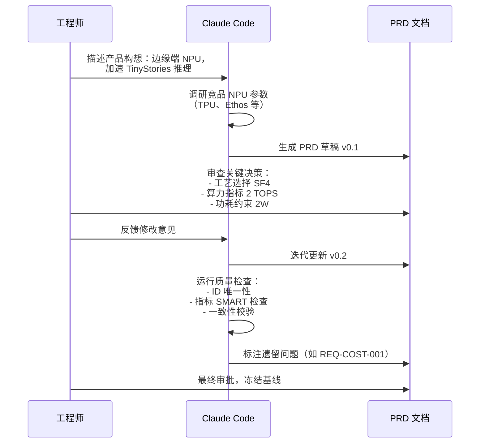

# 第 5 章：用 AI 编写产品需求

> PRD（Product Requirements Document）是人机协作的起点——AI 可以辅助分析、生成和审查，但需求决策权始终在人手中。

---

## 5.1 什么是 PRD 及其在 Babel 中的位置

PRD（Product Requirements Document，产品需求文档）是芯片设计流程中**最上游的规范文档**。它回答一个核心问题：**我们要设计什么？为什么这样设计？**

在 Babel 的 AI 原生设计流程中，PRD 处于 Spec-Driven Pipeline 的第一个节点：

```
PRD → ARCH → MAS → RTL → VER → SYN → PD
```

PRD 的特殊地位在于：

1. **它是 Agent 理解设计意图的唯一输入**。后续的 ARCH 架构文档、MAS 微架构规范，全部从 PRD 的需求条目推导而来。
2. **它是人机协作的分界线**。PRD 中的核心决策（目标市场、性能指标、功耗约束）必须由人做出；Agent 的角色是辅助分析、格式规范化和一致性检查。
3. **它是可追溯性的根节点**。Babel PRD 中的每一条需求都有唯一编号（如 REQ-COMPUTE-001），后续 ARCH 和 MAS 文档通过引用这些编号建立追溯链。

在 Babel 项目的文档体系中，PRD 位于 `spec/PRD/PRD.md`，文档层级为 Tier 0（最高层），其子文档包括 ARCH 架构规范（DOC-D2-01-ARCH）、性能规范（DOC-D2-03-PERF）等。

---

## 5.2 PRD 核心要素

一份完整的芯片 PRD 需要覆盖以下核心要素。以 Babel NPU 的 PRD 为例：

### 5.2.1 应用场景（Use Cases）

应用场景定义了产品的目标市场和核心使用情境。Babel NPU 定义了三个核心用例：

| UC ID | 用例 | 目标工作负载 | KPI |
|---|---|---|---|
| UC-01 | 边缘端文本生成 | TinyStories 15M FP32 | TPS >= 100 token/s（decode phase） |
| UC-02 | 边缘端 prefill | TinyStories 15M，prompt <= 256 tokens | TTFT <= 50 ms |
| UC-03 | INT8/FP16/FP8 推理 | TinyStories 15M FP16 | 精度损失 <= 0.5% vs FP32 baseline |

这三个用例覆盖了 LLM 推理的两个核心阶段（prefill 和 decode）以及多精度推理需求。KPI（Key Performance Indicator）是可量化的验收标准——这正是 PRD 与"想法"的区别。

### 5.2.2 功能需求（Functional Requirements）

功能需求按子系统分类，每条需求必须有唯一 ID、可量化指标和验证方法。Babel PRD 将功能需求分为三大类：

**计算需求（Compute）**——8 条 REQ-COMPUTE 系列需求：

| REQ ID | 需求描述 | 指标 | 验证方法 |
|---|---|---|---|
| REQ-COMPUTE-001 | FP8 峰值吞吐量 >= 2 TOPS | TOPS @ TT/0.9V，500 MHz | Post-silicon benchmark（GEMM） |
| REQ-COMPUTE-002 | FP16 峰值吞吐量 >= 1 TOPS | TOPS @ TT/0.9V，500 MHz | Post-silicon benchmark（GEMM） |
| REQ-COMPUTE-003 | INT8 峰值吞吐量 >= 2 TOPS | TOPS @ TT/0.9V，500 MHz | Post-silicon benchmark |
| REQ-COMPUTE-004 | 支持 Systolic Array（WS/OS 双模式） | 功能验证 | RTL simulation |
| REQ-COMPUTE-005 | Spatial Dataflow 调度，利用率 >= 80% | 利用率 % | 仿真 profiling |
| REQ-COMPUTE-006 | 支持多线程执行，线程数 >= 2 | 并发线程数 | 功能验证 |
| REQ-COMPUTE-007 | 支持混合精度 FP32/FP16/INT8 混用 | 功能验证 | 端到端推理测试 |
| REQ-COMPUTE-008 | 支持 Transformer 算子原语 | 算子覆盖率 100% | 见 doc/operators/ |

注意每条需求都包含三个要素：**需求陈述**（做什么）、**量化指标**（做到什么程度）、**验证方法**（怎么证明做到了）。这是 SMART 原则在芯片需求工程中的具体体现。

**存储需求（Memory）**——5 条 REQ-MEM 系列需求：

| REQ ID | 需求描述 | 指标 |
|---|---|---|
| REQ-MEM-001 | 3D Stacked DRAM 容量 >= 2 GB | GB total |
| REQ-MEM-002 | DRAM 聚合带宽 >= 10 GB/s（读+写） | GB/s @ 标称频率 |
| REQ-MEM-003 | DRAM 读延迟 <= 100 ns（row hit） | ns |
| REQ-MEM-004 | 片上 SRAM（scratchpad）容量 >= 512 KB | KB |
| REQ-MEM-005 | 支持 ECC（SECDED）保护 DRAM 和 SRAM | 功能验证 |

**IO 需求**——2 条 REQ-IO 系列需求：JTAG 调试接口（IEEE 1149.1）和自定义 NPU 指令集接口。

### 5.2.3 非功能需求（Non-Functional Requirements）

非功能需求定义了性能、功耗、面积、可靠性等约束条件：

| 类别 | REQ ID | 代表需求 | 目标值 |
|------|--------|---------|--------|
| 性能 | REQ-PERF-001 | 核心时钟频率 | >= 500 MHz @ TT/0.9V |
| 性能 | REQ-PERF-002 | FP32 decode TPS | >= 100 token/s |
| 性能 | REQ-PERF-003 | FP16 decode TPS | >= 200 token/s |
| 性能 | REQ-PERF-004 | TTFT | <= 50 ms（prompt <= 256 tokens） |
| 功耗 | REQ-PWR-001 | 峰值 TDP | <= 2 W（设计目标 <= 1.8 W） |
| 功耗 | REQ-PWR-002 | 空闲功耗 | <= 0.1 W |
| 功耗 | REQ-PWR-003 | DVFS | >= 2 个工作点 |
| 面积 | REQ-AREA-001 | die 面积 | <= 90 mm²（硬上限 100 mm²） |
| 可靠性 | REQ-REL-001 | MTTF | >= 100,000 小时 @ 85°C |
| 温度 | REQ-THERM-001 | 结温范围 | 0°C 至 85°C |

特别值得注意的是 **margin 设计思想**：功耗 TDP 硬上限 2 W，但设计目标 1.8 W，预留了 10% 的 margin；面积硬上限 100 mm²，设计目标 90 mm²。这种"设计目标严于硬约束"的做法是芯片工程的常见实践，为后续设计迭代留出缓冲空间。

### 5.2.4 Die 组成与互连

Babel NPU 采用 3D Stacked 方案（Wafer-on-Wafer），包含两个 Die：

| Die | 功能 | 工艺 | 数量 |
|---|---|---|---|
| NPU Die | Systolic Array + Dataflow 控制器 + SRAM scratchpad | 三星 SF4（4nm） | 1 |
| DRAM Die | 2 GB，>= 10 GB/s 带宽 | DRAM 供应商工艺 | 1 |

Die-to-Die 互连需求（REQ-D2D 系列）定义了带宽（>= 10 GB/s 双向）、协议（LPDDR4X 或自定义）、能效（<= 5 pJ/bit）和延迟（<= 100 ns round-trip）。

---

## 5.3 用 Claude Code 辅助编写 PRD

在 Babel 的 AI 原生流程中，PRD 的编写是一个**人机协作迭代**的过程。以下是典型的工作流：



### 阶段 1：人提供核心决策

人需要做出的关键决策包括：

- **目标市场和应用**：面向边缘端 AI 推理，而非云端训练
- **目标工作负载**：TinyStories 15M 参数模型
- **工艺选型**：三星 SF4（4nm）
- **关键约束**：面积 <= 100 mm²、功耗 <= 2 W
- **差异化特性**：3D Stacked DRAM、裸机运行

这些决策涉及商业判断、技术路线选择和风险评估，是 Agent 无法替代人做出的。

### 阶段 2：Agent 生成 PRD 草稿

Agent 根据人的决策，完成以下工作：

- **调研竞品参数**：分析业界类似 NPU 的性能指标范围，确认目标值的合理性
- **结构化需求**：将模糊的需求描述转化为带有唯一 ID、量化指标和验证方法的规范条目
- **分类组织**：按 Compute / Memory / IO / Performance / Power / Area / Reliability 分类
- **一致性检查**：确保各需求之间不存在矛盾

### 阶段 3：人审查并迭代

审查的重点包括：

- 指标是否合理（太高则无法实现，太低则缺乏竞争力）
- 是否遗漏了重要需求
- 验证方法是否可行
- margin 是否充足

### 阶段 4：Agent 运行质量检查

Babel PRD 末尾的 Quality Checklist（第 14 节）就是一个自动化的质量检查清单：

```
- [x] 所有 REQ-xxx 有唯一 ID，无重复
- [x] 每条需求符合 SMART（可量化指标，无模糊词）
- [x] 所有性能指标有明确目标值 + 测试条件
- [x] Power budget 预留 >= 10% margin（TDP <= 2W，设计目标 <= 1.8W）
- [x] Area budget 预留 >= 10% margin（硬上限 100 mm²，设计目标 <= 90 mm²）
- [ ] BOM 成本目标待补充（REQ-COST-001 标注 ⚠️）
- [x] 功能安全等级已标注（QM）
- [x] 无 TBD 性能指标（成本除外，已标注）
```

可以看到 REQ-COST-001（BOM 成本）被标注为待补充——这正是质量检查的价值：发现遗留问题并明确标注，而不是让它悄悄溜过。

---

## 5.4 案例：NPU PRD 深度解读

本节深入分析 Babel NPU 的 PRD，展示计算/存储/IO 需求是如何从应用场景推导出来的。

### 5.4.1 从用例到计算需求

TinyStories 15M 是一个约 1500 万参数的 Transformer 模型。FP32 精度下模型参数约 60 MB。PRD 中 UC-01 要求 decode 阶段 TPS >= 100 token/s。

Transformer decode 阶段的核心操作是矩阵向量乘法（batch=1），每个 token 需要执行多层 Attention + FFN 计算。对于 15M 参数的模型，每 token 约需 30M 次 MAC 运算。因此：

```
所需算力 = 30M MAC × 100 token/s = 3G MAC/s = 6 GFLOPS
```

而 PRD 中 REQ-COMPUTE-001 定义的 FP8 峰值吞吐量为 2 TOPS（= 2000 GFLOPS），远高于 6 GFLOPS 的最低需求。这个"过量设计"（over-design）是有意为之的——它为以下场景留出了空间：

- Pipeline 气泡和利用率损耗（REQ-COMPUTE-005 要求利用率 >= 80%，而非 100%）
- 更大模型的扩展性
- 多 batch 推理场景

### 5.4.2 从模型到存储需求

TinyStories 15M 的 FP32 模型参数约 60 MB。但 PRD 定义了 2 GB 的 DRAM 容量（REQ-MEM-001），远大于 60 MB。原因是：

- **KV Cache**：Transformer 推理时需要存储 Key/Value 缓存，随序列长度增长
- **中间激活值**：每一层的输入/输出激活值需要暂存
- **多精度支持**：FP16/INT8 模型也需要足够的存储空间
- **未来扩展**：支持更大的模型变体

带宽需求 REQ-MEM-002（>= 10 GB/s）的推导：decode 阶段每 token 需要从 DRAM 读取完整模型权重（60 MB），在 100 token/s 的目标下需要 6 GB/s 带宽，加上 KV Cache 访问和激活值读写，10 GB/s 是一个合理的目标值。

### 5.4.3 从场景到功耗约束

REQ-PWR-001 定义 TDP <= 2 W，设计目标 <= 1.8 W。这个约束来自边缘端场景的物理限制：

- **自然对流散热**（REQ-THERM-002）：无风扇、无散热片
- **封装面积约束**：<= 150 mm²（REQ-PKG-002）限制了散热面积
- **热设计分析**：在 85°C 环境温度下，1.79 W 的功耗使结温刚好在 85°C 限制内

PRD 还定义了 DVFS（Dynamic Voltage and Frequency Scaling）需求（REQ-PWR-003），要求至少 2 个工作点。这使得 NPU 可以根据负载动态调整频率和电压，在空闲时降低功耗至 0.1 W（REQ-PWR-002）。

### 5.4.4 软件编程模型

PRD 第 8 节定义了软件需求：

| REQ ID | 需求 |
|---|---|
| REQ-SW-001 | 支持自定义 NPU ISA |
| REQ-SW-002 | 提供 C 语言 runtime API（参考 llama2.c 接口风格） |
| REQ-SW-003 | 支持算子库：Attention、MatMul、RMSNorm、RoPE、SoftMax |
| REQ-SW-004 | 裸机（bare-metal）运行支持，无需 OS |

REQ-SW-004（裸机运行）是一个关键的架构决策——它意味着 NPU 不需要运行 Linux 或其他操作系统，直接在硬件上执行推理任务。这简化了软硬件接口，降低了系统复杂度和功耗。

### 5.4.5 安全与标准合规

PRD 第 10-11 节定义了安全和合规需求：

- **REQ-SEC-001**：支持 Secure Boot（签名固件验证）
- **REQ-SEC-002**：供应链威胁模型
- **标准合规**：IEEE 1149.1（JTAG）、JEDEC LPDDR4X（若采用 LPDDR 接口）、IEEE 1838（Die Wrapper）

---

## 5.5 PRD 质量检查

PRD 完成后，需要进行系统性的质量检查。Babel 的 PRD 质量检查包含以下维度：

### 5.5.1 完整性检查

| 检查项 | 方法 | 当前状态 |
|--------|------|---------|
| 所有 REQ-xxx 有唯一 ID | 自动扫描 | 通过 |
| 每条需求有量化指标 | 人工审查 | 通过（成本除外） |
| 每条需求有验证方法 | 自动扫描 | 通过 |
| 覆盖所有子系统 | 交叉引用 | 通过（Compute/Memory/IO/Power/Area/Reliability） |
| 非功能需求完整 | 清单对照 | 通过 |

### 5.5.2 一致性检查

一致性检查确保不同需求之间不存在矛盾。例如：

- **REQ-PERF-001（500 MHz）和 REQ-PWR-001（TDP <= 2 W）是否兼容？**
  - 验证：power_spec.md 中 OP0 工作点（500 MHz / 0.9 V）总功耗 1.79 W < 2 W -- 通过
- **REQ-MEM-002（10 GB/s）和 REQ-D2D-001（10 GB/s 双向）是否一致？**
  - 验证：D2D 带宽覆盖了 DRAM 带宽需求 -- 通过

### 5.5.3 SMART 检查

每条需求应符合 SMART 原则：

- **S**pecific（具体）：明确指出什么功能
- **M**easurable（可量化）：有明确的数值目标
- **A**chievable（可实现）：在工艺约束下可行
- **R**elevant（相关）：与应用场景直接关联
- **T**ime-bound（有时限）：有明确的测试条件

Babel PRD 中的 REQ-COST-001（BOM 成本目标 TBD）是唯一不符合 SMART 原则的条目，已被标注并在 Quality Checklist 中记录。

### 5.5.4 可追溯性检查

每条 PRD 需求都应该在后续 ARCH/MAS 文档中被引用。例如：

- REQ-COMPUTE-001 -> ARCH chip_overview.md 的 FP8 >= 1 TOPS -> M00_SystolicArray MAS 的算力推导
- REQ-MEM-004 -> ARCH memory_map.md 的 SRAM 512 KB -> M02_SRAM MAS 的 Bank 划分

这种可追溯性确保了每个设计决策都能回溯到产品需求，避免了"为设计而设计"的浪费。

### 5.5.5 让 Agent 审查 PRD

可以让 Claude Code 作为审查者对 PRD 进行全面检查：

```
请审查 spec/PRD/PRD.md，检查以下方面：
1. 是否有重复或矛盾的需求条目
2. 性能指标与功耗约束是否兼容
3. 是否遗漏了关键的验证方法
4. margin 设计是否充分
5. 与 doc/operators/ 中的算子定义是否一致
```

Agent 会逐条分析需求，生成审查报告，标注潜在问题供人决策。

---

## 本章小结

1. **PRD 是 AI 原生芯片设计流程的起点**，是 Agent 理解设计意图的唯一输入，其质量直接决定后续所有环节的效果。

2. **PRD 的核心要素包括应用场景、功能需求（带唯一 ID 和量化指标）、非功能需求（功耗/面积/可靠性约束）和验证方法**。每条需求都应满足 SMART 原则。

3. **人机协作模式**：人做核心决策（目标市场、工艺选型、关键约束），Agent 负责结构化、格式化和一致性检查，人审查并迭代。

4. **需求推导应有逻辑链**：从用例（UC-01/02/03）到功能需求（REQ-COMPUTE/MEM/IO）到非功能约束（REQ-PERF/PWR/AREA），每一层都应有清晰的推导过程。

5. **质量检查是 PRD 冻结前的最后防线**：完整性、一致性、SMART 合规和可追溯性四个维度的系统检查，确保 PRD 能够驱动后续的架构设计。
