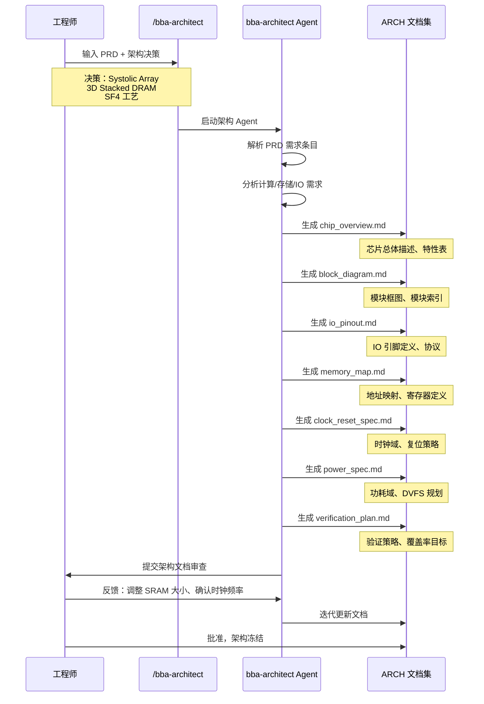
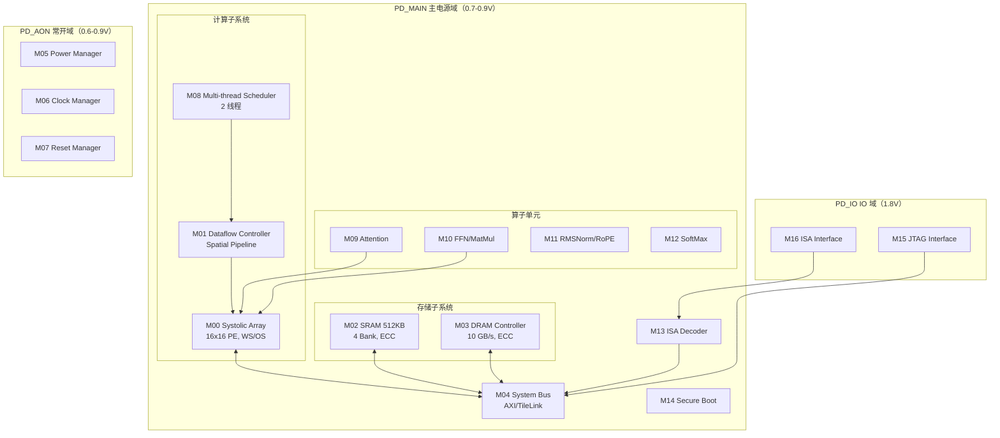

# 第 6 章：Agent 驱动的架构设计

> 架构决策由人做，架构文档的展开由 Agent 完成——人定方向，Agent 展开细节。

---

## 6.1 架构设计目标与决策

架构设计是 PRD 之后的第一个创造性阶段。它的核心任务是：**将 PRD 中的需求条目转化为具体的硬件系统结构**。

架构设计需要回答以下关键问题：

1. **数据通路**：计算单元采用什么结构？（脉动阵列？向量处理器？GPU-like SIMD？）
2. **存储层次**：片上 SRAM 多大？怎么组织？DRAM 接口用什么协议？
3. **控制策略**：集中式还是分布式控制？如何调度多个算子？
4. **功耗管理**：几个功耗域？DVFS 如何实现？
5. **时钟规划**：几个时钟域？跨时钟域（CDC）怎么处理？

在 Babel 的 AI 原生流程中，这些**核心决策由人做出**，而 Agent 的角色是：

- 根据 PRD 需求分析架构选项的优劣
- 将人的决策展开为完整的架构文档
- 检查架构方案与 PRD 需求的一致性
- 识别架构风险并提出缓解建议

例如，人做出"采用 Systolic Array 架构"的决策后，Agent 会展开以下细节：阵列规模（16×16）、PE 结构（MAC 单元 + 累加器）、数据流模式（WS/OS 双模式）、与 SRAM 的接口定义等。

### 人机分工原则

| 决策类型 | 角色 | 示例 |
|---------|------|------|
| 计算架构选型 | 人决策 | Systolic Array vs 向量处理器 |
| 存储层次设计 | 人定方向 + Agent 细化 | "需要片上 SRAM" → Agent 确定 512 KB / 4 Bank |
| IO 引脚定义 | Agent 生成 + 人审查 | JTAG + ISA 接口的引脚分配 |
| 地址映射 | Agent 生成 + 人审查 | 基地址分配、寄存器偏移 |
| 时钟域划分 | 人决策 + Agent 展开 | "主系统 + 常开域" → 3 个时钟域 |
| 功耗域划分 | 人决策 + Agent 估算 | 3 个功耗域 + 功耗预算 |
| 验证策略 | Agent 生成 + 人审查 | 覆盖率目标、验证层次 |

---

## 6.2 使用 `/bba-architect` 启动架构设计

在 Babel 中，架构设计通过 `/bba-architect` Skill 启动。以下是完整的人机协作时序：



### 输入与输出

**输入**：
- PRD 文档（`spec/PRD/PRD.md`）
- 人的架构决策（自然语言描述）
- 参考文档（算子文档 `doc/operators/`、ISA 文档 `doc/isa/`）

**输出**：ARCH 文档集（`spec/ARCH/` 目录），包含 7 个子文档。

### Agent 的工作流程

1. **PRD 解析**：逐条分析 REQ-COMPUTE、REQ-MEM、REQ-IO 等需求，提取量化指标
2. **架构探索**：根据需求推导架构方案，评估 trade-off
3. **文档生成**：按固定模板生成 7 个 ARCH 子文档
4. **一致性校验**：检查 ARCH 文档与 PRD 需求的对应关系
5. **提交审查**：将文档集提交给人审查

---

## 6.3 ARCH 文档结构详解

ARCH 文档集由 7 个子文档组成，每个子文档聚焦架构的一个方面。这种分而治之的组织方式使得每个文档都足够聚焦，同时又通过交叉引用保持整体一致性。

| 文档 | 路径 | 核心内容 | 核心表格 |
|------|------|---------|---------|
| chip_overview.md | spec/ARCH/ | 芯片总体描述、关键特性、目标应用 | Key Features 表（30+ 行） |
| block_diagram.md | spec/ARCH/ | 模块框图（Mermaid）、模块索引 | Module Index（M00-M16，17 个模块） |
| io_pinout.md | spec/ARCH/ | IO 引脚定义、协议规范 | Pin List（24 个引脚） |
| memory_map.md | spec/ARCH/ | 地址空间映射、寄存器定义 | Memory Map（6 个地址区间） |
| clock_reset_spec.md | spec/ARCH/ | 时钟域、复位策略、CDC 方案 | Clock Domains（3 个域） |
| power_spec.md | spec/ARCH/ | 功耗域、DVFS 规划、功耗估算 | Power Estimate（3 个工作点） |
| verification_plan.md | spec/ARCH/ | 验证策略、覆盖率目标 | Verification Hierarchy（4 级） |

### 文档间的交叉引用

ARCH 文档之间通过 REQ ID 和 Module ID 建立引用关系。例如：

- `chip_overview.md` 中的 "FP8 >= 2 TOPS" 引用 `REQ-COMPUTE-001`
- `block_diagram.md` 中 M00 的描述引用 `REQ-COMPUTE-004`（WS/OS 双模式）
- `power_spec.md` 中 PD_MAIN 功耗 1.7 W 对应 `REQ-PWR-001` 的设计目标
- `memory_map.md` 中 SRAM 512 KB 对应 `REQ-MEM-004`
- `clock_reset_spec.md` 中 500 MHz 对应 `REQ-PERF-001`
- `verification_plan.md` 中每个验证场景都引用了对应的 REQ ID

---

## 6.4 案例：NPU 架构深度解读

本节基于 Babel 项目真实的 ARCH 文档，深入解读 NPU 的架构设计。

### 6.4.1 系统总体框图

Babel NPU 共包含 17 个功能模块（M00-M16），按功能划分为 4 个子系统，分布在 3 个功耗域中：



模块索引（摘自 block_diagram.md）：

| Module ID | 名称 | 时钟域 | 电源域 | 功能 |
|-----------|------|--------|--------|------|
| M00 | Systolic Array | CLK_SYS | PD_MAIN | FP8/FP16/INT8 矩阵加速 |
| M01 | Dataflow Controller | CLK_SYS | PD_MAIN | Spatial Dataflow 调度 |
| M02 | SRAM Scratchpad | CLK_SYS | PD_MAIN | 512 KB，ECC SECDED |
| M03 | DRAM Controller | CLK_SYS | PD_MAIN | 3D Stacked 接口 |
| M04 | System Bus | CLK_SYS | PD_MAIN | AXI/TileLink 总线互联 |
| M05 | Power Manager | CLK_AON | PD_AON | DVFS 控制，功耗模式 |
| M06 | Clock Manager | CLK_AON | PD_AON | PLL + DVFS 时钟生成 |
| M07 | Reset Manager | CLK_AON | PD_AON | 复位序列控制 |
| M08 | Multi-thread Scheduler | CLK_SYS | PD_MAIN | 多线程执行调度 |
| M09 | Attention Unit | CLK_SYS | PD_MAIN | Transformer Attention 算子 |
| M10 | FFN/MatMul Unit | CLK_SYS | PD_MAIN | Feed-Forward Network |
| M11 | RMSNorm/RoPE Unit | CLK_SYS | PD_MAIN | 归一化 + 位置编码 |
| M12 | SoftMax Unit | CLK_SYS | PD_MAIN | SoftMax 算子 |
| M13 | ISA Decoder | CLK_SYS | PD_MAIN | 自定义 NPU 指令解码 |
| M14 | Secure Boot | CLK_SYS | PD_MAIN | 签名固件验证 |
| M15 | JTAG Interface | CLK_IO | PD_IO | IEEE 1149.1 调试接口 |
| M16 | ISA Interface | CLK_IO | PD_IO | NPU 指令集 I/O 接口 |

### 6.4.2 计算子系统：Systolic Array + Dataflow Controller

**M00_SystolicArray** 是 NPU 的核心计算引擎，采用 16×16 = 256 个 Processing Element（PE）组成的脉动阵列。

关键架构决策：

| 决策 | 选择 | 理由 |
|------|------|------|
| 阵列结构 | 脉动阵列 | 矩阵乘法天然适合脉动数据流，高计算密度 |
| 数据流模式 | WS + OS 双模式 | WS 适合大批量矩阵乘，OS 适合小批量推理 |
| 阵列规模 | 16×16 | 在 90 mm² 面积约束下平衡算力与功耗 |
| 精度支持 | FP32/FP16/INT8 | INT8 模式下每 PE 拆分为 2 个 MAC，算力翻倍 |

精度与算力对照：

| 精度 | TOPS | 使用场景 |
|------|------|---------|
| FP8 (E4M3/E5M2) | >= 2 | 低精度推理，KV cache |
| FP16 | >= 1 | 标准推理 |
| INT8 | >= 2 | 量化推理 |
| FP32 | 0.25（参考） | Baseline 比较（与 MAS 算力推导一致） |

**M01_DataflowController** 负责编排计算任务，实现 Spatial Dataflow 流水线。它的核心职责是：

- 向 M00 发送计算指令（算子操作码、精度模式、张量形状）
- 管理 2 线程的 Round-Robin 调度
- 确保 pipeline 利用率 >= 80%（REQ-COMPUTE-005）
- 支持 Transformer 算子原语编排

M01 的算子调度表展示了它如何将高层算子分解为 M00 可执行的指令序列：

| 算子 | op_code | 指令序列 |
|------|---------|---------|
| Attention | 0x01 | LOAD_Q → LOAD_K → LOAD_V → MATMUL_QK → SOFTMAX → MATMUL_AV → STORE |
| FFN | 0x02 | LOAD_X → MATMUL_W1 → GELU → MATMUL_W2 → STORE |
| RMSNorm | 0x03 | LOAD_X → LOAD_W → RMSN_COMPUTE → STORE |
| RoPE | 0x04 | LOAD_X → LOAD_FREQ → ROPE_COMPUTE → STORE |

### 6.4.3 存储子系统：SRAM + DRAM Controller

存储层次采用两级结构：

**M02_SRAM（512 KB Scratchpad）**：
- 4 个 Bank，每个 128 KB，支持并行访问
- 256 bit 数据位宽，19 bit 地址（512K / 32B = 16K entries）
- ECC SECDED 保护（每 256 bit 数据附加 10 bit 校验位：9 bit Hamming SEC + 1 bit 整体奇偶校验）
- 读/写延迟均为 1 cycle（500 MHz 下约 2 ns）
- Bank 选择：`bank_sel = addr[18:17]`

**M03_DRAMController**：
- 管理 3D Stacked DRAM（2 GB）
- 聚合带宽 >= 10 GB/s（读+写）
- Row hit 延迟 <= 100 ns
- ECC SECDED 保护
- 接口协议预留 LPDDR4X 和自定义接口两套方案

地址映射方案（摘自 memory_map.md）：

| 基地址 | 大小 | 类型 | 模块 |
|--------|------|------|------|
| 0x0000_0000 | 2 GB | DRAM | M03 |
| 0x8000_0000 | 512 KB | SRAM | M02 |
| 0x8008_0000 | 4 KB | 控制寄存器 | M04 |
| 0x8009_0000 | 4 KB | ISA 寄存器 | M13 |
| 0x800A_0000 | 4 KB | 安全寄存器 | M14 |
| 0x800B_0000 | 4 KB | ECC 状态 | M02, M03 |

总线仲裁优先级（摘自 memory_map.md）：

| 优先级 | Master | 使用场景 |
|--------|--------|---------|
| 0（最高） | M00 (Systolic Array) | 计算 |
| 1 | M09-M12 (Operators) | Transformer 算子 |
| 2 | M13 (ISA Decoder) | 指令取指 |
| 3 | Debug/JTAG (M15) | 调试访问 |

这确保了计算单元在带宽竞争中拥有最高优先级——毕竟 NPU 的核心价值就是算力。

### 6.4.4 功耗域划分

NPU 划分为 3 个功耗域，这是架构设计中最重要的功耗管理决策：

| 功耗域 | 电压范围 | 包含模块 | 门控策略 | 设计意图 |
|--------|---------|---------|---------|---------|
| PD_MAIN | 0.7-0.9 V | M00-M04, M08-M14 | Software CG + Power Gating | 计算和存储，空闲时关闭 |
| PD_AON | 0.6-0.9 V | M05-M07 | Never gated（常开） | 电源/时钟/复位，必须常开 |
| PD_IO | 1.8 V | M15-M16 | Never gated | IO 接口，电平转换 |

**PD_AON（Always-On）** 包含 Power Manager、Clock Manager 和 Reset Manager。这三个模块必须始终保持工作状态——即使在 Deep Sleep 模式下，Power Manager 也需要监听唤醒信号（WAKEUP 引脚）。

功耗估算结果（摘自 power_spec.md）：

| 工作点 | PD_MAIN | PD_AON | PD_IO | DRAM | 总计 | REQ |
|--------|---------|--------|-------|------|------|-----|
| OP0（500 MHz / 0.9 V） | 1.7 W | 7 mW | 15 mW | 80 mW | **1.79 W** | < 2 W |
| OP1（250 MHz / 0.7 V） | 0.55 W | 7 mW | 10 mW | 40 mW | **0.61 W** | - |
| OP2（Deep Sleep） | 0 W | 7 mW | 0.5 mW | 10 mW | **0.09 W** | < 0.1 W |

OP0 总功耗 1.79 W < 1.8 W 设计目标 < 2 W 硬上限，满足 REQ-PWR-001。OP2 Deep Sleep 功耗 0.09 W < 0.1 W，满足 REQ-PWR-002。

低功耗技术（摘自 power_spec.md）：

| 技术 | 目标 | 实现方式 | 节省比例 |
|------|------|---------|---------|
| Clock Gating | 所有逻辑 | 软件控制的 CG 单元 | 30% 动态功耗 |
| Power Gating | PD_MAIN | Header/footer switches | 95% PD_MAIN 漏电 |
| DVFS | CLK_SYS | PLL + Voltage regulator | 65% @ OP1 |

### 6.4.5 时钟与复位

三个时钟域的划分（摘自 clock_reset_spec.md）：

| 时钟域 | 频率范围 | 模块 | DVFS | 门控 |
|--------|---------|------|------|------|
| CLK_SYS | 250-500 MHz | M00-M04, M08-M14 | Yes | Software |
| CLK_AON | 1 MHz | M05-M07 | No | Never |
| CLK_IO | 50 MHz | M15-M16 | No | Never |

跨时钟域（CDC）处理策略：

| 源域 | 目标域 | 方法 | 验证方式 |
|------|--------|------|---------|
| CLK_SYS → CLK_AON | 2 级同步器 | STA CDC check |
| CLK_AON → CLK_SYS | 握手协议 | Formal verification |
| CLK_SYS → CLK_IO | 异步 FIFO | FIFO depth check |

复位方案包含三种复位源：

| 复位源 | 类型 | 范围 | 触发条件 | 释放时机 |
|--------|------|------|---------|---------|
| POR | 异步 | 全局 | 上电 | PLL lock 后 |
| SW_RESET | 同步 | PD_MAIN | 软件触发 | 立即 |
| WDT_RESET | 异步 | PD_MAIN | 看门狗超时 | WDT clear 后 |

复位序列（摘自 clock_reset_spec.md）：

```
Step 1: POR asserted → Step 2: PLL 配置（100 us）→ Step 3: PLL lock（50 us）
→ Step 4: CLK_AON stable → Step 5: PD_MAIN power-on（10 us）
→ Step 6: CLK_SYS stable → Step 7: SW_RESET de-assert → Step 8: Secure Boot（M14）
```

### 6.4.6 IO 引脚

NPU 共 24 个外部引脚（摘自 io_pinout.md），按功能分类：

| 类别 | 引脚数 | 电压 | 说明 |
|------|--------|------|------|
| Power | VDD_MAIN, VDD_AON, VDD_IO, VSS | 0.9V/1.8V | 三组电源 + 地 |
| Reset | POR_N | 1.8V | 全局异步复位 |
| JTAG | TCK/TMS/TDI/TDO/TRST | 1.8V | IEEE 1149.1 调试 |
| ISA | ISA_IF[7:0], ISA_CLK, ISA_VALID | 1.8V | NPU 指令接口 |
| Security | SEC_BOOT_EN, SEC_STATUS | 1.8V | Secure Boot |
| Clock | EXT_CLK | 1.8V | 外部晶振 50 MHz |
| Control | WAKEUP | 1.8V | 低功耗唤醒 |

### 6.4.7 验证策略

验证计划（摘自 verification_plan.md）采用四级验证层次：

| 级别 | 方法 | 覆盖率目标 | 持续时间 |
|------|------|-----------|---------|
| Unit | RTL Simulation | 100% code, 95% functional | 每模块数分钟 |
| Integration | RTL Simulation | 95% functional | 数天 |
| System | FPGA 原型验证（Emulation） | 端到端场景 | 数周 |
| Silicon | Post-silicon validation | 所有用例 | 数月 |

覆盖率要求：

| 覆盖率类型 | 目标 | 工具 |
|-----------|------|------|
| Code Coverage (Line) | 100% | Verilator + coverage |
| Code Coverage (Branch) | 100% | Verilator + coverage |
| Code Coverage (Toggle) | 100% | Verilator + coverage |
| Functional Coverage | 95% | Custom assertions |
| Assertion Coverage | 100% | SVA |

---

## 6.5 架构审查清单

架构文档生成后，人需要对照以下清单进行审查：

### 模块划分审查

| 检查项 | 标准 | NPU 实际情况 |
|--------|------|-------------|
| 模块数量是否合理 | 10-20 个为宜 | 17 个模块（M00-M16） |
| 模块职责是否单一 | 每个模块有明确功能 | 通过 |
| 模块间耦合度 | 通过标准接口连接 | AXI/TileLink 总线 |
| 是否有冗余模块 | 无功能重叠 | 通过 |

### 接口定义审查

| 检查项 | 标准 | NPU 实际情况 |
|--------|------|-------------|
| 引脚定义是否完整 | 所有外部接口有 Pin 定义 | 24 个引脚 |
| 电压域定义清晰 | 每个引脚标注电压 | 0.9V / 1.8V |
| 协议规范引用 | 标准协议有文档引用 | JTAG IEEE 1149.1 |
| IO 数量与封装匹配 | 封装引脚数足够 | BGA/PoP |

### 时钟域审查

| 检查项 | 标准 | NPU 实际情况 |
|--------|------|-------------|
| 时钟域划分是否清晰 | 每个模块属于唯一时钟域 | 3 个域，无歧义 |
| CDC 处理策略 | 所有跨域路径有同步方案 | 3 种 CDC 方法 |
| DVFS 工作点 | 频率/电压组合定义完整 | OP0/OP1/OP2 |
| 复位序列完整性 | 所有模块有明确复位值 | 覆盖全部寄存器 |

### PRD 一致性审查

| PRD 需求 | ARCH 对应实现 | 检查结果 |
|---------|-------------|---------|
| REQ-COMPUTE-001~008 | M00/M01/M08 | 通过 |
| REQ-MEM-001~005 | M02/M03 | 通过 |
| REQ-PERF-001 | CLK_SYS 500 MHz | 通过 |
| REQ-PWR-001（TDP <= 2 W） | OP0 总功耗 1.79 W | 通过 |
| REQ-PWR-002（空闲 <= 0.1 W） | OP2 总功耗 0.09 W | 通过 |
| REQ-PWR-003（DVFS >= 2 工作点） | OP0/OP1/OP2（3 个） | 通过 |
| REQ-AREA-001（<= 90 mm²） | 待 PD 阶段确认 | 待定 |
| REQ-IO-001（JTAG） | M15，5 个引脚 | 通过 |
| REQ-IO-002（ISA 接口） | M16 + M13 | 通过 |
| REQ-SEC-001（Secure Boot） | M14 + 安全引脚 | 通过 |

### 风险识别

| 风险 | 影响模块 | 缓解措施 |
|------|---------|---------|
| FP32 MAC 关键路径 ~1.8 ns，500 MHz margin 仅 0.2 ns | M00 | 综合时施加 max_delay 约束，考虑流水线插入 |
| DRAM D2D 接口供应商未定 | M03 | 预留 LPDDR4X 和自定义接口两套方案 |
| 10 GB/s 带宽验证 | M03, M04 | 早期 RTL 仿真验证带宽，M04 已设计 16 GB/s 峰值 |

---

## 本章小结

1. **架构设计的核心是"人做决策，Agent 展开细节"**。数据通路、存储层次、功耗域划分等关键决策由人做出；IO 定义、地址映射、时钟规划等细节由 Agent 从 PRD 推导生成。

2. **ARCH 文档集由 7 个子文档组成**：chip_overview、block_diagram、io_pinout、memory_map、clock_reset_spec、power_spec、verification_plan，覆盖架构的各个方面。

3. **NPU 架构采用 17 个模块（M00-M16），分 3 个功耗域（PD_MAIN/PD_AON/PD_IO）和 3 个时钟域（CLK_SYS/CLK_AON/CLK_IO）**。计算核心是 16×16 Systolic Array（M00），由 Dataflow Controller（M01）编排。

4. **功耗域划分是架构设计中最重要的功耗决策**。PD_AON 保证 Deep Sleep 下的唤醒能力，PD_MAIN 通过 DVFS 和 Power Gating 实现 1.79 W 的满载功耗和 0.09 W 的深睡功耗。

5. **架构审查需要系统性方法**：模块划分、接口定义、时钟域、PRD 一致性四个维度的检查清单，确保架构方案的完整性和可行性。
