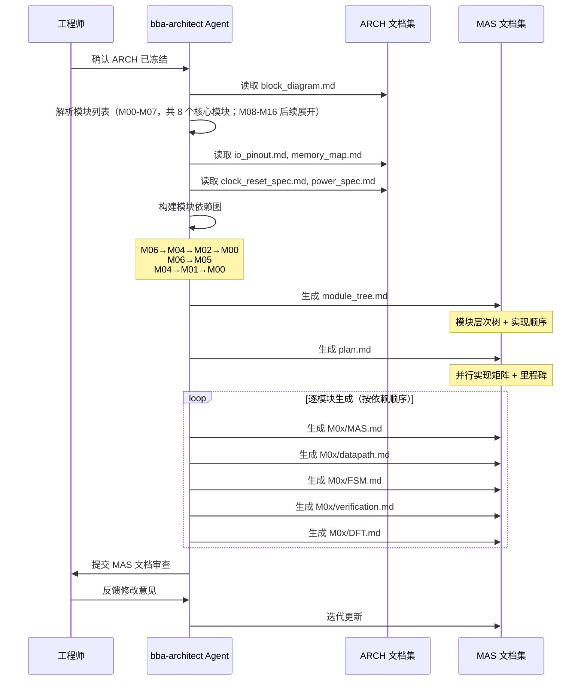
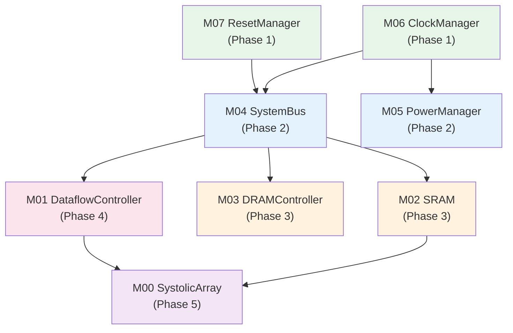

# 第 7 章：Agent 生成微架构规范

> MAS（Micro-Architecture Specification）是 ARCH 到 RTL 的桥梁——它定义了每个模块的端口、参数、行为和时序，是 Agent 生成 RTL 代码的直接输入。

---

## 7.1 什么是 MAS 及其在 ARCH 与 RTL 之间的桥梁作用

ARCH 文档描述了"系统长什么样"——有哪些模块、如何互联、功耗和时钟怎么规划。但 ARCH 的粒度不足以直接生成 RTL 代码。例如，ARCH 告诉我们 M00 是一个 Systolic Array，支持 WS/OS 双模式，但没有定义每个端口的位宽、状态机的转移条件、流水线的级数和延迟。

**MAS 填补了这个粒度鸿沟**：

```
ARCH（系统级）  →  MAS（模块级）  →  RTL（寄存器传输级）
"有 17 个模块"      "M00 有 11 个端口"     "assign sa_done = ..."
"M00 是脉动阵列"    "PE 阵列 16×16"        "always @(posedge clk) ..."
```

MAS 的核心价值在于：

1. **它是 Agent 生成 RTL 的唯一输入**。`/bba-guru-rtl` 读取 MAS 文档，逐模块生成 SystemVerilog 代码。MAS 越精确，生成的 RTL 质量越高。
2. **它是架构决策到实现细节的翻译器**。将 ARCH 中的"512 KB SRAM"翻译为"4 个 Bank，每个 128 KB，256 bit 位宽，19 bit 地址，SECDED ECC"。
3. **它是审查的基准**。RTL 代码生成后，审查者对照 MAS 逐条检查端口定义、状态转移、时序约束是否被正确实现。

在 Babel 的 Spec-Driven Pipeline 中，MAS 位于第三层：

```
PRD（Tier 0） → ARCH（Tier 1） → MAS（Tier 2） → RTL（Tier 3）
```

每一层都是下一层的"规范合约"——下层必须严格遵循上层的定义。MAS 中的每一个信号、每一个寄存器、每一个状态都必须能在 ARCH 中找到来源；RTL 中的每一行代码都必须能在 MAS 中找到依据。

---

## 7.2 使用 `/bba-architect` 生成 MAS

MAS 的生成仍然由 `/bba-architect` Skill 驱动，但进入的是 MAS 生成阶段。其输入是已冻结的 ARCH 文档集。



### MAS 生成的关键步骤

1. **构建模块依赖图**：Agent 分析 ARCH 文档中的模块互联关系，构建有向依赖图。例如 M00 依赖 M01（控制指令）和 M02（数据），因此 M00 必须在 M01 和 M02 之后实现。

2. **确定实现顺序**：按拓扑排序确定模块实现顺序——叶子节点（无依赖）先实现。这是工程上至关重要的决策：错误的实现顺序会导致接口定义不完整。

3. **逐模块展开**：按依赖顺序，为每个模块生成 5 个子文档（MAS、datapath、FSM、verification、DFT）。

4. **接口一致性校验**：检查模块间接口的位宽、方向、协议是否匹配。例如 M01 的输出信号 `m00_op_valid` 必须与 M00 的输入信号 `sa_start` 在语义和时序上一致。

---

## 7.3 MAS 文档结构

### 7.3.1 顶层文档：module_tree.md 和 plan.md

**module_tree.md** 定义了模块的层次结构和依赖关系。Babel NPU 的模块树如下：

```
NPU (Top)
├── M00_SystolicArray        [compute]      Systolic Array 矩阵乘法加速
├── M01_DataflowController   [compute]      Dataflow 调度控制器
├── M02_SRAM                 [storage]      512 KB Scratchpad SRAM
├── M03_DRAMController       [storage]      2 GB DRAM 控制器 @D2D
├── M04_SystemBus            [interconnect] AXI 系统总线
├── M05_PowerManager         [io]           电源管理 DVFS
├── M06_ClockManager         [io]           时钟生成与分配
└── M07_ResetManager         [io]           复位控制
```

每个模块条目包含以下属性：

| 属性 | 示例（M00） |
|------|------------|
| Module ID | M00 |
| Name | Systolic Array |
| Type | compute |
| Clock Domain | CLK_SYS 500MHz |
| Power Domain | PD_MAIN |
| Dependencies | M01, M02, M04 |

**plan.md** 定义了实现计划、并行矩阵和风险分析。其核心是并行实现矩阵（详见 7.6 节）。

### 7.3.2 模块级文档：每个模块 5 个子文档

每个模块的 MAS 目录（如 `spec/MAS/M00_SystolicArray/`）下包含 5 个文件：

| 文件 | 内容 | 用途 |
|------|------|------|
| MAS.md | 模块主规范：接口信号表、参数、寄存器映射 | RTL 生成的主输入 |
| datapath.md | 数据通路描述：ALU、MUX、寄存器文件、数据流 | 数据流实现细节 |
| FSM.md | 状态机定义：状态列表、转移条件、输出逻辑 | 控制逻辑实现 |
| verification.md | 模块验证计划：测试用例、覆盖率目标 | 验证 TB 生成 |
| DFT.md | 可测试性设计：Scan chain、BIST、ATPG | 测试结构实现 |

这 5 个文件共同构成一个模块的完整规范，使得 Agent 可以从规范直接生成 RTL 代码和对应的 Testbench。

---

## 7.4 案例：NPU MAS 解读

本节基于 Babel 项目真实的 MAS 文档，深入解读三个核心模块的微架构规范。

### 7.4.1 M00_SystolicArray：PE 阵列与累加器

M00 是 NPU 的计算核心。其 MAS 文档（`spec/MAS/M00_SystolicArray/MAS.md`）定义了以下关键规范：

**模块属性**：

| 属性 | 值 |
|------|----|
| 工艺 | 三星 SF4 4nm |
| 时钟域 | CLK_SYS 500 MHz |
| 电源域 | PD_MAIN |
| PE 阵列规模 | 16×16 = 256 PE |
| 目标算力 | 1 TOPS FP8 / 0.5 TOPS FP16 / 1 TOPS INT8（注：PRD 要求 FP8≥2 / FP16≥1 / INT8≥2 TOPS，MAS 为保守推导，需通过扩大 PE 阵列或提高频率达成） |
| 数据流模式 | Weight Stationary (WS) / Output Stationary (OS) |
| 精度支持 | FP32 / FP16 / INT8 / FP8 |

算力推导过程：

```
FP32: 256 PE × 1 MAC/cycle × 500 MHz × 2 ops/MAC = 256 GFLOPS ≈ 0.25 TOPS
FP16: 2 × FP32 = 0.5 TOPS
INT8: 4 × FP32 = 1 TOPS（PE 内部 SIMD 精度切换）
```

注意这里用的是"保守估计含流水线气泡"——256 PE 的理论峰值是 0.256 TOPS FP32，实际标称 0.25 TOPS，预留了约 2% 的气泡 margin。

**与 M01_DataflowController 的控制接口**（11 个信号）：

| 信号名 | 方向 | 宽度 | 描述 |
|--------|------|------|------|
| clk | input | 1 | 系统时钟 500 MHz |
| rst_n | input | 1 | 异步低有效复位 |
| sa_start | input | 1 | 启动计算脉冲 |
| sa_done | output | 1 | 计算完成脉冲 |
| dataflow_mode | input | 1 | 0=WS, 1=OS |
| precision_mode | input | 2 | 00=FP32, 01=FP16, 10=INT8 |
| dim_m | input | 5 | 矩阵 M 维度（1~16） |
| dim_n | input | 5 | 矩阵 N 维度（1~16） |
| dim_k | input | 10 | 矩阵 K 维度（1~1024） |
| sa_busy | output | 1 | 阵列忙状态 |
| sa_stall | output | 1 | 背压信号 |

注意 `dim_k` 宽度为 10 bit，支持最大 1024 的 K 维度——这覆盖了 TinyStories 15M 模型中最大的矩阵维度。`dim_m` 和 `dim_n` 各 5 bit，支持 1~16 的范围，与 PE 阵列的 16×16 规模一致。

**与 M02_SRAM 的数据接口**（9 个信号）：

| 信号名 | 方向 | 宽度 | 描述 |
|--------|------|------|------|
| weight_in | input | 16×32 | 权重输入总线（每 PE 1 word） |
| weight_valid | input | 1 | 权重数据有效 |
| weight_ready | output | 1 | 权重接收就绪 |
| act_in | input | 16×32 | 激活值输入总线 |
| act_valid | input | 1 | 激活数据有效 |
| act_ready | output | 1 | 激活接收就绪 |
| result_out | output | 16×32 | 结果输出总线 |
| result_valid | output | 1 | 结果有效 |
| result_ready | input | 1 | 下游接收就绪 |

数据接口使用了**valid/ready 握手协议**——这是 AXI-Stream 风格的标准做法。weight_in 总线宽度为 16×32 = 512 bit，意味着每个时钟周期可以同时向 16 个 PE 输入 32 bit 的权重数据。

MAS 文档特别注明：weight_in/act_in/result_out 总线宽度随 precision_mode 变化——FP32=32bit/PE，FP16=16bit/PE，INT8=8bit/PE。这意味着在低精度模式下，同一物理总线可以传输更多数据。

**PE 阵列结构**：

```
         act_in[0]  act_in[1]  ...  act_in[15]
            |          |                |
weight_in[0]→ PE[0,0] → PE[0,1] → ... → PE[0,15] → result_out[0]
weight_in[1]→ PE[1,0] → PE[1,1] → ... → PE[1,15] → result_out[1]
    ...
weight_in[15]→PE[15,0]→ PE[15,1]→ ... → PE[15,15]→ result_out[15]
```

行方向传播权重，列方向传播激活值，每个 PE 执行一次 MAC 并将部分和向右/向下传递。

**精度切换机制**是 M00 的一个精巧设计：

| precision_mode | 数据宽度 | PE MAC 类型 | 有效 PE 数 | 等效算力 |
|----------------|----------|-------------|------------|----------|
| 00 (FP32) | 32 bit | FP32 MAC | 256 | 0.25 TOPS |
| 01 (FP16) | 16 bit | FP16 MAC | 256 | 0.5 TOPS |
| 10 (INT8) | 8 bit | INT8 MAC×2 | 256×2 | 1 TOPS |

INT8 模式下，每个 PE 内部拆分为 2 个 INT8 MAC 单元并行执行——因为一个 32 bit 的数据通路可以容纳 2 个 8 bit 操作数加上 16 bit 的累加器，从而实现算力翻倍。

**流水线结构**定义了 4 级流水线：

| 阶段 | 名称 | 延迟 | 说明 |
|------|------|------|------|
| Stage 1 | 输入缓冲 | 1 cycle | weight_in / act_in 对齐缓冲，skew 补偿 |
| Stage 2 | PE 阵列传播 | 16 cycles | 数据沿阵列对角线传播 |
| Stage 3 | 累加 | K cycles（可流水） | 沿 K 维度累加部分和 |
| Stage 4 | 输出缓冲 | 1 cycle | 结果收集，格式转换 |

总延迟（首次结果）约 18 + K cycles，稳态吞吐为 1 个结果矩阵 / (M×K) cycles。

**寄存器映射**（4 个寄存器）：

| 寄存器 | 偏移 | 宽度 | 属性 | 描述 |
|--------|------|------|------|------|
| SA_CTRL | 0x00 | 32 | RW | [0]=start, [1]=soft_rst, [3:2]=precision, [4]=dataflow_mode |
| SA_STATUS | 0x04 | 32 | RO | [0]=busy, [1]=done, [2]=stall, [7:4]=fsm_state |
| SA_DIM_CFG | 0x08 | 32 | RW | [4:0]=dim_m, [9:5]=dim_n, [19:10]=dim_k |
| SA_PERF_CNT | 0x0C | 32 | RO | 计算周期计数器（每次 start 清零） |

### 7.4.2 M01_DataflowController：数据编排状态机

M01 是 NPU 的"大脑"——它不执行计算，而是编排计算。其 MAS 文档（`spec/MAS/M01_DataflowController/MAS.md`）展示了控制器设计的典型规范。

**核心职责**：
- 向 M00_SystolicArray 发送计算指令，管理 Spatial Dataflow 流水线
- 支持 4 种 Transformer 算子原语（Attention、FFN、RMSNorm、RoPE）
- 管理 2 线程的 Round-Robin 调度
- 通过 M04_SystemBus（AXI4）访问 M02_SRAM 和 M03_DRAMController

**与 M00 的控制接口**（10 个信号）定义了指令传递协议：

| 信号名 | 方向 | 宽度 | 描述 |
|--------|------|------|------|
| m00_op_valid | OUT | 1 | 算子指令有效 |
| m00_op_ready | IN | 1 | M00 接受指令握手 |
| m00_op_code[7:0] | OUT | 8 | 算子操作码 |
| m00_op_prec[1:0] | OUT | 2 | 精度：00=FP32,01=FP16,10=INT8 |
| m00_op_tid[0] | OUT | 1 | 线程 ID |
| m00_src_addr[31:0] | OUT | 32 | 源操作数基地址 |
| m00_dst_addr[31:0] | OUT | 32 | 目标地址 |
| m00_shape[63:0] | OUT | 64 | 张量形状（M/N/K 编码） |
| m00_done | IN | 1 | 计算完成脉冲 |
| m00_err[1:0] | IN | 2 | 错误码 |

注意 `m00_shape` 信号宽度为 64 bit，用于编码张量的三维形状（M/N/K）。这意味着 M01 可以在一条指令中传递完整的矩阵运算参数，减少了控制接口的指令数量和延迟。

**与 M04_SystemBus 的 AXI4 主接口**（9 个信号）用于指令 fetch 和数据搬运。这是一个标准的 AXI4 读通道接口，支持 burst 传输。

**中断信号**（3 个信号）：

| 信号名 | 方向 | 描述 |
|--------|------|------|
| irq_op_done | OUT | 算子完成中断（电平，软件清） |
| irq_err | OUT | 错误中断 |
| irq_tid[0] | OUT | 触发中断的线程 ID |

**线程管理**是 M01 的核心设计亮点：

| 特性 | 规格 | 设计意图 |
|------|------|---------|
| 线程数 | 2（TID=0, TID=1） | 支持计算与数据搬运重叠 |
| 调度策略 | Round-Robin，每算子边界切换 | 公平调度，避免饥饿 |
| 上下文切换开销 | <= 4 个 CLK_SYS 周期 | 硬件寄存器存储上下文 |
| 上下文内容 | PC、OP_QUEUE 读指针、算子状态、精度配置 | 最小化切换代价 |
| 线程独立寄存器 | THREAD_CFG[0/1]、各自 PC 寄存器 | 线程隔离 |

4 个周期的上下文切换开销是一个非常紧凑的设计——它意味着线程上下文（PC、队列指针等）存储在硬件寄存器中而非 SRAM 中，避免了存储访问的额外延迟。

**性能监控寄存器**：

| 寄存器 | 偏移 | 描述 |
|--------|------|------|
| PERF_CNT0 | 0x014 | 线程 0 完成算子计数 |
| PERF_CNT1 | 0x018 | 线程 1 完成算子计数 |
| PERF_UTIL | 0x01C | [15:0]=流水线利用率（Q16 格式） |

`PERF_UTIL` 寄存器使用 Q16 定点格式（16 bit 小数）表示利用率百分比。例如 0xCCCC 表示 80%（0xCCCC / 0x10000 ≈ 0.8），这与 REQ-COMPUTE-005 中 >= 80% 的利用率要求直接对应——软件可以通过读取这个寄存器实时监控流水线效率。

### 7.4.3 M02_SRAM：存储 Bank 组织

M02 的 MAS（`spec/MAS/M02_SRAM/MAS.md`）展示了片上 SRAM 的详细微架构。

**模块属性**：

| 参数 | 值 |
|------|-----|
| 容量 | 512 KB |
| 时钟域 | CLK_SYS (500 MHz) |
| 电源域 | PD_MAIN |
| 数据位宽 | 256 bit |
| 地址位宽 | 19 bit (512K / 32B = 16K entries) |
| ECC | SECDED |
| 工艺 | Samsung SF4 4nm |

**存储组织**：512 KB 被划分为 4 个 128 KB 的 Bank：

| Bank | 地址范围 | 容量 | 选择逻辑 |
|------|----------|------|---------|
| Bank 0 | 0x00000 - 0x1FFFF | 128 KB | addr[18:17] = 00 |
| Bank 1 | 0x20000 - 0x3FFFF | 128 KB | addr[18:17] = 01 |
| Bank 2 | 0x40000 - 0x5FFFF | 128 KB | addr[18:17] = 10 |
| Bank 3 | 0x60000 - 0x7FFFF | 128 KB | addr[18:17] = 11 |

Bank 选择使用地址最高两位 `addr[18:17]`，这是典型的 Bank 交织方案。当连续访问跨越 Bank 边界时，不同 Bank 可以并行工作，有效提高了聚合带宽。

每个 Bank 内部：4096 行 × 256 bit，单端口 SRAM 宏单元，读/写延迟均为 1 cycle。

**接口信号**（17 个信号）分为两组：

1. **本地接口**（直接连接 M00/M01）：clk, rst_n, addr[18:0], wdata[255:0], rdata[255:0], we, re, ready, ecc_err[1:0]
2. **总线接口**（通过 M04 访问）：bus_req, bus_grant, bus_addr[31:0], bus_wdata[255:0], bus_rdata[255:0], bus_we

**ECC 方案**——SECDED（Single Error Correction, Double Error Detection）使用 Hamming Code：

| 参数 | 值 |
|------|-----|
| 数据位 | 256 bit |
| 校验位 | 10 bit (Extended Hamming: 9 bit SEC + 1 bit parity DED) |
| 总存储宽度 | 266 bit/entry |
| 编码时机 | 写入时生成校验位 |
| 解码时机 | 读出时检测并纠正 |

ECC 纠错能力：

| 错误类型 | 检测 | 纠正 | ecc_err 输出 |
|----------|------|------|-------------|
| 无错误 | -- | -- | 2'b00 |
| 单比特错误 | 可以 | 可以 | 2'b01 |
| 双比特错误 | 可以 | 不可以 | 2'b10 |
| 多比特错误 | 部分 | 不可以 | 2'b10 |

ECC 状态通过三个寄存器暴露给软件：

| 寄存器 | 偏移 | 描述 |
|--------|------|------|
| SRAM_CTRL | 0x0000 | [0]=EN, [1]=ECC_EN, [3:2]=BANK_MODE |
| ECC_STATUS | 0x0004 | [15:0]=SEC_CNT, [31:16]=DED_CNT |
| ECC_ADDR | 0x0008 | [18:0]=ERR_ADDR |

`BANK_MODE` 支持独立模式（00）和交织模式（01），为不同访问模式提供优化选项。

**功耗与面积估算**：

| 模式 | 功耗 | 条件 |
|------|------|------|
| Active Read | 45 mW | 500 MHz, 50% 活动率 |
| Active Write | 52 mW | 500 MHz, 50% 活动率 |
| Idle（时钟门控） | 8 mW | 时钟门控 |
| Standby（电源门控） | 1.2 mW | 电源门控 |

| 组件 | 面积 (mm²) |
|------|-----------|
| SRAM 宏单元 | 0.85 |
| ECC 逻辑 | 0.08 |
| 控制逻辑 | 0.05 |
| 总计 | **0.98** |

M02 面积约 1 mm²，仅占 90 mm² 设计目标的 1.1%——这说明 SRAM 不是面积瓶颈，Systolic Array（M00）才是。

---

## 7.5 MAS 审查要点

MAS 文档审查应关注以下四个维度：

### 7.5.1 与 ARCH 的一致性

| 检查项 | 方法 | 示例 |
|--------|------|------|
| 模块列表与 block_diagram.md 一致 | 逐条对照 | M00-M07 全部覆盖 |
| 每个模块的时钟域/电源域与 ARCH 定义一致 | 交叉引用 | M00: CLK_SYS / PD_MAIN |
| 接口信号与 ARCH 中的互联描述匹配 | 位宽、方向核对 | M01→M00 控制接口 |
| 寄存器地址与 memory_map.md 不冲突 | 地址范围检查 | SRAM 0x8000_0000 |

例如：ARCH 中 M02 位于 0x8000_0000，大小 512 KB。MAS 中 M02 的地址位宽为 19 bit（512K / 32B = 16K entries），与 ARCH 一致。

### 7.5.2 接口协议的完备性

| 检查项 | 标准 |
|--------|------|
| 每个输入信号有明确的时序要求 | setup/hold time 定义 |
| 每个输出信号有明确的驱动能力 | 负载电容定义 |
| 握手协议（valid/ready）定义完整 | 所有组合覆盖 |
| 中断信号有清除机制 | 电平/边沿、清除方式 |

M01 的中断信号定义是一个好的范例：`irq_op_done` 是电平触发、软件清除（RW1C），`IRQ_STATUS` 寄存器支持写 1 清除。这种设计避免了中断丢失和重复触发。

### 7.5.3 时序约束的合理性

| 检查项 | 标准 | 示例 |
|--------|------|------|
| 关键路径延迟 < 时钟周期 | 500 MHz → 2 ns 周期 | M00 FP32 MAC ~1.8 ns |
| Setup/Hold time 与工艺库匹配 | 参考工艺参数 | M02: setup 0.2 ns, hold 0.1 ns |
| 流水线级数与延迟匹配 | 吞吐量和延迟的 trade-off | M00: 18+K cycles 首次延迟 |

plan.md 中标注的风险项"FP32 MAC 关键路径 ~1.8 ns，500 MHz margin 仅 0.2 ns"就是一个需要重点审查的时序约束。审查者需要决定：接受这个风险（依赖综合优化），还是修改架构（插入流水线寄存器，但会增加延迟）。

### 7.5.4 模块粒度是否适合 Agent 生成 RTL

MAS 的模块粒度应该满足：

| 标准 | 理由 |
|------|------|
| 每个模块的 RTL 代码量在 200-800 行 | Agent 单次生成的合理范围 |
| 接口信号数不超过 30 个 | 降低接口错误概率 |
| 状态机状态数不超过 8 个 | 状态转移的完备性容易验证 |
| 每个模块可以在独立的仿真环境中验证 | 支持模块化验证 |

如果某个模块过于复杂（如 M00 的 256 个 PE），应在 MAS 阶段就规划好子模块划分方案，将 PE 阵列拆分为可独立生成和验证的子单元。

---

## 7.6 模块依赖图与实现顺序

基于 plan.md 的真实数据，NPU 的模块依赖关系如下：



依赖图的阅读方式：**箭头表示"被依赖"**，即 M06 → M04 表示 M04 依赖 M06（M04 需要 M06 提供的时钟）。因此 M06 必须先于 M04 实现。

### 并行实现矩阵

依赖图的一个重要推论是：**同一 Phase 内的模块可以并行实现**。这在 AI 原生流程中意义重大——可以同时启动多个 Agent 并行生成不同模块的 RTL。

| 阶段 | 模块 | 类型 | 可并行 | 依赖 |
|------|------|------|--------|------|
| Phase 1 | M06_ClockManager | io | 是 | 无 |
| Phase 1 | M07_ResetManager | io | 是 | 无 |
| Phase 2 | M05_PowerManager | io | 是 | M06 |
| Phase 2 | M04_SystemBus | interconnect | 是 | M06, M07 |
| Phase 3 | M02_SRAM | storage | 是 | M04 |
| Phase 3 | M03_DRAMController | storage | 是 | M04, @D2D |
| Phase 4 | M01_DataflowController | compute | 否 | M04 |
| Phase 5 | M00_SystolicArray | compute | 否 | M01, M02 |

Phase 1 和 Phase 2 的模块（M05-M07、M04）属于 io/interconnect 类型，复杂度相对较低，适合 Agent 快速生成。Phase 4-5 的模块（M01、M00）是核心计算逻辑，复杂度最高，需要更仔细的人机协作和更严格的审查。

### 验证里程碑

plan.md 定义了 5 个验证里程碑：

| 里程碑 | 内容 | 目标日期 |
|--------|------|----------|
| MAS-M1 | Phase 1-2 模块 RTL 冻结 | 2026-09-30 |
| MAS-M2 | Phase 3 存储模块 RTL + MBIST | 2026-10-31 |
| MAS-M3 | M01 DataflowController RTL | 2026-11-30 |
| MAS-M4 | M00 SystolicArray RTL + 算力验证 | 2026-12-31 |
| MAS-M5 | 全芯片集成仿真 + 时序收敛 | 2027-03-31 |

这个时间线反映了依赖图的约束：基础设施模块（时钟、复位、总线）先冻结，存储模块次之，计算控制器再次，计算核心最后。全芯片集成在所有模块 RTL 完成后进行。

### 关键风险管理

plan.md 识别了三个关键风险：

**风险 1：FP32 MAC 关键路径**

| 属性 | 值 |
|------|-----|
| 影响模块 | M00 |
| 问题 | FP32 MAC 关键路径 ~1.8 ns，500 MHz 周期 2.0 ns，margin 仅 0.2 ns |
| 缓解措施 | 综合时施加 max_delay 约束，考虑流水线插入 |

0.2 ns 的 margin 在 7nm/4nm 工艺下属于紧张但可行的范围。如果综合后 WNS（Worst Negative Slack）为负，可以考虑在 MAC 通路中插入流水线寄存器，代价是增加 1 cycle 延迟。

**风险 2：DRAM D2D 接口供应商未定**

| 属性 | 值 |
|------|-----|
| 影响模块 | M03 |
| 问题 | DRAM D2D 接口协议取决于供应商选择 |
| 缓解措施 | 预留 LPDDR4X 和自定义接口两套方案 |

这个风险的缓解策略是在 M03 的 MAS 中做接口抽象——定义统一的内部接口，外部协议通过适配层转换。

**风险 3：10 GB/s 带宽验证**

| 属性 | 值 |
|------|-----|
| 影响模块 | M03, M04 |
| 问题 | 需要联合验证 DRAM + SystemBus 的聚合带宽 |
| 缓解措施 | M04 SystemBus 设计为 16 GB/s 峰值，为 DRAM 的 10 GB/s 留出 60% 余量 |

M04 的 16 GB/s 峰值带宽为 10 GB/s 的 DRAM 需求留出了充足的 margin，即使考虑到仲裁开销和突发访问的效率损失，也能满足需求。

---

## 本章小结

1. **MAS 是 ARCH 到 RTL 的桥梁**，它将系统级的架构描述细化为模块级的实现规范，定义了每个模块的端口、参数、行为、时序和寄存器映射，是 Agent 生成 RTL 代码的直接输入。

2. **MAS 文档集由顶层文档（module_tree.md + plan.md）和各模块的 5 个子文档（MAS.md、datapath.md、FSM.md、verification.md、DFT.md）组成**。

3. **模块依赖图决定了实现顺序**。NPU 的 8 个核心基础模块分 5 个 Phase 实现（M08-M16 的 MAS 和 RTL 将在核心模块完成后展开），同 Phase 内的模块可以并行生成 RTL，提高 Agent 的工作效率。

4. **M00_SystolicArray 的 MAS 展示了精度切换、流水线结构和 valid/ready 握手协议的精巧设计**；M01_DataflowController 的 MAS 展示了算子调度和线程管理的细节；M02_SRAM 的 MAS 展示了 Bank 组织和 ECC 方案。

5. **MAS 审查应关注四个维度**：与 ARCH 的一致性、接口协议的完备性、时序约束的合理性、模块粒度是否适合 Agent 生成。plan.md 中标注的关键风险（如 FP32 MAC 关键路径 margin 不足）需要在 MAS 阶段就规划缓解措施。
